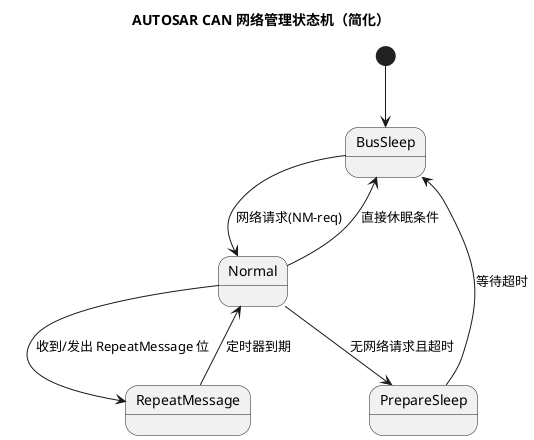
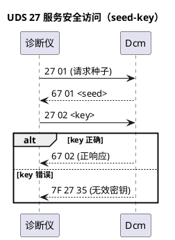
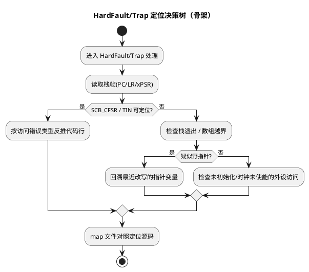
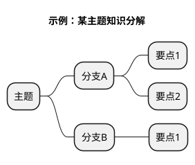

# 图表规范与模板（PlantUML + WaveDrom）

> 本知识库所有图一律用**文本内嵌**在笔记正文中（PlantUML / WaveDrom / Markdown 表格 / ASCII），
> 可 diff、可版本管理、可随笔记一起迁移；`_images/` 只存放真实截图（示波器波形、CANoe 截图、原理图截图、实物照片）。
> **工具按内容类型分派**：过程性知识用 PlantUML，数字波形用 WaveDrom，位定义/帧格式用 Markdown 表格，布局示意用 ASCII。

## 1. 全库约定

1. PlantUML 围栏统一使用 ` ```plantuml `，内部必须包含完整的 `@start*` / `@end*` 配对（`@startuml/@enduml`、`@startmindmap/@endmindmap` 均合法）
2. WaveDrom 围栏统一使用 ` ```wavedrom `，内容为合法 JSON
3. 每张图必须带标题（PlantUML 用 `title`；WaveDrom 用 `head.text`），图与笔记标题呼应
4. 中文场景加中文字体声明：`skinparam defaultFontName "Microsoft YaHei"`
5. 一图一事：一张图只讲一个流程/一个状态机/一段波形，避免大杂烩
6. 图内分支/分区用 `partition`、`alt/else`、`loop` 表达，不靠颜色区分逻辑
7. 图放正文中紧跟对应小节，不放文末附录

## 2. 内容类型 → 工具选型表

| 内容类型 | 工具 | 本库典型用例 |
|---|---|---|
| 状态转换 | PlantUML stateDiagram | NM 状态机、EcuM 上下电、任务状态机、刷写会话 |
| 交互时序 | PlantUML sequenceDiagram | 27 安全访问、CanTp 多帧、Com→CanDrv 链路、优先级反转 |
| 流程/决策 | PlantUML activityDiagram | 启动流程、HardFault 定位决策树、BswM 仲裁 |
| 架构分层 | PlantUML component | AUTOSAR 分层、驱动分层、MCAL 位置 |
| 知识全景 | PlantUML mindmap | 知识地图、术语体系 |
| **数字波形** | **WaveDrom** | I2C 起止条件、SPI 四模式、UART 帧、ADC 采样窗口、LIN break |
| **寄存器位定义/帧格式** | **Markdown 表格** | TXBUF ID 位表、CAN 帧字段、DTC 格式、错误码表（可搜索可 diff，图做不到） |
| **内存/结构体布局** | ASCII 图 | 位带映射、struct 填充、内存分区 |
| **电路示意** | 简化 ASCII + 真实截图进 `_images/` | 上拉电路、MCU 最小系统、续流电路 |
| CAN 位时序 | Markdown 表格（参数）+ WaveDrom（简化波形） | 采样点计算、SJW/PhaseSeg 取值 |

## 3. 模板库（复制即用）

### 3.1 状态机模板（例：网络管理）



### 3.2 时序图模板（例：27 安全访问）



### 3.3 活动图模板（例：HardFault 定位决策树）



### 3.4 组件图模板（例：AUTOSAR 分层）

```plantuml
@startuml
title AUTOSAR Classic 分层架构（骨架）
skinparam defaultFontName "Microsoft YaHei"
package "应用层" {
  [SWC1]
  [SWC2]
}
package "RTE" {
  [RTE]
}
package "BSW 服务层" {
  [Os/EcuM/...]
  [Com/PduR/...]
  [NvM/...]
}
package "MCAL" {
  [Mcu/Port/Spi/Adc...]
}
[SWC1] --> [RTE]
[SWC2] --> [RTE]
[RTE] --> [Os/EcuM/...]
[RTE] --> [Com/PduR/...]
[RTE] --> [NvM/...]
[Os/EcuM/...] --> [Mcu/Port/Spi/Adc...]
@enduml
```

### 3.5 思维导图模板（知识地图用）



### 3.6 WaveDrom 波形模板（硬件时序专用）

**例 1：I2C 起止条件与字节传输**

```wavedrom
{signal: [
  {name: 'SCL', wave: 'p...........'},
  {name: 'SDA', wave: 'x3..4..5..6.x', data: ['START','ADDR+W','ACK','DATA','STOP']}
], head: {text: 'I2C 写传输（START→字节→STOP）', tick: 0}}
```

**例 2：SPI 模式 0（CPOL=0, CPHA=0）**

```wavedrom
{signal: [
  {name: 'CS',   wave: '10.......1'},
  {name: 'SCLK', wave: '0.p.n.p.n.'},
  {name: 'MOSI', wave: 'x3456x', data: ['B7','B6','B5','B4']},
  {name: 'MISO', wave: 'x789.x', data: ['B7','B6','B5','B4']}
], head: {text: 'SPI 模式0：CS 拉低后首个上升沿采样'}}
```

**例 3：UART 帧（8N1）**

```wavedrom
{signal: [
  {name: 'TXD', wave: '1.0.5.4.5.6.7.8.9.1..', data: ['D0','D1','D2','D3','D4','D5','D6','D7']}
], head: {text: 'UART 帧：起始位(LSB先) + 8 数据位 + 停止位'}}
```

**例 4：ADC 采样-保持窗口（模拟场景示意）**

```wavedrom
{signal: [
  {name: '采样开关', wave: '0....1...0....', data: []},
  {name: 'Vin',      wave: '3....3...4....', data: ['输入信号']},
  {name: 'S/H电容',  wave: '2....4...2....', data: ['充电跟踪', '保持平台', '下一轮跟踪']}
], head: {text: 'ADC 采样-保持窗口（开关0=采样，1=保持）', tick: -1}}
```

**WaveDrom 语法速查**：`p`=时钟正半周期，`0/1`=低/高，`x`=不定态，`2-9`=数据（带 `data` 标签），`.`=延续前一状态，`tick: 0` 显示刻度。

## 4. 常用语法速查

| 目的 | 语法 |
|---|---|
| 时序分区 | `partition 名称 { ... }` |
| 分支 | `alt 条件` / `else` / `end` |
| 循环 | `loop 条件` / `end` |
| 可选 | `opt 条件` / `end` |
| 并行 | `par` / `else` / `end` |
| 激活生命线 | `activate X` / `deactivate X` |
| 备注 | `note over A,B : 文本` |
| 活动图分支 | `if (条件?) then (是) ... else (否) ... endif` |
| 状态转换 | `状态A --> 状态B : 事件/条件` |
| 起止 | `[*] --> 状态` / `状态 --> [*]` |

## 5. 渲染环境

- PlantUML：Obsidian 装 PlantUML 社区插件；VSCode 装 PlantUML 插件 `Alt+D` 预览；在线兜底 plantuml.com
- WaveDrom：Obsidian 装 Wavedrom 社区插件（渲染 ` ```wavedrom ` 围栏）；VSCode 装 WaveTrace 或用 wavedrom.com/editor 在线兜底
- 若 Obsidian 未装 WaveDrom 插件，波形块会显示为纯 JSON——请先安装再写波形类笔记
