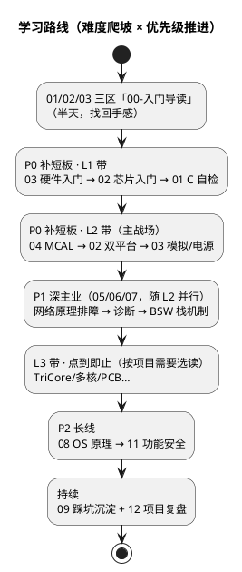

# 学习路线图

> 结合当前背景定制：AUTOSAR BSW/CDD 方向，TC377 + S32K 双平台，CAN/LIN/诊断是主业，MCAL 与硬件基础是短板。
> 本库难度标尺为 **L0~L3 四级**，01~14 区已按 `00-入门导读 / 1-L1基础 / 2-L2进阶 / 3-L3高级` 分带组织，15 区按需检索不分带。

## 难度分级框架（L0~L3）

| 等级              | 定位                                                                     | 经验参考 | 本库覆盖方式                                                                                           |
| ----------------- | ------------------------------------------------------------------------ | -------- | ------------------------------------------------------------------------------------------------------ |
| L0 入门           | 知道嵌入式是什么，能跑通第一个 Demo                                      | 0~1 年   | **已越过，不设内容**（概念在入门导读中一笔带过）                                                 |
| **L1 基础** | 在指导下完成模块任务：看得懂原理图、读得懂数据手册、写得对 C、配得动外设 | 1~3 年   | **主战场**：三区 `1-L1基础` 带 + `00-入门导读`（可从零起步）                                 |
| **L2 进阶** | 独立负责子系统：双平台迁移、BSW 配置成体系、能独立排障                   | 3~5 年   | **主战场**：三区 `2-L2进阶` 带，笔记密度最高                                                   |
| L3 高级           | 系统级视野：架构选型、性能优化、疑难杂症归因                             | 5~10 年  | **目标上限、点到即止**：三区 `3-L3高级` 带，只写概念 + 排障清单 + 延伸指针，深入靠真实工程经验 |

> 阅读方式：不必按顺序修完一个带再进下一个——**知识域为主轴、难度阶梯为坡道**，同一知识域内允许 L1→L3 跳读（各篇头部有 `等级+前置` 行，缺前置时先补前置）。

### L3 上限章程（本库不做什么）

1. 不写 Linux 内核深水区（驱动框架、机制层面为限）
2. 不做 RTOS 源码逐行精读（机制与配置要点为限）
3. 不涉及编译器后端 / 链接器 internals（链接脚本够用为限）
4. 不做 ASIC / FPGA 设计
5. 不做跨行业专项（消费电子、军工等）
6. **L3 主题一律"点到即止"**：概念 + 排障清单 + 延伸指针；真正的深入来自真实项目，笔记只负责让你在项目里知道往哪看

### 各级自查定位表

**L1 自查**（答不上 → 回 `00-入门导读` 补课）：

- [ ] 不用 IDE 补全，能写出双向链表的插入与删除
- [ ] 能说清 `volatile` / `const` / `static` 各自解决什么问题
- [ ] 给一张原理图，能找到 MCU 最小系统四要素（电源/晶振/复位/下载口）
- [ ] 能从 map 文件里找到一个变量的地址与大小
- [ ] 说得出一次中断响应的大致流程（现场保护 → ISR → 恢复）
- [ ] 能把一个 GPIO 配成输出点亮 LED，并解释每步改了什么
- [ ] 读位操作表达式不犯怵（置位/清零/翻转/判断某位）

**L2 自查**（对应日常独立作战能力）：

- [ ] 能独立完成一个外设模块的 MCAL 配置与验证（如 ADC + DMA 链路）
- [ ] 能看懂启动文件，并在链接脚本层面解释内存布局（code/data/bss/stack/heap）
- [ ] 会用示波器 / 逻辑分析仪验证时序类问题
- [ ] CAN 总线 Bus-Off 后，能定位是哪个节点、什么原因
- [ ] 能讲清 AUTOSAR 分层中一帧数据的完整路径（Com → PduR → CanIf → CanDrv）
- [ ] 能写出满足 MISRA-C 的安全函数，并说明每条约束的理由
- [ ] 遇到 HardFault / Trap 能拿到现场（寄存器/栈/调用链）并初步归因

**L3 自查**（概念清楚即达标，点到即止）：

- [ ] 能对比 TriCore 与 Cortex-M 的上下文管理差异（CSA vs MSP/PSP）及各自适用场景
- [ ] 理解 Cache 一致性对 DMA 场景的影响与应对思路
- [ ] 能参与多核任务划分讨论（主从/对等、核间通信机制选型）
- [ ] 性能问题能从体系结构层面（流水线/总线带宽/中断延迟）提出假设
- [ ] 有功能安全整体视角：锁步核、E2E、看门狗分层如何配合
- [ ] 知道某类问题该去翻芯片 TRM/UM 的哪一章

## 优先级总表

| 优先级    | 主线                  | 对应目录 | 说明                                       |
| --------- | --------------------- | -------- | ------------------------------------------ |
| P0 补短板 | 硬件基础（最薄弱）    | 03       | 从汽车电路实例入手，够用为目标             |
| P0 补短板 | MCAL 与外设驱动       | 04       | 每模块按 原理→双平台实现→配置要点 三步走 |
| P0 补短板 | 芯片与体系结构        | 02       | TriCore 与 Cortex-M 双架构并行理解         |
| P1 深主业 | 汽车网络通讯          | 05       | 从会配置走向懂原理、能排障                 |
| P1 深主业 | 诊断与标定            | 06       | UDS 逐服务吃透，Dcm/Dem 配置成体系         |
| P1 深主业 | AUTOSAR 架构          | 07       | 栈内机制：RTE/Os/EcuM/通讯栈/内存栈        |
| P2 长线   | 操作系统原理          | 08       | 中断/调度/同步/内存，实际项目至关重要      |
| P2 长线   | 功能安全与信息安全    | 11       | 26262/E2E/SecOC                            |
| 日常      | 踩坑案例库 + 项目复盘 | 09 / 12  | 一坑一档，周维护                           |

## 路线图

## 当前进度（2026-08 快照）

| 区                | 状态      | 篇数      | 带结构                                        |
| ----------------- | --------- | --------- | --------------------------------------------- |
| 01-编程语言       | ✅ 已完成 | 48+1 导读 | 00导读 / 1-L1 / 2-L2 / 3-L3（索引式）         |
| 02-芯片与体系结构 | ✅ 已完成 | 54+4 导读 | 00导读 / 1-L1 / 2-L2（含芯片行业版图）/ 3-L3                   |
| 03-硬件基础       | ✅ 已完成 | 45+1 导读 | 00导读 / 1-L1 / 2-L2 / 3-L3                   |
| 04-MCAL与外设驱动 | ✅ 已完成 | 42+1 导读 | 00导读 / 1-L1 / 2-L2 / 3-L3（DMA）            |
| 05-汽车网络通讯 | ✅ 已完成 | 35+1 导读 | 00导读 / 1-L1 / 2-L2 / 3-L3（FlexRay/以太网） |
| 06-诊断与标定 | ✅ 已完成 | 30+1 导读 | 00导读 / 1-L1（UDS/OBD） / 2-L2 / 3-L3（Bootloader） |
| 07-AUTOSAR架构 | ✅ 已完成 | 45+1 导读 | 00导读 / 1-L1 / 2-L2 / 3-L3（RTE/加密/多核） |
| 08-操作系统 | ✅ 已完成 | 40+1 导读 | 00导读 / 1-L1 / 2-L2 / 3-L3（嵌入式Linux） |
| 09-调试与测试 | ✅ 已完成 | 16+1 导读 | 00导读 / 1-L1 / 2-L2 / 3-L3（调试方法论） |
| 10-工具链与工程化 | ✅ 已完成 | 18+1 导读 | 00导读 / 1-L1（IDE/Git） / 2-L2（编译器/构建/质量/配置工具/脚本） / 3-L3（预留） |
| 11-功能安全与信息安全 | ✅ 已完成 | 14+1 导读 | 00导读 / 1-L1（ISO-26262基础/安全分析入门） / 2-L2（E2E/看门狗/SecOC/21434） / 3-L3（HSM与SHE） |
| 12-项目实战 | ✅ 已完成 | 7+1 导读 | 00导读 / 1-L1 / 2-L2 / 3-L3（项目复盘） |
| 13-标准与书籍笔记 | ✅ 已完成 | 0~7 号资源架 | 协议/标准/手册/电子书/论文原件 + 下载渠道索引 + 阅读笔记 |
| 14-面试与成长 | ✅ 已完成 | 15+1 导读 | 00导读 / 1-L1 / 2-L2（题库/职业发展） |
| 15-资源收藏 | ✅ 已完成 | 7+1 导读 | 00导读 + 按类型平铺（不分带） |

> 全库 15 区已通过质量审计（425 篇正文：头部行 100%、死链 0/5890、UTF-8 无 BOM、L3 篇"太长不看"全覆盖；面试高频题逐条带答案，入门导读按设计豁免；14 区题库 128 题全带出处回链）。2026-09 增补 02 区"芯片行业版图"7 篇（六大类行业认知，54 篇新口径），增补篇按同套规范写作并通过补审。

## 每周维护节奏

1. 临时笔记先落 `99-归档/`，周末归类到正式目录
2. 归类时同步更新所在目录 README 的索引，并补 `等级+前置` 头部行
3. 有跨域关联时补双向链接或标签
