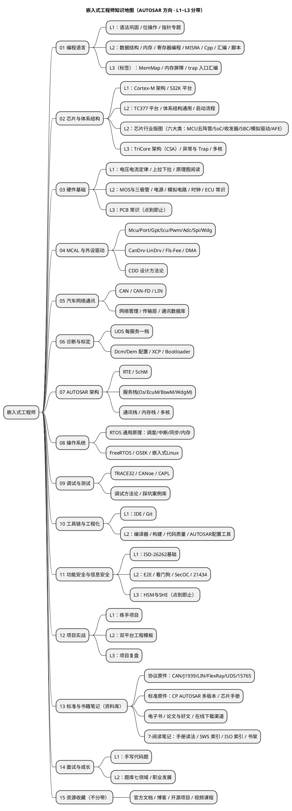

# 知识地图

> 全库 16 个知识域的全景视图。用 PlantUML mindmap 维护，新增目录后同步更新本图。
> 01~03 区已按难度分带（L1 基础 / L2 进阶 / L3 高级，L1/L2 为主战场，L3 点到即止）。

## 完成状态（2026-08 快照）

| 区 | 内容 | 状态 |
|---|---|---|
| 01 | 编程语言（C/Cpp/汇编/脚本，已分带） | ✅ 48 篇 + 入门导读 |
| 02 | 芯片与体系结构（双架构/双平台/启动/异常/多核/行业版图，已分带） | ✅ 54 篇 + 4 篇入门导读 |
| 03 | 硬件基础（电路/原理图/模拟/时钟/PCB/ECU，已分带） | ✅ 45 篇 + 入门导读 |
| 04 | MCAL 与外设驱动（MCAL总览/分层思想/Port与Dio/九大模块/CDD/DMA，已分带） | ✅ 42 篇 + 入门导读 |
| 05 | 汽车网络通讯（CAN/LIN/网络管理/传输层/数据库/FlexRay/以太网，已分带） | ✅ 35 篇 + 入门导读 |
| 06 | 诊断与标定（UDS每服务一档/Dcm/Dem/DID/XCP/诊断数据库/Bootloader，已分带） | ✅ 30 篇 + 入门导读 |
| 07 | AUTOSAR架构（分层/RTE/调度/系统服务栈/通讯栈/内存栈/加密/多核，已分带） | ✅ 45 篇 + 入门导读 |
| 08 | 操作系统（RTOS原理/FreeRTOS/OSEK/嵌入式Linux，已分带） | ✅ 40 篇 + 入门导读 |
| 09 | 调试与测试（调试器/总线工具/方法论/踩坑库，已分带） | ✅ 16 篇 + 入门导读 |
| 10 | 工具链与工程化（IDE/Git/编译器/构建/MISRA，已分带） | ✅ 17 篇 + 入门导读 |
| 11 | 功能安全与信息安全（26262/E2E/WdgM/SecOC/21434/HSM，已分带） | ✅ 8 篇 + 入门导读 |
| 12 | 项目实战（练手项目/双平台模板/复盘，已分带） | ✅ 7 篇 + 入门导读 |
| 13 | 标准与书籍笔记（芯片手册/书籍/SWS/ISO索引，已分带） | ✅ 5 篇 + 入门导读 |
| 14 | 面试与成长（手写代码/题库128题/职业发展，已分带） | ✅ 15 篇 + 入门导读 |
| 15 | 资源收藏（官方文档/博客/开源/视频，不分带） | ✅ 7 篇 + 入门导读 |

> 全库 15 区全部完成：432 篇域笔记 + 4 篇总览文档，死链 0，UTF-8 无 BOM。
