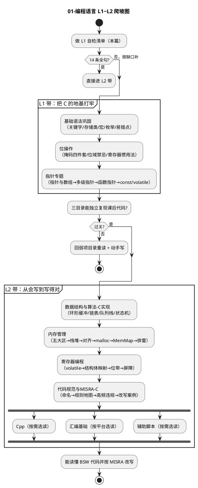

# C 功底自检与爬坡图

> 一句话定位：动笔读库之前先花十分钟做这张"摸底卷"——六组勾选题测出你的 C 功底漏在哪一格，再顺着爬坡图找到该进的入口，不从头啃、不跳级踩空。
> 等级：L1 ｜ 前置：无

## 怎么用这篇

- 全是"能不能答上来"的判断题，不需要写代码，心里有答案就行。
- 每条后面标了"不会→去读哪篇"：勾不上的那一条，就是你今天该打开的笔记。
- 六组全勾：直接跳到文末"下一步读什么"进 L2 带。
- 勾掉一半以上：从 L1 带第一个目录顺读，别嫌慢，地基便宜。

## L1 自检清单

### 一、指针基础

- [ ] 能说清"数组名"和"指向首元素的指针"差在哪（提示：sizeof 的结果不一样）
  不会→[指针与数组](../1-L1基础/指针专题/01-指针与数组.md)
- [ ] 能写出"函数接收一个指针、把调用者的变量改掉"的最小代码
  不会→[指针运算与多级指针](../1-L1基础/指针专题/02-指针运算与多级指针.md)
- [ ] 见到 `int (*fp)(void)` 不慌，知道这是"函数指针"不是函数原型
  不会→[函数指针与回调](../1-L1基础/指针专题/03-函数指针与回调.md)

### 二、位操作

- [ ] 给一个 32 位寄存器值，能用一行宏把第 3 位置 1、第 5 位清 0、读出第 7 位
  不会→[掩码与置位清零](../1-L1基础/位操作/01-掩码与置位清零.md)
- [ ] 知道"用位域（bit-field）映射硬件寄存器"为什么危险（一句话即可）
  不会→[位域vs位操作](../1-L1基础/位操作/02-位域vs位操作.md)

### 三、volatile / const / static 三兄弟

- [ ] 能用自己的话说 static 在"函数内、文件内"两处分别干什么
  不会→[关键字与存储类](../1-L1基础/基础语法巩固/01-关键字与存储类.md)
- [ ] 知道"轮询外设状态标志"那个变量为什么必须加 volatile（提示：编译器会把它缓存进寄存器）
  不会→[volatile的正确使用](../2-L2进阶/寄存器编程/01-volatile的正确使用.md)
- [ ] 能区分 `const int *p` 和 `int *const p`
  不会→[const与volatile指针](../1-L1基础/指针专题/04-const与volatile指针.md)

### 四、栈与堆的区别

- [ ] 能说出"局部变量"住在哪、谁负责分配、函数返回后发生什么
  不会→[栈与堆](../2-L2进阶/内存管理/02-栈与堆.md)
- [ ] 知道为什么 MCU 工程里普遍禁用 malloc（说一条理由即可）
  不会→[malloc原理与碎片](../2-L2进阶/内存管理/04-malloc原理与碎片.md)

### 五、结构体对齐

- [ ] 能算出 `struct {char a; int b; char c;}` 在 32 位平台上的 sizeof（答案是 12，不是 6）
  不会→[内存对齐与填充](../2-L2进阶/内存管理/03-内存对齐与填充.md)
- [ ] 知道什么时候必须小心 packed（提示：拿结构体直接映射寄存器或总线报文时）
  不会→[结构体映射寄存器](../2-L2进阶/寄存器编程/02-结构体映射寄存器.md)

### 六、常见语法陷阱

- [ ] 能说出 `if (a = 3)` 为什么是合法但不该写、MISRA 怎么治它
  不会→[易错语法点](../1-L1基础/基础语法巩固/04-易错语法点.md)
- [ ] 知道宏加括号是防什么（提示：`#define SQ(x) x*x` 传 `a+1` 会怎样）
  不会→[预处理与宏](../1-L1基础/基础语法巩固/02-预处理与宏.md)

### 计分与入口

| 勾选情况    | 建议入口                                                             |
| ----------- | -------------------------------------------------------------------- |
| 14 条全勾   | 功底扎实，直接进[2-L2进阶](../2-L2进阶/README.md)，从内存管理读起     |
| 勾 10~13 条 | L1 带挑弱项目录补，一周内可进 L2                                     |
| 勾 5~9 条   | 从[基础语法巩固](../1-L1基础/基础语法巩固/README.md) 顺读 L1 带三目录 |
| 勾不足 5 条 | 别硬啃 AUTOSAR，先把 L1 带三目录按序过一遍再回来                     |

## 爬坡图：从自检到 L2 的推进关系

读图三句话：

1. L1 带三目录是有先后依赖的：语法 → 位操作 → 指针，倒着读会处处卡。
2. L2 带前四个目录是"主干必修"，Cpp / 汇编 / 脚本三个是"按需选修"——做哪个平台就读哪支。
3. 每一坡的出口都有验收：L1 出口是"能独立写对"，L2 出口是"能读懂别人的并改对"。

## 下一步读什么

- **自检全勾的**：进 [内存管理](../2-L2进阶/内存管理/README.md) 读五大内存区，这是看懂 map 文件和 startup 的钥匙。
- **指针发虚的**：从 [指针与数组](../1-L1基础/指针专题/01-指针与数组.md) 开始，指针专题五篇连读，读完做一遍 [常见笔试题](../1-L1基础/指针专题/05-常见笔试题.md) 验收。
- **位操作手生的**：[掩码与置位清零](../1-L1基础/位操作/01-掩码与置位清零.md) 起步，配 [常见笔试题](../1-L1基础/位操作/04-常见笔试题.md) 练手感。
- **目标明确要过 MISRA 评审的**：语法与指针过关后直奔 [代码规范与MISRA-C](../2-L2进阶/代码规范与MISRA-C/README.md)。
- 想看整个知识库的全景与路线：[学习路线图](../../00-总览/学习路线图.md)。

## 易错点与陷阱

- 自检时"看着眼熟"不等于"会"：每条都要求能对同事讲明白才算勾。
- 不要跳过 L1 直接读 AUTOSAR MemMap 或 trap 入口——它们是 L2→L3 碎片，地基不牢读着全是术语。
- 勾选结果只反映"今天"的状态，隔三个月回来重测一次，防止地基返潮。

## 延伸

- 各带详情：[1-L1基础](../1-L1基础/README.md) ｜ [2-L2进阶](../2-L2进阶/README.md) ｜ [3-L3高级](../3-L3高级/README.md)
- 全库学习顺序与等级体系见 [知识地图](../../00-总览/知识地图.md)。
