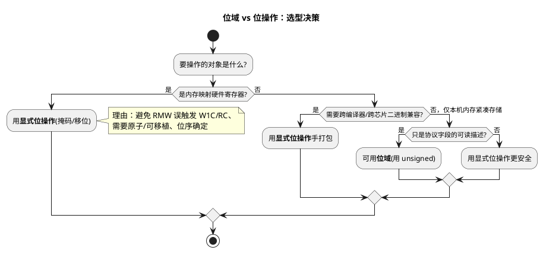

# 02 位域 vs 位操作

> 一句话定位：位域（bit-field）看起来"声明即字段"，但它的位序、对齐、单比特是否有符号几乎全是实现定义行为（implementation-defined）——做协议字段描述尚可，**拿它映射硬件寄存器等于在 W1C/RC 寄存器和多核并发上埋雷**；硬件寄存器、跨平台代码一律用显式位操作。
> 等级：L1 ｜ 前置：[01-掩码与置位清零](01-掩码与置位清零.md)

## 原理

### 1. 位域语法

C 允许在结构体里给成员指定"占用多少 bit"：

```c
typedef struct {
    unsigned int id  : 11;   /* 11 位 */
    unsigned int rtr : 1;
    unsigned int ide : 1;
    unsigned int dlc : 4;
} Can_StdHeader_Bf;
```

写法 `类型 成员名 : 宽度`，编译器在底层用移位/掩码帮你打包。读 `hdr.ide` 像访问普通成员，看起来清爽——但这层"清爽"掩盖了下面一堆实现定义行为。

### 2. 位域的实现定义行为（不可移植的根源）

位域几乎所有布局细节都交给编译器决定，标准故意留白：

| 行为 | 标准规定 | 后果 |
|---|---|---|
| 位分配顺序（高位先/低位先） | 实现定义 | 同一结构体在小端/大端 CPU 上布局不同 |
| 是否跨越存储单元边界 | 实现定义 | 3-bit 字段是否横跨字节由编译器定 |
| 存储单元对齐与填充 | 实现定义 | sizeof 在不同工具链不同 |
| `int` 位域是否有符号 | `int` 即 signed int | `int x:3` 范围 -4~3，赋 0b111 得 -1 |
| 单比特有符号位域 | 实现定义取值 | `int f:1` 只能存 0 或 -1，赋 1 得 -1（MISRA 规则 6.2） |
| 能否取地址 `&bf.x` | **不允许** | 没法用指针/锁单独保护某位 |

这意味着：**同一份位域代码，从 IAR 换到 GreenHills、从 TriCore 换到 Cortex-M，二进制布局可能完全不同**。AUTOSAR 代码要跨工具链、跨芯片复用，位域做寄存器映射是头号可移植性陷阱。MISRA C:2012 规则 6.1 也把位域的可用类型限定在 `bool`/`unsigned int`/`signed int`。

### 3. 位域读硬件寄存器的三重危险

1. **编译器必生成读-改-写（RMW, Read-Modify-Write）**：位域不能只改一位就只写一位，编译器必须读出整个存储单元、改目标位、再写回。对 **W1C（write-1-to-clear）** 中断标志寄存器，写回会把读到的所有"1"再清一遍——误清新置位的标志；对 **RC（read-clear）** 寄存器，读一下就清了，写回的是脏值。
2. **不是原子操作**：RMW 三步，ISR 抢断就丢位（见 03 篇）。
3. **位序/对齐实现定义**：换个编译器，你以为的 bit3 跑到了 bit4，寄存器配错静默失效。

### 4. 位域适合什么 / 必须用位操作的场景



一句话：**位域 = 内存里、本机内、纯软件的字段描述工具；硬件寄存器、跨平台序列化一律位操作。**

## 代码示例

### 场景 1：位域做协议字段描述（合法用法）

```c
/* CAN 2.0A 标准帧头的"字段描述结构"——只用于在内存里组织/解析字段，
 * 不直接 cast 到报文内存或寄存器。注意全部用 unsigned，避免有符号位域坑。 */
typedef struct {
    unsigned int id  : 11;   /* 标准 ID */
    unsigned int rtr : 1;    /* 远程帧 */
    unsigned int ide : 1;    /* 扩展帧标志（标准帧恒 0） */
    unsigned int r0  : 1;    /* 保留 */
    unsigned int dlc : 4;    /* 数据长度码 0~8 */
} Can_StdHeaderDesc;
```

### 场景 2：同一字段用显式位操作解析（可移植对照）

```c
/* 某报文控制字节的位定义（bit0=rtr ... bit4~7=dlc，示意） */
#define CAN_HDR_RTR_POS   (0u)
#define CAN_HDR_RTR_MSK   (1UL << CAN_HDR_RTR_POS)
#define CAN_HDR_DLC_POS   (4u)
#define CAN_HDR_DLC_WID   (4u)

/* 用显式移位/掩码提取，与编译器、CPU 字节序无关 */
uint8 Can_GetDlc(uint8 hdrByte)
{
    return (uint8)((hdrByte >> CAN_HDR_DLC_POS) & ((1UL << CAN_HDR_DLC_WID) - 1UL));
}

boolean Can_IsRemote(uint8 hdrByte)
{
    return ((hdrByte & CAN_HDR_RTR_MSK) != 0u) ? TRUE : FALSE;
}
```

### 场景 3：位域映射硬件寄存器（反例）

```c
/* ---- 反例：用位域映射中断使能寄存器 ---- */
typedef struct {
    volatile unsigned int txEn  : 1;
    volatile unsigned int rxEn  : 1;
    volatile unsigned int errEn : 1;
} Can_IeReg_Bf;

#define CAN_IE_REG (*(volatile Can_IeReg_Bf *)0xF0180010u)

void Bad_EnableTx(void)
{
    CAN_IE_REG.txEn = 1u;   /* 看起来清爽，编译器实际生成：
                             *   tmp = *(uint8*)0xF0180010;  // 读整寄存器
                             *   tmp |= 0x01;                // 改一位
                             *   *(uint8*)0xF0180010 = tmp;  // 写回整寄存器
                             * 问题1：若这是 W1C 标志寄存器，写回会误清标志;
                             * 问题2：RMW 在 ISR 抢断时丢位;
                             * 问题3：位序实现定义，换编译器 bit0 变 bit7。
                             */
}

/* ---- 正解：显式位操作，"或"只动目标位 ---- */
#define CAN_IE_REG_ADDR  (0xF0180010u)
#define CAN_IE_TXEN      (1UL << 0)
#define CAN_IE_RXEN      (1UL << 1)

void Good_EnableTx(void)
{
    *(volatile uint32 *)CAN_IE_REG_ADDR |= CAN_IE_TXEN;
}
```

### 场景 4：union{位域;整型} 做序列化的字节序陷阱

```c
/* 反例：想用 union 让位域和 32 位整型共享内存，"一行"完成报文打包 */
typedef union {
    uint32 raw;
    struct {
        unsigned int fieldA : 12;
        unsigned int fieldB : 20;
    } bf;
} Pdu_Word;

/* 在小端 CPU(Cortex-M) 上 fieldA 落在低 12 位；
 * 在大端核上 fieldA 落在高 12 位。
 * 同样赋值 Pdu.bf.fieldA = 0xABC; 在两种 CPU 上 raw 值不同 -> 报文不一致。
 * 而且 MISRA 规则 19.2 要求不要用 union，规则 6.1 限定位域类型。
 * 量产代码用显式移位组装：
 *   raw = (fieldA & 0xFFFu) | ((fieldB & 0xFFFFFu) << 12);
 */
```

### 场景 5：单比特有符号位域的 -1 陷阱（规则 6.2）

```c
typedef struct {
    int flag : 1;        /* 有符号单比特位域：只能存 0 或 -1！ */
} Trap_Bf;

void Demo(void)
{
    Trap_Bf t;
    t.flag = 1;          /* 想存 1，实际存进去是 -1（符号位） */
    if (t.flag > 0)      /* 永远不成立：t.flag == -1 */
    {
        /* 死代码，永远进不来 */
    }
    /* MISRA 规则 6.2：单比特有名位域不得用有符号类型。改 unsigned int flag:1 才安全。 */
}
```

## 易错点与陷阱

1. **位序实现定义**：little-endian 与 big-endian CPU 上同一结构体布局不同，跨平台必错。
2. **跨字节/字对齐实现定义**：3-bit 字段是否横跨字节边界由编译器决定，依赖"不跨"是埋雷。
3. **`int` 位域是有符号**：`int x:4` 范围 -8~7，`0b1111` 得 -1；要无符号必须显式 `unsigned int`（规则 6.1）。
4. **单比特有符号位域只存 0/-1**：`int f:1` 赋 1 得 -1，`if (f>0)` 恒假——MISRA 规则 6.2 明确禁止。
5. **位域不能取地址**：`&reg.txEn` 编译错误——没法用指针或锁单独保护某位，并发场景无解。
6. **位域 RMW 误触发 W1C/RC**：编译器必读-改-写整个存储单元，对中断标志寄存器是灾难。
7. **不同工具链 sizeof 不同**：IAR/GreenHills/HighTec 对同一结构体给出不同大小，AUTOSAR 跨工程复用即翻车。
8. **union{位域;整型} 当序列化**：是字节序陷阱重灾区，大小端核上二进制结果不同，且违反规则 19.2。

## 面试高频题

**Q1：位域有哪些实现定义行为？**
答：位分配顺序（高位/低位先）、是否跨存储单元边界、对齐与填充，全是实现定义；位域成员还不允许取地址。`int` 位域是有符号的（不算实现定义，但常被误以为无符号）。结论：位域布局不可跨编译器/跨平台假设。

**Q2：为什么不应该用位域映射硬件寄存器？**
答：三条理由——编译器对位域赋值必生成读-改-写整个存储单元，会误触发 W1C/RC 寄存器的副作用；RMW 不是原子操作，ISR 抢断丢位；位序和对齐实现定义，换工具链就错位。

**Q3：位域适合做什么？**
答：仅用于本机内存内、纯软件的紧凑字段组织与可读描述（如组织配置结构、协议字段的内存模型），且不要求二进制跨平台兼容、不取地址、不映射寄存器时。

**Q4：`int flag : 1` 赋值 1 后 `if (flag > 0)` 为什么不成立？**
答：单比特有符号位域只有一位符号位、零位数值位，能表示的值只有 0 和 -1，赋 1 实际存成 -1，比较时提升为 int 的 -1，`-1 > 0` 为假。MISRA 规则 6.2 因此禁止单比特有名位域用有符号类型，应改 `unsigned int flag : 1`。

**Q5：能对位域成员取地址吗？为什么？**
答：不能，`&bf.x` 编译错误。位域不按字节对齐，没有独立地址；这也导致无法用指针/锁单独保护某位，并发场景下位域不可用。

**Q6：位域 vs 位操作：何时用哪个？**
答：硬件寄存器、跨平台序列化、需要原子/可预测位序——一律显式位操作；仅本机内存内、纯软件、不取地址、不跨平台二进制兼容的字段描述，可用位域（且用 `unsigned int`，遵守规则 6.1/6.2）。

## 延伸

- [03 寄存器位操作惯用法](03-寄存器位操作惯用法.md)：位域映射寄存器的 RMW 陷阱在这里展开成完整时序与原子策略。
- [寄存器编程](../../2-L2进阶/寄存器编程/README.md)：结构体映射寄存器的可移植做法与位带操作。
- [代码规范与MISRA-C](../../2-L2进阶/代码规范与MISRA-C/README.md)：规则 6.1/6.2（位域类型）、19.2（禁用 union）等条目。
