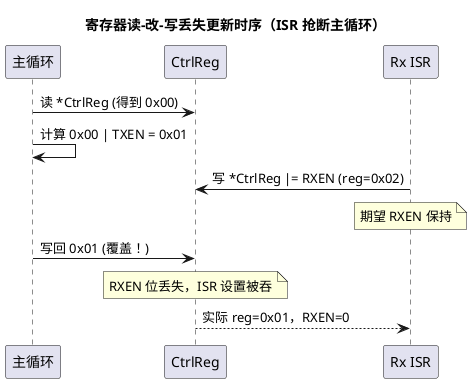

# 03 寄存器位操作惯用法

> 一句话定位：硬件寄存器的位操作不是"会写四件套就行"——读-改-写（RMW）在 ISR 与主循环并发下会丢位，W1C 中断标志寄存器用 `&=` 清位是反逻辑，TC377 多核下关本核中断挡不住另一核；这三件事是 BSW/CDD 工程师在 MCAL 边界踩坑最密集的地方。
> 等级：L1 ｜ 前置：[01-掩码与置位清零](01-掩码与置位清零.md)

## 原理

### 1. 读-改-写（RMW, Read-Modify-Write）

`reg |= BIT(n)` 在汇编层是三步：读 `reg` 到寄存器、改某一位、写回 `reg`。对纯软件变量这没问题，对**共享寄存器**就是并发陷阱——三步之间只要有人插队改了同一寄存器的别的位，写回时就把人家的修改覆盖了。这就是"丢失更新"（lost update）。

### 2. 丢失更新：ISR 与主循环并发改同一寄存器

典型场景：主循环改控制寄存器的 bit0（开 TX），ISR 改同一寄存器的 bit1（开 RX）。两个 RMW 交错，后写的覆盖先写的，bit1 丢失。时序见下方 PlantUML。

### 3. W1C 中断标志寄存器的两个陷阱

W1C（write-1-to-clear）寄存器语义：**写 1 清该位，写 0 该位不变**。很多中断标志、状态锁存寄存器（TC377 MCAN 的 IR/IE、S32K FlexCAN 的 IFLAG）都是 W1C。

- **陷阱一：用 `&=` 清位是反逻辑**。`flagReg &= ~BIT(3)` 算出来对 bit3 写的是 0，而 W1C 写 0 **不清**——目标位根本没清掉，函数静默失效，你以为处理完了中断其实还挂着。
- **陷阱二：先读后写误清**。先 `v = flagReg` 读出所有 pending 位（它们是 1），处理完 bit0 后写回 `flagReg = v`，会把读到的所有 1 全部清掉——包括没处理过的 bit2、以及读之后 ISR 新置位的位。

正确写法：**只对要清的位写 1，其余写 0**——`flagReg = BIT(3)`，干脆利落，不读、不依赖读到的值。

### 4. 多核并发（TC377）下的原子位操作

TC377（AURIX TriCore，三核 CPU0/CPU1/CPU5）下，关本核中断只能挡住**本核**的中断，挡不住另一核同时写同一寄存器。原子位操作策略分三层：

1. **首选：每核独立寄存器**。很多外设给每核一份控制位（如各核自己的中断控制寄存器），天然无竞争，直接 RMW 即可。
2. **共享寄存器：用原子指令**。TriCore 提供原子读-改-写类指令（LDMST / MASK 系列），厂商 SDK（如 IfxCpu）封装成原子位操作接口；C 层尽量调这些接口而不是裸 RMW。
3. **AUTOSAR Os 层：自旋锁**。跨核共享资源用 `GetSpinlock`/`ReleaseSpinlock`（OsSpinlock），临界区内做 RMW；自旋锁比关中断更"对事"，且不影响本核其它中断实时性。



## 代码示例

### 场景 1：RMW 在 ISR/主循环并发下丢位（反例）

```c
#include "Std_Types.h"

#define BIT(n)  (1UL << (n))

volatile uint32 * const CtrlReg = (volatile uint32 *)0xF0180020u;
#define CTRL_TXEN  BIT(0)
#define CTRL_RXEN  BIT(1)

void Isr_RxEvent(void)            /* ISR：置 RXEN */
{
    *CtrlReg |= CTRL_RXEN;        /* RMW：读-改-写 */
}

void App_EnableTxOnly(void)       /* 主循环：开 TXEN、关 RXEN */
{
    *CtrlReg &= ~CTRL_RXEN;       /* RMW：读(temp)-改-写 */
    *CtrlReg |= CTRL_TXEN;
}
/* 丢位时序：主循环读到 reg=0x00 -> 算出 0x01；此刻 ISR 置 RXEN 让 reg=0x02；
 * 主循环写回 0x01 -> RXEN 被覆盖丢失。 */
```

### 场景 2：关中断保护临界区（单核正解）

```c
/* 单核下，把"读-改-写"整段放进关中断临界区即可。
 * AUTOSAR Os 提供 SuspendOSInterrupts / ResumeOSInterrupts、
 * 或 DisableAllInterrupts / EnableAllInterrupts，按所需屏蔽级别选用。 */
void App_EnableTxOnly_Safe(void)
{
    ImpMaskType prevMask;

    prevMask = SuspendOSInterrupts();                          /* 进临界区 */
    *CtrlReg = (*CtrlReg & ~CTRL_RXEN) | CTRL_TXEN;            /* 一次 RMW */
    ResumeOSInterrupts(prevMask);                              /* 出临界区 */
}
/* 注意：临界区要尽量短，只含寄存器操作，不要夹业务逻辑/调用点。 */
```

### 场景 3：W1C 中断标志寄存器的反例与正解

```c
volatile uint32 * const FlagReg = (volatile uint32 *)0xF0180030u;
#define FLAG_TXOK   BIT(0)
#define FLAG_RXOK   BIT(1)
#define FLAG_ERR    BIT(2)

/* 反例1：用 &= 清某位 —— W1C 写0不清，bit0 根本没清掉，静默失效 */
void Bad_ClearTxOk(void)
{
    *FlagReg &= ~FLAG_TXOK;       /* ~FLAG_TXOK 让 bit0 写0 -> 不清！ */
}

/* 反例2：先读后写 —— 读到的所有 pending 位都是1，写回时把它们全清了，
 * 包括没处理过的 bit2，以及"读之后、写之前"ISR 新置位的位 */
void Bad_ClearTxOk_ReadThenWrite(void)
{
    uint32 pending = *FlagReg;    /* 读：可能含未处理标志 */
    /* ...处理 bit0... */
    *FlagReg = pending;           /* 写回：所有 pending 位被清，误清！ */
}

/* 正解：只对要清的位写1，其余写0(对W1C不变) */
void Good_ClearTxOk(void)
{
    *FlagReg = FLAG_TXOK;         /* 只清 TXOK，不影响 RXOK/ERR 等其它 pending 位 */
}

/* 批量清一组已处理标志：把要清的位"或"起来一次性写 */
void Good_ClearMultiple(uint32 handledMask)
{
    *FlagReg = handledMask;       /* 例如 handledMask = FLAG_TXOK | FLAG_RXOK */
}
```

### 场景 4：TC377 多核共享寄存器（自旋锁 / 原子接口）

```c
/* 多核下关本核中断挡不住另一核；必须用 Os 自旋锁或原子指令。
 * 方案A：AUTOSAR Os 自旋锁（推荐，可移植） */
void MultiCore_SetCtrlBits(uint32 mask)
{
    GetSpinlock(SPIN_CTRL_REG);        /* OsSpinlock：跨核互斥 */
    *CtrlReg |= mask;
    ReleaseSpinlock(SPIN_CTRL_REG);
}

/* 方案B：厂商 SDK 原子位操作接口（底层走 TriCore LDMST/MASK 原子读改写）
 * 示意接口名，实际见 IfxCpu 等头文件，如：
 *   IfxCpu_setBitsAtomic((uint32*)CtrlReg, mask);
 *   IfxCpu_clearBitsAtomic((uint32*)CtrlReg, mask);
 * 它们单条原子指令完成 RMW，无需自旋锁、不阻塞中断。 */
```

## 易错点与陷阱

1. **RMW 默认不原子**：`reg |= BIT(n)` 是三步，ISR 抢断就丢位。共享寄存器必须加保护。
2. **关中断要关"够级别"**：只关 Category 1 中断挡不住 Category 2；AUTOSAR 按"会不会被你要保护的中断抢断"来选 `DisableAllInterrupts`/`SuspendOSInterrupts`。
3. **多核关本核中断无效**：TC377 关 CPU0 中断挡不住 CPU1，跨核共享必须自旋锁或原子指令。
4. **W1C 用 `&=` 反逻辑**：写 0 不清，目标位没清掉，静默失效。正确是 `= BIT(n)`。
5. **W1C "先读后写"误清**：读后 ISR 又置位，你写回读到的值会把它也清掉；正确写法不读、只写要清的位。
6. **RC 寄存器做 RMW**：read-clear 寄存器读一下就清了，再"改写回"把脏值写进去。RC 寄存器只读不改写。
7. **volatile 当原子用**：volatile 只保证"每次都真访问内存"，不保证 RMW 原子；并发仍要加保护。
8. **临界区太长**：把业务逻辑、函数调用塞进关中断区，会拖垮中断实时性。临界区只放寄存器 RMW 几条指令。

## 面试高频题

**Q1：什么是 RMW？为什么有并发风险？**
答：读-改-写，`reg |= BIT(n)` 在汇编层是"读 reg→改一位→写回 reg"三步。三步之间若被另一执行流（ISR/另一核）插队改了同一寄存器别的位，写回就覆盖了对方的修改，造成丢失更新。

**Q2：主循环和 ISR 都改同一寄存器不同位，怎么避免丢位？**
答：把 RMW 放进关中断临界区（单核，`SuspendOSInterrupts`/`DisableAllInterrupts`），或用原子位操作指令；保证"读-改-写"不被同一共享者打断。

**Q3：W1C 寄存器怎么清某一位？为什么不能用 `&=`？**
答：W1C 写 1 清、写 0 不变，清 bit3 要 `flagReg = BIT(3)`。`&=` 算出来对 bit3 写 0，写 0 不清——目标位根本没清掉，函数静默失效。

**Q4：W1C "先读后写"为什么会误清？**
答：先读 `v = flagReg` 把所有 pending 位（=1）读出来，写回 `flagReg = v` 时对这些位写 1，全部清掉，包括没处理过的位、以及读之后 ISR 新置位的位。正确做法是只写要清的位，不读、不基于读到的值写回。

**Q5：多核（TC377）下关中断还有用吗？怎么办？**
答：关本核中断挡不住另一核，对跨核共享寄存器无效。要用 Os 自旋锁（`GetSpinlock`/`ReleaseSpinlock`），或厂商 SDK 的原子位操作接口（底层 TriCore LDMST/MASK 原子指令）；每核独立寄存器则无需保护。

**Q6：volatile 能保证位操作原子吗？**
答：不能。volatile 只保证"每次访问都真的发生、不被缓存/合并/删除"，不保证访问不可分割；`reg |= BIT(n)` 仍是读-改-写三步，并发下照样丢位，必须关中断/原子指令/自旋锁。

## 延伸

- [寄存器编程](../../2-L2进阶/寄存器编程/README.md)：结构体映射寄存器、读写时序与内存屏障（DMB/DSB）的工程化做法。
- [指针专题 04 const 与 volatile 指针](../指针专题/04-const与volatile指针.md)：volatile 三个"不保证"与寄存器指针的限定符写法。
- [代码规范与MISRA-C](../../2-L2进阶/代码规范与MISRA-C/README.md)：临界区、共享资源访问相关的规则与合规改写。
