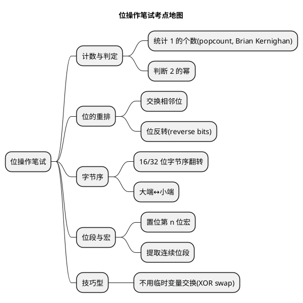

# 04 常见笔试题（位操作）

> 一句话定位：嵌入式笔试/面试里位操作题的八成考法——统计 1 的个数、判断 2 的幂、交换相邻位、字节序转换、XOR 交换、置位宏、位反转、提取位段，全部带 CAN/UDS/DTC 场景变体与"笔试能过、量产要改"的提示。
> 等级：L1 ｜ 前置：[01-掩码与置位清零](01-掩码与置位清零.md)

## 原理

位操作笔试题考点高度集中，先看全景再逐题击破：



做题总原则：

- 看到"统计 1"先想 `x & (x-1)` 每次消一个 1，复杂度等于 1 的个数；
- 看到"判断 2 的幂"先想"只有一个 1"，即 `x && !(x & (x-1))`；
- 看到"重排/反转"先想分治：先两两交换，再四四交换，逐级倍增；
- 看到"字节序"先想总线大端、内核小端，手写移位最可移植；
- 看到宏一律 `1UL` + 全参数加括号（见 01 篇）。

## 代码示例

### 题 1：统计 1 的个数（popcount）

```c
/* 法1：逐位与，O(位数) */
uint8 PopCount_Loop(uint32 x)
{
    uint8 cnt = 0u;
    while (x != 0u)
    {
        cnt += (uint8)(x & 1u);
        x >>= 1;
    }
    return cnt;
}

/* 法2：Brian Kernighan 法，每次消掉最低的 1，循环次数=1 的个数 */
uint8 PopCount_BK(uint32 x)
{
    uint8 cnt = 0u;
    while (x != 0u)
    {
        x &= (x - 1u);   /* x-1 把最低位的 1 借位翻成 0，更低位全变 1；
                           * 与原 x 相与恰好清掉这个 1，其余不变 */
        cnt++;
    }
    return cnt;
}
```

解析：核心是 `x & (x-1)` 的性质——它清掉 `x` 最低位的 1 而不动更高位。Brian Kernighan 法循环次数等于 1 的个数，对稀疏位（如状态字只有两三个位置位）远快于逐位法。注意 `x` 是无符号，右移是逻辑移位。

**汽车场景变体**：统计 DTC 状态字节（DTCStatusMask，bit0=testFailed、bit1=testFailedThisOperationCycle…）中当前激活的故障标志数；或统计某 CAN 信号的有效位宽。

### 题 2：判断 2 的幂

```c
boolean IsPowerOf2(uint32 x)
{
    /* 2 的幂只有一个 1 -> x & (x-1) == 0；但要排除 0（0 也满足上式） */
    return ((x != 0u) && ((x & (x - 1u)) == 0u)) ? TRUE : FALSE;
}
```

解析：2 的幂的二进制只有一个 1，`x & (x-1)` 把这个 1 清掉后为 0。陷阱是 `x = 0` 时 `0 & -1` 也是 0，会被误判，所以必须先排零。

**汽车场景变体**：CAN 控制器某些硬件过滤/掩码要求 ID 或滤波器数量是 2 的幂对齐；或判断一个掩码是否"只覆盖连续一段"（结合 popcount=1 的位段判断）。

### 题 3：交换相邻位

```c
/* 交换 32 位中每对相邻位：bit0<->bit1, bit2<->bit3, ... */
uint32 SwapAdjacentBits(uint32 x)
{
    uint32 even = (x & 0xAAAAAAAAu) >> 1;   /* 取偶数位，右移一格 */
    uint32 odd  = (x & 0x55555555u) << 1;   /* 取奇数位，左移一格 */
    return even | odd;
}
```

解析：分治思想——`0xAAAA...` 选中所有偶数位（bit0/2/4…），`0x5555...` 选中所有奇数位（bit1/3/5…），分别移一格再合并。这是位反转、位重排类题的基础子步骤（两两交换→四四交换→八八交换）。

**汽车场景变体**：报文字段位序重排、某些串行链路 LSB-first 与 MSB-first 转换的子步骤；CAN FD DLC 9~15 的特殊编码也涉及位段重排思路。

### 题 4：高低字节序转换（16/32 位）

```c
/* 16 位字节序翻转 */
uint16 Swap16(uint16 v)
{
    return (uint16)(((v & 0x00FFu) << 8) | ((v & 0xFF00u) >> 8));
}

/* 32 位字节序翻转 */
uint32 Swap32(uint32 v)
{
    return ((v & 0x000000FFu) << 24)
         | ((v & 0x0000FF00u) << 8)
         | ((v & 0x00FF0000u) >> 8)
         | ((v & 0xFF000000u) >> 24);
}
```

解析：本质是"用掩码拆出每个字节，再移到目标位置"。16 位两字节互换、32 位四字节首尾倒置。务必用 `0xFFu` 掩码先截再移，避免移位后越界污染。

**汽车场景变体**：UDS 多字节参数（如 31 例程的输入长度、22/2E 的 DID）按大端在 CAN 总线传输，S32K（Cortex-M，小端）收到后需转主机序；DTC 三字节拼装（见 01 篇）同理。生产代码用移位而不用 memcpy，跨平台安全。

### 题 5：不用临时变量交换（XOR swap）

```c
void XorSwap(uint32 *a, uint32 *b)
{
    /* 前提：a、b 不能指向同一对象，否则会清零 */
    if (a != b)
    {
        *a ^= *b;
        *b ^= *a;
        *a ^= *b;
    }
}
```

解析：利用 `a ^ b ^ b = a` 的自反性三步完成交换，不借临时变量。但**生产代码别用**——可读性差；同名对象（`a==b`）会把它清零成 UB 风险；现代编译器用临时变量交换反而更优（寄存器分配、不破坏流水线），XOR 版妨碍优化器的别名分析。笔试会写、量产用 `tmp`。

**汽车场景变体**：基本无正当量产场景；作为反例提醒——MISRA 视角这种"炫技"写法可读性差、易错，评审会被打回。

### 题 6：置位第 n 位宏

```c
#define BIT(n)          (1UL << (n))
#define SET_BIT(r, n)   ((r) |= BIT(n))
#define CLR_BIT(r, n)   ((r) &= ~BIT(n))
```

解析：三个要点——`1UL` 保证无符号移位（`1<<31` 是 UB）；参数 `n`、`r` 都加括号防优先级坑（`SET_BIT(r, n+1)` 不能展开成 `r |= 1UL << n+1`）；`SET_BIT` 用 `do/while` 或表达式形式以避免 `if` 后跟分号歧义。

**汽车场景变体**：CAN ID 寄存器置 IDE（XTD）位、RTR 位；中断使能寄存器置某通道使能位。结合 01 篇的 `Can_BuildIdReg` 理解"先截断再或"。

### 题 7：位反转（reverse bits，字节）

```c
/* 反转一个字节的高低位序：bit0<->bit7, bit1<->bit6 ... */
uint8 ReverseByte(uint8 v)
{
    v = (uint8)(((v & 0xF0u) >> 4) | ((v & 0x0Fu) << 4));  /* 半字节交换 */
    v = (uint8)(((v & 0xCCu) >> 2) | ((v & 0x33u) << 2));  /* 2位一组交换 */
    v = (uint8)(((v & 0xAAu) >> 1) | ((v & 0x55u) << 1));  /* 相邻位交换 */
    return v;
}
```

解析：分治三步走——先交换高低 4 位，再 2 位一组交换，最后相邻位交换，得到完全反转的字节。这是题 3"交换相邻位"的进阶版，把"两两交换"思路倍增三次。32 位反转同理再加一步 16 位/字节交换。

**汽车场景变体**：CRC 反射计算（CAN 的 CRC-15、LIN 的校验和）、某些串行总线 LSB-first 传输时把 MSB-first 的字段反转后发送。

### 题 8：提取连续位段

```c
/* 提取 x 的 [n, n+w) 位段 */
#define FIELD_GET(x, n, w)  (((x) >> (n)) & ((1UL << (w)) - 1UL))

/* 应用：从 TC377 MCAN ID 寄存器提取 29 位扩展 ID */
#define CAN_ID_XTD   (1u << 31)
#define CAN_EXT_MASK (0x1FFFFFFFu)

uint32 Can_GetExtId(uint32 idReg)
{
    return FIELD_GET(idReg, 0u, 29u);   /* 低 29 位是 ID */
}

boolean Can_IsExtFrame(uint32 idReg)
{
    return ((idReg & CAN_ID_XTD) != 0u) ? TRUE : FALSE;
}
```

解析：先右移 `n` 位把目标位移到最低位，再用 `(1UL<<w)-1` 生成的 `w` 个 1 掩码截掉高位。两步缺一不可：只移不掩会带上高位脏数据，只掩不移拿到的不是孤立值。

**汽车场景变体**：从 CAN ID 寄存器提取 29 位 ID / XTD(IDE) / RTR 字段；从 32 位 DTC 状态字提取某一段故障子状态；从寄存器提取硬件版本号字段。

## 易错点与陷阱

1. **统计 1 用 `x & (x-1)` 忘了无符号**：有符号 `x-1` 在 `x=INT_MIN` 时溢出是 UB，参数用 `uint32`。
2. **判断 2 的幂不排零**：`x & (x-1) == 0` 对 `x=0` 也成立，必须 `x != 0 && ...`。
3. **字节序转换只移不掩**：`v << 8` 在 16 位里会把高位挤出，再或起来时虽被截断但可读性差且易错；先用 `0xFFu` 截再移最稳。
4. **XOR swap 用于同名对象**：`XorSwap(&a, &a)` 第一步 `a^=a` 清零，后续全错——必须判 `a != b`，或干脆生产代码别用。
5. **宏漏 `1UL` 或漏括号**：`1 << 31` 是 UB，`BIT(n+1)` 不加括号展开错。见 01 篇铁律。
6. **位反转分治顺序写反**：必须从"大组到小组"（4→2→1）逐级交换，跳步或乱序结果全错。
7. **提取位段只掩不移**：拿到的是带高位的混合值；只移不掩则带脏数据。两步都要。
8. **笔试炫技写法进量产**：XOR swap、`i+++++i` 这类笔试能过、量产必被 MISRA/评审打回——区分场合。

## 面试高频题（快问快答）

**Q1：`x & (x-1)` 有什么用？**
答：清掉 `x` 最低位的 1。用于 Brian Kernighan 法统计 1 的个数（循环次数=1 的个数）、判断 2 的幂（`x && !(x&(x-1))`）。

**Q2：判断一个数是不是 2 的幂，一行代码？**
答：`return x && !(x & (x-1));`。2 的幂只有一个 1，`x&(x-1)` 清掉它后为 0；`x &&` 排除 0。

**Q3：不用临时变量交换两个整数？为什么生产代码别用？**
答：XOR swap 三步 `a^=b; b^=a; a^=b;`。别用原因：可读性差、同名对象清零、妨碍编译器别名分析与寄存器分配，现代编译器用临时变量交换更优。

**Q4：32 位整型字节序翻转怎么写？**
答：用 `0xFF` 掩码拆出四个字节分别移位再或：`((v&0xFF)<<24) | ((v&0xFF00)<<8) | ((v&0xFF0000)>>8) | ((v&0xFF000000)>>24)`。务必先截后移。

**Q5：字节反转（bit0↔bit7）的思路？**
答：分治三步——半字节交换（`0xF0/0x0F`）、2 位一组交换（`0xCC/0x33`）、相邻位交换（`0xAA/0x55`），逐级倍增。

**Q6：提取寄存器 `[n, n+w)` 位段的宏？为什么先移后掩两步都要？**
答：`#define FIELD_GET(x,n,w) (((x)>>(n)) & ((1UL<<(w))-1UL))`。先移把目标位移到最低位，再掩截掉高位；只移不掩带脏数据，只掩不移拿到的是混合值。

## 延伸

- [01 掩码与置位清零](01-掩码与置位清零.md)：题 6/题 8 宏的完整安全写法与 CAN ID/DTC 组装场景。
- [03 寄存器位操作惯用法](03-寄存器位操作惯用法.md)：题 8 提取出的位段在并发/多核下如何安全修改。
- [代码规范与MISRA-C](../../2-L2进阶/代码规范与MISRA-C/README.md)：本篇多处"笔试能过、量产要改"对应的规则 1.3、12.1 等。
