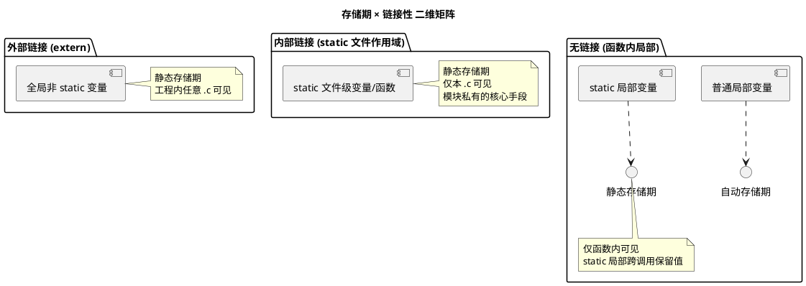

# 01 关键字与存储类

> 一句话定位：static/extern/const/volatile/auto/register 这六个关键字控制"变量活多久、谁能看见它、能不能被改、能不能被优化掉"——读懂 AUTOSAR 模块的 .c/.h 拆分、读懂 ISR 与主循环共享变量，全靠它们。
> 等级：L1 ｜ 前置：无

## 原理

C99 里直接管"存储期 / 链接性 / 限定性"的关键字有六个。理解它们要从两个维度切入：

1. **存储期（storage duration）**：对象在内存里"活"多久——静态（整个程序生命周期）、自动（进入块到出块）、动态分配（malloc/free 之间）。
2. **链接性（linkage）**：对象的名字在多少个翻译单元里可见——外部链接（全工程可见）、内部链接（仅本 .c 可见）、无链接（函数内局部）。

外加两个"限定性"关键字：const 管"能不能写"，volatile 管"能不能被编译器优化掉"。

### 1. 六个关键字速查

| 关键字 | 放在哪 | 管什么 | 典型 AUTOSAR 场景 |
|---|---|---|---|
| `static` | 函数内 / 文件作用域函数或变量 | 改存储期为静态 + 改链接性为内部 | 模块私有变量、单例句柄 |
| `extern` | 任意处声明 | 声明"定义在别处"，外部链接 | 跨 .c 引用 NvM_BlockIdType |
| `const` | 类型左/右 | 只读（逻辑上），编译器可放 ROM | 查找表、DID 表、配置参数 |
| `volatile` | 类型左 | 禁止编译器把访问优化掉 | MMIO 寄存器、ISR 共享标志 |
| `auto` | 函数内 | 显式声明自动存储期（默认） | 几乎不用，留着兼容老代码 |
| `register` | 函数内 | 提示编译器尽量放寄存器 | 现代 MCU 用得少，`&` 取地址会失效 |

### 2. 存储期 × 链接性 二维矩阵



要点：

- **`static` 一词两义**：文件作用域加 `static` 改的是"链接性"（外部→内部，等于模块私有）；块内加 `static` 改的是"存储期"（自动→静态，跨调用保留值）。两件事不冲突，但容易混。
- **`extern` 只是声明不是定义**：`extern uint8 g_flag;` 告诉编译器"这个名字有定义，链接时去找"，本身不分配存储。真正的定义在另一个 .c 里写成 `uint8 g_flag = 0;`。
- **`const` 不等于"必在 ROM"**：放在文件作用域的 `const` 是否进 ROM 取决于链接器段（AUTOSAR MemMap 的 `CONST_SECTION`），const 只是给编译器一个"不可写"的承诺，运行期若强转改写仍可能"看似成功"然后触发 trap。

### 3. 文件作用域 static = AUTOSAR 模块的"模块私有"

AUTOSAR 每个 BSW 模块（NvM、Com、Dem…）都有标准 API：`NvM_Init()`、`NvM_ReadBlock()`、`NvM_WriteBlock()`。这些 API 是对外契约，但每个模块内部必然有大量"只有自己用"的句柄、状态机变量、配置表。把这些东西标 `static` 放在 .c 文件作用域，做到：

- 头文件只暴露契约 API 和类型，最小化耦合；
- 模块内部状态不会被别的 .c 直接改写，所有访问必须经过 API；
- 链接器层面就杜绝了"两个模块都定义 g_ModuleState"的重名冲突。

这是 C 实现面向对象封装最朴素也最有效的手段。

## 代码示例

下面是一个 NvM 风格的最小模块：对外能 ReadBlock/WriteBlock/Init，对内维护一个 RAM 缓冲和"已初始化"标志。

### NvM_Lite.h —— 对外契约

```c
/* NvM_Lite.h：仅暴露 API 与类型，不暴露任何内部状态 */
#ifndef NVM_LITE_H
#define NVM_LITE_H

#include "Std_Types.h"   /* AUTOSAR 标准类型 uint8/uint16/Std_ReturnType 等 */

#define NVM_LITE_BLOCK_SIZE   (64U)   /* 单块 64 字节，模拟一个 NvM 块 */

/* 对外的块 ID，用 enum 而非宏，便于调试器显示名字（详见 03 篇） */
typedef enum
{
    NVM_LITE_BLOCK_CALIB = 0,
    NVM_LITE_BLOCK_DIAG,
    NVM_LITE_BLOCK_NUM
} NvM_Lite_BlockIdType;

/* 标准返回：E_OK / E_NOT_OK，与 AUTOSAR Std_ReturnType 一致 */
Std_ReturnType NvM_Lite_Init(void);
Std_ReturnType NvM_Lite_ReadBlock(NvM_Lite_BlockIdType BlockId, uint8 *DataPtr);
Std_ReturnType NvM_Lite_WriteBlock(NvM_Lite_BlockIdType BlockId, const uint8 *DataPtr);

#endif /* NVM_LITE_H */
```

### NvM_Lite.c —— 内部状态用 static 藏起来

```c
/* NvM_Lite.c：所有内部状态文件作用域 static，模块私有 */
#include "NvM_Lite.h"

/* ---- 模块私有状态：外部不可见，不会被同名冲突 ---- */
static uint8 NvM_Lite_aRamBuffer[NVM_LITE_BLOCK_NUM][NVM_LITE_BLOCK_SIZE];
static boolean NvM_Lite_bInitialized = FALSE;
static uint8 NvM_Lite_u8WriteCount = 0U;   /* 统计写入次数，仅本模块关心 */

/* 模块私有：把块 ID 映射到 RAM 缓冲下标，做越界检查 */
static uint8 *NvM_Lite_GetBuffer(NvM_Lite_BlockIdType BlockId)
{
    uint8 *pBuf = NULL_PTR;
    if ((uint8)BlockId < (uint8)NVM_LITE_BLOCK_NUM)
    {
        pBuf = &NvM_Lite_aRamBuffer[(uint8)BlockId][0];
    }
    return pBuf;
}

Std_ReturnType NvM_Lite_Init(void)
{
    /* 真实工程这里会调 Fee_Read() 把 Flash 搬到 RAM，这里只做清零 */
    uint8 blk;
    for (blk = 0U; blk < (uint8)NVM_LITE_BLOCK_NUM; blk++)
    {
        uint8 *p = NvM_Lite_GetBuffer((NvM_Lite_BlockIdType)blk);
        uint8 i;
        for (i = 0U; i < NVM_LITE_BLOCK_SIZE; i++)
        {
            p[i] = 0xFFU;   /* 模拟 Flash 擦除态 */
        }
    }
    NvM_Lite_bInitialized = TRUE;
    return E_OK;
}

Std_ReturnType NvM_Lite_ReadBlock(NvM_Lite_BlockIdType BlockId, uint8 *DataPtr)
{
    Std_ReturnType ret = E_NOT_OK;
    if ((NvM_Lite_bInitialized == TRUE) && (DataPtr != NULL_PTR))
    {
        uint8 *p = NvM_Lite_GetBuffer(BlockId);
        if (p != NULL_PTR)
        {
            uint8 i;
            for (i = 0U; i < NVM_LITE_BLOCK_SIZE; i++)
            {
                DataPtr[i] = p[i];
            }
            ret = E_OK;
        }
    }
    return ret;
}

Std_ReturnType NvM_Lite_WriteBlock(NvM_Lite_BlockIdType BlockId, const uint8 *DataPtr)
{
    Std_ReturnType ret = E_NOT_OK;
    if ((NvM_Lite_bInitialized == TRUE) && (DataPtr != NULL_PTR))
    {
        uint8 *p = NvM_Lite_GetBuffer(BlockId);
        if (p != NULL_PTR)
        {
            uint8 i;
            for (i = 0U; i < NVM_LITE_BLOCK_SIZE; i++)
            {
                p[i] = DataPtr[i];   /* 真实工程这里改写 RAM 并触发 Fee->Fls 异步写入 */
            }
            NvM_Lite_u8WriteCount++;   /* 统计写入次数 */
            ret = E_OK;
        }
    }
    return ret;
}
```

要点：

- 头文件里**没有任何**全局变量声明，外部想读 `NvM_Lite_u8WriteCount` 拿不到，必须再加一个 API；
- `NvM_Lite_aRamBuffer` 是模块私有，别的 .c 不能 `extern` 它；
- `NvM_Lite_GetBuffer` 是私有辅助函数，标 `static` 后链接器不会导出符号，节省符号表也防止误调用。

## 易错点与陷阱

1. **`static` 局部变量在多任务下不是线程安全的**。AUTOSAR OS 多个任务调用 `NvM_Lite_Init` 时，`static` 状态会被并发改写。临界区靠 `SuspendOSInterrupts()` / `ResumeOSInterrupts()` 或 GetResource/ReleaseResource，不靠 `static`。

2. **`const` 局部变量不进 ROM**。函数内 `const uint8 x = 5;` 仍在栈上，每次进函数都会初始化，和文件作用域 `const` 落 ROM 是两回事。

3. **`volatile` 不是"原子性"**。它只保证"每次都从内存真读、不缓存到寄存器"，但 32 位变量在 8 位 MCU 上仍可能被中断打断在中间。原子性要靠关中断或硬件原子指令。

4. **`extern` 声明写错类型会"链接通过、运行错乱"**。A.c 里 `uint16 g_x;`，B.c 里 `extern uint8 g_x;`——大多数链接器不查类型一致性，读出来就少一半或多一半。AUTOSAR 工程常在统一头文件里 `extern` + 在一个 .c 里定义，避免类型漂移。

5. **`register` 取地址是 UB**。`register uint8 x; uint8 *p = &x;` 在标准 C 里是未定义行为，编译器要么报错要么默默改成 auto。现代编译器自己分配寄存器比人靠谱，不要写。

6. **TC377 (TriCore) 与 S32K (Cortex-M) 的 volatile 语义一致**，但 MMIO 写顺序在两个核上屏障不同：Cortex-M 靠 `__DMB` 内存屏障，TriCore 靠 `__sync()`/`__dsync()`（数据序屏障）；`__isync()` 是取指序屏障，用于自修改代码或写跳转目标后跳转前，不承担 MMIO 写序。寄存器写完立刻读回来验证的代码跨平台移植时要补屏障。

## 面试高频题

**Q1：static 在 C 里到底有几种作用？**
A：两种语义、三个用法。(1) 文件作用域变量/函数加 static → 内部链接，仅本 .c 可见（模块私有）；(2) 函数内局部变量加 static → 静态存储期，跨调用保留值，但仍是无链接（仅本函数可见）。两种语义都改"可见性/生存期"，不冲突。

**Q2：const 修饰指针时，const 在 `*` 左边和右边分别什么含义？**
A：`const T *p`（const 在 `*` 左）= 指向 const 的指针，不能通过 p 改对象；`T *const p`（const 在 `*` 右）= 常量指针，p 本身不能改指向。两条同时：`const T *const p`。记忆口诀："const 靠近谁就锁谁"。

**Q3：什么时候必须用 volatile？**
A：三类对象必加 volatile：(1) 内存映射外设寄存器（MCU 厂家头文件都加好了）；(2) 中断 ISR 与主循环共享的标志变量；(3) 多核/多任务间共享、且不通过同步原语保护的变量。不加的后果：编译器把读取优化掉，循环里读到的是缓存的旧值，标志永远等不到。

**Q4：extern 变量为什么"声明不是定义"？**
A：定义（definition）分配存储并可能初始化，一个程序里每个对象只能定义一次。`extern int g_x;` 只声明"这名字在别处有定义，类型是 int"，不分配存储、不初始化，可以出现多次。链接器在链接阶段把所有引用绑到唯一一个定义上。这就是 ODR（One Definition Rule）的 C 版本。

**Q5：AUTOSAR 模块为什么几乎都用 static 文件作用域变量而不是全局变量？**
A：三大好处：(1) 封装——外部必须走 API，状态变更可控、可加 Det 上报；(2) 命名空间——多个模块各自 g_State 不会撞名；(3) 链接器符号表更小，启动更快。这也直接对应 AUTOSAR SWS 里"模块行为由内部状态机驱动"的设计哲学。

## 延伸

- [内存管理 README](../../2-L2进阶/内存管理/README.md)：存储期与五大内存区的关系，MemMap.h 怎么把 static 变量塞进指定段。
- [代码规范与 MISRA-C README](../../2-L2进阶/代码规范与MISRA-C/README.md)：MISRA 对文件作用域对象外部链接的约束（Rule 8.x 系列）。
- [寄存器编程 README](../../2-L2进阶/寄存器编程/README.md)：volatile 在 MMIO 与硬件屏障中的实战。
