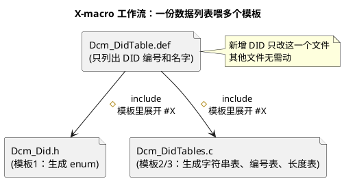

# 02 预处理与宏

> 一句话定位：C 的预处理器是"编译前的文本替换机"——AUTOSAR 生成的代码、MemMap 段切换、DID 表、错误码表都靠它；用得好省一半手写代码，用不好调试到怀疑人生。
> 等级：L1 ｜ 前置：[01-关键字与存储类](01-关键字与存储类.md)

## 原理

预处理器在"词法→语法"之前先做一遍纯文本替换，不懂 C 语法、不懂类型、不懂作用域。所有宏都是"展开后让编译器再看一遍"。理解这一条，下面所有怪现象都不怪。

### 1. 对象宏 vs 函数宏

```TypeScript
#define NVM_BLOCK_SIZE     64U                          /* 对象宏：替换为一段文本 */
#define MAX(a, b)          ((a) > (b) ? (a) : (b))      /* 函数宏：带参数 */
```

- 对象宏：`#define 名字 替换文本`，最常用于常量、配置开关。
- 函数宏：参数列表紧跟名字，参数在替换体里出现一次就会被替换一次——这是后面"双求值"陷阱的根。

### 2. `#` 与 `##` 操作符

- `#x`：把宏参数 `x` 字符串化（stringify），输出 `"x 展开后的内容"`；
- `a ## b`：把两个 token 粘成一个 token（token paste），常用于"按 DID 编号自动生成函数名"。

```C#
#define STRINGIFY(x)    #x
#define CONCAT(a, b)    a##b

int CONCAT(NvM_Block_, 0);                  /* → int NvM_Block_0; */
const char *name = STRINGIFY(NvM_Block_0);   /* → "NvM_Block_0" */
```

### 3. 条件编译、pragma、include guard

| 语法                                                | 用途             | AUTOSAR 典型                                                     |
| --------------------------------------------------- | ---------------- | ---------------------------------------------------------------- |
| `#if / #ifdef / #ifndef / #elif / #else / #endif` | 按宏开关选代码段 | `#if (CPU == TC377)` 走 iLLD，`#elif (CPU == S32K)` 走 S32DS |
| `#define XXX` 不带值                              | 仅做"已定义"开关 | `NVM_DEV_ERROR_DETECT`：定义了就开 Det，不定义就关             |
| `#pragma section ...` / `#pragma location`      | 控制变量落哪个段 | MemMap.h 的`MEMMAP_NVM` 宏在不同编译器里展开成对应 pragma      |
| `#ifndef X / #define X / #endif`                  | include guard    | 几乎每个 .h 头部都有，防重复包含                                 |

include guard 是头文件最朴素也最必要的防御。一些编译器支持 `#pragma once`，AUTOSAR 跨 GCC/Tasking/HighTec/GreenHills 多工具链，保守做法仍是 `#ifndef/#define/#endif`。

### 4. X-macro：一份数据生成多张表

X-macro 的核心思想：把"数据列表"和"展开模板"分离。列表只写一遍，模板可多次复用——生成枚举、生成字符串表、生成查找表、生成长度宏，全部自动同步，加一项只改列表一行。



## 代码示例

完整示例：用 X-macro 维护一份 UDS DID 表，自动生成枚举、字符串名表、DID 编号表、长度表。

### Dcm_DidTable.def —— 数据列表（X-macro 列表）

```c
/* Dcm_DidTable.def：唯一的数据源，每个条目形如 X(编号, 名字, 长度)。
   注意：本文件只定义 X 宏的"形态"，不写 #include、不写 #ifndef。
   它会被多个模板文件 #include 进来，每次重新定义 X 后再 include 一次。 */
X(0xF190, DID_VIN,             17U)   /* 车辆识别号，UDS 标准 DID */
X(0xF187, DID_SW_PART_NUMBER,    4U)   /* 软件零件号 */
X(0xF188, DID_SW_VERSION,        3U)   /* 软件版本号 */
X(0xF18B, DID_ECU_SERIAL,        4U)   /* ECU 序列号 */
X(0xF18A, DID_ECU_MFG_DATE,      3U)   /* ECU 制造日期 */
```

### Dcm_Did.h —— 模板 1：生成枚举 + 对外 API

```c
/* Dcm_Did.h：把 .def 里的 X(编号, 名字, 长度) 展开成枚举（顺序索引 0..N-1）*/
#ifndef DCM_DID_H
#define DCM_DID_H

#include "Std_Types.h"

/* 模板：把每个 X(num, name, len) 展开为  name, 形成顺序枚举 */
#define X(num, name, len)   name,
typedef enum
{
    #include "Dcm_DidTable.def"
    DID_NUM                /* 哨兵，同时是条目计数 */
} Dcm_DidIdType;
#undef X                   /* 用完立刻 #undef，避免污染下一个模板 */

/* 对外 API：内部用顺序索引，调用方拿 DID 编号先 FindByNumber 转换 */
const char      *Dcm_Did_GetName  (Dcm_DidIdType DidId);
uint16           Dcm_Did_GetNumber(Dcm_DidIdType DidId);
uint16           Dcm_Did_GetLength(Dcm_DidIdType DidId);
Dcm_DidIdType    Dcm_Did_FindByNumber(uint16 DidNumber);

#endif /* DCM_DID_H */
```

### Dcm_DidTables.c —— 模板 2/3/4：生成字符串表、编号表、长度表

```c
/* Dcm_DidTables.c：同一份 .def 被连续 #include 三次，每次换一个 X 的定义 */
#include "Dcm_Did.h"

/* ---- 模板 2：生成"DID 名字"字符串表，按枚举下标 O(1) 取出 ---- */
#define X(num, name, len)   #name,
static const char *const Dcm_DidNameTable[] =
{
    #include "Dcm_DidTable.def"
};
#undef X

/* ---- 模板 3：生成"DID 实际编号"表，用于反查和发送 ---- */
#define X(num, name, len)   (num),
static const uint16 Dcm_DidNumberTable[] =
{
    #include "Dcm_DidTable.def"
};
#undef X

/* ---- 模板 4：生成"DID 数据长度"表，按枚举下标 O(1) 取出 ---- */
#define X(num, name, len)   (len),
static const uint16 Dcm_DidLengthTable[] =
{
    #include "Dcm_DidTable.def"
};
#undef X

/* ---- 三套查找函数：所有下标都先做越界保护 ---- */
const char *Dcm_Did_GetName(Dcm_DidIdType DidId)
{
    const char *ret = "DID_UNKNOWN";
    if ((uint16)DidId < (uint16)DID_NUM)
    {
        ret = Dcm_DidNameTable[(uint16)DidId];
    }
    return ret;
}

uint16 Dcm_Did_GetNumber(Dcm_DidIdType DidId)
{
    uint16 num = 0U;
    if ((uint16)DidId < (uint16)DID_NUM)
    {
        num = Dcm_DidNumberTable[(uint16)DidId];
    }
    return num;
}

uint16 Dcm_Did_GetLength(Dcm_DidIdType DidId)
{
    uint16 len = 0U;
    if ((uint16)DidId < (uint16)DID_NUM)
    {
        len = Dcm_DidLengthTable[(uint16)DidId];
    }
    return len;
}

/* DID 编号 → 内部索引：线性查找（DID 表通常几十项，O(N) 可接受）*/
Dcm_DidIdType Dcm_Did_FindByNumber(uint16 DidNumber)
{
    Dcm_DidIdType ret = DID_NUM;
    Dcm_DidIdType idx;
    for (idx = (Dcm_DidIdType)0; idx < DID_NUM; idx++)
    {
        if (Dcm_DidNumberTable[(uint16)idx] == DidNumber)
        {
            ret = idx;
            break;
        }
    }
    return ret;
}
```

新增一个 DID，只要在 `Dcm_DidTable.def` 加一行 `X(...)`，枚举、字符串表、编号表、长度表全部自动同步——这是 X-macro 最香的地方。

## 易错点与陷阱

1. **函数宏参数不加括号 = 定时炸弹**。

   ```c
   #define SQ(x)   x * x
   SQ(1 + 2)        /* 期望 9，实际 1 + 2*1 + 2 = 5 */
   ```

   对策：替换体里每个参数都加括号，整体再加一层：`#define SQ(x) (((x)) * ((x)))`。
2. **参数有副作用会被求值多次**。

   ```c
   #define MAX(a, b)   ((a) > (b) ? (a) : (b))
   int x = 3, y = 4;
   int m = MAX(x++, y++);   /* 期望取大值并各加一次，
                               实际可能 x++ 或 y++ 被求值多次 */
   ```

   对策：宏里不要对带副作用（自增/自减/赋值）的参数求值；要安全最大值用 `static inline` 函数。
3. **多语句函数宏吞 if-else**。

   ```c
   #define INIT_BLK(b)  buf[b] = 0; count++
   if (cond) INIT_BLK(1); else INIT_BLK(2);
   /* 展开成：if (cond) buf[1]=0; count++ else buf[2]=0; count++;
      → 编译报错"else 无 if"，且 count++ 不属于 if */
   ```

   对策：多语句宏用 `do { ... } while(0)` 包住：

   ```c
   #define INIT_BLK(b)  do { buf[(b)] = 0; count++; } while (0)
   ```
4. **宏续行 `\` 后面不能有空格**。行末反斜杠后多一个空格会让续行失效，下一行变成独立语句。打开编辑器"显示空白字符"检查。
5. **`#if` 与 `#ifdef` 混淆**。

   ```c
   #define FEATURE_X 0     /* 定义为 0 */
   #ifdef FEATURE_X        /* 已定义，走 if 分支 */
   #if FEATURE_X           /* 展开为 #if 0，走 else 分支 */
   ```

   对策：开关用 `#if (FEATURE_X == STD_ON)`；纯存在性用 `#ifdef`/`#if defined()`。
6. **`#pragma` 在不同编译器行为不一致**。Tasking（TC377）和 GCC（S32K）的 section pragma 写法不同。AUTOSAR 工程一律包成 `MEMMAP(...)` 这种自家宏，让移植层去适配，不要在业务代码里裸写 `#pragma`。
7. **include guard 宏名撞名**。两个不同模块都写 `#ifndef TYPES_H` 会相互吃掉对方的内容，编译报奇怪的"未定义"。命名加项目前缀和路径前缀，如 `DCM_DID_H`、`NVM_LITE_H`。

## 面试高频题

**Q1：函数宏和 inline 函数有什么区别？什么时候用宏？**
A：宏是文本替换，无类型检查、参数可能多次求值、无作用域；inline 函数有类型检查、参数只求值一次、作用域正常。现代 C99 后绝大多数"短小函数"应优先 `static inline`。宏仍不可替代的场景：编译期字符串化（`#`）、token 拼接（`##`）、X-macro 列表、条件编译开关。

**Q2：写一个安全的 MAX 宏。**
A：

```c
#define MAX(a, b)  ({                                  \
    __typeof__(a) _a = (a);                            \
    __typeof__(b) _b = (b);                            \
    _a > _b ? _a : _b;                                \
})
```

GCC 扩展用语句表达式保证只求值一次。无扩展时退而求其次用 `static inline` 函数，或限制"参数不带副作用"。

**Q3：X-macro 是什么？解决了什么问题？**
A：把"数据列表"和"展开模板"分离的技术。列表文件只列条目，模板文件 `#include` 列表并在外面 `#define X(...)` 决定每个条目怎么展开。一份列表可被多个模板 include，生成枚举、字符串表、查找表、长度宏等，所有产物自动同步。解决的是"同一份信息要在多处保持一致"的维护痛点，典型应用是 AUTOSAR DID 表、错误码表、寄存器位定义表。

**Q4：`#error` 和 `#warning` 有什么用？**
A：`#error "msg"` 让预处理器直接报错终止编译，用于配置冲突硬拦截（比如同时定义了两个互斥的 CPU 型号）。`#warning` 在 GCC 里发警告但不终止，用于提醒（AUTOSAR 标准一般用 `#error` 强制阻断，警告容易被 CI 忽略）。

**Q5：include guard 和 `#pragma once` 的差别？**
A：include guard 跨所有工具链兼容，标准 C；`#pragma once` 是编译器扩展，部分老编译器不支持，但更省事不用起名。AUTOSAR 工程为多工具链兼容（Tasking/GreenHills/HighTec/GCC/IAR）几乎一律用 include guard。

## 延伸

- [DID 与 RID 设计 README](../../../06-诊断与标定/2-L2进阶/DID与RID设计/README.md)：DID 表的工程组织方法、与 Dcm 配置的关系。
- [代码规范与 MISRA-C README](../../2-L2进阶/代码规范与MISRA-C/README.md)：Directive 4.9（避免使用函数式宏）与 Rule 20.x（预处理指令/宏替换）对函数宏的约束、宏展开安全性。
- [内存管理 README](../../2-L2进阶/内存管理/README.md)：`MEMMAP` 宏如何用 `#pragma` 把变量分配到指定段。
