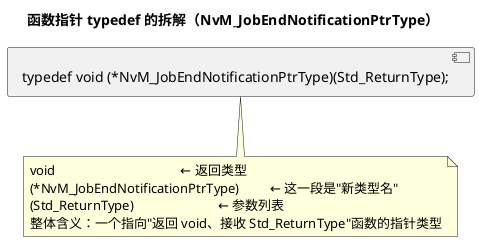

# 03 枚举与 typedef

> 一句话定位：enum 给"状态/常量"起名字让调试器、Det、CANoe 日志都能显示语义；typedef 把平台相关类型和函数指针签名封装成可移植、可读的样子——两个都是 AUTOSAR 标准类型体系（Std_Types.h）的基石。
> 等级：L1 ｜ 前置：[01-关键字与存储类](01-关键字与存储类.md)

## 原理

### 1. enum：带名字的整型常量集合

```VB.NET
typedef enum
{
    NM_STATE_BUS_SLEEP = 0,
    NM_STATE_NORMAL,
    NM_STATE_REPEAT_MESSAGE,
    NM_STATE_PREPARE_SLEEP,
    NM_STATE_NUM
} Nm_StateType;
```

要点：

- 每个枚举常量在调试器里显示**名字**而不是数字——CANoe / Lauterbach / Trace32 看到的是 `NM_STATE_NORMAL`，不是 `1`；
- 枚举值默认从 0 开始递增 1，也可显式赋值、可跳号；
- 枚举常量是**编译期常量**，不能取地址、不能 `++`；
- 枚举常量在 C 里**作用域是 enum 所在的作用域**（C++ 才有独立 enum 作用域），同名冲突要小心。

### 2. enum 底层类型的"跨编译器盲盒"

C89/C99 规定 enum 的底层类型由实现定义（implementation-defined），标准只要求"能装下所有枚举值"。GCC 默认选 `unsigned int` 或 `int`；Keil/IAR 在某些选项下可能选最小的 `uint8`；Tasking TriCore 倾向 `int`。后果：

- `sizeof(Nm_StateType)` 在不同工具链上可能是 1、2 或 4；
- 把 enum 当 `uint8` 传给函数，在 S32K (GCC) 上是 4 字节入栈，在 TC377 (Tasking) 上可能也是 4，但跨平台时寄存器 ABI 细节不同；
- MISRA-C:2012 Rule 10.2 要求"枚举表达式仅与同枚举类型或同一枚举常量比较"，本质就是怕你拿 enum 跟裸 int 混算时跨编译器行为漂移。

### 3. typedef：给类型起别名

```c
typedef unsigned char  uint8;        /* Std_Types.h 里就是这么来的 */
typedef unsigned int   uint16;
typedef unsigned long  uint32;
typedef uint8          Std_ReturnType; /* E_OK=0, E_NOT_OK=1 等 */
```

价值：

- **平台抽象**：`uint8` 在不同 MCU 上都能映射到"8 位无符号整数"，业务代码只认 `uint8`，移植时只改 Std_Types.h；
- **可读性**：`Std_ReturnType` 比 `uint8` 一眼能看出"这是返回值"；
- **函数指针签名**：把复杂的函数指针类型封装成简单名字，是回调机制的基础。

### 4. 函数指针 typedef：回调的标配

```c
typedef void (*NvM_JobEndNotificationPtrType)(void);
```

读法：`(*名字)(参数)` 是函数指针，前面是返回类型。typedef 后，`NvM_JobEndNotificationPtrType` 就是一个"指向 `void(void)` 函数的指针"类型，可以当普通类型一样声明变量、做参数。



## 代码示例

### 示例 1：Nm 状态机用 enum 表达

```c
/* Nm_State.h：网络管理状态机的状态枚举与对外 API */
#ifndef NM_STATE_H
#define NM_STATE_H

#include "Std_Types.h"

typedef enum
{
    NM_STATE_BUS_SLEEP = 0,
    NM_STATE_NORMAL,
    NM_STATE_REPEAT_MESSAGE,
    NM_STATE_PREPARE_SLEEP,
    NM_STATE_NUM          /* 哨兵，同时是状态计数，用于数组下标越界检查 */
} Nm_StateType;

/* 状态转换的输入事件 */
typedef enum
{
    NM_EVT_NONE = 0,
    NM_EVT_NETWORK_REQUEST,
    NM_EVT_NETWORK_RELEASE,
    NM_EVT_REPEAT_MESSAGE_RECEIVED,
    NM_EVT_TIMEOUT,
    NM_EVT_NUM
} Nm_EventType;

Nm_StateType Nm_GetState(void);
void         Nm_HandleEvent(Nm_EventType Evt);
const char  *Nm_GetStateName(Nm_StateType State);

#endif /* NM_STATE_H */
```

```c
/* Nm_State.c：用 enum 当数组下标做"状态名表"，状态转换用 switch（MISRA 友好）*/
#include "Nm_State.h"

static Nm_StateType Nm_CurrentState = NM_STATE_BUS_SLEEP;

/* 状态名表：C99 designated initializer，用 enum 当显式下标，加条目不会错位 */
static const char *const Nm_StateNameTable[NM_STATE_NUM] =
{
    [NM_STATE_BUS_SLEEP]      = "BUS_SLEEP",
    [NM_STATE_NORMAL]         = "NORMAL",
    [NM_STATE_REPEAT_MESSAGE] = "REPEAT_MESSAGE",
    [NM_STATE_PREPARE_SLEEP]  = "PREPARE_SLEEP"
};

const char *Nm_GetStateName(Nm_StateType State)
{
    const char *name = "UNKNOWN";
    if ((uint8)State < (uint8)NM_STATE_NUM)
    {
        name = Nm_StateNameTable[(uint8)State];
    }
    return name;
}

Nm_StateType Nm_GetState(void)
{
    return Nm_CurrentState;
}

void Nm_HandleEvent(Nm_EventType Evt)
{
    Nm_StateType next = Nm_CurrentState;   /* 默认保持当前状态 */

    switch (Nm_CurrentState)
    {
        case NM_STATE_BUS_SLEEP:
            if (Evt == NM_EVT_NETWORK_REQUEST)
            {
                next = NM_STATE_NORMAL;
            }
            break;

        case NM_STATE_NORMAL:
            if (Evt == NM_EVT_NETWORK_RELEASE)
            {
                next = NM_STATE_PREPARE_SLEEP;
            }
            else if (Evt == NM_EVT_REPEAT_MESSAGE_RECEIVED)
            {
                next = NM_STATE_REPEAT_MESSAGE;
            }
            else
            {
                /* 其他事件：保持当前状态，留空块以符合 MISRA */
            }
            break;

        case NM_STATE_REPEAT_MESSAGE:
            if (Evt == NM_EVT_TIMEOUT)
            {
                next = NM_STATE_NORMAL;
            }
            break;

        case NM_STATE_PREPARE_SLEEP:
            if (Evt == NM_EVT_NETWORK_REQUEST)
            {
                next = NM_STATE_NORMAL;
            }
            else if (Evt == NM_EVT_TIMEOUT)
            {
                next = NM_STATE_BUS_SLEEP;
            }
            break;

        default:
            /* 不应有其他状态，真实工程这里上报 Det */
            next = NM_STATE_BUS_SLEEP;
            break;
    }

    Nm_CurrentState = next;
    /* 真实工程这里还会触发 NM-Telegram 收发、状态切换上报 ComM 等 */
}
```

### 示例 2：函数指针 typedef 做回调

```c
/* NvM_Callback.h：用 typedef 定义回调签名，调用方只认类型名 */
#ifndef NVM_CALLBACK_H
#define NVM_CALLBACK_H

#include "Std_Types.h"

/* 回调签名 1：异步任务完成通知，参数是任务结果 */
typedef void (*NvM_JobEndNotificationPtrType)(Std_ReturnType JobResult);

/* 回调签名 2：RAM 镜像初始化，让外部填充 RAM 缓冲 */
typedef void (*NvM_RamInitPtrType)(uint8 *RamPtr);

/* 模块内部保存回调句柄 */
void NvM_RegJobEndCb(NvM_JobEndNotificationPtrType Cb);
void NvM_RegRamInitCb(NvM_RamInitPtrType Cb);

#endif /* NVM_CALLBACK_H */
```

```c
/* NvM_Callback.c */
#include "NvM_Callback.h"

static NvM_JobEndNotificationPtrType NvM_JobEndCb  = NULL_PTR;
static NvM_RamInitPtrType             NvM_RamInitCb = NULL_PTR;

void NvM_RegJobEndCb(NvM_JobEndNotificationPtrType Cb)
{
    NvM_JobEndCb = Cb;
}

void NvM_RegRamInitCb(NvM_RamInitPtrType Cb)
{
    NvM_RamInitCb = Cb;
}

/* 内部某处任务完成时调用 */
static void NvM_OnJobDone(Std_ReturnType Result)
{
    if (NvM_JobEndCb != NULL_PTR)
    {
        NvM_JobEndCb(Result);   /* 通过函数指针回调上层 */
    }
}
```

调用方写：

```c
static void App_JobEndHandler(Std_ReturnType JobResult)
{
    if (JobResult != E_OK)
    {
        /* 上报 Dem、点故障灯 */
    }
}

void App_Init(void)
{
    NvM_RegJobEndCb(App_JobEndHandler);   /* 注册：函数名隐式转换为函数指针 */
}
```

`App_JobEndHandler` 的签名必须和 typedef 完全一致（返回 void、一个 `Std_ReturnType` 参数），否则编译器报"类型不兼容"——这正是 typedef 的好处：签名错了编译期就拦下来。

## 易错点与陷阱

1. **enum 当数组下标要做边界检查**。`Nm_StateNameTable[(uint8)State]` 如果 `State` 因 bug 变成 `NM_STATE_NUM` 或更大，直接越界读出脏数据。MISRA 建议加 `if (state < NM_STATE_NUM)` 保护或用 switch。
2. **enum 与整数混算跨编译器结果不同**。`(uint8)NM_STATE_NORMAL + 1` 在 GCC（底层 int）和 Keil（底层可能 unsigned char）上类型不同，传参时寄存器分配、入栈大小可能不同。MISRA Rule 10.2 直接禁止这种混算，要求先显式 cast 到目标类型。
3. **enum 的"重复值"会让调试器名字显示混乱**。`enum { A = 0, B = 0 }` 调试器看到 0 时不知道显示 A 还是 B。AUTOSAR 标准枚举一般都唯一赋值，避免重名重值。
4. **typedef 不等于 `#define`**。`typedef uint8 MyByte;` 创建新类型名，但 `MyByte` 和 `uint8` 在类型系统里**仍可互换**（C 的 typedef 不创建强类型）。`#define MyByte uint8` 只是文本替换。两者表面一样，但 typedef 受作用域约束、可做函数指针类型，`#define` 不行。
5. **函数指针 typedef 的参数表必须和回调实现完全一致**。回调写成 `void App_JobEndHandler(uint8 Result)`（参数类型变了）再注册给 `NvM_JobEndNotificationPtrType`（参数是 `Std_ReturnType`），虽然 `uint8` 和 `Std_ReturnType` 都映射到 unsigned char，但**类型名不同**，严格编译器（GreenHills/MISRA 模式）会报不兼容。对策：回调签名一字不差地用 typedef 里的类型名。
6. **C 的 enum 常量没有独立作用域**。`enum Color { RED, GREEN, BLUE };` 之后 `RED` 在整个文件可见，再定义 `enum Signal { RED };` 会报重定义。C++ 的 `enum class` 才有独立作用域，C 没有。命名加前缀（`NM_STATE_RED`）规避。

## 面试高频题

**Q1：enum 的底层类型是什么？为什么 AUTOSAR/MISRA 不让你随便和整数混算？**
A：底层类型由实现定义，标准只要求能装下所有枚举值。GCC 默认 int 或 unsigned int，IAR/Keil 可能选最小整数类型。混算时不同编译器选的底层类型不同，导致传参大小、整数提升行为不一致。MISRA Rule 10.2 因此要求枚举只与同枚举类型比较/运算，跨类型必须显式 cast。

**Q2：typedef 和 `#define` 有什么区别？**
A：(1) typedef 创建类型别名，受作用域约束；`#define` 是全局文本替换。(2) typedef 能定义函数指针、数组类型等复杂类型，`#define` 做不到。(3) typedef 不创建强类型（C 里 typedef 后的别名和原类型仍可互换），只是可读性别名。(4) 调试器能显示 typedef 名字，`#define` 展开后看不到原名。

**Q3：为什么函数指针几乎都用 typedef？**
A：函数指针原生语法 `void (*p)(int)` 写在变量声明里、参数列表里、返回类型里都难读（"右左法则"绕晕）。typedef 后 `CallbackPtr p;` 和普通指针一样直观，签名错了编译期就拦。AUTOSAR 的 `NvM_JobEndNotificationPtrType`、`EcuM_StateType` 等大量类型名就是这么来的。

**Q4：写一个 typedef 让"指向返回 int、参数是 `(uint8, uint8)` 的函数的指针"叫 `BinOp`。**
A：`typedef int (*BinOp)(uint8, uint8);`。读法：从名字往左找 `*`、再往右找参数。`BinOp` 是新类型名，整体是"指向 `int(uint8, uint8)` 函数的指针"。

**Q5：enum 常量能 `++` 吗？能取地址吗？**
A：不能。枚举常量是编译期右值，不是对象，没有存储，不能取地址、不能 `++`、不能赋值。能 `++` 和取地址的是 enum **类型变量**（如 `Nm_StateType s = NM_STATE_NORMAL; s++;`），但 MISRA 不推荐对 enum 变量做算术运算。

## 延伸

- [DID 与 RID 设计 README](../../../06-诊断与标定/2-L2进阶/DID与RID设计/README.md)：DID/RID 用枚举组织的方法。
- [代码规范与 MISRA-C README](../../2-L2进阶/代码规范与MISRA-C/README.md)：MISRA Rule 10.x 对枚举与整数混算的约束、typedef 的使用规范。
- [指针专题 / 函数指针与回调](../指针专题/03-函数指针与回调.md)：函数指针的深入用法，回调与 RTE 事件触发。
