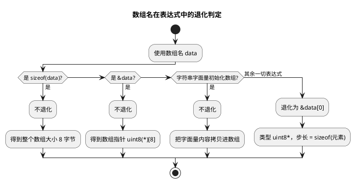

# 01 指针与数组

> 一句话定位：数组名不是指针，但在绝大多数表达式里会"退化"为指向首元素的指针——分清这两者，sizeof、传参、二维数组的所有怪象都能一眼看穿。
> 等级：L1→L2 ｜ 前置：[01-关键字与存储类](../基础语法巩固/01-关键字与存储类.md)

## 原理

### 1. 数组名是"带长度信息的地址符号"，不是指针

```c
uint8 data[8];    /* CAN 报文数据的经典形态，uint8 来自 AUTOSAR Std_Types */
```

`data` 的类型是 `uint8[8]`（数组类型），编译器同时记住三件事：元素类型 `uint8`、长度 8、总大小 8 字节。由此：

- `sizeof(data) == 8`：得到的是**整个数组**的大小，不是指针大小；
- `data = other;`、`data++` 直接编译报错：数组名不是可修改的左值，它自己不占一块指针存储。

### 2. 退化规则（array decay）

C 标准规定：除了三种情况，数组名出现在表达式里都会自动退化为 `&data[0]`（类型 `uint8*`）：

| 表达式 | 是否退化 | 结果类型 | 典型取值（32 位平台） |
|---|---|---|---|
| `sizeof(data)` | 否 | `uint8[8]` | 8（整个数组大小） |
| `&data` | 否 | `uint8(*)[8]` 数组指针 | 地址值同 data |
| `data + 1`、`data[i]`、传参、赋给指针 | 是 | `uint8*` | 首元素地址 |



### 3. &arr 与 arr：数值相同、类型不同、步长不同

对 `uint8 data[8]`：

- `arr`（退化后）：类型 `uint8*`，指向第一个**元素**；
- `&arr`：类型 `uint8(*)[8]`，指向**整个数组**；
- 两者数值上都是这块内存的起始地址，差异全在 `+1` 走多远：

| 表达式 | 地址增量 | 原因 |
|---|---|---|
| `arr + 1` | +1 字节 | 跳过一个元素（uint8） |
| `&arr + 1` | +8 字节 | 跳过整个数组（uint8[8]） |
| `sizeof(arr)` | 8 | 数组本身 |
| `sizeof(&arr)` | 4 | 指针变量的大小 |

### 4. 指针步长由"指向的类型"决定

`p + n` 的地址增量 = `n × sizeof(指向的类型)`：

- `uint8* p`：`p+1` 走 1 字节；
- `uint32* q`：`q+1` 走 4 字节；
- `uint8(*)[8] r`：`r+1` 走 8 字节（一行）。

同一个地址，用不同类型的指针去走，步长完全不同——"类型信息"就挂在指针身上，这是理解一切指针运算的钥匙。

### 5. 二维数组：退化成"行指针"

```c
uint8 frame[3][8];    /* 3 帧 CAN 报文缓存 */
```

- `frame` 的类型是 `uint8[3][8]`；
- 退化后类型是 `uint8(*)[8]`：指向"一行 8 字节"的数组指针；
- `frame[i][j]` 展开是 `*(*(frame + i) + j)`：先按行（8 字节）跳 `i` 次，再按元素（1 字节）跳 `j` 次。

所以二维数组传参必须收成 `uint8 (*frame)[8]`，而不是 `uint8 **frame`——后者是"指针的数组"，内存布局完全不同。

## 代码示例

### 场景 1：遍历一帧 CAN 报文的 data[8]

```c
#include "Std_Types.h"    /* uint8/uint16/uint32、NULL_PTR、E_OK */

#define CAN_DLC_MAX      (8u)

/* 参数写成 data[] 只是"看起来"还是数组，函数内它已经是指针 uint8* */
void CanIf_PrintFrame(const uint8 data[], uint8 dlc)
{
    uint8 idx;

    /* 陷阱预告：函数内 sizeof(data) 得到的是指针大小（4/8），不是 8，
     * 所以长度必须靠 dlc 显式传进来，绝不能在函数内自己 sizeof。 */
    for (idx = 0u; idx < dlc; idx++)
    {
        (void)printf("%02X ", data[idx]);   /* demo 用，实际项目走 Det/trace */
    }
    (void)printf("\n");
}
```

### 场景 2：从 CAN 帧按大端组装 32 位值（读 DID）

```c
/* UDS 22 服务读多字节 DID 时，报文里数值通常高字节在前（Motorola/大端）。
 * 而 TC377（TriCore）和 S32K（Cortex-M）的 CPU 都是小端，
 * 所以必须逐字节手工组装，不能直接类型双关（type punning）。 */
uint32 CanIf_ExtractU32Be(const uint8 *data, uint8 offset)
{
    uint32 value;

    /* 先显式转 uint32 再移位，避免整型提升歧义，MISRA 友好 */
    value  = ((uint32)data[offset]      ) << 24;
    value |= ((uint32)data[offset + 1u]) << 16;
    value |= ((uint32)data[offset + 2u]) << 8;
    value |= ((uint32)data[offset + 3u]);

    return value;
}

/* 反面写法：*(uint32 *)&data[offset] 一步取 4 字节 —— 三宗罪：
 * 1) 字节序随 CPU：小端核装出来的值与报文字节序相反；
 * 2) 对齐风险：奇数偏移起取 4 字节，TriCore 非对齐访问直接 Trap；
 * 3) 违反 MISRA C:2012 规则 11.3（对象指针强转）与严格别名规则。
 */
```

### 场景 3：二维数组（多帧缓存）传参与 sizeof 实测

```c
#define FRAME_CACHE_CNT  (3u)

/* frame 的退化类型是 uint8(*)[8]，参数必须写成数组指针，写 uint8** 编译不过 */
void CanIf_DumpFrameCache(const uint8 (*frame)[CAN_DLC_MAX], uint8 frameCnt)
{
    uint8 row;
    uint8 col;

    for (row = 0u; row < frameCnt; row++)
    {
        for (col = 0u; col < CAN_DLC_MAX; col++)
        {
            (void)printf("%02X ", frame[row][col]);  /* 下标写法依然可用 */
        }
        (void)printf("\n");
    }
}

void Demo(void)
{
    uint8  frameCache[FRAME_CACHE_CNT][CAN_DLC_MAX];  /* 3 帧 x 8 字节 */
    uint32 didValue;

    /* 62 F1 01 90 : 22 F1 90 读 DID 的正响应头（62=响应 SID） */
    frameCache[0][0] = 0x62u;
    frameCache[0][1] = 0xF1u;
    frameCache[0][2] = 0x01u;
    frameCache[0][3] = 0x90u;

    CanIf_PrintFrame(frameCache[0], CAN_DLC_MAX);     /* 传一行：退化为 uint8* */
    didValue = CanIf_ExtractU32Be(frameCache[0], 2u); /* 从偏移 2 取 4 字节 */
    (void)didValue;
    CanIf_DumpFrameCache(frameCache, FRAME_CACHE_CNT);/* 传整个二维数组 */

    /* sizeof 实测（32 位平台，编译期常量）：
     * sizeof(frameCache)        = 24  整个二维数组
     * sizeof(frameCache[0])     = 8   一行（不退化，还是数组）
     * sizeof(&frameCache)       = 4   数组指针
     * (&frameCache[0][0] + 1)   : 前进 1 字节（元素步长）
     * ((uint8 *)frameCache + 1) : 前进 1 字节（已退化为 uint8*）
     * ((uint8 *)(&frameCache + 1) - (uint8 *)frameCache) = 24（数组步长）
     */
}
```

## 易错点与陷阱

1. **函数内的 sizeof 形参"数组"**：`void f(uint8 data[8])` 与 `uint8 *data` 完全等价，函数内 `sizeof(data)` 是 4/8（指针大小）。长度必须另传，这正对应 CanIf 回调里 PduInfoType 同时带 SduDataPtr 和 SduLength 的原因。
2. **数组名当左值**：`data = buf;`、`data++` 都是编译错。要"换缓冲"只能改用指针变量去指，或 memcpy 拷贝。
3. **`&arr` 与 `arr` 混用**：数值一样导致"碰巧能跑"，但 `&arr + 1` 会一次跳过整个数组，越界得悄无声息。强转成 `uint8*` 后连编译器警告都没有。
4. **用 `uint32*` 指着 `uint8 data[]` 强行取数**：对齐（TriCore Trap）、别名（MISRA 11.3）、字节序三重坑，见场景 2 反例。
5. **二维数组传参写成 `uint8 **`**：类型不兼容直接编译失败；就算用强转骗过编译器，`p[i][j]` 会把数据字节当指针解引用，运行时 HardFault。
6. **返回局部数组地址**：`uint8 data[8]; return data;` 得到悬垂指针（dangling pointer），栈帧一回收就是野内存。

## 面试高频题

**Q1：数组名和指针到底有什么区别？**
答：数组类型自带长度与总大小信息，`sizeof` 得到整个数组，不能被赋值/自增；指针是变量，占 4/8 字节，可运算可改指向。数组名在表达式中退化为元素指针，但 `sizeof`、`&`、字面量初始化三处保留数组身份。

**Q2：`arr` 和 `&arr` 有何异同？**
答：数值相同（同一块内存的起始地址），类型不同：`arr` 是 `T*`，`&arr` 是 `T(*)[N]`。因此 `arr+1` 前进一个元素，`&arr+1` 前进整个数组 N 个元素。

**Q3：为什么 `void f(uint8 a[8])` 和 `void f(uint8 *a)` 完全等价？函数内怎么知道长度？**
答：传参时数组退化，`[8]` 只是被编译器忽略的注释。长度必须显式传（dlc 参数），或协议自带长度字段（如 CAN FD 的 DLC、UDS 多字节数据的长度字节）。

**Q4：二维数组 `uint8 m[3][8]` 怎么传参？为什么 `uint8 **` 不行？**
答：收成数组指针 `uint8 (*m)[8]`。退化后 `m` 的类型是"指向一行的指针"，内存连续；而 `uint8 **` 指向的是"指针数组"，第一层是 3 个指针变量，布局完全不同。

**Q5：`p + 1` 的地址增加量由什么决定？**
答：由指针指向类型的大小决定，`n × sizeof(T)`。这也是 `uint8*` 与 `uint32*` 指向同一地址却不能互换运算的根因。

**Q6：`sizeof("UDS")` 和 `strlen("UDS")` 各是多少？**
答：5 和 4。字面量是含结尾 `'\0'` 的 char 数组，sizeof 连结尾算；strlen 数到结尾前为止。

## 延伸

- [位操作](../位操作/README.md)：取出的 32 位值还要做掩码、置位清零，与指针解析配套。
- [内存管理](../../2-L2进阶/内存管理/README.md)：数组放栈、静态区还是堆，决定了它的生命周期与悬垂风险。