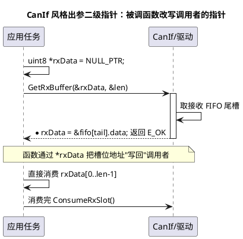

# 02 指针运算与多级指针

> 一句话定位：指针运算只在"同一数组（含尾后一格）"内合法，而二级指针的真实价值只有一个——让被调函数能改写调用者手里的指针本身（出参与句柄初始化）。
> 等级：L1→L2 ｜ 前置：[01-指针与数组](01-指针与数组.md)

## 原理

### 1. 指针算术的合法性边界

合法的指针运算只有三种：`p ± 整数`、`p2 - p1`（同数组内）、指针间比较。且所有参与运算的指针必须落在**同一个数组对象**（或其后一格）内：

- 可形成、可比较、**不可解引用**尾后指针（one-past-the-end）：`&data[8]` 对 `data[8]` 而言合法存在，但 `*(&data[8])` 就是越界；
- 越过尾后再 +1（如 `p = &data[8]; p++`）本身就是未定义行为（UB, Undefined Behavior）；
- 两个无关对象的指针做减法/大小比较是 UB——地址数值上能比，但标准不背书，MISRA C:2012 规则 18.2/18.3 直接禁止；
- `p1 - p2` 的结果类型是 `ptrdiff_t`，表示"隔了几个元素"，不是字节数。

### 2. 指针与整数比较是禁区

指针只能与**同类型指针**或 `NULL_PTR` 比较：

```c
if (p == 0u)     /* 反例：指针与整数直接比较，MISRA 规则 11.4/18.x 拦截 */
if (p != NULL_PTR)  /* 正确写法 */
```

`void *` 不能做算术（GCC 把它按 1 字节步长算，是方言不是标准），更不能解引用——想运算必须先转回具体类型。

### 3. 二级指针：为什么要"指向指针的指针"

一级指针传参，函数能改"指针指向的内容"，但改不了"指针本身"——因为形参只是指针的**副本**。想让被调函数把一个新地址写回给调用者，就必须传"指针的地址"，即二级指针 `T **`。

两大真实用途：

1. **出参（output parameter）**：驱动把内部缓冲（如接收 FIFO 槽位）的地址交给上层，上层用它收报文数据；
2. **句柄初始化（handle initialization）**：句柄本体是 `T *`，初始化函数要给这个句柄赋值，入参自然是 `T **`。



### 4. 三级指针为什么基本是设计问题

`T ***` 意味着"函数要修改一个指向句柄的指针"，本质是**把管理职责穿透了三层**。正确做法是把状态收进结构体，对外只暴露一级句柄 `HandleType *`，用"句柄 + 内部索引"替代多级间接——AUTOSAR 所有模块（CanIf、NvM、Spi）的句柄设计都是这个思路。

## 代码示例

### 场景 1：CanIf 风格出参接口 `uint8 ** rxDataPtr`

```c
#include "Std_Types.h"

#define CAN_FIFO_DEPTH  (8u)
#define CAN_DLC_MAX     (8u)

typedef struct
{
    uint8  data[CAN_DLC_MAX];
    uint8  dlc;
    uint16 canId;
} Can_RxFrameType;

static Can_RxFrameType CanDrv_RxFifo[CAN_FIFO_DEPTH];  /* 接收 FIFO（静态区） */
static uint8 CanDrv_RxFifoHead = 0u;                    /* 下一个待取槽位 */

/* 出参接口：把 FIFO 槽位中数据区的地址写回给调用者。
 * rxDataPtr 的类型是 uint8** —— 它指向"调用者手里的那个指针"。 */
Std_ReturnType CanDrv_GetRxBuffer(uint8 **rxDataPtr, uint8 *lenPtr)
{
    Std_ReturnType ret = E_NOT_OK;

    if ((rxDataPtr != NULL_PTR) && (lenPtr != NULL_PTR))  /* 出参必须判空 */
    {
        *rxDataPtr = CanDrv_RxFifo[CanDrv_RxFifoHead].data;  /* 写回地址 */
        *lenPtr    = CanDrv_RxFifo[CanDrv_RxFifoHead].dlc;
        ret = E_OK;
    }
    return ret;
}

void CanDrv_ConsumeRxSlot(void)
{
    CanDrv_RxFifoHead = (uint8)((CanDrv_RxFifoHead + 1u) % CAN_FIFO_DEPTH);
}
```

调用方与"只传一级指针"的反例对比：

```c
void App_Task_10ms(void)
{
    uint8 *rxData = NULL_PTR;   /* 先置空：没取到数据也能靠判空兜住 */
    uint8  rxLen  = 0u;

    if (E_OK == CanDrv_GetRxBuffer(&rxData, &rxLen))  /* 传指针的地址 */
    {
        (void)CanIf_ExtractU32Be(rxData, 0u);   /* rxData 已指向 FIFO 数据 */
        CanDrv_ConsumeRxSlot();
    }
}

/* 反例：只传一级指针，改的是形参副本，调用者的指针纹丝不动 */
Std_ReturnType Bad_GetRxBuffer(uint8 *rxDataPtr)
{
    rxDataPtr = CanDrv_RxFifo[CanDrv_RxFifoHead].data;  /* 白改，出函数即丢 */
    return E_OK;
}
```

### 场景 2：句柄初始化（NvM 风格）

```c
typedef struct
{
    uint16 blockId;
    uint8  state;
    uint8  ramMirror[64u];
} Nvm_BlockCtrlType;

static Nvm_BlockCtrlType Nvm_BlockCtrlTable[4u];   /* 控制块在模块内部 */

/* 句柄本体是 Nvm_BlockCtrlType*，初始化函数要给它赋值 -> 形参二级指针 */
Std_ReturnType Nvm_CreateBlock(Nvm_BlockCtrlType **handlePtr, uint16 blockId)
{
    Std_ReturnType ret = E_NOT_OK;

    if (handlePtr != NULL_PTR)
    {
        Nvm_BlockCtrlTable[0u].blockId = blockId;
        Nvm_BlockCtrlTable[0u].state   = 0u;
        *handlePtr = &Nvm_BlockCtrlTable[0u];      /* 句柄交给调用者 */
        ret = E_OK;
    }
    return ret;
}

/* 调用者此后只用一级句柄，再也不碰二级 */
void App_Init(void)
{
    Nvm_BlockCtrlType *cfgBlock = NULL_PTR;
    (void)Nvm_CreateBlock(&cfgBlock, 0xF190u);
}
```

### 场景 3：指针运算的合法写法

```c
void PtrArithDemo(const uint8 *base, uint32 len)
{
    const uint8 *cur;
    const uint8 *end = &base[len];   /* 尾后指针：可形成、可比较，不可解引用 */

    for (cur = base; cur < end; cur++)   /* 同一数组内比较，MISRA 18.3 允许 */
    {
        (void)(*cur);                    /* 循环体内保证 cur < end，安全 */
    }
    /* 到这里 cur == end，*cur 已是越界解引用 —— 千万别再读 */

    /* 若需要按字节算差值：(uint32)(cur - base) 得到"元素个数"，
      * 这里元素是 uint8，数值上恰好等于字节数。 */
}
```

## 易错点与陷阱

1. **出参二级指针不判空**：调用者传 NULL 进来，驱动里 `*rxDataPtr = ...` 直接写空地址崩溃。对外接口的出参第一件事就是判 `NULL_PTR`。
2. **把栈上临时缓冲通过出参交出去**：出参指针指向了函数内局部数组，函数一返回地址就悬垂。出参交付的必须是指向静态区/调用者缓冲的地址。
3. **二级指针与二维数组混为一谈**：`uint8 **` 与 `uint8 m[3][8]` 类型不兼容，`uint8 **p = m;` 编译不过；强转后 `p[1]` 会把第二行开头的 8 个数据字节当成地址解引用。
4. **越界一格不自知**：`p <= end` 写成 `p <= &data[8]` 时把尾后那一格也解引用了；正确写法是循环条件 `p < end`，且尾后指针永不解引用。
5. **跨对象指针比较**：判断"两个缓冲是否重叠"时对两个不同数组的指针做 `d < s` 比较，标准上是 UB、MISRA 18.3 违规；笔试语境下允许，量产代码应改用长度与索引判断（见 05 篇 memcpy 题）。
6. **`void *` 上做减法**：GCC 下能编过（按 1 字节），换 Tasking/HighTec 编译器就报错。先转 `uint8 *` 再运算。
7. **看到三级指针先怀疑设计**：`T ***` 几乎总意味着该封装结构体句柄，而不是继续加星号。

## 面试高频题

**Q1：指针加 1 一定地址加 1 吗？**
答：不一定，加 `sizeof(指向类型)`。`uint8*` 加 1，`uint32*` 加 4，数组指针 `uint8(*)[8]` 加 8。

**Q2：什么是指针的"合法运算范围"？尾后指针能解引用吗？**
答：同一数组（或对象）首元素到尾后一格之间。尾后指针可以形成、可以参与比较，但解引用是未定义行为。

**Q3：为什么修改"调用者的指针本身"必须传二级指针？**
答：C 是值传递，一级指针传参只是复制了地址值，函数内改形参改的是副本。传 `&ptr`（二级指针），函数内 `*ptrPtr = newAddr;` 才能写到调用者的变量里。

**Q4：`uint8 **p` 能接收 `uint8 m[3][8]` 吗？**
答：不能，类型不兼容。二维数组退化为 `uint8(*)[8]`；`uint8 **` 指向的是指针数组，两级间接，内存布局不同，强转后运行时必炸。

**Q5：什么时候真的需要三级指针？**
答：几乎不需要。它表示"函数要修改二级指针本身"，通常说明管理职责穿层了；应重构为"结构体 + 一级句柄"。可提及的边缘场景：操作"指针数组的数组"的泛型容器，或某些创建接口 `T ***handleOut`，但现代设计都会避免。

**Q6：两个指针相减的结果是什么类型？单位是什么？**
答：`ptrdiff_t`（有符号），单位是"元素个数"，不是字节数；仅当两指针指向同一数组时才有定义。

## 延伸

- [数据结构与算法-C实现](../../2-L2进阶/数据结构与算法-C实现/README.md)：链表头插/删节点是二级指针的经典练兵场（修改头指针本身）。
- [内存管理](../../2-L2进阶/内存管理/README.md)：出参交付的地址指向哪个区（静态/栈/堆），决定它会不会悬垂。
