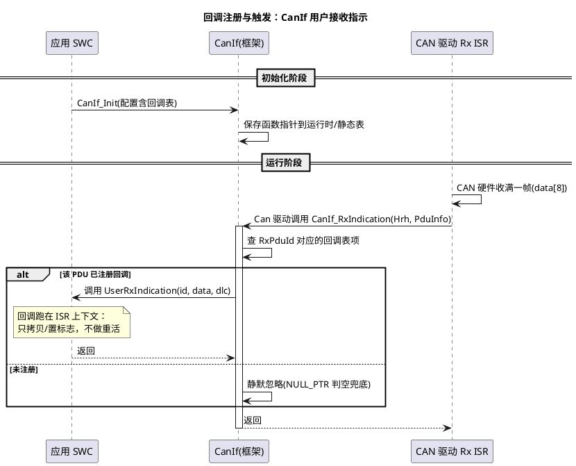

# 03 函数指针与回调

> 一句话定位：函数指针把"做什么"变成可传递的数据——回调注册表是 CanIf/NvM 通知上层的标准姿势，函数指针表则能把巨型 switch 换成 O(1) 查表分发。
> 等级：L1→L2 ｜ 前置：[02-指针运算与多级指针](02-指针运算与多级指针.md)

## 原理

### 1. 语法与 typedef 三步法

函数指针声明是 C 里最难读的语法之一，套路固定：

```c
void (*rxIndication)(uint8 id, const uint8 *data, uint8 dlc);
/* 读法：rxIndication 是一个指针，指向"参数为 (uint8, const uint8*, uint8)、返回 void"的函数 */
```

工程上一定用 typedef 包装，三步法：

1. 先写函数原型：`void f(uint8 id, const uint8 *data, uint8 dlc);`
2. 把函数名换成别名：`void RxInd(uint8 id, const uint8 *data, uint8 dlc);`
3. 在名字前加 `(*RxInd)`，最前面加 typedef：

```c
typedef void (*CanIf_UserRxIndicationType)(uint8 id, const uint8 *data, uint8 dlc);
```

两个冷知识：函数名本身就是地址（`f` 与 `&f` 等价）；通过函数指针调用写 `fp(...)` 或 `(*fp)(...)` 均可，MISRA 偏好显式解引用写法。

### 2. 回调注册表模式（callback registry）

框架在初始化时保存上层函数指针，事件发生时查表调用。AUTOSAR 里到处都是：

- CanIf 的用户接收指示（UserRxIndication）：CanDrv ISR 收到帧后，CanIf 按 RxPduId 查表调用你配置的回调；
- NvM 的作业结束通知（JobEndNotification）：EEA/EA 读写完成，NvM 通知上层块结果。

这个模式把"事件的生产者"（ISR/底层）和"事件的消费者"（SWC/上层）解耦：CanIf 不知道也不关心你收到 0x100 报文要干什么，它只负责按时叫你。

### 3. 函数指针表替代 switch（dispatch table）

把"命令 → 处理函数"做成 const 数组，运行时查表调用。对比巨型 switch：

- 加命令只加一行表项，不用动分发逻辑；
- 表是数据不是代码：可放 flash、可由工具生成；
- 避免几十个 case 造成的跳转表膨胀与可读性坍塌。

UDS 诊断按 SID 分发、CAN 报文按 ID 分发、状态机按状态分发，都是同一招。



## 代码示例

### 场景 1：CanIf 风格回调注册表

```c
#include "Std_Types.h"

#define CANIF_RX_PDUS  (4u)

/* 回调原型（简化自 AUTOSAR SWS CanIf） */
typedef void (*CanIf_UserRxIndicationType)(uint8 canIfRxPduId,
                                           const uint8 *sduDataPtr,
                                           uint8 dlc);

typedef struct
{
    uint16 canId;
    CanIf_UserRxIndicationType userRxIndication;  /* NULL_PTR 表示不通知 */
} CanIf_RxPduCfgType;

/* 配置表加 const：放进 flash，既省 RAM 也防误改 */
static const CanIf_RxPduCfgType CanIf_RxPduCfg[CANIF_RX_PDUS] =
{
    { 0x100u, App_Frame100_Indication },   /* 电机控制帧 -> 应用 */
    { 0x200u, NULL_PTR },                  /* 只转发不通知 */
    { 0x300u, Diag_RxIndication },         /* 诊断功能寻址 */
    { 0x7DFu, Diag_RxIndication }          /* 诊断物理寻址 */
};

/* CanDrv ISR 收到帧后调进来 */
void CanIf_RxIndication(uint8 rxPduId, const uint8 *sduDataPtr, uint8 dlc)
{
    if (rxPduId < CANIF_RX_PDUS)
    {
        CanIf_UserRxIndicationType cb = CanIf_RxPduCfg[rxPduId].userRxIndication;

        if (cb != NULL_PTR)          /* 判空是注册表的生命线 */
        {
            cb(rxPduId, sduDataPtr, dlc);   /* 经由函数指针调用上层 */
        }
    }
}

/* 上层回调：ISR 上下文，只拷贝数据 + 置标志，重活留给任务 */
void App_Frame100_Indication(uint8 canIfRxPduId, const uint8 *sduDataPtr, uint8 dlc)
{
    (void)canIfRxPduId;
    (void)memcpy(App_RxCache, sduDataPtr, (uint32)dlc);
    App_RxCacheFresh = TRUE;
}
```

### 场景 2：函数指针表替代 switch（UDS SID 分发）

```c
typedef void (*Dcm_ServiceHandlerType)(const uint8 *req, uint8 reqLen);

typedef struct
{
    uint8 sid;
    Dcm_ServiceHandlerType handler;
} Dcm_SvcEntryType;

#define DCM_SVC_TABLE_LEN  (sizeof(Dcm_SvcTable) / sizeof(Dcm_SvcTable[0u]))

static const Dcm_SvcEntryType Dcm_SvcTable[] =
{
    { 0x10u, Dcm_HdlSessionControl },
    { 0x22u, Dcm_HdlReadDataById },
    { 0x27u, Dcm_HdlSecurityAccess },
    { 0x2Eu, Dcm_HdlWriteDataById },
    { 0x31u, Dcm_HdlRoutineControl }
};

void Dcm_Dispatch(const uint8 *req, uint8 reqLen)
{
    uint8 i;
    uint8 sid = req[0u];
    boolean found = FALSE;

    for (i = 0u; i < (uint8)DCM_SVC_TABLE_LEN; i++)
    {
        if (Dcm_SvcTable[i].sid == sid)
        {
            Dcm_SvcTable[i].handler(req, reqLen);   /* 查表分发，无 switch */
            found = TRUE;
            break;
        }
    }
    if (FALSE == found)
    {
        Dcm_SendNegResponse(sid, 0x11u);   /* serviceNotSupported */
    }
}
```

### 场景 3：函数指针表状态机（会话状态）

```c
typedef enum { SES_DEFAULT = 0u, SES_PROG } Ses_StateType;
typedef void (*Ses_HandlerType)(uint8 sid);

static void Ses_Default_OnSid(uint8 sid);
static void Ses_Prog_OnSid(uint8 sid);

/* 状态 -> 处理函数 的映射表：加状态=加一行 */
static const Ses_HandlerType Ses_HandlerTable[2u] =
{
    Ses_Default_OnSid,   /* SES_DEFAULT */
    Ses_Prog_OnSid       /* SES_PROG    */
};

static Ses_StateType Ses_CurState = SES_DEFAULT;

void Dcm_OnRequest(uint8 sid)
{
    Ses_HandlerTable[Ses_CurState](sid);   /* 当前状态的 handler 处理请求 */
}

void Ses_Default_OnSid(uint8 sid)
{
    if (0x10u == sid) { Ses_CurState = SES_PROG; }  /* 10 03 进编程会话 */
}
```

## 易错点与陷阱

1. **回调里做重活**：CanIf 的接收指示运行在 CAN Rx ISR 上下文，里面 printf、等超时、刷 EEPROM 都是事故——标准姿势是"拷贝 + 置标志"，处理放任务。
2. **注册表没判空**：初始化前中断就来了、或某 PDU 未配置回调，查表拿到 NULL_PTR 直接调用就是写 PC 寄存器级别的 HardFault。取出来先判再调。
3. **函数指针类型不匹配硬转**：原型 `(uint8*)` 的函数强转成 `(uint32*)` 形参的指针类型再调用，参数错位、寄存器传参错乱，未定义行为。函数指针类型必须严格一致（MISRA 规则 11.1 禁止函数指针互转）。
4. **注册表不加 const**：回调表放 RAM 既浪费空间，又可能被越界写破坏后"跳飞"。配置类表一律 `static const`。
5. **运行时可改的注册表不做临界区**：任务里反注册（置 NULL_PTR）的同时 ISR 正在调用，读到半新半旧状态——改注册表要关中断或用原子字操作。
6. **读不懂复杂声明**：`void (*signal(uint8 id))(void);` 是"返回函数指针的函数"，不是函数指针变量。分不清就拆 typedef。

## 面试高频题

**Q1：怎么 typedef 一个函数指针？**
答：三步法：写原型 → 名字换别名加括号星号 → 前面加 typedef。例：`typedef void (*Cb_t)(uint8);`。之后 `Cb_t cb;` 一目了然。

**Q2：回调（callback）相比轮询（polling）好在哪？代价是什么？**
答：回调是事件驱动，无空转、延迟确定，框架与上层解耦（CanIf 不认识 SWC）；代价是执行上下文不可选（往往在 ISR 里，必须短小）、控制流被反转难调试（调用栈里断点不直观）。

**Q3：函数指针表和 switch 比有什么优劣？**
答：表是数据——可 const 进 flash、可工具生成、加项不改分发代码、查表复杂度稳定；switch 直观、编译器可能优化成跳转表。命令多（几十个 SID）时表结构完胜，两三个分支时 switch 更简单。

**Q4：函数指针能比较相等吗？**
答：两个函数指针指向同一函数时相等有定义；不同函数（哪怕功能相同）比较结果无定义，别拿函数指针当唯一 ID 用，配表请带显式 id 字段。

**Q5：为什么 CanIf 回调里不能调用阻塞函数？**
答：它在 Rx ISR 上下文执行：阻塞会拉高中断延迟、触发 OS 栈溢出/超时看门狗，AUTOSAR 也禁止在 ISR 上下文调用阻塞式 BSW API。正确做法是置标志交任务处理。

**Q6：`(*fp)(args)` 和 `fp(args)` 有区别吗？**
答：语义完全等价，标准都接受。工程上有人偏好显式 `(*fp)(args)`，一眼表明"这是经由函数指针调用"；团队统一即可，别两种混用。

## 延伸

- [数据结构与算法-C实现](../../2-L2进阶/数据结构与算法-C实现/README.md)：函数指针表状态机的完整实现与事件队列配合。
- [代码规范与MISRA-C](../../2-L2进阶/代码规范与MISRA-C/README.md)：函数指针相关的规则（11.1 类型转换、8.13 const 表）解读。
