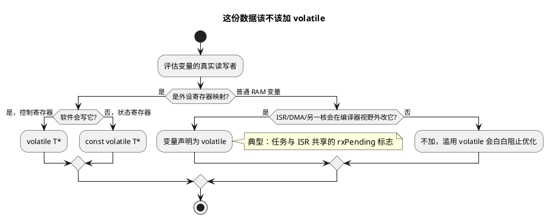

# 04 const 与 volatile 指针

> 一句话定位：const 是"给人和编译器的只读契约"，volatile 是"告诉编译器这块内存会自己变"——寄存器编程与 ISR 共享数据的安全带，TC377/S32K 上写错必见 Trap 或死循环。
> 等级：L1→L2 ｜ 前置：[01-指针与数组](01-指针与数组.md)

## 原理

### 1. const 修饰读法：右左法则

从变量名出发，先看右边再看左边，`*` 是分水岭：**const 在 `*` 左边修饰"指向的东西"，在 `*` 右边修饰"指针本身"**：

| 声明 | 读法 | 指向可改 | 内容可改 |
|---|---|---|---|
| `const char *p` / `char const *p` | 指向 const char 的指针 | 可 | 否 |
| `char * const p` | 指向 char 的 const 指针 | 否 | 可 |
| `const char * const p` | 都 const | 否 | 否 |

读法示范 `char * const p`：p 是 const（先右），它是指针，指向 char（后左）——"指针只读，内容可写"。

### 2. const 指针参数的契约

`uint32 CanIf_ExtractU32Be(const uint8 *data, ...)` 里的 const 是**接口契约**：函数承诺不修改调用者的缓冲区。价值有三：

- 调用方敢直接把唯一副本交进来，不必防御性拷贝；
- 函数内误写 `data[i] = x` 编译期直接报错；
- MISRA C:2012 规则 8.13 要求"能加 const 的指针形参都加"，代码评审/静态检查必查。

### 3. volatile：禁止编译器对访问做手脚

volatile 告诉编译器：每次访问都必须真的读写内存，不许缓存进寄存器、不许合并、不许凭"没人改它"删除访问。三大刚需场景：

1. **内存映射 I/O（MMIO, Memory-Mapped I/O）**：状态寄存器轮询，读一次可能不够，硬件随时变；
2. **ISR 与任务共享变量**：主循环 `while (!flag);` 中的 flag 若非 volatile，编译器把读提升到循环外——死循环；
3. **信号/DMA 等异步修改者**：longjmp、信号处理器、DMA 搬运会"绕过"编译器视野改内存。

### 4. const volatile 并存：只读状态寄存器

`const volatile uint32 *p`：软件**不许写**（写了没意义甚至触发动作），但硬件**会改**（值随时变，读操作不能被优化掉）。版本寄存器、状态寄存器、RX FIFO 计数器都是这类。

### 5. volatile 三个"不保证"

volatile **不保证原子性**（读-改-写仍是多指令）、**不是互斥锁**、**不是内存屏障**（多核/DMA 场景还需 DMB/缓存维护）。它只管"每次都真的访问内存"。



## 代码示例

### 场景 1：MMIO 轮询——没有 volatile 的死循环

```c
/* TC377/S32K 风格：外设寄存器 = 基地址 + 偏移（示意地址） */
#define CAN_STATUS_REG_ADDR   (0xF0180040u)
#define CAN_STATUS_INITDONE   (0x00000001u)

/* ---- 反例：忘了 volatile ---- */
uint32 Bad_WaitInitDone(void)
{
    uint32 *status = (uint32 *)CAN_STATUS_REG_ADDR;

    /* 编译器：循环体内没人写 *status -> 缓存进寄存器只读一次
     * 结果：硬件早已置位，CPU 却永远盯着寄存器的旧影子 -> 死循环
     */
    while (((*status) & CAN_STATUS_INITDONE) == 0u)
    {
        ; /* 忙等，看门狗很快来敲门 */
    }
    return 0u;
}

/* ---- 正例：const 修饰指针本身(不可改指)，volatile 修饰指向的寄存器 ---- */
static volatile uint32 * const CanStatusReg = (volatile uint32 *)CAN_STATUS_REG_ADDR;

uint32 Good_WaitInitDone(void)
{
    uint32 timeout = 100000u;

    while (((*CanStatusReg) & CAN_STATUS_INITDONE) == 0u)
    {
        timeout--;
        if (timeout == 0u)          /* 量产代码必须带超时出口 */
        {
            return 1u;
        }
    }
    return 0u;
}
```

### 场景 2：ISR 与任务共享标志

```c
static volatile boolean CanIf_RxPending = FALSE;   /* ISR 写、任务读 */

void Can_RxIsr(void)            /* CAN 接收中断 */
{
    CanIf_RxPending = TRUE;     /* 写方：ISR */
}

void App_Task_10ms(void)        /* 周期任务 */
{
    if (CanIf_RxPending)        /* 读方：任务。volatile 保证每次都真读内存 */
    {
        CanIf_RxPending = FALSE;
        CanIf_ProcessRxCache(); /* 先清标志再处理：处理期间新帧仍能置位 */
    }
}
/* 注意：volatile 只保证"真的读"，不保证原子；若是读-改-写共享量，
 * 仍需关中断或原子指令，见"易错点"第 4 条。 */
```

### 场景 3：const volatile 只读状态寄存器

```c
/* 硅版本寄存器：软件只读；但每次读都必须真读（可能是 FIFO 型寄存器） */
#define MCU_VERSION_REG  (*(const volatile uint32 *)0xF0030000u)

uint32 Mcu_GetSiliconVersion(void)
{
    return MCU_VERSION_REG;   /* 写它=UB，读它不能被合并/删除 -> 两个限定词都要 */
}
```

### 场景 4：const 参数契约的正反例

```c
/* 正：入参 const，调用方敢把唯一缓冲直接交给你 */
uint32 CanIf_ExtractU32Be(const uint8 *data, uint8 offset);

/* 反：没加 const，调用方无法从原型判断你会不会改他的报文缓存，
 * 谨慎的调用方只好先 memcpy 一份 —— 8 字节 CAN 帧也白白拷贝一遭 */
uint32 Bad_Extract(uint8 *data, uint8 offset);

/* 字符串常量：用 const char* 接住，别让只读属性在类型上丢失 */
void Log_Print(const char *msg);

void Demo(void)
{
    const char *ok = "UDS";    /* 字面量在 rodata(只读段)，类型上就只读 */
    char *bad = "UDS";         /* 隐患：类型丢掉只读属性，改它就 Trap */
    /* bad[0] = 'X';  -> TC377 上写只读段直接 Trap / S32K 开 MPU 后 fault */
    (void)ok;
    (void)bad;
}
```

## 易错点与陷阱

1. **const 位置读错**：`const uint8 *p` 与 `uint8 * const p` 是两个世界。口诀：`*` 左边管内容，`*` 右边管指针。
2. **volatile 加错对象**：`volatile uint32 *p`（指向的对象 volatile，寄存器用这个）与 `uint32 * volatile p`（指针变量本身 volatile，指向的对象不 volatile）含义完全不同，前者才是 MMIO 正解。
3. **整个结构体 volatile**：`volatile Can_FrameType f` 把所有成员全变 volatile，开销大且掩盖真实意图；通常只需要个别成员（如 `volatile uint8 state;`）。
4. **把 volatile 当原子操作**：`volatile uint8 cnt; cnt++;` 在 ISR 与任务并发下照样丢计数——++ 是读-改-写三步，必须关中断或用原子指令。
5. **cast away const 后写入**：`(uint8 *)p` 强转掉 const 再写，标准上是未定义行为；某次编译器把对象放进了只读段就直接 Trap。
6. **const 数组传给非 const 形参**：`const uint8 cfg[8]` 传给 `f(uint8 *)` 编译警告（指针丢弃限定符），不要强压警告，把形参补上 const 才是正解。
7. **volatile 用在局部纯软件变量上"求保险"**：白白阻止寄存器化与优化，热路径上性能明显劣化——按场景用，别当护身符。

## 面试高频题

**Q1：`const char *p`、`char const *p`、`char * const p` 各是什么？**
答：前两个完全等价——指向 const char 的指针，可改指向不可改内容；第三个是 const 指针，可改内容不可改指向。判断口诀：const 在 `*` 左修饰内容，在 `*` 右修饰指针。

**Q2：volatile 的三个典型使用场景？**
答：MMIO 外设寄存器访问；ISR 与任务共享的标志变量；会被 DMA/信号处理器等"编译器视野外"修改的内存。

**Q3：const 和 volatile 能同时修饰一个对象吗？举一例。**
答：能，且很常用：`const volatile uint32 *statusReg`——只读状态寄存器。const 表示软件不许写，volatile 表示值会被硬件改、每次读都必须真读。

**Q4：volatile 保证原子性吗？**
答：不。它只保证"每次访问都真的发生"，不保证访问不可分割。多字节读、读-改-写都需要关中断/原子指令/互锁指令保护。

**Q5：const 修饰函数指针参数有什么用？和 MISRA 什么关系？**
答：它是只读契约，防止函数内误改输入缓冲，也让调用方放心传唯一副本；MISRA C:2012 规则 8.13（指针形参应指向 const 限定类型）就是把它落成强制检查。

**Q6：为什么 `char *p = "hello"; p[0]='H';` 会崩溃？怎么改？**
答：字符串字面量存于只读段（rodata），通过非 const 指针去写触发写保护 Trap/fault。要可修改就用数组：`char p[] = "hello";`（拷贝到栈/可写内存）。

## 延伸

- [寄存器编程](../../2-L2进阶/寄存器编程/README.md)：结构体映射寄存器、读写时序与内存屏障的工程化做法。
- [代码规范与MISRA-C](../../2-L2进阶/代码规范与MISRA-C/README.md)：规则 8.13、11.4 等限定符相关条目的合规改写案例。
