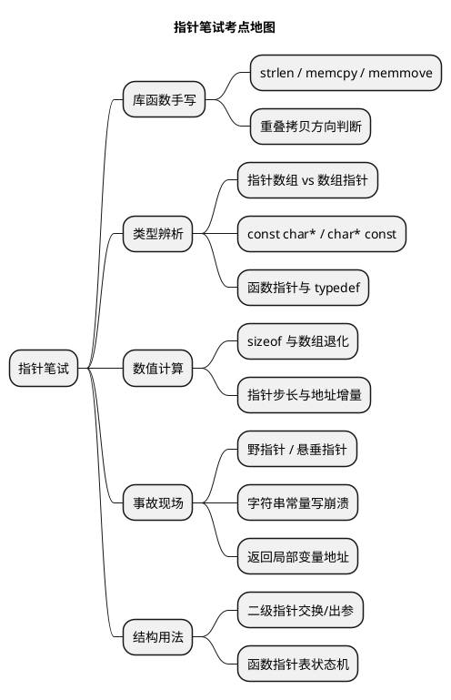

# 05 常见笔试题（指针）

> 一句话定位：嵌入式笔试/面试里指针题的九成考法——手写库函数、类型辨析、sizeof 计算、野指针找错、二级指针交换、函数指针表，全部带 CAN/UDS 场景解析。
> 等级：L1→L2 ｜ 前置：[01-指针与数组](01-指针与数组.md)

## 原理

指针笔试题考点高度集中，先看全景再逐题击破：



做题总原则：

- 涉及 sizeof，先问"这里还是数组吗"（退化了没有）；
- 涉及地址运算，先问"指向类型多大、是否同一数组"；
- 涉及修改，先问"这块内存能不能写、归谁管"；
- 手写库函数，先问"参数判空、重叠、返回值"三件套。

## 代码示例

### 题 1：手写 strlen

```c
size_t My_StrLen(const char *s)
{
    const char *p = s;          /* 保存起点 */

    if (s == NULL_PTR)          /* 笔试加分点：判空 */
    {
        return 0u;
    }
    while (*p != '\0')          /* 找结尾；不写 *p++ 避免阅读歧义 */
    {
        p++;
    }
    return (size_t)(p - s);     /* 同一数组内相减，结果=字符个数 */
}
```

解析：三个考点——入参加 const（只读契约）；`p - s` 是 ptrdiff，表示元素个数；不修改原串（有人写成 `s++` 遍历入参，丢掉起点就算不出长度）。

### 题 2：手写 memcpy（考虑内存重叠）

```c
void *My_MemCpy(void *dst, const void *src, size_t len)
{
    uint8 *d = (uint8 *)dst;
    const uint8 *s = (const uint8 *)src;
    size_t i;

    if ((dst == NULL_PTR) || (src == NULL_PTR))
    {
        return dst;
    }
    if ((d < s) || (d >= (s + len)))   /* 不重叠，或目标在源前面：正向拷 */
    {
        for (i = 0u; i < len; i++)
        {
            d[i] = s[i];
        }
    }
    else                                /* 目标落进源区间：反向拷 */
    {
        for (i = len; i > 0u; i--)
        {
            d[i - 1u] = s[i - 1u];
        }
    }
    return dst;
}
```

解析：

- 标准里 memcpy 本身就**要求不重叠**，重叠场景应使用 memmove；能说清这一点并写出方向判断，就是满分答案；
- 反向拷贝的直觉：`dst = src + 2` 时正向拷贝会先覆盖还没读的源字节，从尾部倒着拷则安全；
- 笔试语境下允许指针大小比较判断重叠；量产代码里跨对象比较违反 MISRA 18.3，应改用索引和基址计算；
- AUTOSAR 排错经历：CanTp 多帧组包时把接收缓冲又拷回自身偏移处，正向 memcpy 直接把报文前两字节"吃掉"——典型的重叠事故。

### 题 3：指针数组 vs 数组指针

```c
uint8  *cmdTab[4];        /* 指针数组：4 个 uint8* 元素，占 16 字节(32位) */
uint8 (*rowPtr)[8];       /* 数组指针：1 个指针，指向 uint8[8]，占 4 字节 */

/* 指针数组典型用法：CAN 报文名字表 */
static const char *CanIdNameTab[3u] =
{
    "0x100 电机扭矩", "0x200 电池状态", "0x7DF 诊断请求"
};

/* 数组指针典型用法：二维 CAN 帧缓存传参 */
void Dump(const uint8 (*frame)[8], uint8 rows);
```

解析：读法看优先级——`[]` 优先级高于 `*`，`cmdTab[4]` 先是数组，元素才是 `uint8*`；加了括号的 `(*rowPtr)` 先是指针，指向 `uint8[8]`。考点是 sizeof：`sizeof(cmdTab)=16`，`sizeof(rowPtr)=4`。

### 题 4：sizeof 计算大题（32 位平台）

```c
uint8  data[8];
uint8  frame[3][8];
uint8 *p = data;

void F(uint8 a[], uint8 (*b)[8]);

/* 逐项求值： */
sizeof(data)          /* = 8   数组本身，不退化 */
sizeof(p)             /* = 4   指针变量 */
sizeof(p + 0)         /* = 4   p+0 已是指针表达式(退化再退化还是指针) */
sizeof(frame)         /* = 24  3 行 x 8 字节 */
sizeof(frame[0])      /* = 8   一行，仍是数组类型 */
sizeof(frame[0][0])   /* = 1   元素 */
/* 函数 F 内部： */
sizeof(a)             /* = 4   形参数组已退化为指针 */
sizeof(b)             /* = 4   指针 */
/* 字符串： */
sizeof("UDS")         /* = 5   含结尾 '\0' */
strlen("UDS")         /* = 4   数到 '\0' 前 */
```

解析：一条主线——**sizeof 里数组不退化，其余表达式里退化**；函数形参 `[8]` 是被编译器忽略的注释。二维数组按行整体算，`frame[0]` 这一行还是数组。

### 题 5：野指针判断（找出 3 处错）

```c
uint8 *Bug_MakeFrame(void)
{
    uint8 data[8];            /* 错1：局部数组 */
    data[0] = 0x01u;
    return data;              /* 错2：返回栈上数组地址 -> 悬垂指针 */
}

void Bug_Use(void)
{
    uint8 *p;                 /* 错3：未初始化的野指针 */
    p[0] = 0xAAu;             /*    未初始化就解引用，写到随机地址 */

    uint8 *q = NULL_PTR;
    q[0] = 0xBBu;             /* 错4：空指针解引用，直接 HardFault/Trap */
    (void)q;
}
```

解析：三个概念分层——**野指针**（wild pointer，未初始化，指向随机地址）、**空指针**（明确无效，一解引用必炸，反而最好排查）、**悬垂指针**（dangling pointer，曾经有效、对象已销毁，最隐蔽）。工程防线：定义即初始化 `NULL_PTR`，归还资源后立刻置 `NULL_PTR`，使用前判空。

### 题 6：二级指针交换"指针本身"

```c
void PtrSwap(uint8 **a, uint8 **b)
{
    uint8 *tmp;

    if ((a == NULL_PTR) || (b == NULL_PTR))
    {
        return;
    }
    tmp = *a;      /* 取出两个指针变量的值 */
    *a  = *b;
    *b  = tmp;     /* 交换的是指针本身，不动任何数据 */
}

void Demo(void)
{
    uint8 frameA[8];
    uint8 frameB[8];
    uint8 *cur = frameA;
    uint8 *next = frameB;

    PtrSwap(&cur, &next);   /* 传指针的地址 -> 二级 */
    cur[0] = 0x5Au;         /* 此刻 cur 已指向 frameB */
}
```

解析：想交换"指针变量"，形参必须收到它的地址，即二级指针。若写成 `void PtrSwap(uint8 *a, uint8 *b)` 交换的只是副本，调用者的指针纹丝不动——与 02 篇出参原理同源。对比记忆：`swap(int*,int*)` 交换整数，`PtrSwap(int**,int**)` 交换指针。

### 题 7：函数指针表状态机（读代码补逻辑）

```c
typedef enum { ST_IDLE = 0u, ST_WAIT_KEY, ST_UNLOCKED } Diag_StateType;
typedef void (*Diag_HandlerType)(uint8 sid);

static void StIdle_OnSid(uint8 sid);
static void StWaitKey_OnSid(uint8 sid);
static void StUnlocked_OnSid(uint8 sid);

static const Diag_HandlerType Diag_HandlerTab[3u] =
{
    StIdle_OnSid,       /* ST_IDLE */
    StWaitKey_OnSid,    /* ST_WAIT_KEY */
    StUnlocked_OnSid    /* ST_UNLOCKED */
};

static Diag_StateType Diag_State = ST_IDLE;

void Dcm_OnRequest(uint8 sid)
{
    Diag_HandlerTab[Diag_State](sid);   /* 状态号即下标：查表分发 */
}

static void StIdle_OnSid(uint8 sid)
{
    if (0x27u == sid) { Diag_State = ST_WAIT_KEY; }   /* 27 安全访问 */
}
```

解析：问"再加一个刷写状态要改哪几处"——枚举加一项、handler 函数加一个、表加一行，分发函数**零改动**。这是函数指针表对巨型 switch 的核心优势；同时要能答出风险：状态号越界即函数指针越界，表大小必须与枚举绑定（宏统一管理）。

### 题 8：const char *p 与 char * const p 区别（判对错）

```c
char buf[8] = "abc";
const char *p1 = buf;    /* 内容只读，指向可变 */
char * const p2 = buf;   /* 指向只读，内容可变 */

p1 = &buf[1];   /* 对：换指向 */
p1[0] = 'X';    /* 错：写 const 修饰的对象，编译报错 */
p2 = &buf[1];   /* 错：改 const 指针本身，编译报错 */
p2[0] = 'X';    /* 对：内容可写 */
```

解析：判别口诀——const 在 `*` 左边修饰"指向的东西"，在 `*` 右边修饰"指针本身"。加分项：`const char * const p3` 两者皆只读；并说明工程意义（入参契约，MISRA 8.13）。

### 题 9：字符串常量修改崩溃

```c
void Demo(void)
{
    char *s = "CAN";      /* s 指向 rodata 中的字面量，类型丢了只读属性 */
    s[0] = 'L';           /* 运行时写只读段：TC377 直接 Trap，S32K 开 MPU 后 fault */
}

void Fixed(void)
{
    char s[] = "CAN";     /* 数组定义：把字面量拷贝进栈上可写内存 */
    s[0] = 'L';           /* 合法：改的是副本 */
}
```

解析：区别在**存储位置**——指针指向只读段的原件，数组是拷贝出来的副本。笔试常追问 `sizeof(s)`：指针版是 4（指针宽度），数组版也是 4（"CAN" 3 个字符加 `'\0'`）——数值相同纯属巧合，追问点正在于此；再追问怎么写才安全：需要可变就用数组，否则 `const char *` 明示只读。

### 题 10：指针步长与地址计算

```c
uint8   data[8];
uint8  *p = &data[0];
uint32 *q = (uint32 *)&data[0];   /* 危险强转，仅用于算地址题 */

/* 设 data 起始地址为 0x2000_0000： */
p + 1                 /* 0x2000_0001：按元素(uint8)步长 1 */
q + 1                 /* 0x2000_0004：按元素(uint32)步长 4 */
&data + 1             /* 0x2000_0008：数组指针，跨过整个数组 */
(uint8 *)(&data[0] + 8)  /* 0x2000_0008：尾后一格，可比较不可解引用 */
```

解析：地址增量 = `n × sizeof(指向类型)`；`&data + 1` 是最容易错的点（跨整个数组）。顺带指出 `(uint32 *)&data[1]` 的三宗罪：非对齐（TriCore Trap）、字节序（CPU 小端报文大端）、违反 MISRA 11.3——实战请逐字节组装（见 01 篇场景 2）。

## 易错点与陷阱

1. **手写函数不判空、不返回值**：strlen/memcpy 笔试第一丢分点是漏 `NULL_PTR` 检查和漏 `return dst;`（memcpy 需支持链式调用）。
2. **sizeof 题忘了退化**：函数内、或任何传过参的"数组"，sizeof 一律按指针算。
3. **把 `char *p = "x"` 和 `char a[] = "x"` 当一回事**：一个指向只读原件，一个是可写副本。
4. **交换题分不清交换"指针"还是"内容"**：看形参是 `T*` 还是 `T**`——一级改内容，二级改指针。
5. **指针步长题忽略数组指针**：`&arr` 参与运算时步长是整个数组大小，不是元素。
6. **函数指针表题漏判界**：状态号/命令号做下标前不判范围，越界即拿到野函数指针。

## 面试高频题（快问快答）

**Q1：sizeof 和 strlen 的区别？**
答：sizeof 是编译期运算符，求类型/对象大小（含 `'\0'`，对数组不退化）；strlen 是运行期函数，数到 `'\0'` 为止（不含）。形参数组传进函数后 sizeof 只得指针大小。

**Q2：memcpy、memmove、memset 使用边界？**
答：memcpy 要求源目的不重叠；memmove 允许重叠（内部分方向拷贝）；memset 按字节填充，别用来清 uint16/uint32 数组以外还想按值初始化的场景（逐字节写 0 除外）。

**Q3：为什么不能返回局部变量的地址？**
答：局部变量在栈帧里，函数返回即失效，地址悬垂；下一次函数调用/中断会覆写这块内存。要返回就返回静态区地址、调用者传入缓冲、或结构体值返回。

**Q4：NULL、空字符串 ""、野指针的区别？**
答：NULL 是值为 0 的指针常量（解引用必炸、判空可防）；`""` 是合法字符串（首字节就是 `'\0'`，能读不能写常量本体）；野指针是未初始化/失效的指针，指向不可预测。

**Q5：指针自增越界一格会怎样？**
答：指向尾后一格合法（可比较），再越或解引用是未定义行为——可能静默读脏数据，也可能立刻 Trap，取决于内存映射，这正是不敢依赖"侥幸能跑"的原因。

**Q6：笔试手写 memcpy 时面试官追问"你的写法有什么问题"？**
答：两处可答——不同对象指针做大小比较在标准/MISRA 上不合法（量产应换索引判断）；未处理 len 为 0 与整型溢出等边界。能主动指出即体现工程素养。

## 延伸

- [代码规范与MISRA-C](../../2-L2进阶/代码规范与MISRA-C/README.md)：本篇多处"笔试能过、量产要改"的写法对应的 MISRA 规则详解。
- [位操作](../位操作/README.md)：与题 10 配套的字节序组装、掩码提取的惯用法。

