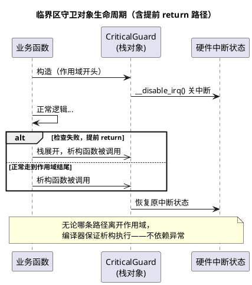

# RAII 在嵌入式中的应用

> 一句话定位：RAII（Resource Acquisition Is Initialization，资源获取即初始化）让"离开作用域必然释放"由编译器保证而不是靠人肉纪律——即使禁了异常，它在 MCU 上依然是消灭"提前 return 忘解锁"这一类 bug 的最强工具。
> 等级：L2 ｜ 前置：[01-构造析构与vtable开销](../类与对象/01-构造析构与vtable开销.md)

## 原理

RAII 的核心契约：**把资源生命周期绑定到对象生命周期**。构造函数获取资源，析构函数释放资源；C++ 保证栈对象在离开作用域时（正常走完、提前 return、甚至 longjmp/异常展开）析构函数**必定被调用**，顺序与构造严格相反。

嵌入式的特殊性在于：`-fno-exceptions` 环境下 RAII 依然成立——因为"栈展开时调用析构"只是 RAII 收益的一种，日常代码里 99% 的收益来自**普通 return 路径的自动清理**，这完全不需要异常机制。经典对照是 C 的 `goto cleanup` 模式：每个出口手工跳到清理标签，出口一多就漏；RAII 把这件事交给编译器，漏不掉。

典型场景：

1. **临界区守卫**：构造 EnterCritical、析构 ExitCritical——函数中任何 return 都不会忘开中断；
2. **看门狗喂狗守卫**：进入长计算前构造"暂停看门狗"，作用域结束恢复；
3. **外设句柄守卫**：构造时占用 SPI 片选/锁，析构时释放，防并发访问。



## 代码示例

```cpp
// ===== 1) 临界区守卫：解决"提前 return 忘解锁" =====
class CriticalGuard {
public:
    CriticalGuard()  : primask_{__get_PRIMASK()} { __disable_irq(); } // 记录并关中断
    ~CriticalGuard() { if (primask_ == 0u) { __enable_irq(); } }      // 恢复原状态
    CriticalGuard(const CriticalGuard&)            = delete;   // 禁拷贝：守卫唯一
    CriticalGuard& operator=(const CriticalGuard&) = delete;
private:
    uint32_t primask_;
};

// 用法：任何 return 路径都自动恢复中断
bool Buffer_Pop(RingType* r, uint8_t* out) {
    CriticalGuard lock;                    // 进入即关中断
    if (r->count == 0u) { return false; }  // 提前 return：析构自动开中断 ✓
    *out = r->buf[r->head++];
    if (r->head >= r->cap) { r->head = 0u; }
    r->count--;
    return true;                           // 正常返回：同样自动恢复 ✓
}   // 对比 C 版：每个 return 前都得手写 __enable_irq()，漏一处就是死锁/丢中断

// ===== 2) 看门狗喂狗作用域守卫 =====
class WatchdogSuspend {
public:
    WatchdogSuspend()  { Iwdg->KR = 0x5555u; Iwdg->RLR = 0xFFFu; } // 暂停/放宽
    ~WatchdogSuspend() { Iwdg->KR = 0xAAAAu; }                     // 退出即喂狗
    WatchdogSuspend(const WatchdogSuspend&)            = delete;
    WatchdogSuspend& operator=(const WatchdogSuspend&) = delete;
};

void LongFlashErase() {
    WatchdogSuspend wd;      // 长耗时擦除期间看门狗被按下暂停
    Flash_EraseSector(7u);
}                            // 离开作用域自动恢复，不惧中间任何 return

// ===== 3) 外设句柄守卫（SPI 总线占用） =====
class SpiBusLock {
public:
    explicit SpiBusLock(GpioPin& cs) : cs_{cs} { cs_.Set(false); }   // 拉低片选=占用
    ~SpiBusLock()                             { cs_.Set(true);  }    // 释放
    SpiBusLock(const SpiBusLock&)            = delete;
    SpiBusLock& operator=(const SpiBusLock&) = delete;
private:
    GpioPin& cs_;
};

uint8_t ReadSensor(GpioPin& cs) {
    SpiBusLock bus(cs);       // 占总线
    Spi_Transfer(0x80u);
    return Spi_Transfer(0xFFu);
}                             // 无论成败，片选必然拉高释放

// ===== 4) ScopeGuard 简化实现（C++14，无异常环境可用） =====
template <typename F>
class ScopeGuard {
public:
    explicit ScopeGuard(F f) : f_{static_cast<F&&>(f)} {}
    ~ScopeGuard() { if (f_) { f_(); } }
    void Dismiss() { f_ = nullptr; }         // 中途决定不清理时调用
    ScopeGuard(const ScopeGuard&)            = delete;
    ScopeGuard& operator=(const ScopeGuard&) = delete;
private:
    F f_;
};
// 用 lambda 现场指定清理动作：
void Demo(uint8_t* shared) {
    auto g = ScopeGuard([&]{ shared = nullptr; });
    if (Process(shared) < 0) { return; }     // 提前 return 也会执行清理
    g.Dismiss();                             // 成功路径显式取消清理
}

/* ===== 对照：C 语言的 goto cleanup 模式 =====
int buf_pop(ring_t* r, uint8_t* out)
{
    int ret = -1;
    uint32_t pm = __get_PRIMASK();
    __disable_irq();                      // 关中断
    if (r->count == 0u) { goto cleanup; } // 每个出口都必须 goto
    *out = r->buf[r->head++];
    if (r->head >= r->cap) { r->head = 0u; }
    r->count--;
    ret = 0;
cleanup:                                  // 出口一多极易漏跳/漏恢复
    if (pm == 0u) { __enable_irq(); }
    return ret;
}
*/
```

RAII 守卫 vs `goto cleanup` 对比：

| 维度 | RAII 守卫 | goto cleanup |
|---|---|---|
| 出口安全性 | 编译器保证所有路径析构 | 每个出口手工 goto，可漏 |
| 多资源嵌套 | 声明即用，自动逆序释放 | 标签层层堆叠，顺序靠人记 |
| 中断/抢占上下文 | 不适用（ISR 内无"作用域退出"语义问题） | 同样不适用 |
| 可移植性 | 需 C++（或 GCC `__attribute__((cleanup))` 模拟） | 纯 C |
| 团队门槛 | 需理解构造/析构时序 | C 工程师零门槛 |

## 易错点与陷阱

- **守卫对象必须禁拷贝**：`CriticalGuard a; CriticalGuard b = a;` 若可拷贝，第二个析构会把中断状态恢复两次/错次。一律 `= delete` 拷贝构造与赋值。
- **恢复而不是无脑开中断**：若进入守卫前中断本来就是关的（嵌套调用），析构里 `__enable_irq()` 会破坏外层临界区。必须构造时保存 PRIMASK、析构时条件恢复（如上面实现）。
- **ISR 里别依赖"作用域退出"**：中断处理函数本身没有提前 return 的复杂出口问题，滥用守卫徒增开销；但若 ISR 内真有多出口+临界区，RAII 同样适用。
- **静态/全局守卫无意义**：RAII 绑定的是**栈对象**作用域；把守卫做成全局对象，析构时机变成程序结束（MCU 上根本没有"结束"），形同虚设。
- **lambda 捕获悬空**：ScopeGuard 的 lambda 按引用捕获局部变量时，若守卫生命周期长于该变量（如被存到全局），析构时就是未定义行为。守卫只做栈上、同作用域清理。
- **构造抛资源失败**：无异常环境下构造函数无法"报错"，守卫构造假定资源必然可得（关中断/拉片选这类操作不会失败）；若获取可能失败，改用两段式：`Init()` 返回错误码 + 手工管理。

## 面试高频题

1. **禁了异常，RAII 还有意义吗？**
   答：有。异常展开只是析构被调用的一种路径；普通 return、作用域结束的确定性析构才是 RAII 在嵌入式的主战场——临界区、喂狗、片选守卫全部只依赖这一条，与异常无关。
2. **RAII 和 goto cleanup 的本质区别？**
   答：责任主体不同。goto cleanup 把清理责任放在每个出口的书写者身上（可漏）；RAII 把责任交给编译器与类型系统（不可漏），并且天然支持多资源逆序释放。
3. **写一个不可拷贝的临界区守卫要注意什么？**
   答：拷贝构造/拷贝赋值 `=delete`；构造保存 PRIMASK 等原状态、析构按原状态恢复（支持嵌套）；不加虚函数（守卫不需要多态，省 vptr）。
4. **析构函数可以是虚的吗？什么时候必须虚？**
   答：可以。当对象可能经基类指针删除时必须虚，否则只执行基类析构；接口类一律 `virtual ~I() = default;`，详见 [构造析构与 vtable 开销](../类与对象/01-构造析构与vtable开销.md)。

## 延伸

- [构造析构与 vtable 开销](../类与对象/01-构造析构与vtable开销.md)：析构逆序、虚析构的底层机制
- [01-哪些特性适合MCU](../嵌入式C++实践/01-哪些特性适合MCU.md)：RAII 属于"零开销可带进 MCU"清单的依据
- [模板零开销原则](../模板与受限STL/01-模板零开销原则.md)：ScopeGuard 模板化的成本分析
