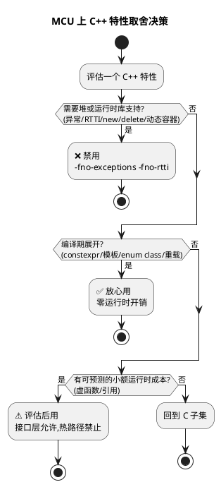

# 哪些 C++ 特性适合 MCU

> 一句话定位：C++ 不是"全有或全无"，工程上正确的做法是挑出编译期展开、零运行时成本的子集带进 MCU，同时用编译选项把危险特性硬性禁掉。
> 等级：L2 ｜ 前置：无

## 原理

C++ 相对 C 的增量特性可以分成三类：

1. **编译期完成型**：类封装、`enum class`、命名空间、函数重载、`constexpr`、模板——产物和手写 C 差不多，只影响编译期，不增加 Flash/RAM。
2. **轻量运行时型**：引用传参（本质是指针，编译器可优化）、虚函数（每次调用多一次 vtable 间接跳转）——可控但要清楚成本。
3. **重运行时型**：异常（Exception）、RTTI（Run-Time Type Information，运行时类型信息）、`new/delete` 动态内存、STL 动态容器（`vector`/`map`/`string`）——这些依赖堆和不可预测的运行时库，与 MCU 的确定性、无堆约束直接冲突。

**AUTOSAR 现实分工**：Classic Platform（CP）标准语言是 C（C99 起），BSW/CDD 全部是 C；Adaptive Platform（AP）使用 C++14/17（Guidelines 强制禁异常、限制动态内存），运行在高性能 SoC（座舱、域控、网关）上。所以典型工程师画像：主业 C 写 CP，了解 AP 的 C++14/17 写法即可。MCU（Cortex-M/R 级别、无 MMU）上用 C++，就是取第 1 类 + 谨慎用第 2 类。



## 代码示例

```cpp
// ===== 适合带进 MCU 的特性演示 =====

// 1) enum class：强类型枚举，不会隐式转成 int，命名空间不污染
enum class DtcStatus : uint8_t {
    kPassed    = 0x00,
    kFailed    = 0x01,
    kPending   = 0x02,
};
// 用法：DtcStatus s = DtcStatus::kFailed;  忘了 :: 编不过，比 C 宏/枚举安全

// 2) 命名空间 + 函数重载：同一接口名按参数类型分发
namespace Spi {
    void     Transfer(uint8_t single);                  // 单字节
    void     Transfer(const uint8_t* buf, size_t len);  // 连续块
}

// 3) constexpr：编译期把 CRC 表算进 Flash，运行时零计算
constexpr uint32_t Crc32Bit(uint32_t index) {
    uint32_t crc = index;
    for (int i = 0; i < 8; ++i) {
        crc = (crc >> 1) ^ (0xEDB88320u & (0u - (crc & 1u)));
    }
    return crc;
}
// 查表数组在编译期生成，链接后就是 Flash 里的一张常量表

// 4) 引用传参：避免了 C 里"传指针还是传值"的二义性
void ComposeFrame(const uint8_t& header, uint8_t* payload); // header 只读且不可为 nullptr

// 5) 类封装：把外设寄存器操作封进私有段，对外只暴露方法
class GpioPin {
public:
    enum class Mode : uint8_t { kInput, kOutput, kAltFunc };
    void     Init(Mode m);
    void     Set(bool high);
    bool     Read() const;          // const 成员函数：承诺不修改对象状态
private:
    volatile uint32_t* base_;       // GPIO 基址
    uint8_t            pin_;        // 引脚号
};

// ===== 必须远离的特性（反面示例，仅供识别，禁止出现在工程里） =====
// auto* p = new CanFrame();      // new 走堆，堆碎片 + 时序不可预测
// std::vector<uint8_t> buf(64);  // vector 内部就是 new，同样被禁
// try { ... } catch (...) { ... }// 异常表占 Flash，展开时间不可预测
// dynamic_cast<ISpi*>(drv);      // RTTI 需要类型信息元数据，-fno-rtti 直接编不过
```

对照表：

| 特性 | 能否上 MCU | 成本 | 备注 |
|---|---|---|---|
| 类封装 / 访问控制 | ✅ | 零 | 编译期检查，不占空间 |
| `enum class` | ✅ | 零 | 替代宏和裸枚举 |
| 命名空间 / 重载 | ✅ | 零 | 名字修饰只在链接期 |
| `constexpr` / 模板元编程 | ✅ | 零 | 编译期算完，Flash 里是结果 |
| 引用传参 | ✅ | ≈指针 | API 表意更清晰 |
| `std::array` | ✅ | 零 | 固定容量，栈/静态分配 |
| 虚函数 | ⚠️ 限接口层 | vptr+vtable 间接跳转 | 见 [02-开销分析](02-开销分析.md) |
| 异常 / RTTI | ❌ | 异常表 + 不可预测时间 | `-fno-exceptions -fno-rtti` 硬禁 |
| `new/delete` / 动态容器 | ❌ | 堆碎片 + 非确定性 | `-fno-exceptions` 下容器连抛异常都做不到 |
| 虚函数滥用（层层继承） | ❌ | 可读性 + 调试成本 | 至多一层接口 + 一层实现 |

**决策清单（合入前自查）**：

1. 编译选项是否已带 `-fno-exceptions -fno-rtti`（GCC/Clang）？
2. 链接脚本里是否根本没有 heap 区（或 heap 大小为 0）？
3. 是否用到任何 `<vector>` `<map>` `<string>` 头文件？
4. 继承层次是否 ≤ 2 层（接口 + 实现）？
5. 构造/析构是否只做赋值，不做寄存器副作用（外设初始化放显式 `Init()`）？

## 易错点与陷阱

- **以为不用 `new` 就没堆**：`printf` 浮点格式化、部分 C 库函数（`strtok`、`rand`）内部可能有静态/动态分配，链接 `.bss`/heap 段要逐一核对。
- **静态对象构造顺序陷阱**：跨编译单元的全局对象构造顺序未定义，`GpioPin g{...}` 若在构造函数里读寄存器，而时钟还没使能，直接 HardFault。构造函数只赋值，硬件初始化放 `Init()`，由 main 显式调用。详见 [02-开销分析](02-开销分析.md)。
- **`enum class` 底层类型要显式给**：不给时编译器自选 `int`/`unsigned`，AUTOSAR 通信矩阵里按字节排布时必须写 `enum class X : uint8_t`。
- **模板实例化膨胀**：同一个模板对 `uint8_t/uint16_t/uint32_t` 实例化三份代码，Flash 翻倍。控制实例化种类数，见 [02-开销分析](02-开销分析.md)。
- **Adaptive ≠ 可以随便用 C++**：AP 的 C++14/17 Guidelines 同样禁异常、限制动态内存到启动阶段，"上了 AP 就能 vector 满天飞"是误解。

## 面试高频题

1. **为什么嵌入式 C++ 要禁异常？**
   答：异常展开时间不可预测（破坏实时性）；异常表和 unwind 代码显著增加 Flash；错误路径不可静态分析，安全标准（如 MISRA/ISO 26262 工具链）难以论证覆盖。
2. **虚函数在 MCU 上能不能用？代价是什么？**
   答：能，但限接口层。代价是每对象一个 vptr（4 字节）+ 一次 vtable 间接跳转（阻碍内联和分支预测）；热路径（中断、循环移位）应避免。本质与 C 的函数指针表等价，见 [类与对象笔记](../类与对象/01-构造析构与vtable开销.md)。
3. **Classic AUTOSAR 是 C，那 C++ 在汽车软件里用在哪？**
   答：Adaptive Platform（C++14/17，POSIX OS 的高算力平台）；以及部分 OEM 在 CP 上层应用/工具链侧的受限 C++；BSW/MCAL 生态仍是 C。
4. **`constexpr` 和 `const` 的区别？**
   答：`const` 只承诺"运行时不可改"，初值可以是运行时算出的；`constexpr` 要求编译期可求值，配合模板可以生成编译期查找表，产物直接进 Flash，运行时零成本。

## 延伸

- [02-开销分析](02-开销分析.md)：虚函数/异常/静态构造的具体成本量级与 map 文件验证法
- [构造析构与 vtable 开销](../类与对象/01-构造析构与vtable开销.md)：虚函数布局图解与 C 函数指针表等价性
- [模板零开销原则](../模板与受限STL/01-模板零开销原则.md)：编译期计算与可用容器清单
- [RAII 在嵌入式中的应用](../RAII与资源管理/01-RAII在嵌入式中的应用.md)：无异常环境下的作用域守卫
