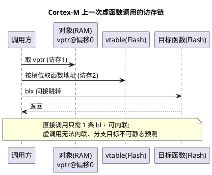

# C++ 特性开销分析

> 一句话定位：把"某某特性有开销"从传说变成可量化的 Flash/RAM/周期数，并用 map 文件亲手验证——这是评审 C++ 代码时唯一可靠的说话依据。
> 等级：L2 ｜ 前置：[01-哪些特性适合MCU](01-哪些特性适合MCU.md)

## 原理

四类典型成本来源：

1. **虚函数（Virtual Function）**：每个多态对象多一个 vptr（Cortex-M 上 4 字节 RAM），每个多态类多一张 vtable（Flash）；调用是"取 vptr → 查表 → 间接跳转"两访存一跳转，且编译器无法内联，比直接调用多几十周期量级（取决于 cache/流水线）。
2. **异常（Exception）**：即使从不 throw，启用 `-fexceptions` 也会为每个可能展开的函数生成 `.ARM.exidx`/`.eh_frame` 异常表（Flash 普涨 10%~30%）；一旦真的抛出，栈展开时间不可预测，实时任务不可接受。
3. **静态对象构造**：全局/静态 C++ 对象的构造函数在 `main` 之前由启动代码调用——GCC/newlib 下就是 `__libc_init_array()` 逐个执行 `.init_array` 段里的构造入口。代价有两层：一是多一段启动时间（安全启动时间窗常被压得很紧），二是跨编译单元的构造顺序未定义，A 对象构造时引用 B 对象就会读到未构造的内存。
4. **模板实例化膨胀（Template Bloat）**：模板按"类型+常量"组合各生成一份完整代码，`RingBuffer<uint8_t,64>` 和 `RingBuffer<uint16_t,64>` 就是两个类；实例化组合不受控时 Flash 线性膨胀。



## 代码示例

```cpp
// ===== 1) 虚函数成本：眼见为实 =====
class IDriver {
public:
    virtual uint8_t Read() = 0;
    virtual ~IDriver() = default;
};
class SpiDriver final : public IDriver {
public:
    uint8_t Read() override { return reg_->DR; }
private:
    volatile uint32_t* reg_ = reinterpret_cast<volatile uint32_t*>(0x40013000u);
};
SpiDriver g_spi;                       // 对象 4 字节起（vptr + reg_）
// 反汇编：g_spi.Read() 会编译成
//   ldr r0, [addr_of_g_spi]   ; 取 vptr
//   ldr r1, [r0, #offset]     ; 查 vtable 槽位
//   blx r1                    ; 间接调用
// 而非虚版本就是一条 bl，甚至被内联成一条 ldr

// ===== 2) 静态构造：main 之前发生了什么 =====
class CanIf {
public:
    CanIf() { /* 若在这里配置寄存器 => 时钟可能未使能 => HardFault */ }
};
CanIf g_canIf;   // 构造入口被塞进 .init_array 段
// 启动流程（GCC + newlib，对应 C 的 __libc_init_array）：
//   Reset_Handler -> SystemInit -> 拷 .data / 清 .bss
//                 -> __libc_init_array() 遍历 .init_array 调用各构造
//                 -> main()
// 安全写法：构造函数只赋值，硬件动作放显式 Init()

// ===== 3) 模板膨胀：一种类型一份代码 =====
template <typename T, size_t N>
class RingBuffer { /* ... 约 200 行实现 ... */ };
RingBuffer<uint8_t,  64> a;   // 生成一份代码
RingBuffer<uint16_t, 32> b;   // 又一份代码（类型不同）
RingBuffer<uint8_t,  32> c;   // 再一份（N 是模板参数，即使代码相同也各留一份）
// 控制手段：把 N 从模板参数挪到构造参数，模板只按 T 实例化
```

**用 map 文件验证开销的方法**（Cortex-M + GCC/armclang 通用）：

1. 编译时打开 `-ffunction-sections -fdata-sections`，链接时 `-Wl,--gc-sections`、生成 map：`-Wl,-Map=app.map`。
2. 打开 `app.map`，看段与归档（Archive）两栏：
   - 虚函数：搜 `vtable for SpiDriver`，Flash 里会出现一张表，大小 = 槽位数 × 4；
   - 异常表：搜 `.ARM.exidx` / `.eh_frame` 段大小，对比 `-fno-exceptions` 前后整段消失；
   - 静态构造：搜 `.init_array`，里面每个 4 字节项对应一个全局构造入口；
   - 模板膨胀：搜 `RingBuffer`，每个实例化一组符号，看 `.text` 增量。
3. 终极对比法：做 A/B 实验——同一份功能分别以"虚函数版/直接调用版"、"开异常/关异常"、"3 种模板实例/1 种"各链接一次，记录 `arm-none-eabi-size` 输出的 text/data/bss 三列差值，就是该特性的真实成本。
4. 运行时成本用 DWT->CYCCNT（Cortex-M3+ 的周期计数器）环绕被测调用读取周期差，虚调用与直接调用的差值通常在两位数周期量级。

## 易错点与陷阱

- **"没写 throw 就没异常开销"**：错。只要 `-fexceptions` 开着（很多工具链默认开），异常表照生成。必须显式 `-fno-exceptions`，且链 C++ 库时一并关。
- **静态对象构造顺序**：同一编译单元内按声明序，跨编译单元未定义。全局对象构造函数里调用另一个编译单元的对象方法是经典未定义行为，且症状随机（取决于链接顺序），极难定位。
- **`.init_array` 在中断向量表初始化之前执行吗**：在 `SystemInit` 之后、`main` 之前执行，此时若构造函数依赖某外设时钟，必须确保 `SystemInit` 已使能——CubeMX/HAL 模板通常满足，手写启动文件时要自查。
- **模板"零开销"的宣传边界**：零的是"运行时抽象开销"，代码体积开销不为零——每多一种实例化就多一份 `.text`，见 [模板零开销原则](../模板与受限STL/01-模板零开销原则.md)。
- **inline 只是建议**：虚调用、跨编译单元且未开 LTO 的 inline 都不会真正内联，验证开销别靠猜，看反汇编。
- **vtable 放 Flash 但 vptr 在 RAM**：每个对象实例都背一个 vptr，对象数量大时 RAM 增量 = 4 × 实例数，别只盯 Flash。

## 面试高频题

1. **虚函数调用的完整成本是什么？**
   答：空间上每类一张 vtable（Flash）+ 每对象一个 vptr（RAM）；时间上两次访存 + 间接跳转，且阻断内联；对 Cortex-M 这类无分支预测补偿的核，代价相对更明显。
2. **全局 C++ 对象的构造函数什么时候执行？由谁调用？**
   答：进入 `main` 之前，由启动代码调用（GCC/newlib 下是 `__libc_init_array` 遍历 `.init_array` 段），在 `.data` 拷贝、`.bss` 清零之后执行。因此构造函数里不能依赖"main 里才初始化"的资源。
3. **如何向领导证明"关异常省了 X KB"？**
   答：A/B 链接 + map/size 对比：同代码分别以 `-fno-exceptions` 与默认配置各链接一次，比较 text 总量与 `.ARM.exidx`/`.eh_frame` 段大小，差值即证据。
4. **模板会让代码变大吗？为什么？**
   答：会。模板按类型+常量组合实例化，每种组合生成一份独立代码（ODR 层面是不同的函数），实例化组合不受控时 `.text` 线性增长；把尺寸类参数改为运行时参数、或显式实例化并 extern 声明可控制膨胀。

## 延伸

- [01-哪些特性适合MCU](01-哪些特性适合MCU.md)：特性取舍总表与决策清单
- [构造析构与 vtable 开销](../类与对象/01-构造析构与vtable开销.md)：vtable 布局图解、与 C 函数指针表对照
- [模板零开销原则](../模板与受限STL/01-模板零开销原则.md)：零开销的确切含义与边界
