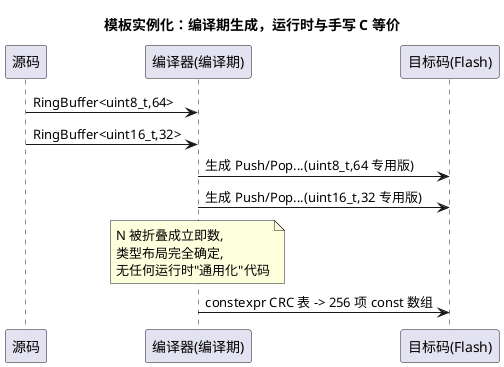

# 模板零开销原则

> 一句话定位：模板的"零开销"指的是**抽象不收费**——编译期把类型和常量展开成专用代码后，运行时与手写 C 完全等价；但代码体积、编译时间不为零，这就是它的边界。
> 等级：L2 ｜ 前置：[02-预处理与宏](../../../1-L1基础/基础语法巩固/02-预处理与宏.md)

## 原理

模板不是运行时机制，而是**编译期代码生成器**：编译器按"类型 + 常量参数"组合（实例化，Instantiation）为每种组合生成一份专属代码。因此：

- **零的部分**：运行时抽象成本。`RingBuffer<uint8_t,64>::Push()` 展开后就是对该具体布局的直操作，N 作为编译期常量被折叠进指令，没有"通用参数化"的运行时税；
- **不为零的部分**：
  1. 代码体积——每种实例化一份 `.text`（模板膨胀，Template Bloat），见 [02-开销分析](../嵌入式C++实践/02-开销分析.md)；
  2. 编译时间与错误信息可读性；
  3. 某些隐性陷阱——模板参数若含函数调用语义未被内联，抽象就会"收费"。

`constexpr`（常量表达式）是零开销的另一支柱：强制编译期求值，结果直接写进 Flash。典型如 CRC 查找表——C 工程师手写 256 行十六进制表，C++ 用 constexpr 循环在编译期生成同一张表，源码可读、可维护、可 diff。

**容器边界**：`std::array` 是聚合包装，零开销替代 C 数组（多了 `size()`/`begin()`/边界检查接口）；`std::vector`/`std::map`/`std::string` 依赖堆分配（`new`），且标准要求分配失败抛 `bad_alloc`——在 `-fno-exceptions` + 无堆的 MCU 上从根上不可用，不是"省着用"的问题，是"用不了"。



## 代码示例

```cpp
// ===== 1) constexpr 编译期生成 CRC 查找表（替代手写 256 行表） =====
constexpr uint32_t Crc32Step(uint32_t crc) {          // 单次多项式迭代
    return (crc >> 1) ^ (0xEDB88320u & (0u - (crc & 1u)));
}
constexpr uint32_t Crc32Entry(uint32_t index) {       // 生成一个表项
    uint32_t crc = index;
    for (int i = 0; i < 8; ++i) { crc = Crc32Step(crc); }
    return crc;
}
template <size_t... I>
struct CrcTableImpl {                                 // 按传入的索引序列展开表项
    static constexpr uint32_t kTable[256] = { Crc32Entry(I)... };
};
// make_index_sequence 生成 0..255 的实参序列，实例化出完整 256 项表（需 #include <utility>）
using CrcTable = CrcTableImpl<std::make_index_sequence<256>>;
// C++14 起 constexpr 循环合法；生成的 kTable 在链接后就是 Flash 里的常量表，
// 运行时零计算——与手写 256 行 ROM 表逐字节相同

// ===== 2) std::array：固定容量，零开销替代 C 数组 =====
#include <array>
std::array<uint8_t, 8> canIdFilter = { 0x100, 0x101, 0x102, 0x103,
                                       0x200, 0x201, 0x202, 0x203 };
// sizeof(canIdFilter) == 8，与 uint8_t[8] 完全一致
// 白送：canIdFilter.size()、范围 for、at()（越界可查）、不会数组退化为指针
// 反例：std::vector<uint8_t> v(8);  // 内部 new + bad_alloc 语义 => MCU 禁用
//       std::map<...>, std::string  // 同理：堆 + 动态增长 + 异常 => 禁用

// ===== 3) 自写模板化 ring buffer<T, N>（完整代码，无堆、无异常） =====
template <typename T, size_t N>
class RingBuffer {
    static_assert(N > 0u, "N must be positive");
    static_assert((N & (N - 1u)) == 0u, "N must be power of 2");  // 用 & 代替 %
public:
    bool Push(const T& v) {                 // 中断生产者
        const size_t next = (tail_ + 1u) & kMask;
        if (next == head_) { return false; }// 满（留空一槽）：直接失败，不等待不抛异常
        buf_[tail_] = v;                    // 先写数据体
        tail_ = next;                       // 再发布索引（修正：只写 tail_）
        return true;
    }
    bool Pop(T& out) {                      // 任务消费者
        if (head_ == tail_) { return false; } // 空：直接失败
        out = buf_[head_];
        head_ = (head_ + 1u) & kMask;       // 修正：只写 head_
        return true;
    }
    constexpr size_t Capacity() const { return N - 1u; }          // 修正：留空一槽，可用容量 N-1
    size_t Count() const { return (tail_ - head_) & kMask; }     // 修正：由两根游标导出
    bool   Empty() const { return head_ == tail_; }
    bool   Full()  const { return ((tail_ + 1u) & kMask) == head_; }
private:
    static constexpr size_t kMask = N - 1u; // 编译期常量：取模折叠成与运算
    T      buf_[N]{};                       // 静态容量：栈/静态区分配，无堆
    size_t head_  = 0u;                     // 读位置（只由 Pop 推进）
    size_t tail_  = 0u;                     // 写位置（只由 Push 推进）
};

// 用法：实例化即得到两个"专用硬件级"缓冲，N 折叠成立即数
RingBuffer<uint8_t, 64> uartRx;   // 64 字节串口接收环
RingBuffer<uint16_t, 8> adcCh;    // 8 项 ADC 通道环

// 免锁的前提是 head_ 只由消费者写、tail_ 只由生产者写；
// 多生产者则需在 Push 外加临界区，见 RAII 守卫
```

`vector`/`map` 不能上 MCU 的三重原因：

| 依赖 | 冲突点 |
|---|---|
| 堆（operator new） | MCU 常无堆或堆极小；碎片 + 分配时间不定 |
| 异常（bad_alloc） | `-fno-exceptions` 下分配失败路径直接不可表达 |
| 拷贝语义（扩容搬移） | 实时路径触发整块搬移，最坏时间不可控 |

`std::array` 与模板 ring buffer 则是"编译期定容量 + 栈/静态分配"，恰好规避全部三条。

## 易错点与陷阱

- **"零开销"≠"零体积"**：每种 `<T, N>` 组合各一份代码，随手对 5 种类型 × 3 种容量实例化就是 15 份 `.text`。控制实例化种类，或把容量改为构造参数（模板只按 T 展开）。
- **`static_assert` 是模板的第一道闸**：N 非 2 的幂在实例化瞬间报错，而不是在运行时 `%` 出慢代码；好模板应把约束前移到编译期。
- **模板定义必须对使用者可见**：模板不实例化就没有代码，分离到 .cpp 再只在头文件声明会直接链接失败；要么全在头文件，要么 .cpp 里显式实例化 + `extern template`。
- **`std::array` 不能替代运行期长度**：N 是类型的一部分，运行时才知道大小的场景（如 DTC 长度由 DID 决定）只能静态给最大 N + 记录有效长度，别硬套。
- **`at()` 与 `operator[]` 的取舍**：`at()` 越界抛 `std::out_of_range`，无异常环境下行为是 abort/未定义；安全敏感代码用 `operator[]` + 自查边界，或用 `data()/size()` 手控。
- **ring buffer 的并发边界**：模板零开销与线程安全无关——单读单写免锁的论证只对"一个生产者 + 一个消费者"成立，多写必须加临界区/关中断，见 [RAII 守卫](../RAII与资源管理/01-RAII在嵌入式中的应用.md)。

## 面试高频题

1. **"模板零开销"的确切含义？边界在哪？**
   答：指抽象的运行时成本为零——实例化后与手写专用代码等价（N 折叠为立即数、调用被内联）。边界在代码体积（每组合一份）与编译时间；若模板内调用的函数没被内联，也会引入真实调用开销。
2. **为什么 `std::vector` 不能用在 MCU，`std::array` 可以？**
   答：vector 依赖堆分配、扩容搬移和分配失败抛异常三件事，分别与无堆、实时性、`-fno-exceptions` 冲突；`std::array` 是编译期定容量的聚合，栈/静态分配，仅是 C 数组的类型安全包装，零运行时增量。
3. **写模板 ring buffer 时为什么要求 N 是 2 的幂？**
   答：让 `index % N` 折叠为 `index & (N-1)`——单周期与运算替代多周期除法，并用 `static_assert` 把该约束在实例化期强制，违反直接编译报错。
4. **constexpr 函数和普通函数的区别？**
   答：constexpr 函数"可以"在编译期求值（传入编译期常量时结果进 Flash），也允许在运行时调用（传运行时值）；普通函数只能运行时执行。编译期路径让 CRC 表这类初始化成本从上电执行变为零。

## 延伸

- [02-开销分析](../嵌入式C++实践/02-开销分析.md)：模板膨胀的 map 文件验证方法
- [01-哪些特性适合MCU](../嵌入式C++实践/01-哪些特性适合MCU.md)：模板/constexpr 在特性取舍总表中的位置
- [构造析构与 vtable 开销](../类与对象/01-构造析构与vtable开销.md)：对比虚函数这种"收费"抽象
