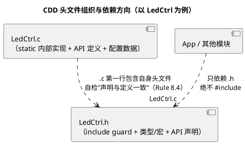

# 01 命名与排版规范

> 一句话定位：命名回答"这个符号是谁的、干什么用、活在哪一层"，排版回答"评审第一眼能不能信"——模块前缀本质上是用手工方式给 C 语言补上了命名空间（namespace），AUTOSAR 从 BSW 到 CDD 全靠这套约定在链接器（linker）层面相安无事，它也是 MISRA-C:2012 第 5 区标识符规则的地基。
> 等级：L2 ｜ 前置：无

## 原理

### 1. 为什么嵌入式 C 必须"分层命名"

1. **链接器视角**：所有 `.o` 文件的全局符号进同一个命名空间，两个模块都定义 `Init()` 就直接撞车。模块前缀 = 廉价的命名空间隔离，直接满足 Rule 5.1/5.8（外部标识符可区分、外部链接唯一）。
2. **评审视角**：看到 `NvM_` 前缀就知道归存储组管、改它要找谁评审；看到 `static` 就知道作用域不出本文件。
3. **工具视角**：AUTOSAR 配置生成工具（如 DaVinci、EB tresos）按前缀做一致性检查；命名混乱的工具生成代码混进来后更难分清"谁的锅"。
4. **MISRA 视角**：标识符一族规则（5.1~5.9：可区分、内层不隐藏外层、不与宏重名、tag/typedef 唯一）靠"前缀分层"天然满足，事后改名的代价远大于一开始起对。

### 2. AUTOSAR 官方命名风格要点

| 对象 | 约定 | 示例 |
|---|---|---|
| 模块名 | 大驼峰缩写，2~8 字符 | `NvM`、`CanIf`、`Dem`、`EcuM` |
| 函数名 | `模块前缀_大驼峰` | `NvM_ReadBlock`、`CanIf_Transmit` |
| 类型名 | `模块_名词Type` | `CanIf_ControllerModeType` |
| 配置类型 | `模块_ConfigType` | `NvM_ConfigType` |
| 基本类型 | 统一 `Std_Types.h`：`uint8/sint8/uint16/.../boolean`，返回值用 `Std_ReturnType`（`E_OK/E_NOT_OK`） | `uint8 cnt;` |
| 常量/宏 | 模块前缀 + 全大写 | `NVM_BLOCK_ID_MAX` |
| 回调函数 | 方向后缀：收到 `...Indication`，发送完成 `...Confirmation` | `CanIf_ControllerModeIndication`、`CanIf_TxConfirmation` |
| 版本信息 | `模块_SW_MAJOR_VERSION` 等三段宏 + `模块_GetVersionInfo` | `NvM_GetVersionInfo` |
| 配置文件 | `模块_Cfg.c`（预编译）、`模块_PBcfg.c`（post-build） | `CanIf_Cfg.c` |

定长类型是 MISRA-C:2012 Dir 4.6（Advisory）的明确建议：**用能体现宽度与符号的 typedef 代替裸 `int/unsigned`**，AUTOSAR 的 `Std_Types.h` 就是这条指令的官方实现。

### 3. 函数动词选择表

| 动词 | 语义（防什么误用） | BSW 实例 |
|---|---|---|
| `Init` / `DeInit` | 初始化 / 反初始化，生命周期边界 | `Can_Init` / `Can_DeInit` |
| `Get` / `Set` | 只读写模块内存中的简单状态，评审者默认"零成本" | `CanIf_GetControllerMode` |
| `Read` / `Write` | 有"搬运"语义：硬件、NVM 块、跨核共享内存 | `NvM_ReadBlock` / `NvM_WriteBlock` |
| `Transmit` | 总线/PDU 发送 | `CanIf_Transmit` |
| `Enable` / `Disable` | 硬件功能使能/关断 | `Adc_EnableHardwareTrigger` |
| `Indication` / `Confirmation` | 回调：数据/状态到达 / 发送完成 | `CanIf_TxConfirmation` |
| `MainFunction` | OS 周期任务入口 | `NvM_MainFunction`、`Com_MainFunctionRx` |
| `GetVersionInfo` | 标准版本查询 | `Det_GetVersionInfo` |

**Get/Set 与 Read/Write 的分界**：Get/Set 只碰内存变量，调用方默认无副作用；涉及硬件访问、阻塞、NVM 块操作等"代价可见"的动作必须用 Read/Write。把 I2C 读传感器叫 `GetXxx()`，评审者会把它当零成本随意调用。

### 4. 变量作用域的辨识约定

| 变量种类 | 命名约定 | 示例 | 相关规则 |
|---|---|---|---|
| 局部变量 | 无前缀、名词 | `brightness`、`idx` | 8.9（收进最小作用域） |
| 文件级静态变量 | `模块前缀_`（可再叠加 `s_`，团队统一） | `LedCtrl_Duty[4]` | 8.7/8.8（static 到位） |
| 全局变量 | `模块前缀_` + 团队 `g_` 约定 | `g_BattVoltage` | 8.4/8.6（声明与唯一定义） |
| 静态函数 | `static` + 模块前缀 | `static void LedCtrl_UpdatePwm(...)` | 8.7/8.8 |

原则：**前缀表达"归属与作用域"，不表达数据类型**（不搞匈牙利记法）——类型信息交给 typedef 和声明，改类型时不用连改名。

### 5. 排版四要素

1. **缩进**：4 空格，全工程禁 Tab（Tab 展开宽度不同是 diff 噩梦）。
2. **大括号**：AUTOSAR 生态常见"函数定义的开括号独占一行，`if/for` 的开括号同行"（Vector 风格），也有团队全 Allman——**团队统一**比风格本身重要，写进 lint/格式化配置里自动化。
3. **行宽**：建议 ≤100 字符（QAC/AUTOSAR 常见 100 或 120），超长换行时参数对齐。
4. **一行一个声明、一条语句**：配合 Rule 8.1（类型显式），`uint8 a, b;` 拆成两行；指针星号贴近变量名 `uint8 *ptr`，避免 `uint8* a, b;` 的经典误导。

### 6. 头文件组织



规则要点：

1. **include guard（包含保护）**：`#ifndef/#define/#endif` 三件套，MISRA Dir 4.10（Required）明确要求；`#pragma once` 是语言扩展（Rule 1.2 不建议），不用。
2. **.h 只放声明**：类型定义、宏、`extern` 函数原型；**绝不**在 .h 里定义变量或函数体（多头包含即多重定义，违反 Rule 8.6）。
3. **绝不 `#include "xxx.c"`**：同一翻译单元（Translation Unit, TU）被包含两次会产生重复定义。
4. **include 顺序**（自上而下）：自身 .h → 编译器抽象/Std_Types → BSW 头 → 本模块其他头 → 其他 CDD 头。`.c` 第一行包含自身 `.h`，让编译器替你检查声明与定义是否一致（Rule 8.4）。

## 代码示例

`LedCtrl.h`（CDD 模块完整骨架，可直接抄）：

```c
#ifndef LEDCTRL_H
#define LEDCTRL_H                     /* include guard：Dir 4.10（Required） */

#include "Std_Types.h"                /* uint8 / boolean / Std_ReturnType */

/* ---------- 版本信息（AUTOSAR 惯例三段宏） ---------- */
#define LEDCTRL_SW_MAJOR_VERSION   (1u)
#define LEDCTRL_SW_MINOR_VERSION   (0u)
#define LEDCTRL_SW_PATCH_VERSION   (2u)

/* ---------- 对外类型：模块前缀 + Type 后缀 ---------- */
typedef enum {
    LEDCTRL_CHANNEL_0 = 0,            /* 通道 0：状态指示灯 */
    LEDCTRL_CHANNEL_1                 /* 通道 1：故障指示灯 */
} LedCtrl_ChannelType;

typedef uint8 LedCtrl_BrightnessType; /* 0~100：占空比百分比 */

#define LEDCTRL_CHANNEL_NUM      (2u)
#define LEDCTRL_BRIGHTNESS_MAX   (100u)

/* ---------- API：模块_动词宾语 ---------- */
extern void LedCtrl_Init(void);
extern void LedCtrl_DeInit(void);
extern void LedCtrl_SetBrightness(LedCtrl_ChannelType Channel,
                                  LedCtrl_BrightnessType Brightness);
extern LedCtrl_BrightnessType LedCtrl_GetBrightness(LedCtrl_ChannelType Channel);
extern void LedCtrl_MainFunction(void);   /* 周期任务入口：10ms */

#endif /* LEDCTRL_H */
```

`LedCtrl.c` 片段（体现命名 + 排版 + 作用域）：

```c
#include "LedCtrl.h"                  /* 第一行：自身头（自检 Rule 8.4） */

/* 文件级静态变量：模块前缀，全工程唯一（Rule 8.8/5.8） */
static LedCtrl_BrightnessType LedCtrl_Brightness[LEDCTRL_CHANNEL_NUM];

/* 静态函数：只被本文件用（Rule 8.7/8.8） */
static void LedCtrl_UpdatePwm(LedCtrl_ChannelType Channel, uint8 Tick);

void LedCtrl_MainFunction(void)
{
    uint8 ch;                         /* 局部变量：无前缀 */
    static uint8 tick = 0u;           /* 只被本函数用：函数内 static（Rule 8.9） */

    tick++;
    for (ch = 0u; ch < LEDCTRL_CHANNEL_NUM; ch++)
    {
        LedCtrl_UpdatePwm((LedCtrl_ChannelType)ch, tick);
    }
}
```

### 《CDD 模块命名速查表》（打印贴工位版）

| 要命名的东西 | 模板 | 示例 |
|---|---|---|
| 模块名 | 大驼峰缩写 | `LedCtrl`、`BattMon` |
| 文件 | `模块.c/.h`，配置 `模块_Cfg.c` | `LedCtrl.h`、`CanIf_Cfg.c` |
| API 函数 | `模块_动词宾语` | `LedCtrl_SetBrightness` |
| 初始化/反初始化 | `模块_Init` / `模块_DeInit` | `LedCtrl_Init` |
| 周期函数 | `模块_MainFunction[_Rx/Tx]` | `LedCtrl_MainFunction` |
| 回调（收/发完成） | `模块_...Indication` / `...Confirmation` | `LedCtrl_TimeoutIndication` |
| 查版本 | `模块_GetVersionInfo` | `LedCtrl_GetVersionInfo` |
| 数据类型 | `模块_名词Type` | `LedCtrl_ChannelType` |
| 配置类型 | `模块_ConfigType` | `LedCtrl_ConfigType` |
| 回调类型 | `模块_用途Type` | `LedCtrl_TimeoutCbkType` |
| 宏/常量 | `模块_全大写` | `LEDCTRL_CHANNEL_NUM` |
| 枚举成员 | `模块_全大写` | `LEDCTRL_CHANNEL_0` |
| 局部变量 | 无前缀名词 | `brightness`、`idx` |
| 文件级静态变量 | `模块_`（或叠 `s_`） | `LedCtrl_Brightness[]` |
| 全局变量 | `模块_` + `g_`（团队约定） | `g_BattVoltage` |
| 静态函数 | `static` + `模块_` | `static LedCtrl_UpdatePwm` |
| 函数指针变量 | `模块_名词Cbk` | `LedCtrl_TimeoutCbk` |
| 错误上报 | 统一走 `Det_ReportError` | `Det_ReportError(...)` |

## 易错点与陷阱

1. **忘加模块前缀**：`ReadBlock()` 一旦与别的模块撞名，链接期才爆，且库链接顺序不同表现不同——这是 5.1/5.8 最常见的现实代价。
2. **Get/Set 滥用于硬件操作**：评审者默认零成本，结果在 1ms 任务里调了个 I2C 读。
3. **只被一个 .c 用的函数没加 `static`**：违反 8.7/8.8，还污染工程符号表。
4. **用 `#pragma once` 代替 guard**：非标准扩展（Rule 1.2），跨工具链行为不一致。
5. **头文件里定义变量/函数**：`static uint8 x;` 写进 .h，每个包含它的 TU 各得一份——状态"复制"且浪费 RAM。
6. **匈牙利记法编码类型**：`ui8Counter` 换 `uint16` 时类型与名字一起骗人；前缀只表达归属/作用域。
7. **宏与函数/变量重名**：宏展开悄悄替换标识符（Rule 5.5），排查极难；宏一律全大写可避让。
8. **回调方向不明**：`LedCtrl_Handler` 分不清是收到还是发完；用 Indication/Confirmation 后缀。
9. **枚举成员不带模块前缀**：`CHANNEL_0` 在两个模块里含义不同却同名，include 顺序决定谁生效。

## 评审清单

- [ ] 所有外部符号（函数/变量/类型/宏）都带模块前缀？
- [ ] 动词符合语义表？Get/Set 没有藏在硬件操作？
- [ ] 只被单文件用的函数/对象都 `static` 了（8.7/8.8）？只被单函数用的对象搬进函数内了（8.9）？
- [ ] 头文件"三无"：无变量定义、无函数体、无人 include `.c`？guard 命名含模块名？
- [ ] `.c` 第一行是自身 `.h`（8.4 自检）？
- [ ] 缩进 4 空格、行宽 ≤100、一行一声明，大括号风格全工程一致？
- [ ] 基本类型全走 `Std_Types`（Dir 4.6），无裸 `int/unsigned`？
- [ ] 回调命名带 Indication/Confirmation 方向后缀？
- [ ] 宏全大写且带模块前缀，与任何标识符不同名（5.5）？

## 面试高频题

**Q1：为什么 AUTOSAR/C 嵌入式代码必须给函数加模块前缀？**
答：C 的全局符号进链接器同一命名空间，两个模块都叫 `Init()` 直接撞名（链接期才爆，且与库顺序有关）。模块前缀等于手工补的 namespace，天然满足 MISRA Rule 5.1/5.8（外部标识符可区分/唯一），也让评审一眼认出归属（`NvM_` 前缀=归存储组评审）。

**Q2：Get/Set 与 Read/Write 的分界是什么？为什么 I2C 读传感器不能叫 `GetXxx()`？**
答：Get/Set 只读写模块内存中的简单状态，评审者默认零成本、无副作用；涉及硬件访问、阻塞、NVM 块搬运等"代价可见"的动作必须用 Read/Write。I2C 读是毫秒级硬件事务，叫 Get 会被误当零成本在 1ms 任务里随意调用。

**Q3：为什么 `.c` 文件第一行要 `#include` 自身的 `.h`？**
答：让编译器替你检查声明与定义的一致性（MISRA Rule 8.4）：若 .h 里的原型与 .c 的定义签名不一致，同一 TU 内先见声明后见定义会直接报错，而不是留给调用方链接期或运行期才发现。

**Q4：`#pragma once` 与 include guard 选哪个？为什么？**
答：选 `#ifndef/#define/#endif` 三件套（MISRA Dir 4.10 Required）。`#pragma once` 是语言扩展（违反 Rule 1.2 对语言扩展的限制），跨工具链/跨文件系统行为不完全一致；标准 guard 虽多三行但可移植、可静态检查。

## 延伸

- [02 MISRA-C规则分类导读](02-MISRA-C规则分类导读.md)：本篇的命名约定对应哪些条目，去分区地图里对号入座。
- [03 高频违规条目解析](03-高频违规条目解析.md)：8.7/8.9 等"命名间接相关"条目的逐条拆解。
- [指针专题](../../1-L1基础/指针专题/README.md)：指针星号书写、`const` 修饰位置的可读性问题。
- [基础语法巩固](../../1-L1基础/基础语法巩固/README.md)：`typedef`、存储类说明符与作用域的语法基础。
