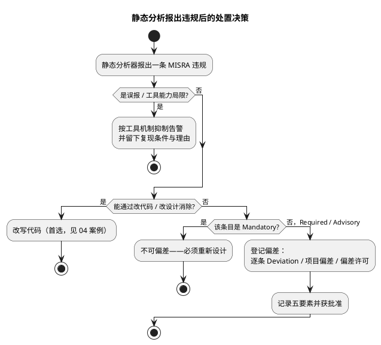

# 02 MISRA-C 规则分类导读

> 一句话定位：MISRA-C:2012 原版有 16 条指令（Directive）+ 143 条规则（Rule）共 159 条——不背条目，先建地图：三级分类决定你的偏差权限，编号分区决定去哪查，工具链决定谁替你盯着。
> 等级：L2 ｜ 前置：[01-命名与排版规范](01-命名与排版规范.md)

## 原理

### 1. 标准与版本演进

| 版本 | 年份 | 变化 |
|---|---|---|
| MISRA C:2012 原版 | 2013 | 16 指令 + 143 规则，支持 C90/C99 |
| Amendment 1 | 2016 | 新增 14 条规则，并做技术澄清 |
| Amendment 2 | 2020 | 追加少量安全强化条目（外部输入校验、浮点 NaN、多线程数据竞争/死锁等主题） |
| Amendment 3 | 2023 | 与 MISRA Compliance:2020 对齐，部分条目重新分级、编号重排，出版为 MISRA C:2023 |

本知识库引用条目号以 **MISRA-C:2012（含 Amendments）** 为准；A3 重排过编号，翻新手册时注意新旧对照。

### 2. 三级分类：决定"你能不能偏差"

| 级别 | 中文 | 能否偏差 | 偏差条件 | 示例 |
|---|---|---|---|---|
| Mandatory | 强制 | **不能** | 偏离即不合规，只能重新设计 | Rule 9.1（自动变量未初始化不读） |
| Required | 必须 | 可以 | 必须走正式偏差流程（理由+风险+缓解+批准） | Rule 10.3、Rule 21.3 |
| Advisory | 建议 | 可以 | 建议同样记录在案 | Rule 15.5（单出口）、Rule 8.7 |

注意：Advisory 的"建议"不是"可忽略"——功能安全审计（ISO 26262 审核）时，Advisory 未处理又无偏差记录，照样算 finding。

### 3. 偏差（Deviation）体系

MISRA Compliance:2020 定义了三层偏差机制：

| 机制 | 适用范围 | 典型场景 |
|---|---|---|
| Deviation（逐条偏差） | 某一处具体代码 | 某个寄存器地址转换 |
| Project Deviation（项目偏差） | 整个项目内同类情况统一适用 | 项目内所有 `(void)` 显式忽略返回值 |
| Deviation Permit（偏差许可） | 权威方预先颁发，可跨项目复用 | 汇编隔离、寄存器访问层 |

偏差记录五要素：**条目号、触发场景、技术理由、风险与缓解措施、批准人与日期**。有记录、有批准才叫偏差；没有就叫违规（violation）。



### 4. 规则编号分区地图

先记"区号 → 主题"，再记条目。**指令（Dir）与规则（Rule）是两套编号**，工具报告里分别标注。

**指令区（Directives，流程/设计/构建类要求）**

| 区段 | 主题 | 代表条目 |
|---|---|---|
| Dir 1.1 | 实现定义行为须文档化 | Dir 1.1（Required） |
| Dir 2.1 | 编译零错误 | 所有源文件不得带错编译 |
| Dir 3.1 | 需求可追溯 | 代码须能追溯到文档需求 |
| Dir 4.1~4.15 | 代码设计 | Dir 4.6 定长 typedef、Dir 4.7 返回错误须检查、Dir 4.10 include guard、Dir 4.12 禁动态内存、Dir 4.14 外部输入须校验 |
| Dir 5.1~5.2 | 并发 | 数据竞争 / 死锁 |

指令大多**无法由工具自动判定**，靠流程、评审和文档保证——这是"工具零告警 ≠ 合规"的根源。

**规则区（Rules，可静态检查）**

| 区段 | 主题 | 一句话 |
|---|---|---|
| Rule 1.1~1.3 | 环境 | 限标准 C 语法、不建议语言扩展、禁未定义行为（1.3 是总闸） |
| Rule 2.1~2.8 | 未使用代码 | 2.1 不可达代码、2.2 死代码（均 Required）；2.5 未用宏、2.7 未用参数 |
| Rule 3.1~3.2 | 注释 | 注释里不得出现 `/*`、`//`；`//` 注释禁行拼接 |
| Rule 4.1~4.2 | 字符集与词法 | 八进制/十六进制转义须终结；三字母组不建议 |
| Rule 5.1~5.9 | 标识符 | 可区分性、内层不隐藏外层、宏不与标识符重名、tag/typedef 唯一（命名规范的地基） |
| Rule 6.1~6.3 | 类型（位域） | 位域类型限定、单比特位域禁有符号、位域禁入 union |
| Rule 7.1~7.4 | 常量 | 八进制常量禁用、无符号常量加 `u/U` 后缀、禁小写 `l` 后缀、字符串字面量只能给 `const char*` |
| Rule 8.1~8.14 | 声明与定义 | 类型显式（8.1）、原型完整（8.2）、声明一致（8.3）、外部链接唯一（8.4/8.5/8.6）、8.7 外部链接最小化、8.8 内部链接用 `static`、8.9 块作用域、8.13 尽量 `const` |
| Rule 9.1~9.5 | 初始化 | 9.1 自动变量未赋值不读（**Mandatory**）、聚合类型花括号初始化 |
| Rule 10.1~10.8 | 基本类型模型 | 隐式转换的总闸：10.1 操作数类别恰当、10.3 禁窄化/跨类别赋值、10.4 双操作数类别一致、10.6/10.8 复合表达式转换限制 |
| Rule 11.1~11.9 | 指针类型转换 | 11.3 禁跨对象类型指针转换、11.4 指针↔整数不建议、11.5 `void*` 收窄不建议、11.6 `void*`↔算术禁、11.8 禁去 `const/volatile`、11.9 `NULL` 唯一空指针常量 |
| Rule 12.1~12.5 | 表达式 | 12.1 运算符优先级显式加括号、12.2 移位右操作数范围 |
| Rule 13.1~13.6 | 副作用 | 13.5 逻辑运算右操作数禁持久副作用 |
| Rule 14.1~14.4 | 控制表达式 | 14.2 for 循环良构、14.3 控制表达式不得恒定、14.4 条件须为本质布尔 |
| Rule 15.1~15.7 | 控制流 | 15.1 不建议 goto、15.2/15.3 goto 向前且同块、15.5 单出口（Advisory）、15.6 条件/循环体必须花括号、15.7 else-if 链须 else 收尾 |
| Rule 16.1~16.7 | switch | 16.1 良构、16.3 每分支须 break、16.4 必须 default、16.6 至少两个分支 |
| Rule 17.1~17.8 | 函数 | 17.1 禁 `stdarg.h`、17.2 禁递归、17.7 返回值必须使用、17.8 参数不建议修改 |
| Rule 18.1~18.8 | 指针与数组 | 18.1 指针算术不得越界、18.2 指针相减限同数组、18.4 指针算术建议改下标、18.6 禁悬垂地址、18.8 禁变长数组 VLA |
| Rule 19.1~19.2 | 存储重叠 | 19.1 重叠对象赋值禁（**Mandatory**）、19.2 不建议 union |
| Rule 20.x | 预处理 | `#include` 位置约束（20.1）、头文件名特殊字符限制、宏重定义限制 |
| Rule 21.x | 标准库 | 21.1/21.2 保留标识符不可占用、21.3 禁 malloc 族、21.6 禁 stdio |
| Rule 22.x | 资源 | 资源申请/释放的配对与序列要求，裸机工程少触发 |

### 5. 工具链角色分工

| 角色 | 覆盖范围 | 局限 |
|---|---|---|
| 编译器告警（`-Wall -Wextra`） | 语法/未使用/隐式声明的第一道防线 | 非合规工具，只看本 TU |
| 静态分析器（QAC、Polyspace、Parasoft、Klocwork 等） | 绝大多数 Rule；官方按**可判定性（Decidable）**标注——Decidable 可全自动查，Undecidable 只能部分覆盖 | 指令区基本无能为力；跨 TU / 依赖路径分析的条目（如 8.7）需全工程配置正确 |
| 评审与流程 | 指令区、Undecidable 条目、偏差合理性 | 靠清单与记录 |
| CI 门禁 | 增量代码零新违规、偏差登记完整性 | 只管"账"，不管"对" |

## 代码示例

偏差在代码与文档中的落地写法（注释语法各工具不同，以下为通用示意）：

```c
/* ① 代码处逐条偏差：写清五要素，评审可追溯 */
/* MISRA-C:2012 Rule 11.4 Deviation — DP-REG-001
 * 场景：内存映射寄存器必须整数转指针，无合规替代实现
 * 缓解：仅允许出现在 MCAL 层 RegMap.c；地址来源 TC377 手册 Rev 2.1 表 7-3
 * 批准：安全经理 2025-06-01，复审周期：每季度基线审计
 */
volatile uint32 *const Dev_StatusRegPtr =
    (volatile uint32 *)DEV_STATUS_REG_ADDR;      /* 仅此一处走 DP-REG-001 */

/* ② 项目偏差：同类情况项目内统一批准，代码处只引用编号 */
(void)Det_ReportError(STORAGE_SID, 0x01u);        /* PD-VoidCast-01：显式忽略返回值 */
```

```c
/* ③ 无偏差时的"消警不改代码"反例：下面这种裸 (void) 压制 17.7 是合规写法，
 *    但如果掩盖了 Dir 4.7（错误信息须检查）的本意，评审应拒绝 */
Std_ReturnType ret = NvM_ReadBlock(NVM_BLOCK_LED, &Led_Cfg);
if (ret != E_OK)
{
    (void)Det_ReportError(NVM_SID, 0x02u);        /* 错误路径有处理，才是完整闭环 */
}
```

## 易错点与陷阱

1. **Advisory 当"可忽略"**：审计照样查，未处理且无偏差记录即 finding。
2. **Mandatory 试图走偏差**：三级分类的定义决定了 Mandatory 无偏差通道，只能重新设计。
3. **有注释没记录**：代码里写了理由但没有批准人和登记台账，属于违规而非偏差。
4. **工具零告警 ≠ MISRA 合规**：指令区、Undecidable 条目、被抑制的告警都需要流程证据；合规是流程结论，不是工具截图。
5. **只对子集文件跑工具**：合规范围声明（哪些目录、哪些工具版本、哪个标准版本）必须与实际扫描范围一致，否则报告自相矛盾。
6. **三种偏差机制混用**：Deviation Permit 跨项目复用、Project Deviation 项目内统一、逐条 Deviation 点对点——适用层级写错，审计时全部重做。
7. **标准升级后旧偏差失配**：A3（MISRA C:2023）重排了编号，升级工具前先做新旧条目映射表，否则历史偏差登记集体"失联"。
8. **把 MISRA 当风格指南**：它防的是缺陷类别（未定义行为、隐式转换、失控指针），排版风格只是顺带约束。

## 工具视角

1. **建基线三步**：全条目（M/R/A）启用静态分析器 → 存量违规逐条登记（改写或偏差）→ 建立门禁：新合入代码零新违规，存量按台账收敛。
2. **报告产物**：维护一份 Guideline Compliance Summary（条目 × 状态：合规/偏差/违规），作为功能安全审计的交付物。
3. **告警分级**：Mandatory 违规设为 CI 失败项；Required/Advisory 违规进看板按期清账。
4. **编译器联动**：`-Wall -Wextra -Werror` 独立于 MISRA 工具常开，语言类问题在编译期就拦截。

## 面试高频题

**Q1：MISRA-C 的 Mandatory / Required / Advisory 三级分类分别是什么？哪些可以偏差？**
答：Mandatory（强制）不能偏差，偏离即不合规只能重新设计（如 Rule 9.1 未初始化不读）；Required（必须）可经正式偏差流程偏离（理由+风险+缓解+批准），如 Rule 10.3；Advisory（建议）也可偏差且建议记录在案。注意 Advisory 不等于可忽略——ISO 26262 审计时未处理又无偏差记录照样算 finding。

**Q2：什么是偏差（Deviation）？合规的偏差要满足什么条件？**
答：偏差是对某条规则在特定场景下经论证的有据豁免，分三层：逐条 Deviation（单点）、Project Deviation（项目内同类统一）、Deviation Permit（权威方预颁跨项目复用）。合规偏差必须记录五要素——条目号、触发场景、技术理由、风险与缓解措施、批准人与日期；有记录有批准才叫偏差，否则就是违规。

**Q3：为什么"静态分析工具零告警"不等于 MISRA 合规？**
答：①指令区（Directives）大多无法由工具自动判定，靠流程/评审/文档保证；②部分规则标记为 Undecidable，工具只能部分覆盖；③被抑制的告警与偏差登记需要台账证据。合规是流程结论，不是工具截图——审计要的是 Guideline Compliance Summary 与偏差记录链。

**Q4：Rule 与 Directive 两套编号有什么区别？举例各自管什么。**
答：Directive 管流程/设计/构建类要求（Dir 4.6 定长 typedef、Dir 4.10 include guard、Dir 4.12 禁动态内存），多数不可自动检查；Rule 是可静态检查的代码级规则，按区号分主题（Rule 10.x 隐式转换、Rule 11.x 指针转换、Rule 16.x switch 良构、Rule 21.x 标准库）。工具报告里两套编号分别标注，别混为一谈。

## 延伸

- [03 高频违规条目解析](03-高频违规条目解析.md)：地图里项目上最常"踩"的 14 组条目逐条拆解。
- [04 合规改写案例](04-合规改写案例.md)：消不掉才偏差——四个"先改代码"的完整案例。
- [内存管理：malloc 原理与碎片](../内存管理/04-malloc原理与碎片.md)：Rule 21.3 / Dir 4.12 禁动态内存的工程原因。
