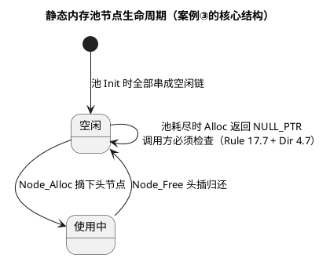

# 04 合规改写案例

> 一句话定位：消警的正确顺序是"先改设计 → 再改代码 → 实在不行才偏差"——四个完整 before/after 案例把 03 篇的条目串成真实重构：union 改位操作、`void*` 改类型安全、malloc 改静态池、多出口改单出口。
> 等级：L2 ｜ 前置：[03-高频违规条目解析](03-高频违规条目解析.md)

## 原理

静态分析报违规后，处置优先级（与 02 篇的决策图一致）：

1. **改设计**：类型双关、`void*` 泛型、动态分配，多数是设计期决策，源头改掉条目自然消失。
2. **改代码**：显式 cast、加花括号、补 `u` 后缀——机械但有效，工具可自动插入。
3. **才偏差**：寄存器地址转换这类无替代实现的，收敛到单点后正式登记偏差许可。



## 代码示例

### 案例①：union 读硬件寄存器 → 显式位操作

**before（违规点已标注）**：

```c
/* 位域 + union 直接映射状态寄存器 */
typedef union                       /* Rule 19.2：不建议使用 union */
{
    uint32 word;
    struct
    {
        uint32 mode : 3;            /* 位域布局实现定义，工具链间不保证一致 */
        uint32 err  : 1;
        uint32 busy : 1;
        uint32 rsv  : 27;
    } bits;
} DevStatusRegType;

#define DEV_STATUS_REG  (*(volatile DevStatusRegType *)0xF0180200u)  /* Rule 11.4 */

uint8 Dev_GetMode(void)
{
    return (uint8)DEV_STATUS_REG.bits.mode;   /* 整字读 + 位域提取，副作用不可控 */
}
```

**after**：

```c
/* 显式掩码/移位：位定义与编译器、字节序无关 */
#define DEV_STATUS_REG_ADDR   (0xF0180200u)
#define DEV_STATUS_MODE_MSK   (0x00000007u)   /* bit0~2 */
#define DEV_STATUS_ERR_MSK    (0x00000008u)   /* bit3 */
#define DEV_STATUS_BUSY_MSK   (0x00000010u)   /* bit4 */

/* Rule 11.4 无法消除，收敛为模块内单点偏差（Dev_RegMap.c 走 DP-REG-001） */
static volatile uint32 *const Dev_StatusRegPtr =
    (volatile uint32 *)DEV_STATUS_REG_ADDR;

uint8 Dev_GetMode(void)
{
    uint32 regVal = *Dev_StatusRegPtr;                  /* 一次显式读 */
    return (uint8)(regVal & DEV_STATUS_MODE_MSK);       /* Rule 10.3：显式窄化 */
}

boolean Dev_IsBusy(void)
{
    uint32 regVal = *Dev_StatusRegPtr;
    return (((regVal & DEV_STATUS_BUSY_MSK) >> 4u) != 0u) ? (boolean)TRUE
                                                          : (boolean)FALSE;
}
```

| 规则 | before | after |
|---|---|---|
| Rule 19.2（union） | 违规 | **消除** |
| 位域布局风险（见 [位域 vs 位操作](../../1-L1基础/位操作/02-位域vs位操作.md)） | 存在 | 消除（位定义显式） |
| Rule 11.4（整数→指针） | 每个寄存器一处 | **收敛到单点 + 偏差许可** |
| Rule 10.3（窄化） | 隐式 | 显式 cast |

### 案例②：`void*` 通用接口 → 静态类型安全池

**before**：

```c
/* 通用缓冲池：返回 void*，调用点必然收窄 */
typedef struct { uint8 mem[64u]; uint16 used; } PoolType;

extern void  Pool_Init(PoolType *p);
extern void *Pool_Alloc(PoolType *p, uint16 size);

typedef struct { uint8 freqHz; uint8 dutyPct; } PwmCfgType;

PwmCfgType *Pwm_GetCfg(void)
{
    PoolType pool;
    Pool_Init(&pool);
    return (PwmCfgType *)Pool_Alloc(&pool, sizeof(PwmCfgType));  /* Rule 11.5 */
    /* 另外致命伤：返回了局部变量的内存 */
}
```

**after**：

```c
/* 每个池固定一种元素类型，接口零指针转换 */
typedef struct { uint8 freqHz; uint8 dutyPct; } PwmCfgType;

#define PWM_CFG_POOL_SIZE  (4u)
typedef struct
{
    PwmCfgType items[PWM_CFG_POOL_SIZE];
    boolean    used[PWM_CFG_POOL_SIZE];
} PwmCfgPoolType;

static PwmCfgPoolType Pwm_CfgPool;            /* Rule 8.7/8.8：模块内部 */

static PwmCfgType *Pwm_PoolAlloc(void)        /* Rule 8.7：static 函数 */
{
    PwmCfgType *result = NULL_PTR;
    uint8 i;

    for (i = 0u; i < PWM_CFG_POOL_SIZE; i++)
    {
        if ((boolean)FALSE == Pwm_CfgPool.used[i])
        {
            Pwm_CfgPool.used[i] = (boolean)TRUE;
            result = &Pwm_CfgPool.items[i];  /* 无任何指针转换 */
            break;                            /* Rule 15.4：唯一出口用 break */
        }
    }
    return result;                            /* 可能为 NULL_PTR，调用方必查（17.7） */
}
```

| 规则 | before | after |
|---|---|---|
| Rule 11.5（`void*` 收窄） | 违规 | **消除**（类型即接口） |
| Rule 11.3（跨类型转换） | 潜在 | 消除 |
| Rule 18.6（悬垂地址） | 返回局部池内存 | 消除（池为静态存储） |
| Rule 8.7/8.8 | —— | 顺带满足 |

标准 API（如 NvM 的 RAM 块指针就是 `void*`）改不了源头时：调用点集中在一个胶水文件里转换，配逐条偏差。

### 案例③：malloc 建链表 → 静态池 + 空闲链

**before**：

```c
typedef struct NodeTag { uint16 id; struct NodeTag *next; } NodeType;

NodeType *List_Insert(NodeType *head, uint16 id)
{
    NodeType *n = (NodeType *)malloc(sizeof(NodeType));   /* Rule 21.3 + Dir 4.12 */
    if (NULL == n)                                        /* Rule 11.9 + 14.4 */
    {
        return head;                                      /* Rule 15.5：多出口之一 */
    }
    n->id = id;
    n->next = head;
    return n;
}
/* 无人 free、失败路径不可测、堆碎片随运行时长增长 */
```

**after**：

```c
#define NODE_POOL_SIZE  (16u)
typedef struct NodeTag { uint16 id; struct NodeTag *next; } NodeType;

static NodeType  NodePool[NODE_POOL_SIZE];   /* 静态池：替代堆 */
static NodeType *Node_FreeList;              /* 空闲链表头 */

void Node_InitPool(void)
{
    uint16 i;
    for (i = 0u; i < (NODE_POOL_SIZE - 1u); i++)
    {
        NodePool[i].next = &NodePool[i + 1u];   /* 串联空闲链，边界清晰（18.1 可证明） */
        NodePool[i].id = 0u;
    }
    NodePool[NODE_POOL_SIZE - 1u].next = NULL_PTR;
    NodePool[NODE_POOL_SIZE - 1u].id = 0u;
    Node_FreeList = &NodePool[0];
}

NodeType *Node_Alloc(void)
{
    NodeType *n = Node_FreeList;
    if (n != NULL_PTR)                       /* Rule 14.4：显式与 NULL_PTR 比较 */
    {
        Node_FreeList = n->next;             /* 摘下头节点 */
        n->next = NULL_PTR;
    }
    return n;                                /* 池耗尽返回 NULL_PTR，调用方必查（17.7） */
}

void Node_Free(NodeType *n)
{
    /* 归还前校验指针确实指向池内（同一数组内比较，Rule 18.3 允许） */
    if ((n >= &NodePool[0]) && (n <= &NodePool[NODE_POOL_SIZE - 1u]))
    {
        n->next = Node_FreeList;             /* 头插回空闲链 */
        Node_FreeList = n;
    }
}
```

| 规则 | before | after |
|---|---|---|
| Rule 21.3 + Dir 4.12（动态内存） | 违规 | **消除**（编译期确定内存） |
| Rule 17.7（返回值/判空） | 失败路径弱 | 池耗尽显式返回 `NULL_PTR` |
| Rule 15.5（单出口） | 多出口 | 单出口 |
| 非功能收益 | 碎片、时序抖动 | 零碎片、O(1) 分配，栈/池大小可静态分析 |

### 案例④：多出口复杂函数 → 单出口重构

**before**：

```c
Std_ReturnType Storage_Save(const uint8 *data, uint8 len)
{
    if (NULL_PTR == data)          /* 检查 1：提前退出 */
    {
        return E_NOT_OK;
    }
    if (len > 64u)                 /* 检查 2：提前退出 */
    {
        return E_NOT_OK;
    }
    if (Storage_Busy())            /* Rule 14.4：整数/布尔当条件；检查 3：提前退出 */
    {
        return E_NOT_OK;
    }
    return Storage_WriteRaw(data, len);   /* Rule 15.5：四个出口，三处无诊断 */
}
```

**after**：

```c
Std_ReturnType Storage_Save(const uint8 *data, uint8 len)
{
    Std_ReturnType ret = E_NOT_OK;
    boolean busy = Storage_Busy();            /* 副作用先算一次，条件保持纯净 */

    if (NULL_PTR == data)
    {
        (void)Det_ReportError(STORAGE_SID, 0x01u);   /* 错误路径可观测 */
    }
    else if (len > 64u)
    {
        (void)Det_ReportError(STORAGE_SID, 0x02u);
    }
    else if ((boolean)TRUE == busy)
    {
        ret = E_NOT_OK;                        /* 忙：本周期放弃，由调度重试 */
    }
    else
    {
        ret = Storage_WriteRaw(data, len);     /* Rule 17.7：返回值必用 */
    }
    return ret;                                /* Rule 15.5：单一出口 */
}
```

| 规则 | before | after |
|---|---|---|
| Rule 15.5（单出口，Advisory） | 4 个出口 | **1 个出口** |
| Rule 14.4（条件本质布尔） | `if (Storage_Busy())` | `(boolean)TRUE == busy` |
| Rule 15.6/15.7（花括号、else 收尾） | 部分缺失 | 完整链 |
| 可维护性 | 每加检查加一个 return | 检查即 else-if 分支，错误路径带 DET 上报 |

注意：if-else-if 链层级超过三层时可读性开始下降，届时优先拆分函数或引入状态变量，而不是继续堆分支。

## 易错点与陷阱

1. **改写只求消警**：案例①里 union 换位操作后仍要检查读寄存器是否带副作用（RC/W1C），位操作不豁免硬件语义。
2. **静态池不判池耗尽**：`Node_Alloc` 返回 `NULL_PTR` 后调用方必须检查（17.7/Dir 4.7），否则把堆时代的问题原样搬进池时代。
3. **池指针校验漏边界**：`Node_Free` 不校验指针是否属于池，外部野指针一插就毁链——归还前先做范围校验。
4. **单出口重构引入深层嵌套**：else-if 超过三层就拆函数，"为合规牺牲可读"是本末倒置。
5. **案例②胶水文件变成垃圾场**：`void*` 转换集中的文件要有命名约定与偏差编号对照，定期评审条目不增长。
6. **忘记更新偏差台账**：案例①消除 union 后，原 19.2 的逐条偏差要同步关闭，否则台账与代码失配，审计时说不清。

## 工具视角

1. **改写后全量重跑**：确认目标条目清零，同时盯住关联条目（改 10.3 常带出 10.4，改 11.3 常带出 10.3）。
2. **基线 diff 审查**：把"消警数 - 新增数"作为 PR 描述字段，负收益的改写打回。
3. **偏差对账**：每轮基线审计时核对——代码里的偏差注释、工具抑制配置、GCS 台账三者数量一致。
4. **单元测试兜底**：静态池（案例③）补池耗尽、重复释放、越界归还三个用例，这些是静态工具证明不了的行为属性。

## 面试高频题

**Q1：静态分析报出 MISRA 违规后的正确处置顺序是什么？**
答：三级优先——先改设计（类型双关、void* 泛型、动态分配多是设计期决策，源头改掉条目自然消失）；再改代码（显式 cast、加花括号、补 u 后缀，工具可自动插入）；实在无替代实现才偏差（如寄存器地址转换），且先收敛到单点再登记偏差许可。

**Q2：用 union+位域映射硬件寄存器有哪些问题？改法是什么？**
答：违反 Rule 19.2（不建议 union）且位域布局实现定义——bit 排列在工具链间不保证一致，跨编译器/字节序即错；还叠加 11.4。改法：整字读寄存器后用显式掩码+移位提取位段（`(reg & MODE_MSK) >> 0`），位定义与编译器无关。注意改写后仍要遵守硬件语义（RC/W1C 寄存器的读副作用）。

**Q3：禁了 malloc（Rule 21.3），动态需求怎么满足？静态池要注意什么？**
答：用静态内存池：编译期定容的数组+空闲链，Alloc 摘头节点、Free 头插归还，确定性且无碎片。三个必须：调用方必须检查返回 NULL_PTR（池耗尽，Rule 17.7+Dir 4.7）；Free 前校验指针属于池（防野指针毁链）；补池耗尽、重复释放、越界归还三个单测用例——这些行为属性静态工具证明不了。

**Q4：多出口改单出口的重构，什么时候应该停手？**
答：单出口（Rule 15.5，Advisory）的价值是便于资源清理与路径追踪，但当 else-if 嵌套超过三层时"为合规牺牲可读"本末倒置——应停手改用"提前计算条件变量 + else-if 扁平化"，实在不行拆函数；也可按 03 篇做法对 15.5 登记项目偏差整层处理。

## 延伸

- [03 高频违规条目解析](03-高频违规条目解析.md)：四个案例涉及条目的逐条详解。
- [位操作：位域 vs 位操作](../../1-L1基础/位操作/02-位域vs位操作.md)：案例①位域布局风险的完整背景。
- [内存管理：malloc 原理与碎片](../内存管理/04-malloc原理与碎片.md)：案例③静态池替代堆的工程论证。
- [数据结构：链表](../数据结构与算法-C实现/02-链表.md)：空闲链的头插/摘取手法。
- [寄存器编程：结构体映射寄存器](../寄存器编程/02-结构体映射寄存器.md)：厂商 SDK 如何整层处理 11.4。
