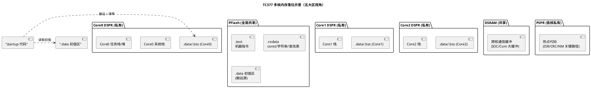

# 01 五大内存区

> 一句话定位：把一个 C 程序"摊开"成 .text/.rodata/.data/.bss/栈/堆六块，搞清每块住在 Flash 还是 RAM、由谁初始化、谁在管——map 文件与 startup 代码就不再是黑盒。
> 等级：L2 ｜ 前置：[01-关键字与存储类](../../1-L1基础/基础语法巩固/01-关键字与存储类.md)

## 原理

### 1. 六块内存的职责与栖息地

C 程序在目标机上的存储不是"一锅粥"，链接器（Linker）按段（section）把符号归位到不同的物理介质。五大内存区（外加常被并入的栈/堆，习惯称六块）职责如下：

| 段名 | 内容 | 介质 | 可写 | 初始化者 |
|---|---|---|---|---|
| `.text` | 机器指令 | Flash/ROM | 否 | 烧写工具（编程器） |
| `.rodata` | `const` 全局/静态、字符串字面量、查找表 | Flash/ROM | 否 | 烧写工具 |
| `.data` | 已初始化且初值非 0 的全局/静态 | RAM（初值存 Flash） | 是 | startup 代码从 Flash 搬运 |
| `.bss` | 未初始化或初值为 0 的全局/静态 | RAM | 是 | startup 代码清零 |
| 栈（stack） | 函数栈帧：局部变量、寄存器保存、参数 | RAM | 是 | 编译器生成的 prologue/epilogue |
| 堆（heap） | `malloc/free` 动态分配 | RAM | 是 | C 运行库或用户 allocator |

记忆要点：**只有 `.data` 同时占 ROM 和 RAM**——ROM 存初值，RAM 存运行副本；`.bss` 不占 ROM（全 0，没必要存）；`.text/.rodata` 只占 ROM；栈/堆只占 RAM。这条直接决定 ECU 选型时的 Flash/RAM 容量估算。

### 2. startup 代码到底做了什么

复位（Reset）后、进入 `main()` 之前，启动代码（startup code，如 Tasking 的 `__cstart`、GCC 的 `_start`/`Reset_Handler`）至少做三件与内存相关的事：

1. **初始化栈指针**：TriCore 写 `SP` 寄存器（指向各核 DSPR 顶端），Cortex-M 写 `MSP`（主栈）。
2. **搬运 `.data`**：遍历链接器生成的 copy table（散列加载表 scatter table），把 `.data` 的初值从 Flash 复制到 RAM。
3. **清零 `.bss`**：遍历 zero-fill table，把 `.bss` 区整块置 0。

伪代码骨架（与平台无关）：

```c
void Reset_Handler(void) {
    /* 1. 栈指针由链接脚本里的初始值或硬件自动加载 */
    /* 2. 搬运 .data：从 __data_load（Flash）到 __data_start（RAM） */
    for (uint32 *src = &__data_load, *dst = &__data_start; dst < &__data_end; ) {
        *dst++ = *src++;
    }
    /* 3. 清零 .bss */
    for (uint32 *dst = &__bss_start; dst < &__bss_end; ) {
        *dst++ = 0u;
    }
    main();
}
```

`__data_load`、`__data_start` 这些符号由链接脚本（Tasking 的 `.lsl`、GCC 的 `.ld`）定义，是 map 文件里能看到的关键锚点。

### 3. 在 TC377 与 S32K 上的落位

**英飞凌 TC377（TriCore TC1.6P，三核 Core0/1/2）** 内存介质丰富，五大区分布有讲究：

- **PFlash（Program Flash，6 MB，全局共享）**：放 `.text`、`.rodata`、`.data` 初值。三核共享同一片 PFlash，取指通过 PCache 加速。
- **DSRAM（Data SRAM，全局共享区，约 720 KB）**：放跨核通信缓冲（如 IOC 邮箱）、共享的 NvM 缓冲、Com 层大缓冲。
- **DSPR（Data Scratch Pad RAM，每核私有，如 Core0 240 KB）**：放该核的 `.data/.bss`、该核系统栈、该核任务栈、堆。**这是多核内存落位的核心：各核数据天然隔离在各自 DSPR，互不踩踏。**
- **PSPR（Program Scratch Pad RAM，每核私有，32 KB）**：可放热点代码段（如 ISR、CRC 校验、NM 收发关键路径），避开 PFlash 取指延迟。需在链接脚本显式 `>> PSPR` 或用 MemMap 指定。
- **CSA（Context Save Area，上下文保存区）**：TriCore 硬件上下文切换专用，位于 DSPR，由 OS 启动时初始化链表。

**NXP S32K（Cortex-M4/M7，单核或 S32K3 多核）** 介质简单：

- **Flash**：`.text`、`.rodata`、`.data` 初值。Cortex-M 支持 XIP（eXecute In Place），直接在 Flash 取指。
- **SRAM**：`.data`、`.bss`、栈（MSP 主栈 + PSP 进程栈）、堆。多核 S32K3 通过硬件分区（SRAM 区分 core0/core1 区域）+ MPU 隔离。

两者关键差异：TC377 有"私有代码 RAM（PSPR）+ 私有数据 RAM（DSPR）"的显式多核划分；S32K 只有统一 SRAM，多核隔离靠地址分区 + MPU，软件感知弱一些。

### 4. map 文件视角看各区大小

map 文件是排查"RAM 用爆了""Flash 不够"的第一现场。两类编译器典型字段：

**Tasking（TC377）map**：列出每段的 `Size`、`VMA`（运行地址）、`LMA`（加载地址）。关注 `D SRAM`/`PSPR`/`DSPR` 的占用百分比，以及 `.data` 的 `LMA != VMA`（说明有搬运）。

**GCC（S32K，arm-none-eabi）map**：

```
.text   0x00000000    0x12340
.rodata 0x00012340     0x2000
.data   0x20000000     0x800  load address 0x00014340
.bss    0x20000800     0x1000
```

`.data` 行的 `load address` 就是它在 Flash 的初值位置。日常排查三件事：
1. `.bss` 是否意外包含大数组（如 `static uint8 log_buf[65536];`）——本该放堆或 NvM 缓冲却落了 `.bss`，开机即占死 RAM。
2. `.data` 是否过大——大量带初值的全局表（如 DID 表）该考虑挪到 `.rodata`（`const`）。
3. 栈/堆预留是否被启动脚本写死，导致工程一加任务栈就溢出。



## 代码示例

```c
#include "Std_Types.h"

/* --- 落 .rodata：const 全局，只读查找表 --- */
static const uint8 CanIdLookup[16] = {0x10u, 0x20u, 0x30u, 0x40u,
                                       0x50u, 0x60u, 0x70u, 0x80u,
                                       0x90u, 0xA0u, 0xB0u, 0xC0u,
                                       0xD0u, 0xE0u, 0xF0u, 0x00u};

/* --- 落 .data：初值非 0 的全局，占 RAM + Flash 双份 --- */
static uint16 RxCounter_g = 100u;       /* 接收计数器，带初值 */

/* --- 落 .bss：未初始化全局，只占 RAM，启动时清零 --- */
static uint8  TxBuf[64];                /* CAN 发送缓冲 */
static uint32 ErrorFlag;                /* 默认 0 */

/* --- 字符串字面量落 .rodata --- */
const char *GetVersion(void)
{
    return "BSW_R1.04";                 /* 字面量本身在 Flash */
}

/* --- 局部变量落栈 --- */
void ComputeChecksum(const uint8 *data, uint32 len, uint8 *out)
{
    uint32 i;                           /* 栈上 */
    uint8  sum = 0u;                    /* 栈上 */
    for (i = 0u; i < len; i++)
    {
        sum = (uint8)(sum + data[i]);
    }
    *out = sum;
}
```

经验：AUTOSAR 工程里 `.bss` 大头通常是 NvM 的 RAM block、Com 层的 I-PDU 缓冲、Dem 的事件缓冲；`.data` 应尽量小——把"带初值的全局表"改成 `const` 进 `.rodata` 是最划算的 RAM 优化。

## 易错点与陷阱

1. **把大数组带初值声明成全局可写**：`uint8 cal_table[1024] = {1,2,3,...};` 落 `.data`，同时吃 1 KB Flash + 1 KB RAM。若只读，加 `const` 进 `.rodata`，省 1 KB RAM。
2. **以为 `static uint8 buf[N];` 不占空间**：它进 `.bss`，占 N 字节 RAM，只是不占 Flash。
3. **栈和堆的边界**：链接脚本里栈顶和堆底相邻，栈向下长、堆向上长，相撞就互相踩——ECU 上几乎不用堆，主因就是这里。
4. **`.data` 搬运失败**：自定义 startup 漏掉某段，导致全局变量初值是垃圾。现象是"上电瞬间变量值不对，复位后正常"——典型 startup 拷贝表不全。
5. **多核工程把数据落错核**：Core1 的任务访问 Core0 的全局变量，没走 IOC 缓冲，缓存一致性（PFlash/DSPR 的 cache 行为）导致读到旧值。需在链接脚本里按核切段。

## 面试高频题

**Q1：`.data` 和 `.bss` 的区别？为什么 `.bss` 不占 Flash？**
答：`.data` 是初值非 0 的全局/静态，初值必须存 Flash，启动时搬运到 RAM；`.bss` 是初值为 0 的全局/静态，启动时整块清零即可，无需在 Flash 存一堆 0，所以不占 Flash。

**Q2：一个全局变量 `int x = 5;` 在内存里占用几处？分别在哪？**
答：两处。Flash 存初值 5（`.data` 初值区/LMA），RAM 存运行副本（`.data`/VMA）。startup 时把 5 从 Flash 搬到 RAM。

**Q3：函数里的 `static int cnt = 0;` 落哪个段？`cnt` 改了之后掉电会不会丢？**
答：初值 0 落 `.bss`（不是 `.data`，因为 0 等同未初始化）。掉电丢——`.bss` 在 RAM，每次复位重新清零。要持久化用 NvM。

**Q4：TC377 三核工程，为什么默认各核的全局变量不会互相踩？**
答：链接脚本（`.lsl`）把 Core0 的 `.data/.bss` 段定位到 Core0 DSPR 地址区间，Core1/2 同理。各核 DSPR 物理地址不重叠，天然隔离。跨核共享数据需显式放到 DSRAM 或用 IOC。

**Q5：map 文件里 `.data` 行的 `load address` 和 `address`（VMA）不同意味着什么？**
答：意味着这段有搬运——VMA 是 RAM 运行地址，LMA 是 Flash 加载地址，startup 从 LMA 拷到 VMA。两者不同是 `.data` 段的正常表现。

**Q6：为什么 ECU 几乎不用 `malloc`？**
答：堆碎片化不可控、分配耗时不确定、失败处理复杂，与功能安全/实时性冲突。AUTOSAR 推荐静态分配或定长内存池。

## 延伸

- [栈与堆](02-栈与堆.md)：栈帧结构与堆碎片的深入剖析。
- [AUTOSAR MemMap 机制](05-AUTOSAR-MemMap机制.md)：五大区在 AUTOSAR 工程里如何用宏精确落位。
- [TC377 存储器映射](../../../02-芯片与体系结构/2-L2进阶/TC377平台/存储器映射/README.md)：PFlash/DSRAM/DSPR/PSPR 的地址空间细节。
