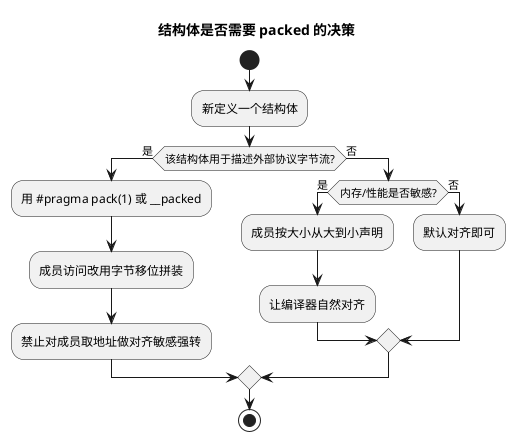

# 03 内存对齐与填充

> 一句话定位：编译器在结构体里塞的"看不见的空隙"叫填充（padding），它是总线访问效率与可移植性的折中——算不准 sizeof、乱用 packed 都会埋雷。
> 等级：L2 ｜ 前置：[02-栈与堆](02-栈与堆.md)

## 原理

### 1. 为什么要对齐（硬件原因）

CPU 取数不是按字节来的，而是按总线宽度（32 位机一次 4 字节）从**对齐地址**读取。访问一个 4 字节的 `uint32` 放在地址 0x1000（4 字节对齐）只需一次总线读；若放在 0x1001（非对齐），硬件要么读两次再拼接，要么直接抛异常。

| 架构 | 非对齐访问行为 |
|---|---|
| Cortex-M3/M4/M7 | 默认允许，硬件拆成多次访问（性能损失）；可通过 `SCB->CCR.UNALIGN_TRP` 使能触发 UsageFault |
| Cortex-M0/M0+ | 不支持，直接 UsageFault（HardFault） |
| TriCore TC1.6P | 多数情况硬件处理（性能损失），特定指令/对齐检查开启时抛 Trap |

对齐的"自然对齐"规则：N 字节类型应放在 N 的倍数地址上。`uint8` 任意、`uint16` 2 字节对齐、`uint32` 4 字节对齐、`uint64`/`double` 8 字节对齐（32 位机有时退化为 4）。指针大小等于总线宽度，按总线宽度对齐。

### 2. 结构体填充规则

编译器按成员声明顺序排布，每个成员按自身自然对齐放到下一个可用对齐位置，不足处填 padding。整个结构体大小要是"最大成员对齐值"的倍数（保证数组首元素对齐后其余也对齐）。

**手算练习**：

```c
struct A {
    uint8  a;     /* 偏移 0，占 1 */
    uint32 b;     /* 自然对齐 4，偏移需 4 → 填 3 字节 */
    uint8  c;     /* 偏移 8，占 1 */
};                /* 最大对齐 4，总大小凑 4 倍数 → 12 字节 */
```

字节布局（每格 1 字节，`·` 是填充）：

```
偏移  0  1  2  3  4  5  6  7  8  9 10 11
内容  a  ·  ·  ·  b  b  b  b  c  ·  ·  ·
```

`sizeof(struct A) == 12`，不是 6。把 `c` 提前可省空间：

```c
struct A_Packed {
    uint32 b;     /* 偏移 0 */
    uint8  a;     /* 偏移 4 */
    uint8  c;     /* 偏移 5 */
};                /* 凑 4 倍数 → 8 字节 */
```

**经验法则**：按成员大小**从大到小**声明，能最大化压缩 padding。AUTOSAR 的 Std_Types.h、Can_IdType 等结构都遵循这条。

### 3. `#pragma pack` 与 `__attribute__((packed))` 的代价

强制 1 字节对齐（紧凑布局）有两种写法：

```c
/* Tasking/GCC 通用 */
#pragma pack(push, 1)
struct UdsFrame {
    uint8  sid;
    uint16 did;
    uint8  data[4];
};
#pragma pack(pop)

/* GCC 风格 */
struct UdsFrame {
    uint8  sid __attribute__((packed));
    ...
} __attribute__((packed));
```

代价：

1. **性能损失**：访问 `did`（地址 1，非对齐）在支持非对齐的架构上拆成多次总线读；在不支持的架构上抛异常。
2. **不能取对齐敏感成员的地址做强制类型转换**：`uint16 *p = &frame.did;` 在 M0+ 直接 HardFault。
3. **原子性丢失**：非对齐访问可能拆成两次总线操作，中间被打断会读到撕裂值。
4. **编译器可能生成更差代码**：用字节逐个拼装代替单条 load 指令。

### 4. DID / 总线协议解析中的正确用法

总线协议（CAN、UDS、DoIP、SOME/IP）的报文是**字节流**，按字节序紧凑排布，没有填充。用 packed 结构体直接"覆盖"报文缓冲是常见且诱人的做法，但有几个坑必须避：

**字节序（Endianness）**：CAN/UDS 报文多字节字段按**大端（Motorola / network byte order）**，而 Cortex-M/TriCore 默认**小端（Intel）**。直接 packed 强转读出来是反的。正确做法是用字节移位拼装，不依赖机器字节序：

```c
/* 从 UDS 报文里读 16 位 DID（大端），不依赖主机字节序 */
uint16 Uds_ReadDid(const uint8 *frame)
{
    return (uint16)(((uint16)frame[0] << 8) | (uint16)frame[1]);
}
```

**packed 结构体的正确用法**：只在"内存布局必须与外部协议一一对应"时用，且对成员访问用字节拼装而非取地址强转。或者干脆**完全不用 packed 结构体，纯字节偏移读写**——AUTOSAR 的 Com 层就是这么做的，序列化/反序列化全靠字节操作，零对齐风险。



## 代码示例

```c
#include "Std_Types.h"

/* --- 自然对齐：填充会让 sizeof 变大 --- */
typedef struct {
    uint8  id;          /* 偏移 0 */
    /* 填充 1 字节 */
    uint16 value;       /* 偏移 2，2 字节对齐 */
    uint8  flag;        /* 偏移 4 */
    /* 填充 3 字节凑 4 倍数 */
} SignalSample;         /* sizeof == 8 */

/* --- 重排成员，省去填充 --- */
typedef struct {
    uint16 value;       /* 偏移 0 */
    uint8  id;          /* 偏移 2 */
    uint8  flag;        /* 偏移 3 */
} SignalSampleCompact;  /* sizeof == 4，省一半 */

/* --- packed：UDS 报文头，与字节流一一对应 --- */
#pragma pack(push, 1)
typedef struct {
    uint8  sid;         /* 服务 ID */
    uint16 did;         /* 数据标识符，注意字节序 */
    uint8  data[4];     /* 数据 */
} UdsHeader;            /* sizeof == 7，无填充 */
#pragma pack(pop)

/* --- 大端 DID 安全读取：字节拼装，零对齐/字节序风险 --- */
uint16 UdsHeader_GetDid(const UdsHeader *p)
{
    /* did 在报文里是大端，结构体成员是机器序，不能直接读 */
    const uint8 *raw = (const uint8 *)p + 1u;   /* 跳过 sid */
    return (uint16)(((uint16)raw[0] << 8) | (uint16)raw[1]);
}

/* --- 检查对齐的编译期断言（MISRA 友好） --- */
#if defined(__GNUC__) || defined(__TASKING__)
STATIC_ASSERT(sizeof(SignalSampleCompact) == 4u, "SignalSampleCompact size mismatch");
#endif
```

## 易错点与陷阱

1. **跨平台 sizeof 不一致**：同一结构体在 32 位/64 位机、不同编译器下填充规则可能不同（指针大小、最大对齐差异）。协议结构体必须 packed + 编译期 assert。
2. **packed 结构体取成员地址强转**：`uint16 *p = (uint16 *)&packedField;` 在 Cortex-M0 直接 HardFault。M4/M7 也建议避免，性能差。
3. **字节序假设**：以为 `*(uint16*)&buf[1]` 读出来就是协议字段。小端机读大端报文必反。统一用移位拼装。
4. **位域（bit-field）跨平台不可移植**：`struct { uint8 a:3; uint8 b:5; }` 的排布方向依赖编译器，AUTOSAR 工程基本禁用，改用移位掩码。
5. **union 类型双关（type punning）**：通过 union 重新解释内存违反严格别名（strict aliasing），MISRA 不允许。改用 memcpy 或字节操作。
6. **对齐检查意外开启**：TriCore 开了数据对齐 Trap 或 Cortex-M 开了 `UNALIGN_TRP`，原本"能跑"的 packed 代码突然进异常。排查时先看这两个开关。

## 面试高频题

**Q1：`struct { char a; int b; char c; }` 在 32 位机上 sizeof 是多少？怎么优化？**
答：12 字节（a 1 + 填 3 + b 4 + c 1 + 填 3）。把 b 提到最前：`int b; char a; char c;` → 8 字节。或按大小从大到小排。

**Q2：`#pragma pack(1)` 的代价是什么？什么时候该用？**
答：代价是非对齐访问的性能损失或异常、原子性丢失、可能更差的代码生成。只在结构体必须与外部字节流一一对应（协议帧、Flash 存储格式）时用，且成员访问避免取地址强转。

**Q3：怎么不依赖机器字节序从大端报文里读 16 位字段？**
答：用字节移位：`((uint16)buf[0] << 8) | buf[1]`。永远不用指针强转。

**Q4：Cortex-M0 和 M4 对非对齐访问的处理有何不同？**
答：M0 不支持，非对齐访问直接 HardFault；M4 硬件拆成多次访问（性能损失），但开了 `UNALIGN_TRP` 也会触发 UsageFault。

**Q5：结构体大小为什么要是最大成员对齐值的倍数？**
答：保证该结构体数组的首元素对齐后，后续元素的首成员也对齐。否则 `arr[1]` 的 `b` 可能落到非对齐地址。

**Q6：为什么 AUTOSAR Com 层不用 packed 结构体解析信号？**
答：避免对齐/字节序/可移植性三重坑，纯字节偏移 + 移位掩码最安全、最可移植，且便于工具（如 ComGen）自动生成。

## 延伸

- [五大内存区](01-五大内存区.md)：结构体作为全局变量落 `.data/.bss`、局部变量落栈时的对齐考量。
- [指针专题：指针运算](../../1-L1基础/指针专题/02-指针运算与多级指针.md)：packed 成员取地址强转的指针陷阱。
- [代码规范与 MISRA-C](../代码规范与MISRA-C/README.md)：MISRA 对位域、union 类型双关的约束。
