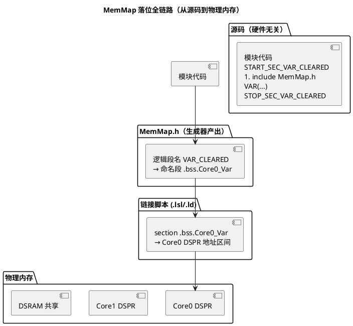

# 05 AUTOSAR MemMap 机制

> 一句话定位：MemMap.h 是 AUTOSAR 用一组宏把"代码/数据该落到哪段物理内存"这件事从源码里抽出来、由配置工具按编译器和芯片生成——它是跨编译器、跨核、跨 RAM/ROM/标定段统一落位的关键胶水层。
> 等级：L2→L3 ｜ 前置：[01-五大内存区](01-五大内存区.md)

## 太长不看

> - 人话直觉：AUTOSAR 源码自己不管"我落在哪块内存"，只声明一个逻辑段名（如 VAR_CLEARED）；配置工具生成的 MemMap.h 在编译期把这个名字展开成当前编译器、当前核对应的 `#pragma section` 或 `__attribute__`——同一份源码换编译器、换核、换工程，重新生成 MemMap.h 即可，源码零修改。
> - 本篇解决：看懂 BSW 源码里 `START_SEC_xxx + #include "MemMap.h" + STOP` 三段式的机制、Tasking 与 GCC 两种展开骨架的差异、MemMap 如何与链接脚本（.lsl/.ld）配合把段落到物理地址（含 TC377 各核数据落各自 DSPR 的做法）。
> - 赶时间记住：① 三段式必须紧贴定义、START/STOP 成对，包裹错位或漏 STOP 是最常见错误（map 文件里段异常膨胀是信号）；② 生成器产出的 MemMap.h 别手改，重新生成会覆盖，调整去配置工具里做；③ `VAR_NOINIT` 段要在链接脚本里从 startup 清零表排除，否则"复位保留值"失效。

## 原理

### 1. 为什么需要 MemMap

AUTOSAR BSW 模块代码（CanIf、PduR、NvM……）是**与硬件/编译器无关**的源码，但每个模块的代码和数据该落到哪段内存（PFlash 还是 DSPR？哪个核？普通 RAM 还是标定 RAM？）却是**与芯片、编译器、工程配置强相关**的。如果让源码里直接写 `#pragma section` 或 `__attribute__((section(...)))`，会带来三个问题：

1. **跨编译器不兼容**：Tasking 用 `#pragma section`，GCC 用 `__attribute__`，GreenHills 用另一套。源码若硬编码，换编译器就要改全部模块。
2. **多核落位无法静态写死**：Core0 和 Core1 的 NvM 缓冲要落各自 DSPR，但同一份 NvM 源码在两核上编译时落位不同。源码不能假设自己跑在哪核。
3. **标定段（CALIB）特殊处理**：标定数据要落到独立的 Flash 标定区，支持 XCP 在线修改，与普通 `.rodata` 不同，需单独段。

MemMap 机制把"落哪段"这件事从源码剥离：源码只声明"这块是 `NVRAM_BUFFER` 类型的段"，由配置工具（如 DaVinci Configurator、ETAS ISOLAR-A、Tresos）生成的 `MemMap.h` 在编译期把 `NVRAM_BUFFER` 展开成当前编译器、当前核、当前工程对应的 `#pragma` 或 `__attribute__`。

### 2. 三段式（START / 内容 / STOP）使用模式

AUTOSAR 模块代码里到处是这种三段式：

```c
#define START_SEC_CODE
#include "MemMap.h"
/* ===== 此处到 STOP 之间的代码落 .text.CODE 段 ===== */
FUNC(void, CANIF_CODE) CanIf_Init(void) { ... }
#define STOP_SEC_CODE
#include "MemMap.h"

#define START_SEC_VAR_CLEARED
#include "MemMap.h"
/* ===== 此处到 STOP 之间的变量落清零 RAM 段（.bss 类）===== */
VAR(uint8, CANIF_VAR) CanIf_RxBuffer[64];
#define STOP_SEC_VAR_CLEARED
#include "MemMap.h"
```

关键点：

- `#define START_SEC_<NAME>` 后**立即 `#include "MemMap.h"`**。MemMap.h 检测到该宏已定义，展开对应的 `#pragma section`，然后 `#undef` 掉这个宏（防止下次 include 误触发）。
- 中间放该段要落的代码或变量声明。
- `#define STOP_SEC_<NAME>` + `#include "MemMap.h"` 把段恢复为默认，结束本段。

段名（`<NAME>`）有规范前缀，常见几类：

| 段前缀 | 含义 | 典型介质 |
|---|---|---|
| `CODE` | 函数代码 | Flash |
| `CONST` | 只读常量/查找表 | Flash |
| `VAR_CLEARED` | 启动时清零的可写变量 | RAM（.bss 类） |
| `VAR_INIT` | 带初值的可写变量 | RAM（.data 类，初值在 Flash） |
| `VAR_POWER_ON_INIT` | 上电初始化一次的变量 | RAM |
| `VAR_NOINIT` | 不清零、不初始化的变量 | RAM（避开 startup 清零） |
| `CALIB` | 标定数据 | 独立标定 Flash 区 |

### 3. MEMMAP_MATCHING 匹配机制原理

`MemMap.h` 内部是一个**巨大的条件编译阶梯**，对每个可能的 `START_SEC_<NAME>` 都有一组匹配分支。其骨架可抽象为：

```c
/* MemMap.h（生成器产出，编译器/核/工程相关） */
#ifdef START_SEC_CODE
  /* 当前编译器：Tasking → #pragma section */
  #pragma section code ".text.MY_CODE"
  #undef START_SEC_CODE
#elif defined(START_SEC_VAR_CLEARED)
  #pragma section data ".bss.MY_VAR_CLEARED" data
  #undef START_SEC_VAR_CLEARED
  ...
#endif

#ifdef STOP_SEC_CODE
  #pragma section code default
  #undef STOP_SEC_CODE
#elif defined(STOP_SEC_VAR_CLEARED)
  #pragma section data default
  #undef STOP_SEC_VAR_CLEARED
  ...
#endif
```

**MEMMAP_MATCHING** 是把"段名 → 物理段"这层映射做成可配置的中间层：配置工具在 ARXML/EcuC 里定义"某模块的 `CODE` 段对应物理段 `.text.Core0_FastCode`"，生成器据此把 `MEMMAP_MATCHING CODE` 展开成具体的 `#pragma section`。这样模块源码只认 `CODE` 这个逻辑段名，物理落位由配置决定，**同一份源码在不同工程、不同核、不同介质上重新生成 `MemMap.h` 即可改落位，源码零修改**。

匹配机制三要素：

1. **逻辑段名**（源码侧）：`CODE`、`VAR_CLEARED` 等不依赖硬件的名字。
2. **匹配宏**（MemMap.h 侧）：`START_SEC_<NAME>` / `STOP_SEC_<NAME>` 的定义/未定义状态作为开关。
3. **物理段映射**（配置侧）：逻辑段名 → 真实 section 字符串，按编译器/核/介质展开。

### 4. Tasking 与 GCC 两种展开骨架

**Tasking（TriCore）展开**——用 `#pragma section` 切段，作用域到下一个 `#pragma section default`：

```c
/* Tasking MemMap.h 片段 */
#if defined(START_SEC_CODE)
#pragma section code ".text.CanIf_Code"
#undef START_SEC_CODE
#elif defined(STOP_SEC_CODE)
#pragma section code default
#undef STOP_SEC_CODE
#endif

#if defined(START_SEC_VAR_CLEARED)
#pragma section data ".bss.CanIf_Var" data
#undef START_SEC_VAR_CLEARED
#elif defined(STOP_SEC_VAR_CLEARED)
#pragma section data default
#undef STOP_SEC_VAR_CLEARED
#endif
```

**GCC（arm-none-eabi，S32K）展开**——`#pragma section` 支持有限，常用 `__attribute__((section(...)))`，但 attribute 要贴在声明上，所以 GCC 风格的 MemMap 往往把段名塞进一个宏，由 `VAR`/`FUNC` 宏拼接：

```c
/* GCC MemMap.h 片段 */
#if defined(START_SEC_CODE)
  #define _SEC_CODE  __attribute__((section(".text.CanIf_Code")))
  #undef START_SEC_CODE
#elif defined(STOP_SEC_CODE)
  #undef _SEC_CODE
  #undef STOP_SEC_CODE
#endif

/* 模块代码里 FUNC 宏会拼接 _SEC_CODE：
   FUNC(void, CANIF_CODE) CanIf_Init(void);
   → void CanIf_Init(void) _SEC_CODE;  （attribute 贴在声明尾） */
```

注意 GCC 的 attribute 必须出现在声明处，所以三段式的"段落"语义靠 `VAR`/`FUNC` 包装宏完成，`START/STOP` 只切换 `_SEC_XXX` 宏的定义。这是 GCC MemMap 与 Tasking 的本质差异。

### 5. 与链接脚本（.lsl / .ld）的衔接

MemMap.h 只负责把符号放进**命名段**（`.text.CanIf_Code`、`.bss.CanIf_Var`），真正决定这些段落到哪个物理地址的是链接脚本：

- **TC377 Tasking `.lsl`**：定义各核 DSPR、PSPR、PFlash 的地址区间，把 `section ".text.CanIf_Code"` 指定到 `PFLASH` 或 `CORE0 PSPR`。
- **S32K GCC `.ld`**：`*(.text.CanIf_Code)` 收集到 `.text` 区（Flash），`*(.bss.CanIf_Var)` 收集到 `.bss`（SRAM）。

所以一套完整的落位 = `MemMap.h`（命名段）+ 链接脚本（段→物理地址）。配置工具通常同时生成两者，保持一致。

### 6. 多核 TC377 各核数据落各自 DSPR 的实践意义

TC377 三核（Core0/1/2）各有私有 DSPR。让各核模块数据落各自 DSPR 有两大好处：

1. **访问零竞争**：核内访问自己 DSPR 不涉总线仲裁，延迟低、可预测；跨核访问 DSRAM 要走共享总线，有仲裁开销。
2. **天然隔离**：Core1 的 NvM 缓冲在 Core1 DSPR，Core0 的任务栈在 Core0 DSPR，物理地址不重叠，一个核写越界不会直接踩另一核数据。

实现方式：MemMap.h 为每核生成不同物理段名。例如 Core0 编译时 `START_SEC_VAR_CLEARED` 展开为 `.bss.Core0_Var`，Core1 编译时展开为 `.bss.Core1_Var`，链接脚本把 `.bss.Core0_Var` 落 Core0 DSPR 地址、`.bss.Core1_Var` 落 Core1 DSPR 地址。跨核共享数据（如 IOC 邮箱）单独用 `START_SEC_VAR_SHARED` 展开到 DSRAM。



## 代码示例

```c
/* 模块代码侧：硬件无关的三段式（节选 CanIf 风格） */
#include "MemMap.h"

#define START_SEC_CODE
#include "MemMap.h"
FUNC(void, CANIF_CODE) CanIf_Init(void)
{
    /* 初始化逻辑 */
}
#define STOP_SEC_CODE
#include "MemMap.h"

#define START_SEC_VAR_CLEARED
#include "MemMap.h"
VAR(uint8, CANIF_VAR) CanIf_RxBuffer[64];   /* 清零 RAM */
VAR(uint8, CANIF_VAR) CanIf_TxBuffer[64];
#define STOP_SEC_VAR_CLEARED
#include "MemMap.h"

#define START_SEC_VAR_NOINIT
#include "MemMap.h"
VAR(uint32, CANIF_VAR) CanIf_ResetCounter;   /* 不清零，复位后保留，用于诊断 */
#define STOP_SEC_VAR_NOINIT
#include "MemMap.h"

#define START_SEC_CONST
#include "MemMap.h"
CONST(uint16, CANIF_CONST) CanIf_RxPduIdTable[16] = { /* ... */ };
#define STOP_SEC_CONST
#include "MemMap.h"
```

```c
/* 生成器产出的 MemMap.h（Tasking 风格，简化） */
#ifndef MEMMAP_H
#define MEMMAP_H

#if defined(START_SEC_CODE)
#pragma section code ".text.CanIf_Code"
#undef START_SEC_CODE
#elif defined(STOP_SEC_CODE)
#pragma section code default
#undef STOP_SEC_CODE

#elif defined(START_SEC_VAR_CLEARED)
#pragma section data ".bss.CanIf_Var" data
#undef START_SEC_VAR_CLEARED
#elif defined(STOP_SEC_VAR_CLEARED)
#pragma section data default
#undef STOP_SEC_VAR_CLEARED

#elif defined(START_SEC_VAR_NOINIT)
#pragma section data ".bss.NoInit.CanIf_Var" data
#undef START_SEC_VAR_NOINIT
#elif defined(STOP_SEC_VAR_NOINIT)
#pragma section data default
#undef STOP_SEC_VAR_NOINIT

#elif defined(START_SEC_CONST)
#pragma section rodata ".rodata.CanIf_Const"
#undef START_SEC_CONST
#elif defined(STOP_SEC_CONST)
#pragma section rodata default
#undef STOP_SEC_CONST
#endif

#endif /* MEMMAP_H */
```

## 易错点与陷阱

1. **宏包裹位置错位**：`START_SEC_CODE` 必须紧贴被包裹的函数**定义**（不是声明）。声明放头文件、定义放 .c，包裹错位会导致函数落错段或不落段。
2. **漏掉 STOP**：只有 START 没有 STOP，后续所有代码/变量都被迫进同一段，map 文件里会看到异常膨胀的段。
3. **NOINIT 段没在链接脚本里保护**：`VAR_NOINIT` 段必须从 startup 的清零表里排除，否则它会被当普通 `.bss` 清零，"保留复位前值"的目的失效。
4. **多核工程用错 MemMap.h**：Core0 和 Core1 各有自己的 MemMap.h（或同一文件按核条件编译），用错会让 Core1 的数据落进 Core0 DSPR，运行时缓存一致性/访问权限出问题。
5. **CALIB 段没接 XCP**：标定段落到独立 Flash 区，但 ECU 配置里没接 XCP 标定协议，标定工具改不了，等于摆设。
6. **直接编辑生成器产出的 MemMap.h**：下次配置工具重新生成会覆盖手改。所有调整都应在配置工具里做。

## 面试高频题

**Q1：AUTOSAR 为什么需要 MemMap？直接在源码里 `#pragma section` 不行吗？**
答：直接写会绑死编译器（Tasking/GCC/GHS 指令不同）、绑死核（多核落位不同）、绑死介质（标定段特殊）。MemMap 把"逻辑段名"留给源码、"物理落位"交给生成器按工程配置产出，源码零修改即可跨编译器/跨核复用。

**Q2：`START_SEC_xxx` + `#include "MemMap.h"` 这套机制是怎么工作的？**
答：`#define START_SEC_xxx` 后 include MemMap.h，文件内的条件阶梯检测到该宏已定义，展开对应 `#pragma section`（或 attribute 宏），随后 `#undef` 该宏防止误触发。`STOP` 段同理恢复默认段。

**Q3：MEMMAP_MATCHING 解决什么问题？**
答：把"逻辑段名 → 物理段字符串"这层映射配置化。源码只认逻辑名（CODE、VAR_CLEARED），物理段名（`.text.Core0_FastCode`）由配置决定，同一份源码在不同工程/核上重新生成 MemMap.h 即可改落位。

**Q4：GCC 和 Tasking 的 MemMap 展开有什么本质差异？**
答：Tasking 用 `#pragma section` 切段，作用域到下个 `#pragma default`，段落语义自然成立；GCC 的 `__attribute__((section))` 必须贴声明，所以 GCC 风格把段名塞进 `_SEC_XXX` 宏，靠 `VAR`/`FUNC` 包装宏拼到声明上，`START/STOP` 只切换宏定义。

**Q5：TC377 多核工程怎么让各核数据落各自 DSPR？为什么这么做？**
答：MemMap.h 为每核生成不同物理段名（`.bss.Core0_Var` vs `.bss.Core1_Var`），链接脚本把各段落到对应核 DSPR 地址。好处是核内访问零总线仲裁、低延迟可预测，且各核数据物理隔离，越界不直接互踩。

**Q6：`VAR_NOINIT` 段为什么不会被 startup 清零？**
答：链接脚本把它从 `.bss` 中分离成独立段，并从 startup 的 zero-fill copy table 里排除。若没排除，它会被当普通 `.bss` 清零，"保留复位前值"失效——这是常见配置坑。

## 延伸

- [五大内存区](01-五大内存区.md)：MemMap 的逻辑段名最终落到五大区里的哪一区。
- [内存对齐与填充](03-内存对齐与填充.md)：MemMap 落段后，段内成员的对齐仍由编译器按自然对齐处理。
- [TC377 存储器映射](../../../02-芯片与体系结构/2-L2进阶/TC377平台/存储器映射/README.md)：PFlash/DSPR/PSPR 物理地址区间，链接脚本据此切段。
- [S32K 存储器与 Flash](../../../02-芯片与体系结构/1-L1基础/S32K平台/存储器与Flash/README.md)：S32K Flash/SRAM 布局与 GCC `.ld` 衔接。
- 工程深入场景：多核 TC377 工程划分各核 DSPR、标定段（CALIB）接 XCP 在线修改、NOINIT 段做崩溃日志保留——真正要啃 MemMap，是在做内存布局规划或对着 map 文件查"段落错/段异常膨胀"的时候。
