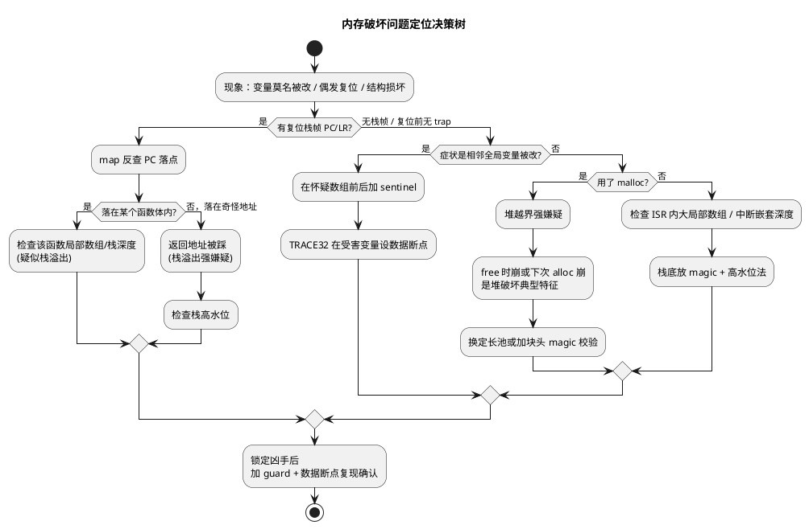

# 06 内存泄漏与越界排查

> 一句话定位：内存破坏的可怕在于"案发地"与"症状地"远隔千里——变量莫名被改、哈希表损坏、偶发复位都是表象，靠填充 pattern、栈金丝雀、map 反查和 TRACE32 内存断点才能回到真凶。
> 等级：L2 ｜ 前置：[04-malloc原理与碎片](04-malloc原理与碎片.md)

## 原理

### 1. 内存破坏的典型现象

内存破坏（memory corruption）在 ECU 上的症状往往与"出错位置"无关，而表现为以下几类：

- **变量莫名被改**：全局变量值不按代码逻辑变化，如一个 `RxCounter` 在没执行接收时也变了。典型是相邻越界写入踩到。
- **数据结构损坏**：链表/哈希表的 next 指针被改成垃圾，遍历时跳飞或死循环。NvM 块链、Com 信号表常是受害者。
- **偶发复位**：栈被踩烂导致返回地址错乱，或 watchdog 因主循环卡死超时复位。
- **仅特定工况复现**：只有 CAN 总线高负载 + 诊断同时触发才出现，因为这时栈最深、缓冲最满。
- **复现后现象每次不同**：同一触发条件，破坏位置因上次内存布局微变而漂移。

这类问题用"加打印看哪行错"几乎无效——出错行是受害者不是凶手。必须从内存本身入手。

### 2. 三类破坏的特征差异

| 类型 | 典型症状 | 触发时机 | 线索 |
|---|---|---|---|
| 栈溢出 | 局部变量被改、返回地址错乱、函数返回跳飞 | 深调用链/中断嵌套/大局部数组 | 复位栈帧 PC 指向奇怪地址；高水位接近栈底 |
| 堆越界 | malloc 管理结构被破坏、下次 alloc/free 崩 | malloc 后越界写 | 越界后第一次 free/malloc 才崩，间隔久 |
| 数组越界（全局） | 相邻全局变量被改 | 写数组时索引超界 | 现象与某全局变量"莫名其妙变化"关联 |

关键判别：**现象与代码逻辑的"距离"越远，越可能是内存破坏**。栈溢出多在"调用/返回"瞬间发作；堆越界有"延迟发作"特征；全局数组越界常表现为相邻变量被改。

### 3. 排查手段

**填充 pattern（水位法）**：在怀疑区填固定字节（如 `0xA5`、`0xCC`、`0xDEADBEEF`），运行后检查哪些被覆盖。

- 栈水位：填满任务栈，跑最坏工况，看栈底还剩多少 pattern 没动 → 实际栈使用。
- 缓冲区 guard：在缓冲前后各放几个 pattern 字节，运行后检查是否被改 → 越界检测。

**栈金丝雀（stack canary）**：编译器在栈帧局部变量和返回地址之间塞一个随机值（金丝雀），函数返回前检查，被改就触发abort/HardFault。GCC 的 `-fstack-protector`、Tasking 的栈检查选项都是这思路。ECU 上还可手动在每个任务栈底放 magic number，OS 调度时检查。

**map 文件 + 地址反查**：复位后从栈帧取出 PC/LR，结合 map 文件反查落到哪个函数哪一行。这是 HardFault/Trap 后定位的第一步。TRACE32 的 `v.fmt`、addr2line 工具都做这事。

**TRACE32 内存断点/监视**：在怀疑被改的地址上设数据断点（watchpoint），一旦写入立即停下，调用栈直接指认凶手。这是定位"变量莫名被改"的最强武器。Cortex-M 的 DWT 有 4 个数据比较器可设硬件断点，TriCore 也有类似 data watchpoint 单元。注意硬件断点数量有限，用完只能靠软件 guard。

**Sentinel 结构体**：在关键结构体前后包一对哨兵字段，定期校验，被改就报 Dem：

```c
typedef struct {
    uint32 magicBefore;
    uint8  payload[64];
    uint32 magicAfter;
} GuardedBuf;
```

### 4. 定位决策树



## 代码示例

```c
#include "Std_Types.h"

#define MAGIC_BEFORE  0xDEADBEEFu
#define MAGIC_AFTER   0xCAFEBABEu

/* --- Sentinel 包装：检测相邻越界 --- */
typedef struct {
    uint32 magicBefore;
    uint8  payload[64];
    uint32 magicAfter;
} GuardedBuf;

void GuardedBuf_Init(GuardedBuf *p)
{
    p->magicBefore = MAGIC_BEFORE;
    p->magicAfter  = MAGIC_AFTER;
}

/* 校验：被改返回非 0，并上报 Dem */
uint8 GuardedBuf_Verify(const GuardedBuf *p)
{
    uint8 corrupted = 0u;
    if ((p->magicBefore != MAGIC_BEFORE) || (p->magicAfter != MAGIC_AFTER))
    {
        corrupted = 1u;
        /* Dem_ReportErrorStatus(DEM_EVENT_MEM_CORRUPTION, DEM_EVENT_STATUS_FAILED); */
    }
    return corrupted;
}

/* --- 栈水位法：填 pattern + 读高水位 --- */
#define STACK_PATTERN  0xA5u

void Stack_FillPattern(uint8 *stackBase, uint32 size)
{
    uint32 i;
    for (i = 0u; i < size; i++)
    {
        stackBase[i] = STACK_PATTERN;
    }
}

/* 返回剩余未用栈字节数（高水位） */
uint32 Stack_HighWaterMark(const uint8 *stackBase, uint32 size)
{
    uint32 i;
    for (i = 0u; i < size; i++)
    {
        if (stackBase[i] != STACK_PATTERN)
        {
            break;          /* 第一次被改写位置 = 栈最深用到的地方 */
        }
    }
    return i;
}

/* --- 内存泄漏计数法（若不得不用 malloc） --- */
static uint32 g_AllocCount = 0u;
static uint32 g_FreeCount  = 0u;

void *LeakTracked_Malloc(uint32 size)
{
    void *p = malloc(size);          /* 工程允许时才用 */
    if (p != NULL_PTR)
    {
        g_AllocCount++;
    }
    return p;
}

void LeakTracked_Free(void *p)
{
    if (p != NULL_PTR)
    {
        g_FreeCount++;
        free(p);
    }
}

/* 周期检查：alloc/free 不该长期失衡 */
uint8 LeakTracked_IsLeaking(void)
{
    return (g_AllocCount > g_FreeCount) ? 1u : 0u;
}
```

## 易错点与陷阱

1. **加打印反而改变现象**：`printf` 自身吃栈、改时序，可能让 bug 消失或挪位。优先用硬件断点和 sentinel，少用打印。
2. **栈水位只跑短工况**：没覆盖刷写/诊断/NM 抖动同时发生，测出的高水位偏低，问题出厂后才暴露。
3. **TRACE32 数据断点用满**：Cortex-M DWT 只有 4 个硬件数据断点，怀疑对象多时要轮流设，或靠软件 guard 缩小范围。
4. **map 反查用错 map**：复现版本的 elf/map 必须与烧录固件完全一致，否则反查行号全错。CI 出包时归档 elf + map。
5. **堆越界误判为栈溢出**：堆越界延迟发作，崩在 free/malloc 时调用栈指向 libc，易被当成"栈问题"。先看是否用了 malloc。
6. **优化级别改变现象**：高优化下局部变量落寄存器、栈布局变化，bug 可能消失或挪位。复现必须用出厂优化级别。

## 面试高频题

**Q1：变量莫名被改，排查思路是什么？**
答：先看是否相邻数组越界——在怀疑缓冲前后加 sentinel（magic number）周期校验；同时在受害变量上设 TRACE32 硬件数据断点，一旦写入立即停，调用栈直接指认凶手。少用打印（会改时序）。

**Q2：栈溢出和堆越界的症状差异？**
答：栈溢出多在调用/返回瞬间发作，复位栈帧 PC 落在奇怪地址，高水位接近栈底；堆越界有延迟发作特征，越界后第一次 free/malloc 才崩，崩点在 libc，间隔久。

**Q3：什么是栈金丝雀？怎么用？**
答：在栈帧局部变量和返回地址之间塞一个随机值，函数返回前检查，被改就触发异常。GCC `-fstack-protector`、Tasking 栈检查都是这思路。手动版是在任务栈底放 magic，OS 调度时检查。

**Q4：TRACE32 怎么定位内存破坏？**
答：①复位后从栈帧取 PC/LR，结合 elf/map 反查源码行；②在怀疑被改地址设硬件数据断点（watchpoint），写入即停，调用栈指认凶手；③看栈高水位判断是否溢出。硬件断点有限（Cortex-M DWT 4 个），多用软件 guard 缩范围。

**Q5：map 文件在排查内存破坏里起什么作用？**
答：把复位栈帧的 PC/LR 地址反查到源码函数和行号；查各段大小确认栈/堆预留；确认怀疑数组/变量落在哪个段、与谁相邻（找越界受害者）。前提是 elf/map 与烧录固件一致。

**Q6：为什么加 printf 调试内存破坏反而让 bug 消失？**
答：printf 自身吃栈、改变调用时序和内存布局，可能让原本踩边界的越界不再触发，或挪到别处。排查内存破坏应优先用硬件断点和 sentinel，避免引入观察者效应。

## 延伸

- [栈与堆](02-栈与堆.md)：栈溢出三大来源与任务栈估算方法。
- [malloc 原理与碎片](04-malloc原理与碎片.md)：堆越界破坏块头的底层机制。
- [五大内存区](01-五大内存区.md)：map 文件反查时各段地址区间的对照基础。
- [调试方法论](../../../09-调试与测试/3-L3高级/调试方法论/README.md)：TRACE32 与 HardFault/Trap 定位流程的系统化论述。
