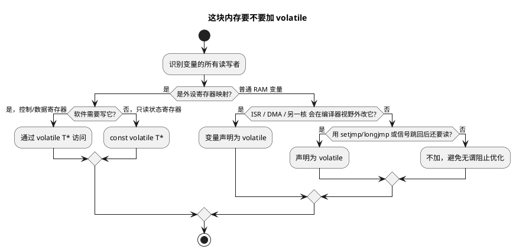

# 01 volatile 的正确使用

> 一句话定位：volatile 是告诉编译器"这块内存会自己变，每次都给我真访问"——TC377 轮询外设状态、S32K 上 ISR 与主循环共享标志，少了它就是死循环与脏数据；但它不是原子操作，更不是锁。
> 等级：L2 ｜ 前置：[04-const与volatile指针](../../1-L1基础/指针专题/04-const与volatile指针.md)

## 原理

### 1. 优化器视角：为什么需要 volatile

C 编译器看到一个普通变量 `uint32 s`，会做三个"合理"假设：**没人会在它背后改它、内存读是昂贵的、连续读同一变量结果不变**。基于这三点，优化器被允许：

- 把 `s` 的值加载进 CPU 寄存器后反复用，不再回读内存；
- 把循环里"看似不变"的读提升到循环外（hoisting / loop invariant code motion）；
- 合并相邻的多次读或多次写（load/load fusion、store/store fusion）；
- 凭"下一条语句没人改它"直接删掉一次读或一次写。

这三条假设对纯软件变量成立，对**硬件可改、异步上下文可改**的内存则致命。`volatile` 限定符就是逐条推翻这些假设的开关：每次访问都必须真的发到内存总线、不许合并、不许删除、不许重排到其它 volatile 访问之外（非 volatile 访问仍可重排，所以 volatile 不是内存屏障，见第 4 篇）。

### 2. 两大嵌入式刚需场景

1. **内存映射 I/O（MMIO, Memory-Mapped I/O）外设寄存器**。状态寄存器随时被硬件改（CAN 初始化完成位、FIFO 非空标志、ADC 转换结束位）；写控制寄存器往往是"触发一次动作"，合并或删除写会丢动作。这类地址必须经 `volatile` 访问。
2. **中断服务程序（ISR, Interrupt Service Routine）与主循环共享的标志**。典型 `while (!flag);` 忙等或 `if (rxPending) { rxPending = FALSE; ... }`：flag 由 ISR 写、主循环读，编译器视野里"主循环没人改 flag"就把读提到循环外——死循环或一次性失效。

第三个场景略提：**`setjmp/longjmp`、信号处理、DMA 搬运**等"绕过当前控制流修改内存"的机制同样需要 volatile，否则跳回后变量的旧值还在寄存器里。AUTOSAR 工程里 DMA 缓冲描述符、多核间共享邮箱也属此类。

### 3. 不加 volatile 的后果：轮询死循环反例

下面这段在 `-O2` 下几乎必然死循环，且**不会报任何警告**：

```c
#define CAN_SR (*(uint32 *)0xF0180040u)   /* 漏了 volatile */
#define CAN_SR_INITDONE 0x00000001u
while ((CAN_SR & CAN_SR_INITDONE) == 0u) { ; }   /* 编译器只读一次 */
```

优化器推理：循环体内没有对 `CAN_SR` 的写 → 假定值不变 → 读一次缓存进寄存器 → 循环条件变成对寄存器的测试 → 硬件实际已置位，CPU 仍盯着旧影子。看门狗超时、整机复位。把指针类型改为 `volatile uint32 *` 即可纠正。

### 4. 三个"不保证"——volatile 不是万能保险

- **不保证原子性**：`volatile uint32 cnt; cnt++;` 仍是"读—改—写"三条指令，ISR 与任务并发照样丢计数；
- **不是互斥锁**：它不阻止两个上下文交错执行；
- **不是内存屏障**：它只约束 volatile 访问之间的顺序，非 volatile 访问、CPU 乱序、缓存与写缓冲仍可能乱序。多核/DMA 一致性问题要靠 DMB/DSB 与缓存维护，见 [04-读写时序与屏障](04-读写时序与屏障.md)。

### 5. 指针本身 volatile，还是"指向的对象" volatile

这是最容易加错对象的点，用右左法则读：

| 声明 | 含义 | 典型用途 |
|---|---|---|
| `volatile uint32 *p` | p 指向 volatile uint32 | **MMIO 正解**：通过 p 访问的寄存器每次真读真写 |
| `uint32 * volatile p` | p 本身是 volatile 指针，指向普通 uint32 | 罕见：指针变量本身会被异步改（如 DMA 更新描述符指针） |
| `volatile uint32 * const p` | 指向 volatile 的常量指针 | 寄存器基址指针：指向对象 volatile，指针本身固定 |

绝大多数寄存器编程要的是第一种：**修饰指向的对象，不是指针本身**。



## 代码示例

### 场景 1：MMIO 轮询，带超时出口

```c
/* TC377 风格示意地址；实际工程请按芯片手册的 Module Base + Offset */
#define CAN0_SR_ADDR        (0xF0180040u)
#define CAN0_SR_INITDONE    (0x00000001u)

/* 关键：类型是 volatile uint32* —— 指向的对象是 volatile */
static volatile uint32 * const Can0StatusReg = (volatile uint32 *)CAN0_SR_ADDR;

/* MISRA 风格：返回值表示状态，0=成功，非 0=超时错误码 */
uint32 Can_WaitInitDone(uint32 timeout_loops)
{
    while (((*Can0StatusReg) & CAN0_SR_INITDONE) == 0u)
    {
        timeout_loops--;
        if (timeout_loops == 0u)            /* 量产代码必须带超时，避免锁死 */
        {
            return 1u;                      /* DET 可在此上报 E_NOT_OK */
        }
    }
    return 0u;
}
```

### 场景 2：ISR 与主循环共享标志

```c
#include "Std_Types.h"   /* boolean / TRUE / FALSE */

/* ISR 写、任务读 —— 必须 volatile，否则主循环被优化成只读一次 */
static volatile boolean CanIf_RxPending = FALSE;

/* 中断上下文：写方 */
void CAN0_OkIsr(void)
{
    CanIf_RxPending = TRUE;
}

/* 周期任务：读方，先清标志再处理，处理期间新帧仍能置位 */
void App_Task_10ms(void)
{
    if (CanIf_RxPending)
    {
        CanIf_RxPending = FALSE;
        CanIf_ProcessRxCache();
    }
}
```

### 场景 3：volatile 不保证原子性 —— 计数器反例

```c
static volatile uint32 g_rxFrameCnt = 0u;   /* ISR ++ ，任务只读：安全 */

/* 但若任务也要 ++ 或 -- ，就出事： */
void App_Task_100ms(void)
{
    /* ++ 是 读-改-写 三步；若在'读'之后ISR也++，任务'写'回会覆盖ISR的累加 -> 丢计数 */
    g_rxFrameCnt--;                          /* 错误：非原子 */

    /* 正确做法之一：关中断保护读-改-写 */
    Irq_SaveAndDisable();                    /* 伪代码：屏蔽中断 */
    g_rxFrameCnt--;
    Irq_Restore();
}
```

### 场景 4：指针本身 volatile（罕见但合法）

```c
/* 假设 DMA 会自动更新一个"下一帧缓冲指针"，CPU 读它前要确保拿到最新值 */
static volatile uint8 * volatile g_nextFrame;   /* 指针本身被 DMA 改 */
/* 第一个 volatile：指向的缓冲内容也可能异步变（按需）
 * 第二个 volatile：指针变量 g_nextFrame 本身被 DMA 改，每次读都真读内存 */
```

## 易错点与陷阱

1. **加错对象**：`volatile uint32 *p`（指向对象 volatile，MMIO 正解）与 `uint32 * volatile p`（指针本身 volatile，指向对象不 volatile）天差地别，按右左法则核对。
2. **整个结构体加 volatile**：`volatile Can_FrameType f` 让所有成员都 volatile，开销大且掩盖真实意图；通常只把真正异步访问的成员标 volatile。
3. **拿 volatile 当原子操作**：单字节读写在多数架构上碰巧原子，但 `++`、`|=`、多字节读写都不是，并发下必出错。计数器、链表指针等仍需关中断/原子指令/锁。
4. **以为 volatile 能排序所有访问**：volatile 只保证 volatile 访问彼此不被重排；非 volatile 变量、CPU 写缓冲、缓存仍可能让"先写控制寄存器再写数据寄存器"在总线上颠倒——要屏障。
5. **局部纯软件变量滥用 volatile"求保险"**：白白阻止寄存器化，热路径性能劣化；按场景用，别当护身符。
6. **const volatile 组合写法错位**：只读状态寄存器要 `const volatile uint32 *`（或 `volatile const`，等价），两个限定词缺一不可——const 管"软件不许写"，volatile 管"硬件会改、读不能被优化"。
7. **强转丢 volatile 再访问**：把 `volatile uint32 *` 强转成 `uint32 *` 后访问，标准上未定义行为；某些编译器优化下访问被合并/删除，外设动作丢失。
8. **MISRA 合规**：MISRA C:2012 规则 8.9 建议把"只在文件内使用的对象"定义为 static；规则 11.4 要求指针与整数互转需评审——寄存器映射的 `(volatile uint32 *)0x...` 属于此条，工程里通常用统一宏封装并记录偏离。规则 8.13（指针形参应指向 const）与 volatile 配合，可形成 `const volatile uint32 *` 的只读寄存器入参契约。

## 面试高频题

**Q1：volatile 是干什么的？嵌入式里有哪些必用场景？**
答：告诉编译器该对象的值会在编译器视野外被改变，每次访问都必须真发到内存、不许缓存/合并/删除/重排。必用场景：MMIO 外设寄存器；ISR 与主循环共享的标志；会被 DMA/信号/setjmp-longjmp 异步修改的内存。

**Q2：不加 volatile 的 `while(!flag);` 为什么会死循环？**
答：编译器做循环不变量外提：循环体内没有对 flag 的写，便假定它不变，只读一次缓存进寄存器，循环条件变成对寄存器的测试，硬件/ISR 实际置位后 CPU 仍看旧值，无限循环。加 volatile 强制每次回读内存即可。

**Q3：`volatile uint32 *p` 和 `uint32 * volatile p` 区别？**
答：前者"指向 volatile uint32 的指针"，通过 p 访问的对象是 volatile，是 MMIO 正解；后者"p 本身是 volatile 的指针"，指向的对象不 volatile，用于指针变量本身会被异步改（如 DMA 更新）的罕见场景。

**Q4：volatile 保证原子性吗？举例。**
答：不保证。`volatile uint32 cnt; cnt++;` 是读—改—写三步，ISR 与任务并发会丢计数。要原子性需关中断、原子指令或互斥锁；volatile 只管"每次真访问内存"。

**Q5：volatile 是内存屏障吗？**
答：不是。它只约束 volatile 访问之间的编译期顺序，不阻止 CPU 乱序、写缓冲重排、缓存不一致。对外设初始化"先写控制位再写数据"这类需要总线顺序的场景，仍需 DMB/DSB/DSYNC 等屏障指令。

**Q6：const 和 volatile 能同时修饰一个对象吗？**
答：能，且常用：`const volatile uint32 *statusReg` 表示只读状态寄存器——const 管软件不许写，volatile 管硬件会改、每次读都必须真读。两者职责正交。

## 延伸

- [04-读写时序与屏障](04-读写时序与屏障.md)：volatile 管不了的总线顺序与缓存一致性，靠屏障指令补齐。
- [02-结构体映射寄存器](02-结构体映射寄存器.md)：把 volatile 与结构体基址映射结合，工程化访问一组寄存器。
- [位操作](../../1-L1基础/位操作/README.md)：寄存器位级访问的底层手法，与 volatile 配合覆盖多数 MCAL 场景。
- [指针专题：const 与 volatile 指针](../../1-L1基础/指针专题/04-const与volatile指针.md)：const/volatile 限定符的统一读法与 MISRA 8.13 落地。
- [代码规范与MISRA-C](../代码规范与MISRA-C/README.md)：规则 8.9 / 8.13 / 11.4 等限定符与指针转换相关条目的合规改写。
- [MCAL 总览](../../../04-MCAL与外设驱动/1-L1基础/MCAL总览/README.md)：volatile 在 MCAL 驱动分层里的实际落点。
