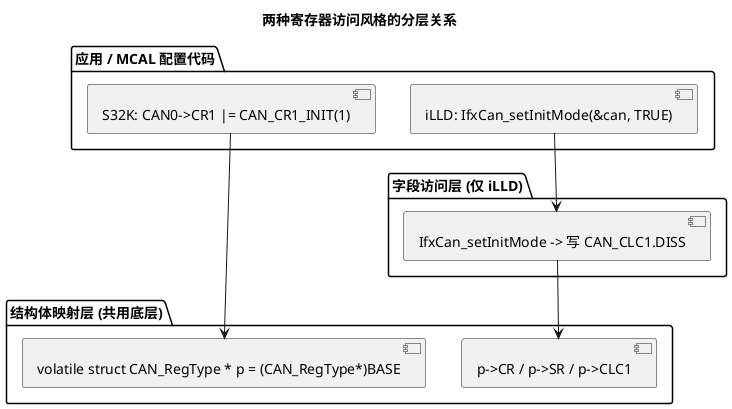

# 02 结构体映射寄存器

> 一句话定位：把一组外设寄存器按芯片手册的偏移定义成 `volatile struct`，再用基址强转指针访问——比满屏 `*(volatile uint32*)(BASE+offset)` 清晰百倍；但成员顺序、字节序、对齐填充、pack 禁忌一旦踩坑，就是寄存器错位引发的 Trap。
> 等级：L2 ｜ 前置：[03-内存对齐与填充](../内存管理/03-内存对齐与填充.md)

## 原理

### 1. 基址映射法：结构体指针 + 固定基址

芯片手册通常把一个外设的寄存器列成一张表：模块基址（Module Base）+ 每个寄存器的偏移（Offset）。C 语言里把它们组织成一个结构体，再用一个固定地址强转成"指向该结构体的指针"，访问 `p->CR`、`p->SR` 就等于访问对应偏移的寄存器。

```c
/* 骨架：基址 + 结构体指针 */
#define CAN0_BASE   (0x40024000u)
typedef volatile struct
{
    __IO uint32 CR;        /* +0x00 控制寄存器 */
    __IO uint32 SR;        /* +0x08 状态寄存器，注意中间空了 4 字节 */
    ...
} Can_RegType;

#define CAN0   ((Can_RegType *)CAN0_BASE)
```

`__IO`、`__O`、`__I` 是 CMSIS 风格宏，展开为 `volatile` / `volatile const` / `const volatile`，把"软件可读写 / 只写 / 只读"的语义写进类型，同时一并带上 volatile。寄存器访问必须经 volatile，原因见 [01-volatile的正确使用](01-volatile的正确使用.md)。

### 2. 成员顺序、字节序与对齐填充

- **成员顺序必须严格按手册偏移递增排列**。C 标准保证结构体成员按声明顺序、地址递增排列；只要不插入编译器自动填充，第 N 个成员就落在第 N 个偏移。
- **字节序（Endianness）**：Cortex-M（S32K）与 TriCore 默认都是小端（Little-Endian）。结构体里一个 `uint32` 寄存器的 4 个字节在内存中的排列与硬件一致；但若用 `uint8` 数组去拆位，要按小端顺序取。换大端核时这段映射要重审。
- **对齐与填充（Alignment & Padding）**：编译器为了让 `uint32` 成员 4 字节对齐，会在前面有 `uint8`/`uint16` 成员后自动插入填充字节。这与手册偏移常常不一致。解决方法见下条。

### 3. 三种"对齐填充"应对姿势

1. **尽量用与偏移匹配的整数类型成对排列**：手册里 32 位寄存器用 `uint32`，连续 32 位寄存器自然 4 字节对齐，几乎不留填充——这是最干净的方式。
2. **遇到保留寄存器显式补成员**：手册里若 `+0x04` 是 RESERVED，结构体里就显式写一个 `uint32 RESERVED0;`，让后续成员对上偏移。**永远不要靠"编译器会自动填"碰运气**。
3. **绝不能用 `#pragma pack(1)` 强行 1 字节对齐 MMIO 结构体**：pack(1) 让 32 位寄存器访问可能变成多次字节访问，触发总线错误，且破坏 `volatile uint32` 的单次访问语义。MMIO 结构体必须保持自然对齐，禁 pack。

### 4. 三个"不许"——memset/memcpy/取地址运算

- **不许 memset/memcpy 整个寄存器结构体**：写控制寄存器往往"触发一次动作"，批量写会把保留位、写 1 清除位（W1C）按字面值写进去，副作用不可控；且可能产生非对齐访问。
- **不许对寄存器结构体做 `= {0}` 整体初始化赋值**：同理，逐寄存器、按位写。
- **慎用 `&p->CR` 取地址传给 DMA**：合法但需确认该寄存器支持 DMA 访问（部分寄存器只支持 CPU 访问），且 DMA 与 volatile 的可见性问题要靠屏障解决。

### 5. 两种工程风格对照

| 维度 | S32K SDK 风格 | TC377 iLLD 风格 |
|---|---|---|
| 寄存器访问 | `基址 + 结构体 + 位掩码宏` | `模块句柄 + 字段访问函数` |
| 典型写法 | `CAN0->CR1 |= CAN_CR1_INIT(1u);` | `IfxCan_setInitMode(&g_can, TRUE);` |
| 抽象层级 | 直接摸寄存器，宏包位段 | 封装成函数，内部再写寄存器 |
| 配置 | 静态/动态寄存器位段填值 | 模块句柄持有基址与配置 |
| 优点 | 透明、好对照手册、空间省 | 易移植、易做单元测试、隐藏寄存器细节 |
| 风险 | 误写位、易越界 | 层层封装有调用开销，调试要看进函数 |

两套都离不开底层 `volatile struct` 映射：S32K SDK 直接把 `CAN_Type` 这种结构体暴露给你；iLLD 在 `IfxCan` 模块内部仍用 `MODULE_CAN` 结构体指针，只是外面再包一层访问函数。MCAL 工程师补底层认知，关键是看懂"基址强转 + 结构体成员"这一层，再去看上层封装才不悬空。



## 代码示例

### 示例 1：最小 CAN 模块寄存器结构体（S32K 风格）

```c
#include "Std_Types.h"

/* CMSIS 风格限定符宏：把 volatile 与读写语义一并写进类型 */
#ifndef __IO
#define __IO  volatile          /* 软件可读可写，且必须真访问 */
#endif
#ifndef __O
#define __O   volatile          /* 只写：写动作不能被合并/删除 */
#endif
#ifndef __I
#define __I   volatile const    /* 只读：硬件会改，读不能被优化掉 */
#endif

/* 按芯片手册偏移递增定义；保留寄存器显式列出 RESERVEDn
 * 假设手册（节选）：
 *   0x00 CR     控制寄存器
 *   0x04 SR     状态寄存器  -- 此处为示意，实际 S32K 的 SR 偏移见手册
 *   0x08 IR     中断使能
 *   0x0C RESERVED
 *   0x10 TXBAR  发送缓冲区添加请求
 */
typedef struct
{
    __IO uint32 CR;          /* +0x00 */
    __IO uint32 SR;          /* +0x04 */
    __IO uint32 IR;          /* +0x08 */
    __I  uint32 RESERVED0;   /* +0x0C 只读占位，软件不写 */
    __O  uint32 TXBAR;       /* +0x10 只写：写 1 触发发送 */
} Can0_RegType;

#define CAN0_BASE_ADDR  (0x40024000u)
#define CAN0            ((Can0_RegType *)CAN0_BASE_ADDR)

/* MISRA 风格：位掩码宏用括号包裹，避免展开优先级问题 */
#define CAN_CR_INIT_MASK        (0x00000001u)
#define CAN_SR_INITDONE_MASK    (0x00000001u)
#define CAN_IR_RXEN_MASK        (0x00000040u)

/* 使能 CAN：写控制位、查状态位、开接收中断 */
uint32 Can0_Init(void)
{
    uint32 timeout = 100000u;

    CAN0->CR = CAN_CR_INIT_MASK;                       /* 进入初始化模式 */

    /* 轮询状态位：经 __IO 的 volatile 保证每次真读 */
    while ((CAN0->SR & CAN_SR_INITDONE_MASK) == 0u)
    {
        if (--timeout == 0u)
        {
            return 1u;                                  /* 超时上报 */
        }
    }

    CAN0->IR = CAN_IR_RXEN_MASK;                        /* 使能接收中断 */
    return 0u;
}

/* 发送一帧：写 TXBAR 触发动作 —— __O 保证这次写绝不能被合并/删除 */
void Can0_SendTrigger(uint8 bufIdx)
{
    CAN0->TXBAR = ((uint32)1u << bufIdx);
}
```

### 示例 2：TC377 iLLD 风格对照（仅示意封装思路）

```c
/* iLLD 里模块句柄持有基址，外部只调函数，不直接碰寄存器 */
typedef struct
{
    volatile Can0_RegType *regs;   /* 句柄内仍持有结构体指针 */
    uint8  nodeIndex;
    /* ... 其它配置 ... */
} IfxCan_Can_Type;

void IfxCan_Can_Init(IfxCan_Can_Type *can, volatile Can0_RegType *base)
{
    can->regs = base;
    /* 内部仍写寄存器，但封装成函数：上层不关心位段细节 */
    can->regs->CR = CAN_CR_INIT_MASK;
    /* IfxCan_setInitMode / IfxCan_setBitTiming 等都最终落到这一层 */
}
```

### 示例 3：错误的整体操作（反例）

```c
/* 反例 1：memset 整个寄存器结构体 —— 会写 RESERVED、W1C 位，副作用不可控 */
memset((void *)CAN0, 0, sizeof(Can0_RegType));   /* 禁止 */

/* 反例 2：用 pack(1) 把结构体压成 1 字节对齐 —— 32 位访问可能变多次字节访问 */
#pragma pack(push, 1)
typedef struct { __IO uint8 cfg; __IO uint32 data; } Bad_RegType;  /* 禁止 */
#pragma pack(pop)

/* 反例 3：把非 volatile 指针指向寄存器 —— 优化导致访问被合并/删除 */
uint32 *bad = (uint32 *)CAN0_BASE_ADDR;          /* 禁止：缺 volatile */
```

## 易错点与陷阱

1. **成员偏移与手册对不上**：漏列 RESERVED、或用了 `uint8`/`uint16` 后编译器自动填充导致后续 32 位寄存器错位。建议用 `_Static_assert(offsetof(Can0_RegType, TXBAR) == 0x10u, "offset mismatch");` 在编译期校验。
2. **pack(1) 误用**：网络协议头可以 pack，MMIO 结构体绝对不行；pack 会破坏自然对齐与单次访问语义。
3. **memset/memcpy 整体操作**：寄存器有 W1C、触发位、保留位，整体写会触发副作用或写非法值。
4. **字节序假设**：跨平台移植时，用 `uint8[4]` 拆 32 位寄存器要按目标核字节序；CAN 报文 ID 在寄存器里的位段排列也与字节序相关。
5. **缺 volatile**：结构体成员若忘了 `__IO`/`volatile`，轮询状态位会被优化成只读一次；用 CMSIS 风格宏统一限定符，从源头杜绝。
6. **取地址传 DMA 未确认**：`&CAN0->TXBAR` 传给 DMA 源/目的地址前，要确认该寄存器在芯片上支持 DMA 访问，部分寄存器只允许 CPU 访问。
7. **MISRA 偏离登记**：`(Can0_RegType *)0x40024000u` 这类"整数转指针"违反 MISRA C:2012 规则 11.4（指针与整数互转需评审）；工程做法是用统一宏封装并在 devia­tion 文件登记，而非每个文件散写。

## 面试高频题

**Q1：为什么寄存器结构体不能 `#pragma pack(1)`？**
答：pack(1) 取消自然对齐，编译器对 32 位寄存器的访问可能拆成多次字节/半字访问，破坏 `volatile uint32` 的"单次访问"语义，可能触发总线错误或让硬件看到多次寄存器写。MMIO 结构体必须保持自然对齐，靠显式列 RESERVED 成员对齐手册偏移。

**Q2：结构体映射寄存器，成员顺序能乱排吗？为什么？**
答：不能。C 标准保证结构体成员按声明顺序、地址递增排列；只有严格按手册偏移递增声明（含显式 RESERVED），成员才落在正确寄存器上。可用 `_Static_assert(offsetof(...) == ...)` 在编译期校验。

**Q3：`__IO`、`__I`、`__O` 各是什么？**
答：CMSIS 风格宏：`__IO` = `volatile`（可读写、必须真访问）；`__I` = `const volatile`（只读，硬件会改，读不能被优化掉）；`__O` = `volatile`（只写，写动作不能被合并/删除）。把读写语义与 volatile 一并写进类型。

**Q4：为什么不能 `memset` 一个寄存器结构体？**
答：寄存器有写 1 清除位（W1C）、触发位、保留位；memset 会按字面 0/非 0 写所有寄存器，可能误清状态、误触发动作、写非法值到保留位（部分芯片写保留位触发 Trap）。必须逐寄存器、按位写。

**Q5：S32K SDK 与 iLLD 在寄存器访问上风格差在哪？**
答：S32K SDK 直接暴露 `CAN_Type` 结构体，用 `CAN0->CR1 |= CAN_CR1_INIT(1)` 直接摸寄存器，透明好对照手册；iLLD 把寄存器访问封装成 `IfxCan_setXxx(&handle, ...)` 函数，句柄持有基址，上层不直接碰寄存器，易移植易测试但调用链更深。两者底层都靠 `volatile struct` + 基址强转。

**Q6：`(Can_RegType *)0x40024000u` 这种写法在 MISRA 下要注意什么？**
答：违反规则 11.4（指针与整数互转需评审）。工程做法是统一封装成宏（如 `#define CAN0 ((Can_RegType*)CAN0_BASE)`），在项目偏离文件登记一次性评审，而非散落各处。

## 延伸

- [01-volatile的正确使用](01-volatile的正确使用.md)：结构体成员限定符 `__IO` 的本质就是 volatile，先读这篇搞懂为什么必须加。
- [03-位带操作](03-位带操作.md)：Cortex-M 上绕开读改写的位级原子访问，与结构体映射互补。
- [04-读写时序与屏障](04-读写时序与屏障.md)：结构体映射管"访问哪个寄存器"，屏障管"访问顺序在总线上是否生效"。
- [位操作](../../1-L1基础/位操作/README.md)：寄存器位掩码宏的写法与 MISRA 友好习惯。
- [代码规范与MISRA-C](../代码规范与MISRA-C/README.md)：规则 11.4 整数转指针、规则 19.2 union 禁用等寄存器映射相关条目。
- [MCAL 总览](../../../04-MCAL与外设驱动/1-L1基础/MCAL总览/README.md)：寄存器映射在 MCAL 驱动分层中的位置。
- [S32K 平台](../../../02-芯片与体系结构/1-L1基础/S32K平台/README.md) / [TC377 平台](../../../02-芯片与体系结构/2-L2进阶/TC377平台/README.md)：两个平台的寄存器手册与 SDK/iLLD 组织方式。
