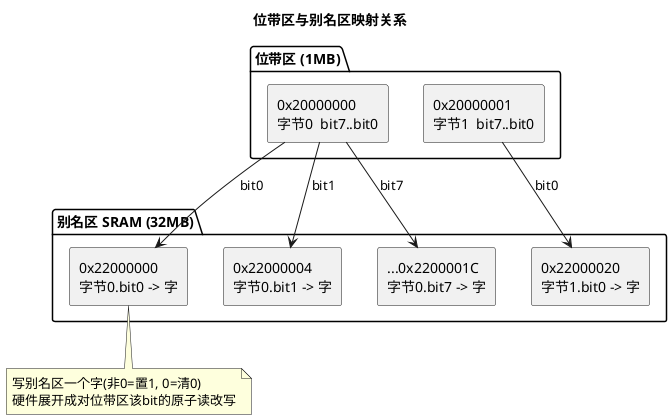

# 03 位带操作

> 一句话定位：Cortex-M 把 SRAM/外设区各划出 1MB"位带区"，映射到 32MB"别名区"——别名区里一个 32 位字对应位带区一个比特，写别名即原子改一位，免去读改写；TC377/TriCore 没有位带，得用关中断或原子指令替代。
> 等级：L2 ｜ 前置：[03-寄存器位操作惯用法](../../1-L1基础/位操作/03-寄存器位操作惯用法.md)

## 原理

### 1. 为什么要位带：读改写的痛点

改一个寄存器/内存的某一位，经典做法是"读—改—写"：`reg |= (1u<<n)`。它是三条指令，中间若被 ISR 或另一核打断，就会"丢失更新"：

```
任务A: 读 reg = 0b0010
ISR :  改 reg 的另一位, 写回 reg = 0b0100
任务A: 改 bit1, 写回 reg = 0b0010   <- ISR 的修改被覆盖
```

传统解法是关中断或上锁。Cortex-M 提供另一条路：**位带（Bit-Band）**——把"改一位"变成对别名地址的一次 32 位写，硬件保证原子。

### 2. 位带区与别名区的地址关系

Cortex-M3/M4/M7 有两个位带区（Bit-Band Region），各 1MB，分别映射到两个 32MB 的别名区（Bit-Band Alias）：

| 位带区 | 起始地址 | 范围 | 对应别名区起始 |
|---|---|---|---|
| SRAM 位带 | `0x20000000` | 1MB | `0x22000000` |
| 外设位带 | `0x40000000` | 1MB | `0x42000000` |

位带区每个比特，在别名区对应一个 32 位字（4 字节）。1MB = 8M bit，每 bit 对应别名区 4 字节 = 32MB，正好对上。

> 注意：只有这两个 1MB 区域支持位带，不是所有 SRAM/外设都能用。S32K 的部分外设寄存器若不在 `0x40000000~0x40FFFFFF` 范围内，就无法用位带访问。

### 3. 别名地址计算公式

设位带区某字节地址为 `byte_addr`，要操作的位号为 `n`（0~7），则对应别名区字地址：

```
bit_word_addr = bit_band_base + (byte_offset * 32) + (bit_number * 4)
```

其中：
- `bit_band_base` = 别名区起始（`0x22000000` 或 `0x42000000`）
- `byte_offset` = `byte_addr - 位带区起始`（该字节在位带区内的偏移）
- `*32`：每个字节 8 bit，每 bit 占别名区 4 字节 → 一个字节占 `8*4=32` 字节
- `bit_number*4`：位号 n 在该字节内再偏移 `n*4` 字节

写别名区一个字：写非 0（通常写 `1`）→ 该位置 1；写 `0` → 该位清 0。读别名区一个字：返回 `0` 或 `1`（位值），不是原字节。

### 4. 原子性来源

对别名区的 32 位访问，总线矩阵（BusMatrix）会"展开"成对位带区那一个 bit 的原子读改写，由硬件保证不可分割。CPU 视角只是一条普通 `STR`/`LDR`，不需要关中断、不需要锁。这对 ISR 与任务共享的"单个标志位"特别好用。

### 5. 局限

- **只覆盖两个 1MB 区域**：SRAM 位带区 1MB 之外的大 SRAM、外设位带区外的寄存器用不了；S32K 部分 FSMC/外设若超出范围无法位带。
- **总线开销**：一次位带访问在总线上仍是读改写，比直接位操作慢、占用总线带宽；高频热路径不建议大量使用。
- **只对单 bit 原子**：多 bit 一起改仍要锁。
- **可移植性差**：Cortex-M0/M0+ 没有位带；TriCore、其它架构没有。位带代码无法跨平台。



## 代码示例

### 示例 1：别名地址计算宏（Cortex-M 通用）

```c
#include "Std_Types.h"

/* 位带区与别名区起始地址 */
#define BITBAND_SRAM_BASE   (0x20000000u)
#define BITBAND_SRAM_ALIAS  (0x22000000u)
#define BITBAND_PERI_BASE   (0x40000000u)
#define BITBAND_PERI_ALIAS  (0x42000000u)

/* 把"位带区某地址某 bit"映射成"别名区字地址"
 * addr : 位带区内的字节地址
 * bitn : 0~7
 * 用宏内联，避免函数调用带来的额外访存
 */
#define BITBAND_SRAM(addr, bitn) \
    (*(volatile uint32 *)(BITBAND_SRAM_ALIAS + \
       (((uint32)(addr) - BITBAND_SRAM_BASE) * 32u) + \
       ((uint32)(bitn) * 4u)))

#define BITBAND_PERI(addr, bitn) \
    (*(volatile uint32 *)(BITBAND_PERI_ALIAS + \
       (((uint32)(addr) - BITBAND_PERI_BASE) * 32u) + \
       ((uint32)(bitn) * 4u)))
```

### 示例 2：SRAM 标志位原子置 1/清 0

```c
/* 任务与 ISR 共享的标志位（放在位带区内） */
static volatile uint8 g_flagByte __attribute__((section(".bitband"))); /* 确保落在 0x20000000~0x200FFFFF */

/* 用位带宏把 g_flagByte 的 bit0 当一个独立 32 位变量操作 */
#define FLAG_RX_PENDING    BITBAND_SRAM((&g_flagByte), 0u)
#define FLAG_TX_DONE       BITBAND_SRAM((&g_flagByte), 1u)

void CAN_RxIsr(void)
{
    FLAG_RX_PENDING = 1u;          /* 原子置 1，无需关中断 */
}

void App_Task_10ms(void)
{
    if (FLAG_RX_PENDING)           /* 读别名返回 0/1，原子读 */
    {
        FLAG_RX_PENDING = 0u;      /* 原子清 0 */
        CanIf_ProcessRxCache();
    }
}
```

### 示例 3：外设寄存器某位原子改

```c
/* 假设某 GPIO 输出寄存器在 0x400FF040，bit5 控制 LED */
#define LED_REG_ADDR        (0x400FF040u)
#define LED_BIT             (5u)
#define LED                 BITBAND_PERI(LED_REG_ADDR, LED_BIT)

void Led_On(void)
{
    LED = 1u;                      /* 等价于原子地 GPIOx->PDOR |= (1<<5) */
}
void Led_Off(void)
{
    LED = 0u;                      /* 等价于原子地 GPIOx->PDOR &= ~(1<<5) */
}
```

### 示例 4：TriCore 无位带 —— 替代手段

```c
/* TC377/TriCore 没有位带硬件。改一位的几种替代：
 * 1) 关中断保护读改写（最通用）
 * 2) 用 TriCore 原子指令（如 SWAP/MASK 系列对 SRAM 区可用，但外设寄存器要查手册是否支持）
 * 3) 各核独立外设：若该外设只被一个核访问，无需锁，直接读改写即可
 */

/* 方法 1：关中断读改写（示意） */
void Tc_SetBit_Atomic(volatile uint32 *reg, uint8 bitn)
{
    uint32 mask = ((uint32)1u << bitn);
    uint32 flags = IfxCpu_disableInterrupts();   /* iLLD：关中断返回旧 PSW */
    *reg |= mask;
    IfxCpu_restoreInterrupts(flags);             /* 恢复 */
}

/* 方法 3：单核独占外设直接读改写（无并发） */
void Tc_SetBit_SingleCore(volatile uint32 *reg, uint8 bitn)
{
    *reg |= ((uint32)1u << bitn);   /* 该外设只被 CPU0 访问，安全 */
}
```

## 易错点与陷阱

1. **地址不在位带区**：`0x20000000~0x200FFFFF`、`0x40000000~0x400FFFFF` 之外的地址用位带宏会得到错误别名地址，访问即 HardFault。务必确认变量/寄存器落在位带区内。
2. **变量没真正落在位带区**：`static volatile uint8 flag;` 默认段不一定在位带区，要用链接脚本段或 `__attribute__((section(...)))` 强制放到位带 SRAM；否则别名地址算错。
3. **误把别名返回值当字节值**：读别名返回 `0` 或 `1`（该 bit 的值），不是原字节；想读整个字节要去位带区原地址读。
4. **多 bit 改仍非原子**：位带只对单 bit 原子；同时改多位（如 3 个标志一起置位）仍是多次写，要锁。
5. **跨架构移植踩坑**：Cortex-M0/M0+ 无位带；TriCore 无位带。把位带宏直接搬到这些核上会编译过但运行错。工程里要用条件编译隔离。
6. **性能误判**：位带一次访问在总线上是读改写，比直接位操作慢且占带宽；对高频热路径（如逐 bit 采样的软件 SPI）反而劣化，要慎用。
7. **外设寄存器只读/写 1 清除位**：位带"清 0"对外设 W1C 位的行为要按手册——有的 W1C 位写 0 无效、写 1 才清，位带写 0 不一定能清；对只读状态位写别名无效。

## 面试高频题

**Q1：位带的别名地址公式？推导一下。**
答：`bit_word_addr = bit_band_base + (byte_offset*32) + (bit_number*4)`。位带区 1MB = 8M bit，每 bit 在别名区占 4 字节 → 32MB。一个字节 8 bit 占别名区 `8*4=32` 字节，所以字节内偏移乘 32；位号 n 在字节内再乘 4（每 bit 4 字节）。

**Q2：位带为什么是原子的？**
答：CPU 对别名区只是一条普通 32 位 LDR/STR，但总线矩阵把这次访问"展开"成对位带区那一个 bit 的读改写，由硬件保证不可分割，无需关中断或锁。

**Q3：位带能用在所有 SRAM 和外设上吗？**
答：不能。只有 SRAM `0x20000000~0x200FFFFF`、外设 `0x40000000~0x400FFFFF` 两个 1MB 区域支持。Cortex-M0/M0+ 完全没有位带；TriCore 也没有。

**Q4：位带和直接 `reg |= (1<<n)` 比有什么优缺点？**
答：优点是单 bit 操作原子，ISR/任务共享标志位无需关中断。缺点是只覆盖特定区域、单次访问总线开销大（仍是读改写）、可移植性差。高频热路径和多 bit 操作仍建议关中断或直接位操作。

**Q5：TriCore 上要做"单 bit 原子置位"怎么办？**
答：三种手段——关中断保护读改写（最通用）；用 TriCore 原子指令（SWAP/MASK，需确认外设寄存器是否支持）；若外设只被一个核独占访问，无并发则直接读改写即可。

**Q6：读位带别名区返回什么？**
答：返回 `0` 或 `1`，即位带区对应 bit 的当前值，不是整个字节。想读字节要去位带区原地址。

## 延伸

- [01-volatile的正确使用](01-volatile的正确使用.md)：位带宏里别名地址也要 `volatile` 修饰，防止编译器缓存访问。
- [02-结构体映射寄存器](02-结构体映射寄存器.md)：结构体映射管"访问哪个寄存器"，位带管"原子改其中一位"，二者常配合。
- [04-读写时序与屏障](04-读写时序与屏障.md)：位带只解决原子性，不解决总线顺序与可见性，多核/DMA 场景仍要屏障。
- [位操作](../../1-L1基础/位操作/README.md)：直接位掩码、读改写、置位/清位/翻转的标准写法。
- [ARM Cortex-M](../../../02-芯片与体系结构/1-L1基础/ARM-Cortex-M/README.md)：Cortex-M3/M4/M7 的存储器映射与位带硬件细节。
- [S32K 平台](../../../02-芯片与体系结构/1-L1基础/S32K平台/README.md)：S32K 上哪些外设落在位带区、SDK 是否提供位带封装。
- [TC377 平台](../../../02-芯片与体系结构/2-L2进阶/TC377平台/README.md)：TriCore 无位带的替代方案与多核外设划分。
