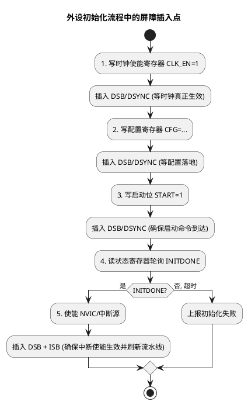

# 04 读写时序与屏障

> 一句话定位：volatile 只管"每次都真访问内存"，但编译器重排、CPU 乱序、写缓冲、缓存一致性仍可能让"先写控制位再写数据"在总线上颠倒——屏障（barrier）才是保证顺序与可见性的最后防线，Cortex-M 用 DMB/DSB/ISB，TriCore 用 dsync/isync/msync。
> 等级：L2→L3 ｜ 前置：[01-volatile的正确使用](01-volatile的正确使用.md)

## 太长不看

> - 人话直觉：volatile 只保证"真的去读写内存"，但你写进寄存器的值可能还躺在 CPU 的写缓冲里没送到外设——屏障指令就是"等一下，前面的写落地了再走"，保证顺序、完成与取指都按你的预期发生。
> - 本篇解决：知道四个高频场景（外设初始化、NVIC 中断使能、DMA 缓冲一致性、改系统控制寄存器）各该插哪种屏障，能看懂 CMSIS 的 `__DSB()/__ISB()` 与 iLLD 的 `IfxCpu_DSYNC()`。
> - 赶时间记住：① DMB 管顺序、DSB 管完成、ISB 管取指，强度 DSB>DMB；② "中断使能了却不进"多半是写完 ISER 缺 DSB；③ TriCore 对应 DSYNC/ISYNC/MSYNC，跨平台代码用抽象宏隔离别硬编码 `__DSB()`。

## 原理

### 1. 顺序为什么会被破坏——三个层面

一段 C 代码 `A; B;` 真正在总线上"先 A 后 B"并不天然成立，破坏来自三层：

1. **编译器重排**：编译器为优化，在遵守"单线程可观察行为不变"前提下可重排普通内存访问。`ctrl = ENABLE; data = VALUE;` 若两地址无依赖，可能被调成先写 data。
2. **CPU 乱序与写缓冲**：Cortex-M 有写缓冲（Write Buffer），TriCore 也有 store buffer。CPU 把写丢进缓冲就继续执行，两条写可能以不同顺序到达外设；带缓存的多核还有缓存一致性问题。
3. **缓存一致性**：多核/DMA 场景下，一个核的写在自己的缓存里，另一核或 DMA 看不到；需要清理/失效缓存或一致性屏障。

volatile 只约束"volatile 访问彼此不被编译器重排"，对 CPU 乱序、写缓冲、缓存都无能为力——这就是屏障要补的洞。

### 2. 三种屏障各管什么

| 屏障 | 作用对象 | 典型指令（Cortex-M） | 一句话 |
|---|---|---|---|
| 编译器屏障 | 编译器 | `asm volatile("" ::: "memory")`（GCC）；`__DMB()` 之外的 `__COMPILER_BARRIER()` | 只阻止编译器把内存访问跨屏障重排，不生成 CPU 指令 |
| 数据内存屏障 DMB | CPU 内存序 | `DMB` | 保证屏障前的内存访问"完成观测"先于屏障后；不等待写真正落地外设 |
| 数据同步屏障 DSB | CPU 内存序 | `DSB` | 比 DMB 强：等待屏障前所有内存访问真正完成（含写缓冲排空）才继续 |
| 指令同步屏障 ISB | CPU 流水线 | `ISB` | 冲刷流水线，保证后续指令从缓存/内存重新取，常用于改了系统控制寄存器后 |

记忆：**DMB 管顺序，DSB 管完成，ISB 管取指**。强度 DSB > DMB。

### 3. 何时必须加屏障——四个高频场景

1. **外设初始化顺序**：先写"使能时钟"，再写"配置寄存器"，最后写"启动位"。时钟未真正使能就写配置寄存器，访问可能进 void。`CLK_EN=1; <DSB>; CFG=...; <DSB>; START=1;`。
2. **NVIC 中断使能后**：`NVIC->ISER[x] = mask;` 之后若立即 `return` 等中断，写可能在缓冲里没生效，中断"使能了却不进"。CMSIS 的 `__NVIC_EnableIRQ` 末尾会带 `__DSB()`。
3. **DMA 一致性**：DMA 搬运的内存若是 cacheable，CPU 写完要 clean cache（推到内存）让 DMA 看到；DMA 写完 CPU 要 invalidate cache（丢掉旧值）再读。这里 clean/invalidate 本身带屏障语义。
4. **自修改代码 / 改系统控制寄存器**：改完 MPU/VTOR/FPU 使能位后要 `ISB`，让后续指令按新配置重新取指；写完代码区要 `DSB` 再 `ISB`。

### 4. "写后读回验证"惯用法

某些外设的写需要确认硬件收到（如进入初始化模式、清除错误标志）。惯用法：

```c
DEV->CTRL = CTRL_INIT;
(void)DEV->CTRL;        /* 读回，触发写缓冲排空，相当于轻量 DSB */
/* 但更稳妥是显式 __DSB()，读回在不同架构语义不一致 */
```

读回能"挤"出写缓冲，但语义依赖架构，可移植性差；正式代码用 `__DSB()` 显式屏障更可靠。

### 5. TriCore 对应指令

TriCore 也有三类对应屏障，命名与作用和 ARM 对齐：

| 作用 | TriCore 指令 | 对应 ARM | 说明 |
|---|---|---|---|
| 数据同步屏障 | `DSYNC` | DSB | 等待之前所有内存访问完成（store buffer 排空） |
| 指令同步屏障 | `ISYNC` | ISB | 冲刷流水线，重新取指；改 PSW/PCXI/系统寄存器后必加 |
| 内存同步屏障 | `MSYNC` | DMB | 保证内存访问顺序，多核/外设一致性场景 |

iLLD 提供 `IfxCpu_DSYNC()`、`IfxCpu_ISYNC()`、`IfxCpu_MSYNC()` 内联封装，等价于对应指令。改完中断使能寄存器、跨核邮箱、GTM 触发位等，按手册要求插入。



## 代码示例

### 示例 1：编译器屏障 vs CPU 屏障

```c
#include "Std_Types.h"

/* 编译器屏障（GCC/Clang）：阻止编译器把内存访问跨屏障重排，不生成 CPU 指令 */
#define COMPILER_BARRIER()   __asm__ volatile("" ::: "memory")

volatile uint32 *g_ctrl = (volatile uint32 *)0x40010000u;
volatile uint32 *g_data = (volatile uint32 *)0x40010004u;

void Bad_Order(void)
{
    /* volatile 只保证两次写不被编译器合并/删除，
     * 但 CPU 写缓冲可能让 data 先于 ctrl 到达外设 */
    *g_ctrl = 1u;
    *g_data = 0xAAu;
}

void Good_Order(void)
{
    *g_ctrl = 1u;
    __DSB();              /* 等 ctrl 写真正落地外设，再写 data */
    *g_data = 0xAAu;
    __DSB();
}
```

### 示例 2：CMSIS 风格外设初始化（Cortex-M / S32K）

```c
/* CMSIS 提供的内联：__DMB() / __DSB() / __ISB()，跨厂商一致 */
#include "cmsis_compiler.h"

#define DEV_BASE   (0x40020000u)
typedef struct { volatile uint32 CLKEN; volatile uint32 CFG; volatile uint32 START; } Dev_RegType;
#define DEV   ((Dev_RegType *)DEV_BASE)

uint32 Dev_Init(void)
{
    uint32 timeout = 100000u;

    DEV->CLKEN = 1u;
    __DSB();                          /* 等时钟真正使能 */
    DEV->CFG   = 0x1234u;
    __DSB();                          /* 等配置落地 */
    DEV->START = 1u;
    __DSB();

    while ((DEV->CLKEN & 1u) == 0u)   /* 轮询硬件就绪 */
    {
        if (--timeout == 0u)
        {
            return 1u;
        }
    }
    return 0u;
}

/* NVIC 使能中断后必须 DSB+ISB，否则可能"使能了却不进中断" */
void Enable_RxIrq(void)
{
    NVIC_EnableIRQ(DEV_RX_IRQn);      /* CMSIS 内部已含 __DSB() */
    __ISB();                          /* 显式刷流水线，确保后续按新中断状态取指 */
}
```

### 示例 3：TriCore/iLLD 风格（TC377）

```c
#include "IfxCpu.h"

volatile uint32 *g_canClc = (volatile uint32 *)0xF0000040u;
volatile uint32 *g_canCtrl = (volatile uint32 *)0xF0000100u;

void Tc_Can_Init(void)
{
    *g_canClc  = 0x1u;                /* 解模块复位/使能时钟 */
    IfxCpu_DSYNC();                   /* 对应 DSYNC：等访问真正完成 */

    *g_canCtrl = 0x3u;                /* 写配置 */
    IfxCpu_DSYNC();

    /* 改 PSW/中断使能等系统寄存器后用 ISYNC 刷流水线 */
    IfxCpu_enableInterrupts();        /* 内部含 MFCR+ISYNC 之类的序列 */
}
```

### 示例 4：DMA 缓冲一致性（cacheable 内存）

```c
/* CPU 把数据写进 txBuf，再启动 DMA 发送。txBuf 是 cacheable 时：
 * 1) CPU 的写可能还在 D-Cache，DMA 从内存读会读到旧值
 * 2) 必须先 clean cache 把数据推到内存，再启动 DMA
 */
void Dma_Send(const uint8 *txBuf, uint32 len)
{
    SCB_CleanDCache_by_Addr((uint32 *)txBuf, len);   /* clean：推到内存 */
    __DSB();                                          /* 等 clean 完成 */
    DMA->SRC  = (uint32)txBuf;
    DMA->LEN  = len;
    DMA->CTRL = DMA_START;                            /* 启动 DMA */
    __DSB();
}

/* DMA 接收完成后 CPU 读 rxBuf：
 * 之前 CPU 可能缓存了 rxBuf 的旧值，要先 invalidate 再读 */
void Dma_RecvDone_Isr(uint8 *rxBuf, uint32 len)
{
    SCB_InvalidateDCache_by_Addr((uint32 *)rxBuf, len);  /* 丢掉旧缓存值 */
    __DSB();
    /* 之后读 rxBuf 才会从内存取新数据 */
}
```

## 易错点与陷阱

1. **以为 volatile 能排序**：volatile 只阻止编译器重排 volatile 访问之间，不阻止 CPU 写缓冲/乱序。`ctrl=1; data=2;` 都加 volatile 仍可能 data 先到外设，必须 DSB。
2. **该用 DSB 用了 DMB**：DMB 只保证顺序不保证完成。若后续指令依赖"写已真正落到外设"（如关时钟后立即进低功耗），必须 DSB。
3. **漏 ISB**：改了 MPU/VTOR/FPU 使能/中断使能等系统寄存器后不加 ISB，流水线里可能还有按旧配置取的指令，行为不确定。
4. **NVIC 使能后没 DSB**：`ISER` 写停留在写缓冲，中断"使能了却不进"。CMSIS 的 `NVIC_EnableIRQ` 已含 DSB，但自己写寄存器时要补。
5. **DMA 一致性漏 clean/invalidate**：cacheable 内存做 DMA 缓冲，CPU 写完不 clean，DMA 读旧值；DMA 写完 CPU 不 invalidate，CPU 读到 cache 旧值。无 cache 的 SRAM 无此问题，但多核共享仍要考虑。
6. **过度用屏障拖性能**：DSB/DSYNC 要等写缓冲排空，开销大。热路径上要按手册最小化屏障数量，能合并的连续写之间不必每个都插。
7. **跨架构指令混用**：把 `__DSB()` 写进 TriCore 工程不通用；要用 iLLD 的 `IfxCpu_DSYNC()` 或平台抽象宏隔离，保证可移植。
8. **"写后读回"当通用屏障**：读回寄存器挤写缓冲的语义依赖架构与外设，不能替代显式 DSB；正式代码用 `__DSB()`。

## 面试高频题

**Q1：volatile 能保证内存访问顺序吗？为什么还需要屏障？**
答：不能。volatile 只阻止编译器对 volatile 访问的重排/合并/删除，但 CPU 写缓冲、乱序执行、缓存一致性仍可能让"先 ctrl 后 data"在总线上颠倒。要保证顺序与可见性需 DMB/DSB，刷新指令流水线需 ISB。

**Q2：DMB、DSB、ISB 区别？**
答：DMB 保证屏障前的内存访问在观测上先于屏障后，但不等待完成；DSB 更强，等待屏障前所有内存访问真正完成（含写缓冲排空）才继续；ISB 冲刷流水线，后续指令从缓存/内存重新取。强度 DSB>DMB，ISB 管取指。

**Q3：外设初始化时哪里必须加屏障？**
答：写时钟使能后（等时钟生效再访问配置寄存器）、写启动位后（确保命令到达）、轮询状态位之前（保证之前的写都已落地）。每个关键写之后插 DSB/DSYNC，改系统控制寄存器后加 ISB。

**Q4：NVIC 使能中断后为什么要 DSB？**
答：写 ISER 进入写缓冲，CPU 继续执行可能在中断真正使能前就进入低功耗或返回，导致"使能了却不进中断"。DSB 等写生效；CMSIS 的 NVIC_EnableIRQ 已内置 DSB。

**Q5：DMA 一致性问题怎么解决？**
答：CPU 写 cacheable 内存给 DMA 读，先 clean D-Cache 推到内存；DMA 写完 CPU 要读，先 invalidate D-Cache 丢旧值。无 cache 的 SRAM 无此问题。配套 DSB 等操作完成。

**Q6：TriCore 上对应 ARM 的 DSB/ISB 是什么？**
答：TriCore 用 `DSYNC`（数据同步屏障，对应 DSB，等内存访问完成/store buffer 排空）、`ISYNC`（指令同步，对应 ISB，刷流水线）、`MSYNC`（内存同步，对应 DMB，保内存序）。iLLD 封装为 `IfxCpu_DSYNC/ISYNC/MSYNC`。

## 延伸

- [01-volatile的正确使用](01-volatile的正确使用.md)：volatile 与屏障分工——前者管"真访问内存"，后者管"顺序与可见性"。
- [02-结构体映射寄存器](02-结构体映射寄存器.md)：结构体映射管"访问哪个寄存器"，屏障管"访问顺序在总线上是否生效"。
- [03-位带操作](03-位带操作.md)：位带只解决单 bit 原子，多核/DMA 可见性仍要屏障。
- [ARM Cortex-M](../../../02-芯片与体系结构/1-L1基础/ARM-Cortex-M/README.md)：Cortex-M 写缓冲、缓存与 DMB/DSB/ISB 的架构语义。
- [TC377 平台](../../../02-芯片与体系结构/2-L2进阶/TC377平台/README.md) / [TriCore 架构](../../../02-芯片与体系结构/3-L3高级/TriCore架构/README.md)：DSYNC/ISYNC/MSYNC 与多核一致性。
- [DMA 专题](../../../04-MCAL与外设驱动/3-L3高级/DMA专题/README.md)：DMA 缓冲一致性、cache clean/invalidate 的工程实践。
- [中断系统（TC377）](../../../02-芯片与体系结构/2-L2进阶/TC377平台/中断系统/README.md)：中断使能后的屏障与Trap 上下文。
- 工程深入场景：外设初始化顺序排障、"中断使能了却不进"定位、DMA 缓冲 cache 一致性（clean/invalidate）、改 MPU/VTOR 后补 ISB——真正要啃透屏障，是对着波形看到总线写顺序颠倒、或在 Cortex-M 与 TriCore 间移植代码统一屏障抽象的时候。
