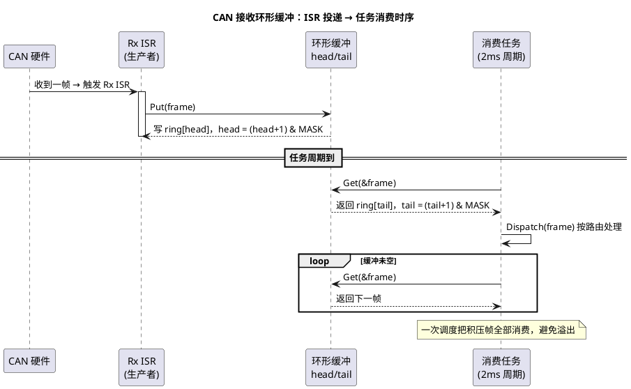

# 01 环形缓冲区

> 一句话定位：固定大小数组 + 头尾两根游标，用"模运算/掩码"绕回原点——这是 ISR（中断服务例程，Interrupt Service Routine）与任务之间最廉价、最常被忽略内存序问题的一块共享内存。
> 等级：L2 ｜ 前置：[02-指针运算与多级指针](../../1-L1基础/指针专题/02-指针运算与多级指针.md)

## 原理

### 1. 头尾索引模型

环形缓冲（Ring Buffer / Circular Buffer）本质是一段定长数组，配两根索引：

- `head`：生产者下一次写入的位置（写入后向前推进）；
- `tail`：消费者下一次读取的位置（读出后向前推进）。

索引回绕有两种写法：

| 写法 | 推进公式 | 适用场景 |
|---|---|---|
| 取模法 | `next = (head + 1u) % SIZE` | 缓冲大小任意 |
| 掩码法 | `next = (head + 1u) & (SIZE - 1u)` | **SIZE 必须为 2 的幂** |

嵌入式里 99% 用掩码法：`%` 在无硬件除法的核上会被编译成 `__aeabi_uidiv` 库调用，几十个周期；`&` 一条指令。代价是缓冲大小被绑死成 2 的幂，对 CAN 接收缓冲毫无损失。

### 2. 判满判空两法

环形缓冲最经典的坑是"head == tail"既表示空也表示满"。两套解法：

**法一：留空一个槽（sacrifice one slot）**

- 空：`head == tail`
- 满：`(head + 1) % SIZE == tail`

实际可用容量是 `SIZE - 1`。这是无锁 SPSC（Single-Producer Single-Consumer）场景的标准做法，因为判满判空只依赖两根索引自身，没有任何额外共享变量需要同步。

**法二：独立计数（separate count）**

- 空：`count == 0`
- 满：`count == SIZE`

可用容量是 `SIZE`，但 `count` 是生产者写、消费者也读——多核上 `count++` 不是原子的，必须加锁或用原子操作。SPSC 无锁场景下若硬上计数法，反而把"无锁"废掉了。

> 经验：单生产者单消费者场景一律选法一。多生产者/多消费者必须加锁或上 atomic，那时计数法更直观。

### 3. 无锁 SPSC 的内存序要点

SPSC 之所以能无锁，靠的是**职责切分**：

- 生产者只写 `head`，只读 `tail`；
- 消费者只写 `tail`，只读 `head`；
- 各自读对方的索引，**读到陈旧值是安全的**——生产者读到旧的 `tail`，最坏结果是误判为满、丢一帧；消费者读到旧的 `head`，最坏结果是误判为空、这一拍不消费，下一拍自然就追上。

实现这条性质需要两件事：

1. **`volatile` 修饰 head/tail**：阻止编译器把读写优化进寄存器。MISRA-C 里 `volatile` 是被允许且推荐用于硬件/共享变量。
2. **CPU 不重排这两次访问**：单核 Cortex-M / TriCore 对普通内存不重排（只有对 Device Memory 才严格顺序）；写完数据再写 `head` 这种"发布"模式在单核上自然成立。

#### 单核 MCU（S32K / Cortex-M4）怎么做

- 关中断法：消费任务读 head 之前 `DisableAllInterrupts()`，读完 `EnableAllInterrupts()`，保证读到的不是半截值。其实 32 位读本身在 M4 上是原子的，关中断更多是给"读完 tail 后判断动作"这种临界区做整体保护。
- 不关中断也行：只要 head/tail 是 `volatile uint16/uint32`，单字读写单核上不会被打断。

#### 多核 TC377（TriCore 三核）要更谨慎

TC377 是 3 核 SoC（CPU0/CPU1/CPU2），跨核共享缓冲会踩两个坑：

- **Cache 一致性**：CPU0 写入 `head` 后，数据可能停在 CPU0 的 D-Cache，CPU1 看不到。要么把缓冲放在非缓存共享段（`__sharen` 段 + DLMU 配 non-cacheable），要么显式 `__dsync()` + cache 维护。
- **写发布顺序**：先写数据再更新 `head` 这条规则，跨核需要 memory barrier。TriCore 提供 `__syncm`、AURIX iLLD 里 `Ifx__syncm()` 即可。
- 更稳的做法：直接用 MCAL 提供的 `GetResource/ReleaseResource` 或 OS Spinlock，不要自己手写无锁——多核无锁代码 90% 是错的。

### 4. 溢出策略

缓冲满了之后怎么办？两种主流策略：

| 策略 | 行为 | 适用 |
|---|---|---|
| 丢新（Drop New） | `Put` 直接返回失败，新帧不进缓冲 | 诊断/标定流——保留老数据更值钱 |
| 丢旧（Drop Old / Overwrite） | `Put` 写入并推进 `tail`，老数据被覆盖 | 实时性高的 CAN 接收——保留最新状态 |

诊断请求一般用丢新（让上位机重试），CAN 报文接收也常丢新（丢一帧总比丢一串同步报文好定位）；Bootloader 下载流有时用丢旧（断点续传，最新数据优先）。代码层面是 `Put` 函数里一行差异，结构上完全一致。

## 代码示例

CAN 接收环形缓冲（ISR 里 `Put`、任务里 `Get`），留空一个槽法 + 丢新策略：

```c
/* 01-环形缓冲区示例：CAN 接收 SPSC 环形缓冲 */
#include "Std_Types.h"
#include <string.h>

/* 缓冲大小必须是 2 的幂，便于掩码运算 */
#define CAN_RX_BUF_SIZE         (64u)
#define CAN_RX_BUF_SIZE_MASK    (CAN_RX_BUF_SIZE - 1u)

/* 单个 CAN 接收帧快照：进 ISR 后立即把硬件寄存器内容拷贝出来 */
typedef struct {
    uint32 canId;
    uint8  dlc;
    uint8  data[8u];
} CanRxFrameType;

/* 环形缓冲控制块：头尾索引模型（留空一个槽） */
typedef struct {
    CanRxFrameType      ring[CAN_RX_BUF_SIZE];
    volatile uint16     head;   /* 生产者写：ISR */
    volatile uint16     tail;   /* 消费者写：任务 */
    uint32              overflowCount;  /* 溢出统计：非共享，单方更新即可 */
} CanRxRingBufType;

/* 全局实例：放在共享段供 ISR/Task 共同访问 */
static CanRxRingBufType g_CanRxRingBuf;

/* 初始化：清空缓冲，head = tail = 0 表示空 */
void CanRxRingBuf_Init(CanRxRingBufType *buf)
{
    buf->head = 0u;
    buf->tail = 0u;
    buf->overflowCount = 0u;
    /* ring 数组无需清零，避免初始化阶段多花时间 */
}

/* 判空：head == tail */
boolean CanRxRingBuf_IsEmpty(const CanRxRingBufType *buf)
{
    return (buf->head == buf->tail) ? TRUE : FALSE;
}

/* 判满：(head + 1) & MASK == tail —— 留空一个槽法 */
boolean CanRxRingBuf_IsFull(const CanRxRingBufType *buf)
{
    uint16 next = (uint16)((buf->head + 1u) & CAN_RX_BUF_SIZE_MASK);
    return (next == buf->tail) ? TRUE : FALSE;
}

/*
 * 生产者接口：ISR 内调用，写入一帧。
 * 注意写入顺序：先写数据 ring[head]，再更新 head（发布模型）。
 * 单核上 volatile 已足够；多核 TC377 上 head 更新前需 __syncm()。
 * 返回 TRUE 写入成功，FALSE 表示缓冲满（丢新策略）。
 */
boolean CanRxRingBuf_Put(CanRxRingBufType *buf, const CanRxFrameType *frame)
{
    uint16 next = (uint16)((buf->head + 1u) & CAN_RX_BUF_SIZE_MASK);

    if (next == buf->tail) {
        /* 满：丢新——本帧不写入，由调用方统计溢出 */
        return FALSE;
    }
    /* 先写数据体，再发布索引：消费者只有看到 head 更新后才会读到这份数据 */
    (void)memcpy(&buf->ring[buf->head], frame, sizeof(CanRxFrameType));
    buf->head = next;     /* 关键发布点 */
    return TRUE;
}

/*
 * 消费者接口：任务内调用，取出一帧。
 * 读取顺序：先取数据 ring[tail]，再推进 tail。
 */
boolean CanRxRingBuf_Get(CanRxRingBufType *buf, CanRxFrameType *frame)
{
    if (buf->head == buf->tail) {
        /* 空：本拍无数据 */
        return FALSE;
    }
    (void)memcpy(frame, &buf->ring[buf->tail], sizeof(CanRxFrameType));
    buf->tail = (uint16)((buf->tail + 1u) & CAN_RX_BUF_SIZE_MASK);
    return TRUE;
}

/* ====== 上层调用示例 ====== */

/* CAN Rx ISR：硬件收帧触发，把寄存器快照压入缓冲 */
void Can_IsrRxCallback(uint32 canId, uint8 dlc, const uint8 *data)
{
    CanRxFrameType frame;

    frame.canId = canId;
    if (dlc > 8u) {
        dlc = 8u;   /* 防御性钳位，CAN 经典帧 DLC 最大 8 */
    }
    frame.dlc   = dlc;   /* 修正：钳位后再存快照，避免 dlc>8 时消费方按 dlc 越界读 data */
    (void)memcpy(frame.data, data, (uint32)dlc);

    if (CanRxRingBuf_Put(&g_CanRxRingBuf, &frame) == FALSE) {
        g_CanRxRingBuf.overflowCount++;   /* 后台计数，便于事后分析 */
    }
}

/* 周期消费任务（如 2ms Task）：取出所有已收到的帧分发处理 */
void CanRx_ConsumeTask(void)
{
    CanRxFrameType frame;

    /* 一次任务调度把缓冲里所有积压帧都消费掉 */
    while (CanRxRingBuf_Get(&g_CanRxRingBuf, &frame) == TRUE) {
        CanRx_Dispatch(&frame);   /* 业务分发：按 ID 路由到不同处理函数 */
    }
}
```

ISR 与任务之间的时序关系：



## 易错点与陷阱

1. **`SIZE` 不是 2 的幂却用了掩码法**：`& (SIZE-1)` 直接错乱，且编译期不会报。把 `#define CAN_RX_BUF_SIZE_MASK (CAN_RX_BUF_SIZE - 1u)` 配静态断言 `_Static_assert((CAN_RX_BUF_SIZE & CAN_RX_BUF_SIZE_MASK) == 0u, "size must be power of 2");` 卡死。

2. **`head`/`tail` 漏 `volatile`**：编译器把读优化进寄存器，任务永远看不到 ISR 更新的 head，缓冲"假死"。这是新手最常踩的坑，MISRA-C Dir 4.4 也建议对硬件/共享变量加 `volatile`。

3. **写发布顺序颠倒**：先 `head = next; memcpy(ring[old_head]);` ——消费者看到 head 已推进，读到的却是半截数据。务必"先写数据体，再更新索引"。

4. **`uint8` 索引溢出**：缓冲大小 > 256 时用 `uint8` 当索引，到 255 回绕后逻辑正确但语义混乱；用 `uint16` 或 `uint32`。

5. **多核上忘 cache 维护**：CPU0 写 head 没刷 cache，CPU1 读到旧值永远以为空。要么把缓冲放 non-cacheable 段，要么每次发布前 `Ifx__syncm()`。

6. **临界区切错粒度**：消费任务里把整个 `while` 循环包在 `DisableAllInterrupts()` 内，ISR 被长时间阻塞。SPSC 根本不需要关中断——只要单字读写原子即可。

7. **溢出策略选错**：CAN 接收用"丢旧"覆盖同步报文，导致一帧 ECU 复位请求被覆盖丢失；Bootloader 流用"丢新"导致下载慢。务必按业务语义选。

8. **`memcpy` 在 ISR 里慢**：8 字节帧用 `memcpy` 没问题，但如果是大对象（几十 KB），中断里拷贝会拖死系统。压栈对象要尽量精简，或只放指针（注意生命周期）。

## 面试高频题

**Q1：环形缓冲为什么 head == tail 既表示空又表示满？怎么解决？**
A：因为 head 和 tail 是模 N 的循环量，空时两者重合，满时（head 走完一圈追上 tail）也重合。两种解法：留空一个槽，判满用 `(head+1)%N == tail`；或独立计数 `count`，判满用 `count == N`，但 count 要原子操作。

**Q2：单生产者单消费者的环形缓冲为什么可以不加锁？**
A：因为生产者只写 head、消费者只写 tail，两者职责互不重叠。各自只读对方索引，读到陈旧值最坏导致一次"误判满/空"——空判为满丢一帧，满判为空这一拍不消费，下一拍自然追上，不会破坏数据结构。

**Q3：`volatile` 修饰 head/tail 在这里到底起什么作用？**
A：阻止编译器把读优化进寄存器或合并多次访问。每次读 head/tail 都强制从内存重新加载，确保任务能看到 ISR 写的最新值。但 `volatile` 不保证 CPU 不重排指令——那是 memory barrier 的活。

**Q4：TC377 上跨核使用环形缓冲，需要额外注意什么？**
A：三个坑：(1) Cache 一致性——把共享段配 non-cacheable 或显式做 cache 维护；(2) 写发布顺序跨核要 memory barrier，如 `Ifx__syncm()`；(3) iLLD 提供的 spinlock/MTU semaphore 是更稳的选择，多核无锁代码 90% 是错的。

**Q5：ISR 里写缓冲 vs 任务里读缓冲，临界区到底切在哪里？**
A：SPSC 模式下不需要切临界区。如果消费端要"判空 + 取数 + 业务"原子完成，可只关中断覆盖这三步，但通常业务处理放到任务里更合适——ISR 只做"快照入队"，业务放任务里慢慢做。

**Q6：丢新和丢旧策略怎么选？**
A：看数据语义。诊断/标定请求保留老数据价值更高，用丢新（让上位机重试）；实时状态报文最新值优先，用丢旧（覆盖）。Bootloader 续传场景也常丢旧。代码层面只是 `Put` 函数里"满"分支的一行差异。

## 延伸

- [指针与数组](../../1-L1基础/指针专题/01-指针与数组.md)：理解环形缓冲索引步长的基础
- [指针运算与多级指针](../../1-L1基础/指针专题/02-指针运算与多级指针.md)
- [volatile 与 const 指针](../../1-L1基础/指针专题/04-const与volatile指针.md)：共享变量为什么必须加 volatile
- [内存管理](../内存管理/README.md)：缓冲区在内存段中的放置与生命周期
- [CAN 收发器与物理层](../../../05-汽车网络通讯/1-L1基础/CAN/收发器与物理层/README.md)：理解 ISR 触发频率与缓冲深度设计
