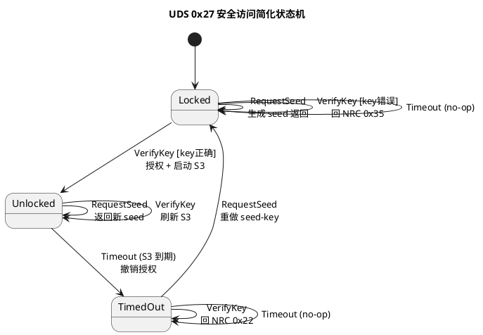

# 04 状态机

> 一句话定位：ECU 上几乎所有"有时间维度"的逻辑——NM、会话、安全访问、刷写、电源管理——本质都是状态机；写 ECU 代码 80% 在写状态机，剩下 20% 是状态之间的数据搬运。
> 等级：L2 ｜ 前置：[03-枚举与typedef](../../1-L1基础/基础语法巩固/03-枚举与typedef.md)

## 原理

### 1. 为什么 ECU 代码离不开状态机

汽车控制器要响应外部输入（CAN 报文、诊断请求、按键），但同样一个输入在不同上下文下含义完全不同：诊断 0x11 ECUReset，在 Default Session 下应被拒绝（NRC 0x22），在 Programming Session 下应触发复位重启；EcuM 在 Run 阶段收到 Wakeup 信号是 no-op，在 Sleep 阶段则是关键唤醒源。

**输入语义依赖上下文**就是状态机的天然语义。如果不抽象成状态机，代码里全是 `if (session == DEFAULT && ecuMode == RUN && securityLevel == 0)` 的并列条件，新人接手即崩。

### 2. switch-case 实现的问题

最朴素的写法：

```c
switch (state) {
    case STATE_LOCKED:
        if (event == EV_REQUEST_SEED) {
            /* 处理 seed */
            state = STATE_LOCKED;
        } else if (event == EV_VERIFY_KEY) {
            if (key == expectedKey) {
                state = STATE_UNLOCKED;
            }
        }
        break;
    case STATE_UNLOCKED:
        /* ... */
        break;
}
```

随着状态数和事件数增加，问题爆炸式恶化：

- **状态分支膨胀**：N 状态 × M 事件 = N×M 个分支；
- **入口/出口动作重复**：进入 Unlocked 时"启动 S3 定时器"代码可能在多个分支里复制；
- **测试困难**：要覆盖每个分支组合；
- **加新状态要改所有 case**：违反开闭原则；
- **遗漏分支静默通过**：C 的 switch 不强制覆盖所有 (state, event) 组合，漏写一个就死循环。

### 3. 表驱动状态机（Table-driven FSM）

把状态迁移抽成一张表：

| 当前状态 | 事件 | 守卫条件 | 下一状态 | 动作 |
|---|---|---|---|---|
| Locked | RequestSeed | 无 | Locked | 生成 seed 并回复 |
| Locked | VerifyKey | key 正确 | Unlocked | 授权 + 启动 S3 |
| Locked | VerifyKey | key 错误 | Locked | 回复 NRC 0x35 |
| Unlocked | Timeout | 无 | TimedOut | 撤销授权 |
| ... |

代码里这张表是 `const` 数组，引擎循环遍历查表，找到匹配的 (state, event, guard) 就执行动作并切换状态。

```c
typedef boolean (*GuardFn)(void *ctx);
typedef void    (*ActionFn)(void *ctx);

typedef struct {
    State    fromState;
    Event    event;
    GuardFn  guard;       /* NULL 表示无条件 */
    State    toState;
    ActionFn action;      /* 可为 NULL */
} FsmTransition;
```

加状态、加事件只改表，不改引擎代码——这就是 AUTOSAR Nm、ComM、EcuM 模块内部状态机的写法。

### 4. 入口/出口动作与 guard

进阶的 FSM 有三类动作：

- **入口动作（Entry Action）**：进入某状态时执行（如进入 Unlocked 启动 S3 定时器）；
- **出口动作（Exit Action）**：离开某状态时执行（如离开 Unlocked 停 S3 定时器）；
- **迁移动作（Transition Action）**：发生迁移时执行（如生成 seed）。

把入口/出口动作绑定到状态、迁移动作绑到迁移，能消除大量重复代码——所有进入 Unlocked 的路径都自动启动定时器，不会出现某条路径忘了启动。

**Guard（守卫）** 是迁移条件函数：表里某行 (state, event) 配 `GuardFn`，引擎调用它，返回 FALSE 则这条规则不匹配、继续找下一条。这才能表达"VerifyKey 在 key 正确时迁移到 Unlocked，错误时留在 Locked"这种条件迁移。

### 5. 层次状态机（HSM）

普通 FSM 的痛点是"很多状态共享相同行为"。例如 NM 状态机里 Network Mode 下的 RepeatMessage/NormalOperation/PrepareSleep 三个子状态，都响应 BusSleep 事件迁移到 BusSleep 状态——普通 FSM 要写三遍。

**层次状态机（Hierarchical State Machine，HSM）** 让状态有父子关系：父状态的迁移被子状态继承。这样三个子状态只要写在父状态 Network Mode 下处理一次 BusSleep。

经典实现是 Miro Samek 的 QP/QM 框架，AUTOSAR NM/ComM 的状态机本质就是 HSM。本篇只给概念，实现完整 HSM 代码量大，CDD 工程师一般不需要自己实现——若实在需要，引入 QP-C 或 AUTOSAR BswM 的模式仲裁更省事。

## 代码示例

UDS 安全访问（service 0x27）简化状态机，状态：Locked / Unlocked / TimedOut，事件：RequestSeed / VerifyKey / Timeout。

```c
/* 04-状态机示例：UDS 0x27 安全访问简化状态机 */
#include "Std_Types.h"

/* 状态枚举 */
typedef enum {
    STATE_LOCKED = 0,
    STATE_UNLOCKED,
    STATE_TIMED_OUT,
    STATE_COUNT
} SecAccState;

/* 事件枚举 */
typedef enum {
    EV_REQUEST_SEED = 0,
    EV_VERIFY_KEY,
    EV_TIMEOUT,
    EV_COUNT
} SecAccEvent;

/* 上下文：保存运行期数据 */
typedef struct {
    SecAccState  state;
    uint32       currentSeed;
    uint32       expectedKey;   /* 由 seed 计算得出 */
    uint32       verifyKey;     /* 待校验 key：调用方发 EV_VERIFY_KEY 前填入（修正补充） */
    uint32       s3TimerMs;     /* 剩余 S3 时间 */
    uint8        lastNrc;       /* 上次响应的 NRC，便于回调上层 */
    uint8        securityLevel; /* 当前解锁的级别 */
} SecAccContext;

/* ====== 守卫函数 ====== */
static boolean Guard_KeyCorrect(SecAccContext *ctx)
{
    /* 真实场景：seed 经 AES/SHA 计算，这里简化为预期 key 比对。
     * 修正：原写法只判 expectedKey 非零（做过 RequestSeed 后任意 key 都能解锁），
     * 改为比对调用方在 EV_VERIFY_KEY 前填入的 verifyKey。 */
    return (ctx->verifyKey == ctx->expectedKey) ? TRUE : FALSE;
}

/* ====== 动作函数 ====== */
static void Action_SendSeed(SecAccContext *ctx)
{
    ctx->currentSeed = SecAcc_GenerateSeed();   /* 平台相关 RNG */
    ctx->expectedKey = ctx->currentSeed ^ 0x5A5A5A5Au;   /* 简化算法 */
    ctx->lastNrc = 0u;
    SecAcc_ReplyPositive(0x01u, ctx->currentSeed);
}

static void Action_GrantAccess(SecAccContext *ctx)
{
    ctx->securityLevel = 1u;
    ctx->s3TimerMs = 5000u;   /* S3 = 5s 默认 */
    ctx->lastNrc = 0u;
    SecAcc_ReplyPositive(0x02u, 0u);
}

static void Action_DenyKey(SecAccContext *ctx)
{
    ctx->lastNrc = 0x35u;   /* InvalidKey */
    SecAcc_ReplyNegative(0x27u, 0x35u);
}

static void Action_RevokeAccess(SecAccContext *ctx)
{
    ctx->securityLevel = 0u;
    ctx->s3TimerMs = 0u;
    /* NRC 由调用方根据当前请求决定，状态机只负责状态切换 */
}

static void Action_RejectNeedSeed(SecAccContext *ctx)
{
    ctx->lastNrc = 0x22u;   /* ConditionsNotCorrect：必须先做 27 01 */
    SecAcc_ReplyNegative(0x27u, 0x22u);
}

static void Action_RefreshS3(SecAccContext *ctx)
{
    ctx->s3TimerMs = 5000u;   /* 在 Unlocked 下再次 27 02 也刷 S3 */
}

/* ====== 状态迁移表 ======
 * 每行：(from, event, guard, to, action)
 * 守卫为 NULL 表示无条件；动作为 NULL 表示无动作。
 */
typedef struct {
    SecAccState   from;
    SecAccEvent   event;
    boolean     (*guard)(SecAccContext *);
    SecAccState   to;
    void        (*action)(SecAccContext *);
} FsmRule;

static const FsmRule g_FsmTable[] = {
    /* Locked 状态 */
    { STATE_LOCKED,    EV_REQUEST_SEED, NULL,               STATE_LOCKED,    Action_SendSeed       },
    { STATE_LOCKED,    EV_VERIFY_KEY,    Guard_KeyCorrect,  STATE_UNLOCKED,  Action_GrantAccess    },
    { STATE_LOCKED,    EV_VERIFY_KEY,    NULL,               STATE_LOCKED,    Action_DenyKey        },
    { STATE_LOCKED,    EV_TIMEOUT,       NULL,               STATE_LOCKED,    NULL                  },

    /* Unlocked 状态 */
    { STATE_UNLOCKED,  EV_REQUEST_SEED, NULL,               STATE_UNLOCKED,  Action_SendSeed       },
    { STATE_UNLOCKED,  EV_VERIFY_KEY,   NULL,               STATE_UNLOCKED,  Action_RefreshS3      },
    { STATE_UNLOCKED,  EV_TIMEOUT,      NULL,               STATE_TIMED_OUT, Action_RevokeAccess   },

    /* TimedOut 状态 */
    { STATE_TIMED_OUT, EV_REQUEST_SEED, NULL,               STATE_LOCKED,    Action_SendSeed       },
    { STATE_TIMED_OUT, EV_VERIFY_KEY,   NULL,               STATE_TIMED_OUT, Action_RejectNeedSeed  },
    { STATE_TIMED_OUT, EV_TIMEOUT,      NULL,               STATE_TIMED_OUT, NULL                  },
};

#define FSM_TABLE_SIZE   (sizeof(g_FsmTable) / sizeof(g_FsmTable[0]))

/* ====== FSM 引擎 ======
 * 查表执行：找到第一条 (state, event, guard==TRUE) 匹配的规则就执行并迁移。
 * 没匹配到的事件被静默丢弃（也可改为回调上层做兜底）。
 */
void SecAcc_HandleEvent(SecAccContext *ctx, SecAccEvent event)
{
    uint8 i;
    for (i = 0u; i < FSM_TABLE_SIZE; i++) {
        const FsmRule *r = &g_FsmTable[i];
        if (r->from == ctx->state && r->event == event) {
            if ((r->guard == NULL) || (r->guard(ctx) == TRUE)) {
                if (r->action != NULL) {
                    r->action(ctx);
                }
                ctx->state = r->to;
                return;   /* 一条规则匹配即终止 */
            }
        }
    }
    /* 未匹配：可选回调，这里静默 */
}

/* ====== 周期 tick：S3 定时器递减 ====== */
void SecAcc_Tick(SecAccContext *ctx, uint32 elapsedMs)
{
    if (ctx->state == STATE_UNLOCKED) {
        if (ctx->s3TimerMs > elapsedMs) {
            ctx->s3TimerMs -= elapsedMs;
        } else {
            ctx->s3TimerMs = 0u;
            SecAcc_HandleEvent(ctx, EV_TIMEOUT);
        }
    }
}
```

迁移图：



## 易错点与陷阱

1. **表里多条规则同一 (state, event) 时顺序敏感**：`Locked + VerifyKey` 配了两条——key 正确 → Unlocked，key 错误 → 留 Locked。**正确规则放上面，兜底规则放下面**。引擎找到第一条就 return，反过来永远走兜底。这是表驱动 FSM 最常见的 bug。

2. **守卫函数有副作用**：`Guard_KeyCorrect` 里写了"撤销授权"逻辑——下次再调它状态已变，结果不可重复。守卫必须纯函数，副作用一律放到 action 里。

3. **缺状态初始化**：`ctx->state` 默认 0（Locked）看似没事，但 `s3TimerMs`、`securityLevel` 不清零会导致 Unlocked 状态错误继承上次会话数据。状态机必须有显式 `Init()`。

4. **多事件同时到达处理顺序**：UDS 收到一帧 0x27 02，但定时器同时到期——先处理 VerifyKey 还是先处理 Timeout？建议每拍只处理一个事件，且外部事件优先级高于内部 tick；或保证事件队列 FIFO。

5. **入口/出口动作忘记实现**：进入 Unlocked 启动 S3，离开 Unlocked 停 S3。本节简化版没做 entry/exit，把启动 S3 塞进了"key 正确"那条 action——若新加一条路径（如"出厂模式直接 Unlocked"）就漏了启动 S3。规模一上来必须升级到带 entry/exit 的引擎。

6. **状态机不是万能**：纯数据驱动的逻辑（DID 查找、信号路由）不要塞进状态机——状态机解决"时序"，数据查找用查表更直接。

7. **状态机越界修改外部状态**：`Action_GrantAccess` 里直接改全局 `g_securityLevel`——下一次复位时全局态污染。建议状态机所有数据收进 `SecAccContext`，对外接口返回"当前 level"。

8. **缺超时路径测试**：UT 只测 happy path，Timeout 路径遗漏。每个状态都至少配一条 Timeout 测试用例，否则 S3 到期时进入未定义状态。

## 面试高频题

**Q1：为什么 ECU 代码必须用状态机，不能用 if-else 堆叠？**
A：(1) 输入语义依赖上下文，状态机能直接表达；(2) 状态数 × 事件数大时 if-else 不可维护；(3) 状态机能用表驱动做静态分析（覆盖矩阵）；(4) 测试用例天然按状态划分，UT 写起来直接；(5) AUTOSAR BswM/Nm/ComM 都是状态机，对接它们的语义统一。

**Q2：表驱动状态机如何表达"key 正确才迁移，错误回 NRC"这种条件迁移？**
A：迁移表每行加一个 Guard 函数指针。同一 (state, event) 配多行，第一行 Guard 是 `key 正确`，下一行 Guard 为 NULL 作兜底。引擎遍历表，第一条 Guard 返回 TRUE 的规则就执行，剩下规则忽略。**正确规则放上面，兜底规则放下面**。

**Q3：层次状态机解决什么问题？**
A：父状态的迁移被所有子状态继承。NM 状态机里 Network Mode 下三个子状态都响应 BusSleep，普通 FSM 要写三遍，HSM 在父状态写一遍即可。代价是实现复杂度高（事件向上传递、entry/exit 顺序），生产代码一般直接用 QP 框架或 AUTOSAR BswM。

**Q4：guard 和 action 的区别是什么？guard 能有副作用吗？**
A：guard 是返回 bool 的判断函数，决定这条迁移是否生效；action 是迁移发生时执行的操作。guard **绝对不能有副作用**——它会被引擎反复调用，每次结果必须一致。副作用一律放 action 里。

**Q5：UDS 0x27 安全访问里 S3 定时器的作用是什么？**
A：S3 是会话级安全访问超时（默认 5s）。解锁后若 5s 内无任何诊断活动，安全级别自动撤销，需要重新做 seed-key。这是防"会话保持期间被未授权访问"的机制。状态机里 Unlocked 状态响应 EV_TIMEOUT → TimedOut。

**Q6：状态机表怎么生成单元测试覆盖矩阵？**
A：(1) 列出所有 (state, event) 组合 N×M；(2) 每个组合至少一条测试；(3) 带守卫的迁移加测守卫 TRUE/FALSE 两条；(4) 缺失规则单独测，验证静默或回调。覆盖矩阵可由脚本从迁移表自动生成——这也是表驱动比 switch-case 强的地方。

## 延伸

- [队列与栈](03-队列与栈.md)：事件队列驱动状态机的常见模式
- [函数指针与回调](../../1-L1基础/指针专题/03-函数指针与回调.md)：表驱动状态机的 action 函数指针
- [网络管理](../../../05-汽车网络通讯/2-L2进阶/网络管理/README.md)：AUTOSAR NM 状态机详解
- [EcuM 上下电时序](../../../07-AUTOSAR架构/2-L2进阶/系统服务栈/EcuM/02-上下电时序.md)：上下电状态机
- [BswM 模式仲裁](../../../07-AUTOSAR架构/2-L2进阶/系统服务栈/BswM/01-模式仲裁.md)：模式仲裁与状态机集成
- [UDS SID27 安全访问](../../../06-诊断与标定/1-L1基础/UDS协议/SID27-安全访问.md)：0x27 安全访问完整流程
- [裸机与状态机编程](../../../08-操作系统/1-L1基础/裸机与状态机编程/README.md)：无 OS 下的状态机驱动主循环
