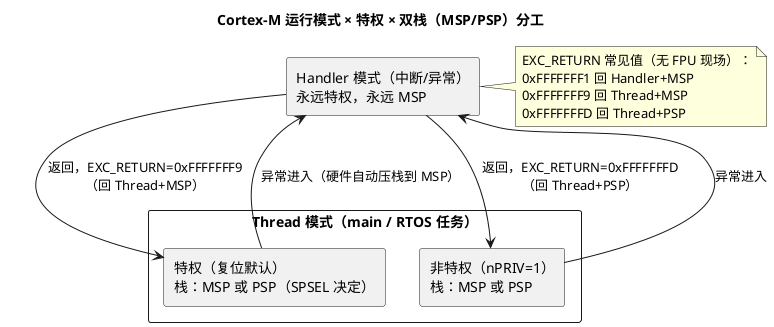

# ARM Cortex-M 寄存器与工作模式

> 一句话定位：读懂启动文件、RTOS 上下文切换与 HardFault 现场的第一步——认全 r0~r15、xPSR 三件套、PRIMASK 一族特殊寄存器，以及 Thread/Handler 双模式与 MSP/PSP 的分工（S32K 的 Cortex-M4/M7 同样适用）。
> 等级：L2 ｜ 前置：无

## 原理

Cortex-M 是 32 位 Load/Store 架构，只有 Thumb 一种执行状态（见 [02-Thumb指令](02-Thumb指令.md)）。程序员可见的寄存器分三组：**通用寄存器、状态寄存器（xPSR）、特殊寄存器**。

### 1. 通用寄存器 r0~r15

| 寄存器 | 名称 | 说明 |
|---|---|---|
| r0~r3 | 参数/返回寄存器 | AAPCS（ARM 调用约定）：传参、放返回值；调用者保存（caller-saved） |
| r4~r11 | 局部变量寄存器 | 被调用者保存（callee-saved），函数序言/尾声的 push/pop 主要是它们 |
| r12 | IP（Intra-Procedure scratch） | 暂存寄存器，调用者保存；跳转胶水代码（veneer）会借它用 |
| r13 | SP（Stack Pointer） | **分体（banked）为 MSP 和 PSP**，任一时刻只能用其一 |
| r14 | LR（Link Register） | 保存函数返回地址；**异常返回时装的是 EXC_RETURN 魔数** |
| r15 | PC（Program Counter） | 读出值带固定架构偏移；写它=跳转，目标 bit[0] 必须为 1 |

MSP（Main Stack Pointer，主栈指针）与 PSP（Process Stack Pointer，进程栈指针）的分工是 Cortex-M 的设计亮点：

- 复位后默认使用 MSP；
- **Handler 模式（中断/异常）永远使用 MSP**；
- Thread 模式下由 `CONTROL.SPSEL` 决定用 MSP 还是 PSP——RTOS 通常让任务跑在 PSP 上。

### 2. xPSR：APSR + IPSR + EPSR 三个视图

| 视图 | 字段 | 含义 |
|---|---|---|
| APSR（Application PSR） | N/Z/C/V | 负/零/进位/溢出，`cmp` 更新、条件跳转读取 |
| | Q | 饱和标志（DSP 饱和指令置位） |
| | GE[19:16] | Greater-Equal，M4/M7 的 DSP 并行指令产生、`sel` 指令消费 |
| IPSR（Interrupt PSR） | ISR_NUMBER[8:0] | 当前异常号：0=Thread 模式；n=异常 n；外设 IRQn = 异常号-16 |
| EPSR（Execution PSR） | T（bit24） | Thumb 位，**必须为 1**；被清零→INVSTATE UsageFault |
| | ICI/IT | 被打断的 LDM/STM 或 IT 块的继续位 |

注意：`mrs` 直接读 EPSR 恒为 0，T 位只有在调试器的 xPSR 视图里才看得见——不是芯片出问题。

### 3. 特殊寄存器（只能 MRS/MSR 访问）

| 寄存器 | 作用 | 典型用法 |
|---|---|---|
| PRIMASK | 1 位，屏蔽所有可配置优先级异常（只剩 NMI/HardFault） | `cpsid i` 关中断进临界区，`cpsie i` 恢复 |
| FAULTMASK | 1 位，连 HardFault 也屏蔽，只剩 NMI | fault 处理里临时压制；从异常返回时硬件自动清零 |
| BASEPRI | 屏蔽"优先级数值 ≥ BASEPRI"的中断；**0 = 不屏蔽** | RTOS 内核"只挡低优先级"的临界区；M4/M7 有，M0+ 没有 |
| CONTROL | bit0 SPSEL：0=MSP / 1=PSP；bit1 nPRIV：0=特权 / 1=非特权（仅 Thread 模式有意义） | 任务切到用户态：SPSEL=1 + nPRIV=1 |

### 4. 模式 × 特权 × 栈 的合法组合

- Thread + 特权：复位后的默认状态，裸机 main 全程在此；
- Thread + 非特权：RTOS 用户任务（配合 MPU 隔离）；
- Handler：永远特权、永远 MSP，无例外。



## 代码示例/解读

### 1. 用 C 内联汇编读/写这些寄存器（GCC 语法，S32DS 可直接用）

```c
#include <stdint.h>

uint32_t get_ipsr(void)        /* 当前异常号：0 = 线程态，n = Handler n */
{
    uint32_t v;
    __asm volatile ("mrs %0, ipsr" : "=r"(v));
    return v & 0x1FFu;         /* 只取 ISR_NUMBER 位域 */
}

uint32_t get_control(void)     /* bit0=SPSEL（0=MSP/1=PSP），bit1=nPRIV */
{
    uint32_t v;
    __asm volatile ("mrs %0, control" : "=r"(v));
    return v;
}

uint32_t get_psp(void)         /* RTOS 排查必看：任务栈指针 */
{
    uint32_t v;
    __asm volatile ("mrs %0, psp" : "=r"(v));
    return v;
}

void set_psp(uint32_t v)       /* 建任务栈时把栈顶装进 PSP */
{
    __asm volatile ("msr psp, %0" :: "r"(v));
}
```

### 2. 临界区：关中断的正确姿势

```asm
; ---- 最简单（不嵌套安全）----
cpsid i            ; PRIMASK=1，关所有可配置优先级中断
...                ; 临界区代码
cpsie i            ; PRIMASK=0，恢复

; ---- 嵌套安全的写法：先存旧值，恢复旧值 ----
mrs   r0, primask  ; 读出当前 PRIMASK（可能是 0 也可能是 1）
cpsid i            ; 关中断
...
msr   primask, r0  ; 恢复原值——外层若是关着的就还关着
```

### 3. RTOS 上下文切换里 MSP/PSP 的真实用法（PendSV 骨架）

```asm
PendSV_Handler:
    mrs   r0, psp          ; 任务跑在 PSP 上，先取任务栈指针
    stmdb r0!, {r4-r11}    ; 压 callee-saved 寄存器
                           ; （r0-r3/r12/LR/PC/xPSR 由硬件入栈时自动压到 MSP）
    ...                    ; 保存 r0 到 TCB、调度选下一个任务、从新 TCB 取 sp
    ldmia r0!, {r4-r11}    ; 恢复新任务的 r4-r11
    msr   psp, r0          ; 新任务的栈指针装回 PSP
    bx    lr               ; 返回，LR 里是 EXC_RETURN
                           ; 硬件按其值从 PSP 弹剩余 8 个字回到任务现场
```

## 易错点与陷阱

1. **BASEPRI=0 不是"屏蔽一切"而是"不屏蔽"**：数值越大优先级越低，BASEPRI 屏蔽的是"数值 ≥ 它"的中断。
2. **ARMv6-M（M0/M0+，如 S32K11x 小核）没有 BASEPRI/FAULTMASK**，只有 PRIMASK；把 M4 的临界区代码平移过去访问这些寄存器属于不可预测行为，以核手册为准。
3. **MRS 读 EPSR 恒为 0**：T 位看不见不代表被清零；T 位真被清零会在 `bx` 到 bit[0]=0 的地址时以 INVSTATE UsageFault 现身。
4. **中断里的 LR 不是返回地址**：它装的是 EXC_RETURN（0xFFFFFFxx），把它当普通函数地址用会跳飞；嵌套中断手动压栈时 LR 要单独处理。
5. **非特权态改不了这些**：PRIMASK/BASEPRI/CONTROL.nPRIV 只能在特权态写；任务想回特权态必须走 SVC（Supervisor Call）。
6. **中断里读 SP 读到的是 MSP**，任务崩溃现场要查 PSP——调试时先看 `CONTROL.SPSEL` 确认当前用的是哪个栈，再决定 dump 哪块内存。
7. **GE/Q 标志位只有 DSP/饱和指令才更新**：M0+ 上没有这些指令，相关内建函数不可用。

## 面试高频题

1. **r13/r14/r15 分别是什么？为什么 SP 有两个？**
   答：SP、LR、PC。SP 分体为 MSP/PSP：中断/异常固定用 MSP，应用任务可用 PSP，实现"内核栈与任务栈隔离"——中断不侵蚀任务栈、上下文切换只需处理任务自己的栈。

2. **APSR/IPSR/EPSR 各放什么？**
   答：APSR 是条件标志 N/Z/C/V/Q/GE；IPSR 是当前异常号（0=线程态，外设 IRQn=异常号-16）；EPSR 是 T 位与 ICI/IT 继续位。三者拼成 xPSR，异常入栈时作为一个字自动保存。

3. **PRIMASK、FAULTMASK、BASEPRI 的区别？裸机临界区用哪个？**
   答：PRIMASK 1 位掩掉所有可配置优先级异常；FAULTMASK 连 HardFault 也掩（异常返回自动清零）；BASEPRI 按优先级数值阈值掩。裸机一般 `cpsid i`（PRIMASK）最简单；RTOS 内核常用 BASEPRI 只挡内核级以下中断，把高优先级中断留给时敏任务。

4. **Thread/Handler 模式与特权/非特权是什么关系？CONTROL 寄存器管什么？**
   答：Handler 模式永远特权、永远 MSP；Thread 模式可特权可非特权、可用 MSP 或 PSP，由 CONTROL 的 SPSEL/nPRIV 两位控制。复位默认 Thread+特权+MSP。

5. **中断里为什么硬件自动压 8 个字？压到哪个栈？**
   答：r0-r3、r12、LR、PC、xPSR 是 AAPCS 的调用者保存组，硬件自动压栈后 ISR 就能直接像 C 函数一样运行；压到 MSP（Handler 模式固定 MSP）。任务用 PSP 时这两块栈互不干扰。

## 延伸

- 下一篇：[02-Thumb指令](02-Thumb指令.md)
- [03-启动文件startup解读](03-启动文件startup解读.md)
- [ARM Cortex-M 体系结构](../../../../02-芯片与体系结构/1-L1基础/ARM-Cortex-M/README.md)
- [S32K 平台](../../../../02-芯片与体系结构/1-L1基础/S32K平台/README.md)
- [异常与 Trap](../../../../02-芯片与体系结构/3-L3高级/异常与Trap/README.md)
