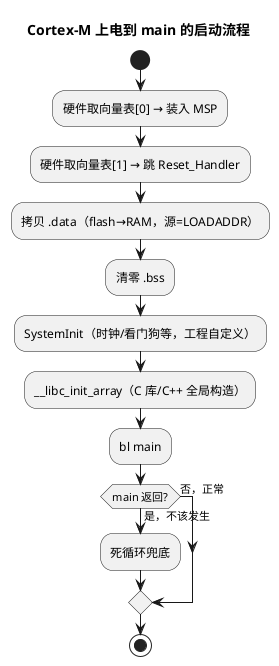

# S32K 启动文件 startup 解读

> 一句话定位：从上电到 `main` 之间那几百行汇编——向量表前两项、Reset_Handler 骨架、weak/alias 兜底机制，以及它们与链接脚本 `.isr_vector`、`LOADADDR` 的配合（以 S32 SDK 的 GCC 版 startup 为骨架，IAR/ARM Compiler 思路相同）。
> 等级：L2 ｜ 前置：[02-Thumb指令](02-Thumb指令.md)

## 原理

### 1. 上电第一件事：硬件取向量表

Cortex-M 复位后硬件自己完成两步（软件不参与）：

1. 从向量表基址（默认 0x00000000，可由 VTOR 重定位）取**第 0 项**装入 MSP——所以中断/异常一开就能压栈；
2. 取**第 1 项**作为 PC，跳进 `Reset_Handler`。

向量表布局（架构固定的前 16 项 + 芯片外设中断）：

| 下标 | 内容 | 说明 |
|---|---|---|
| 0 | MSP 初值 | 链接脚本给的栈顶（如 `__StackTop`），不是代码地址！ |
| 1 | Reset_Handler | 复位入口 |
| 2~15 | NMI / HardFault / MemManage / BusFault / UsageFault / x4 保留 / SVCall / DebugMon / 保留 / PendSV / SysTick | ARMv7-M 架构固定 |
| 16+ | 外设中断（LPUART/LPTMR/CAN/FTM…） | **顺序按芯片参考手册的中断向量映射表填**，IRQn 即下标-16 |

### 2. Reset_Handler 要做的事

把 `.data` 从 flash 搬到 RAM、清 `.bss`、可选的 `SystemInit`（时钟等板级初始化）、`__libc_init_array`（C 运行库/C++ 全局构造）、`bl main`、兜底死循环。



### 3. weak + alias：未实现中断的兜底

startup 把几十上百个中断 handler 都声明成 **weak（弱符号）**并**别名（alias）到 `Default_Handler`**：链接时谁提供了同名强符号（比如你在 C 里写了 `void LPUART1_IRQHandler(void)`）就用谁的；没写的全部落进 `Default_Handler` 的死循环。

**诊断价值**：程序卡死在 `Default_Handler`（或叫 `DefaultISR`，随 SDK）= 有中断被使能但没写 handler，或向量表填错——这是新手工程"跑着跑着死了"的头号来源之一。定位方法：调试器暂停，读 `IPSR` / `SCB->ICSR` 的 `VECTACTIVE` 字段得异常号，减 16 得 IRQn，反查芯片头文件的 `IRQn_Type` 枚举即知是哪个外设。

## 代码示例/解读

### 1. 向量表（S32 SDK 的 startup_S32Kxxx.S 骨架，有删减）

```asm
    .section .isr_vector, "a", %progbits   ; 只读数据段，链接脚本保证放 flash 最前
    .type __isr_vector, %object
__isr_vector:
    .long   __StackTop          /* [0]  MSP 初值：链接脚本 _estack/__StackTop */
    .long   Reset_Handler       /* [1]  复位入口 */
    .long   NMI_Handler         /* [2]  以下为架构固定异常 */
    .long   HardFault_Handler   /* [3] */
    .long   MemManage_Handler   /* [4] */
    .long   BusFault_Handler    /* [5] */
    .long   UsageFault_Handler  /* [6] */
    .long   0                   /* [7]  保留 */
    .long   0                   /* [8]  保留 */
    .long   0                   /* [9]  保留 */
    .long   0                   /* [10] 保留 */
    .long   SVC_Handler         /* [11] SVCall，RTOS 系统调用入口 */
    .long   DebugMon_Handler    /* [12] */
    .long   0                   /* [13] 保留 */
    .long   PendSV_Handler      /* [14] RTOS 上下文切换标配 */
    .long   SysTick_Handler     /* [15] RTOS 心跳 */
    /* [16..] 外设中断：LPUART/LPTMR/CAN/FTM/DMA...
       顺序必须与芯片参考手册的中断向量映射表一致，
       每个 .long 都有对应的 weak 别名（见下） */
```

### 2. Reset_Handler 逐行注释

```asm
    .section .text.Reset_Handler
    .weak  Reset_Handler
    .type  Reset_Handler, %function
Reset_Handler:
    /* 有的工程（S32K SDK 常见）开头先关看门狗——厂商工程行为，非架构要求 */

    /* ---- 拷贝 .data：flash 里的初值 → RAM ---- */
    ldr   r0, =_sidata         /* r0 = .data 装载地址 LMA（flash 中的副本） */
    ldr   r1, =_sdata          /* r1 = .data 运行地址 VMA（RAM 起点） */
    ldr   r2, =_edata          /* r2 = .data 结束地址 */
1:  cmp   r1, r2               /* 还没搬完？ */
    bcs   2f                   /* r1 >= r2 → 搬完了 */
    ldr   r3, [r0], #4         /* 从 flash 取一个字，r0 后移 */
    str   r3, [r1], #4         /* 写入 RAM，r1 后移 */
    b     1b
    /* ---- 清零 .bss：C 标准要求全局/静态未初始化变量为 0 ---- */
2:  ldr   r1, =_sbss           /* r1 = .bss 起点 */
    ldr   r2, =_ebss           /* r2 = .bss 结束 */
    movs  r0, #0
3:  cmp   r1, r2
    bcs   4f
    str   r0, [r1], #4         /* 逐字清零 */
    b     3b
    /* ---- 板级/系统初始化 ---- */
4:  bl    SystemInit           /* 时钟、FPU 使能等（S32K SDK 里在 system_S32Kxxx.c）*/
    bl    __libc_init_array    /* C 运行库初始化 + C++ 全局构造 + __attribute__((constructor)) */
    /* ---- 进入应用 ---- */
    bl    main                 /* main 不该返回 */
    b     .                    /* 万一返回：原地死循环兜底 */
```

### 3. weak + alias 的两种写法

```asm
    /* 汇编写法（GCC，S32 SDK startup 用的就是它） */
    .weak   Default_Handler
Default_Handler:               /* 兜底：原地死循环，有的工程会在这里复位 */
    b       .
    .weak   LPUART1_IRQHandler             /* 声明弱符号 */
    .thumb_set LPUART1_IRQHandler, Default_Handler   /* 别名指向兜底 */
```

```c
/* C 等价写法（GCC/armclang），IAR 用 __weak 关键字 */
void LPUART1_IRQHandler(void) __attribute__((weak, alias("Default_Handler")));
/* 工程里再写一个同名函数即可覆盖；名字拼错 = 没覆盖 = 落进 Default_Handler */
```

### 4. 与链接脚本的衔接（S32K GCC .ld 骨架）

```ld
MEMORY
{
  FLASH (rx)  : ORIGIN = 0x00000000, LENGTH = 512K    /* 以你型号手册的存储器映射为准 */
  RAM   (rwx) : ORIGIN = 0x1FFF8000, LENGTH = 64K
}

SECTIONS
{
  .isr_vector :                                   /* 向量表必须是 flash 第一个段 */
  {
    . = ALIGN(4);
    KEEP(*(.isr_vector))                          /* KEEP 防 --gc-sections 误删 */
    . = ALIGN(4);
  } > FLASH

  .text : { *(.text*) *(.rodata*) } > FLASH       /* 代码与常量 */

  .data :
  {
    . = ALIGN(4);
    _sdata = .;                                   /* VMA：RAM 里的起点 */
    *(.data*)
    . = ALIGN(4);
    _edata = .;
  } > RAM AT > FLASH                              /* LMA 在 flash，VMA 在 RAM */
  _sidata = LOADADDR(.data);                      /* 搬运源地址 = LMA */

  .bss :
  {
    _sbss = .;
    *(.bss*) *(COMMON)
    _ebss = .;
  } > RAM

  _estack = ORIGIN(RAM) + LENGTH(RAM);            /* __StackTop：喂给向量表[0] */
}
```

三个关键概念：

- **VMA（运行地址）/LMA（装载地址）**：`.data` 两址不同，startup 的搬运就是把 LMA 复制到 VMA；
- **`LOADADDR(.data)`**：链接器算好的 LMA，即汇编里的 `_sidata`；
- **`KEEP`**：向量表没有代码引用它，不加 KEEP 会被 `--gc-sections` 当垃圾回收，芯片直接起不来。

### 5. 卡在 Default_Handler 时的快速定位

```c
/* 进阶做法：把兜底写成 C，主动留下罪证 */
void Default_Handler(void)
{
    volatile uint32_t irq = (SCB->ICSR & SCB_ICSR_VECTACTIVE_Msk) - 16u;
    /* 断点停在这里，irq 即外设 IRQn；
       裸机也可在调试器里直接看 IPSR（见 01 篇） */
    for (;;) { __asm volatile("cpsid i"); }
}
```

## 易错点与陷阱

1. **向量表第 0 项不是 Reset_Handler**，是 MSP 初值。手写 bootloader 跳 APP 时必须：取 APP 向量表[0]装 MSP（`msr msp, r0`）、设 VTOR 指向 APP 向量表、再取向量表[1]跳过去——少一步就是玄学跑飞。
2. **`.data` 搬运方向/源地址错**：链接脚本没写 `AT > FLASH` 时 LMA=VMA，`_sidata` 指到 RAM，"搬了个寂寞"，全局变量初值全是随机数——症状是"上电偶尔不对，复位几次又好"。
3. **忘了 `__libc_init_array`**：用了 newlib 的部分特性（malloc、C++ 全局对象、`constructor` 属性）时行为异常；纯裸机小工程可能恰好没事，但别赌。
4. **写错 handler 名 = 没写**：`LPUART1_IRQHandler` 拼错一个字母，weak 机制让它"合法地"落进 Default_Handler，编译链接零告警。命名从启动文件/头文件里复制，别手敲。
5. **`main` 返回后跑飞**：startup 里 `bl main` 后必须有死循环兜底；工程上更建议 main 里主循环永不退出。
6. **IRQn 与向量表下标差 16**：`IRQn_Type` 枚举从 0 数，向量表从 16 数外设项；手填向量表/手算 VECTACTIVE 时最容易错这一下。
7. **工具链差异**：GCC 用 `.isr_vector` 段 + `.thumb_set`；IAR 用 `__vector_table` + `__weak`；armclang/GCC 也可能用 `__attribute__((section))` 的 C 数组写法。移植时别把段名和机制硬搬。
8. **栈顶必须是"满递减栈的底"**：MSP 初值应指向 RAM 末尾（高地址），且 8 字节对齐——压栈先减后存，方向反了第一次中断就写穿。

## 面试高频题

1. **上电到 main 之间发生了什么？**
   答：硬件取向量表[0]/[1]装 MSP、跳 Reset_Handler → 拷 .data、清 .bss → SystemInit（时钟等）→ __libc_init_array → main；main 返回则死循环兜底。

2. **向量表前两项是什么？为什么 SP 放在第 0 项？**
   答：MSP 初值与 Reset_Handler 入口。硬件取表时自动装 MSP，保证进入任何异常（包括最早的 HardFault）都有栈可压，软件无需先设栈。

3. **.data/.bss 各是什么？谁在什么时候初始化？**
   答：.data = 有初值的全局/静态变量，占 RAM、初值存 flash，Reset_Handler 搬运（源=LOADADDR）；.bss = 未初始化（或初值为 0）的全局/静态，Reset_Handler 清零。栈和堆不在这两段里，见 [五大内存区](../../内存管理/01-五大内存区.md)。

4. **weak/alias 机制怎么工作？进 Default_Handler 说明什么、怎么定位？**
   答：链接器优先选强符号，弱符号兜底到 Default_Handler。进 Default_Handler = 某中断使能但没写 handler 或表填错；调试器读 IPSR/ICSR.VECTACTIVE 得异常号，减 16 反查 IRQn 枚举定位外设。

5. **LOADADDR、_sidata、_sdata 分别是什么？**
   答：_sdata 是 .data 的 VMA（RAM 起点），LOADADDR(.data) 是 LMA（flash 中副本地址），汇编里取该值赋给 _sidata 作搬运源；VMA/LMA 分离让"初值存 flash、变量住 RAM"同时成立。

## 延伸

- [01-寄存器与模式](01-寄存器与模式.md)
- [02-Thumb指令](02-Thumb指令.md)
- [五大内存区（.data/.bss）](../../内存管理/01-五大内存区.md)
- [启动流程](../../../../02-芯片与体系结构/2-L2进阶/启动流程/README.md)
- [S32K 平台](../../../../02-芯片与体系结构/1-L1基础/S32K平台/README.md)
