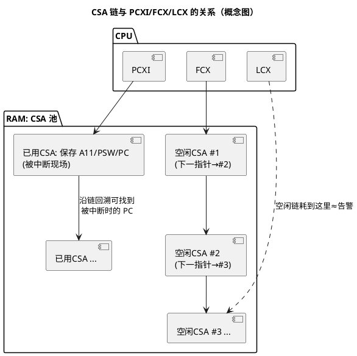

# TriCore 寄存器与寻址模式

> 一句话定位：读懂 startup 与 trap 代码的第一步——认全 TriCore（TC1.6P）的 D/A/PC/PSW/PCXI 寄存器和 6 种寻址写法。
> 等级：L2 ｜ 前置：无

## 原理

TriCore（英飞凌 AURIX TC3xx 系列核，如 TC377 的 TC1.6P）是 32 位加载/存储（Load/Store）架构：**算术逻辑只发生在寄存器之间，访存必须走 ld/st**。通用寄存器分两组：

| 组 | 寄存器 | 说明 |
|---|---|---|
| 数据寄存器 | D0~D15 | 算术/逻辑/位操作主战场；32 位（部分指令支持 64 位寄存器对，如 `d1:d0`） |
| 地址寄存器 | A0~A15 | 存地址、做指针；也参与加减与逻辑运算 |

其中有几个寄存器被架构或编译器"钦定"了角色，读汇编时必须条件反射：

| 寄存器 | 角色 | 备注 |
|---|---|---|
| A10 | SP（Stack Pointer，栈指针） | 栈向低地址生长；startup 第一件事就是给它赋值 |
| A11 | RA（Return Address，返回地址） | `call` 自动用它保存返回地址，`ret` 从它取 |
| A15 | 常被编译器用作小数据区（small data）基址 | 具体约定看编译器（GHS/TASKING/GCC）手册，别默认 |
| D15 | 常用作系统调用号/中间跳转寄存器 | 约定俗成，非硬件强制 |

**PC 与 PSW（Program Status Word，程序状态字）**：

- PC：程序计数器。软件一般不能直接读写，通过 `call/j/jl/ret` 和 trap 隐式修改；崩溃定位时从 CSA 里"挖"出被中断时刻的 PC（见 [04-trap入口代码](04-trap入口代码.md)）。
- PSW：32 位状态字，常用字段（概念级）：
  - **CC（Condition Code）**：比较与条件跳转的依据，`cmp` 更新它，`jeq/jne/jge/...` 读它；
  - **IO**：IO 特权级，访问外设寄存器要够级；
  - **CDC（Call Depth Counter）**：调用深度计数器，超限触发上下文类 trap（可用来抓失控递归）。
  - PSW 分"高字/低字"的完整位定义各核版本略有差异，**精确字段与位号以所用芯片 UM（用户手册）的 PSW 章节为准**，本笔记只记"读 trap 日志时最常看 CC/IO/CDC"。

**CSA 链与 PCXI/FCX/LCX**（TriCore 最有特色的部分）：

TriCore 的函数调用不靠"压栈"，靠硬件管理的**上下文**（Context）：

- **CSA（Context Save Area，上下文保存区）**：链接器在 RAM 里划出的一块区域，每个 CSA 单元固定 16 个字，保存一份寄存器现场（上/下文内容不同）。
- **FCX（Free Context List head pointer）**：指向空闲 CSA 链表的表头。每个空闲 CSA 的第一个字存"下一个空闲 CSA 的地址"，形成单向链表。
- **LCX（Limit Context pointer）**：指向空闲链表靠后的"警戒线"。当空闲链表缩短、FCX 推进到 LCX 附近时，硬件触发 CSA 耗尽类 trap——这是"栈溢出"在 TriCore 上的典型形态之一。
- **PCXI（Previous Context Information）**：当前 CPU 里"上一个上下文"的档案：PCX 字段指向最近一次被换出的现场所在的 CSA，并带上下文类型（Upper/Lower Context）等标志。`call`/中断/`syscall` 都会自动走这套机制。



## 代码示例/解读

### 1. 各类寻址模式一行示例

```asm
; ---- 立即数寻址（Immediate）----
mov  d0, #5            ; d0 = 5，常数直接写在指令里
movh.a a4, #0x7000     ; a4 高 16 位装入立即数，低 16 位清零（构造 32 位地址第一步）
lea  a4, [a4]@los(TAB) ; 配合 lea 补低 16 位，最终 a4 = &TAB（典型两步取地址法）
; 用途：赋常数、取全局符号地址。注意 32 位立即数装不满一条指令，所以要 movh+lea 组合。

; ---- 寄存器间接 [An] ----
ld.w d0, [a4]          ; d0 = *(u32*)a4
st.w [a4], d0          ; *(u32*)a4 = d0
; 用途：访问指针指向的单个变量。

; ---- 基址 + 常量偏移 [An+c] ----
ld.w d0, [a4+8]        ; d0 = *(u32*)(a4+8)，即结构体第 3 个字成员
; 用途：结构体成员访问，偏移由编译器按成员偏移算好。

; ---- 后增量 [An+] / 预减量 [-An] ----
ld.w d0, [a4+]         ; d0 = *(u32*)a4;  a4 += 4（后缀决定步长：.b/.h/.w/.d 各不同）
st.w [a4+], d0         ; 存后 a4 前进一个字
st.w [-a10], d0        ; 先 a4 减 4 再存 —— 手写栈操作、函数序言常见
; 用途：数组遍历、.data 拷贝循环（见 03 篇）、入栈。

; ---- 基址 + 变址 [An+Ak]（记法上即 [A0+P]，P 泛指第二个地址寄存器）----
ld.w d0, [a4+a5]       ; d0 = *(u32*)(a4+a5)，a4 基址不动，a5 做下标
; 用途：数组/查表 d0 = base[i]，a5 存 i*4，循环里只改 a5。

; ---- 位寻址 [[An]]（双中括号）----
and  d0, [[a4]]        ; 对 a4 指向的"某一位串"做位操作
; 位地址编码规则：地址低 2 位 ×8 = 位在字内的偏移，高 30 位 = 字地址。
; 即 [[0x3000'0003]] 定位到字 0x3000'0000 的第 24 位起。
; 用途：编译器把 C 的位域操作编译成一条指令；读驱动代码见 [[...]] 就想"这是在玩位"。
```

### 2. 寄存器角色在真实代码里的样子

```asm
; 典型函数序言/尾声（编译器生成，概念骨架）
func:
  movh.a a15, #@his(__SDATA1)   ; 装小数据区基址（编译器约定，GHS/TASKING 细节不同）
  lea    a15, [a15]@los(__SDATA1)
  call   sub_func               ; 返回地址进 a11，现场进 CSA（无需手写压栈！）
  ...
  ret                           ; 从 a11 取返回地址，CSA 恢复现场

; 两个名字要认得（链接脚本/startup 里常见）：
;   __ISTK : 中断栈顶，startup 会把它装进 a10
;   __USTK : 用户/任务栈顶（有 OS 时切换）
```

### 3. 用调试器看 CSA 链（排查崩溃的手感）

```text
(gdb) p/x $pcxi            # 读 PCXI，取 PCX 字段 → 得到最近现场所在 CSA 地址
(gdb) x/4wx <CSA地址>      # CSA 第 0 字 = 上一层的 PCXI（继续回溯）
                           # 随后的字里可挖出被换出的 PC / PSW / A11 / D 寄存器
; 沿 PCXI 链一层层挖，就能还原"崩溃时调用链"，等价于 ARM 上的回溯栈帧。
```

## 易错点与陷阱

1. **把 A10 当普通寄存器用**：中断/异常处理器里随手 `mov a10, xxx` 会毁掉栈，编译器生成的代码不会犯，人手写内联汇编容易犯。
2. **以为 call 会压栈**：TriCore 的 `call` 走 CSA，不写 SP；如果工程把 CSA 池配得太小，深调用链触发的是 CSA 类 trap，不是栈溢出——排查方向完全不同。
3. **后增量步长跟数据宽度走**：`ld.b [a4+]` 只 +1，`ld.d [a4+]` +8；拷贝循环里宽度配错，指针立刻错位。
4. **位寻址 [[...]] 误当普通间接寻址**：双括号里低 2 位是"位偏移"不是地址偏移，直接套指针思维算地址必错。
5. **PSW 位号背了就写**：不同 TC1.6.x 小版本 PSW 保留位不同，读 UM 对表，笔记/注释里写"字段含义 + 查 UM 章节"最稳。
6. **A15 当全局指针是约定不是架构**：换编译器或换内存模型（small/medium）后基址寄存器和段名都会变，读工程汇编先看 map 文件确认。

## 面试高频题

1. **TriCore 为什么函数调用不需要手写压栈指令？**
   答：`call` 触发硬件自动把 Upper Context（PC/PSW/A10~A15、D8~D15 等）存入 FCX 指向的空闲 CSA，PCXI 记录该 CSA；`ret` 反向恢复。栈（A10）主要留给局部变量和编译器临时量。

2. **FCX 和 LCX 分别是什么？CSA 耗尽会怎样？**
   答：FCX 指向空闲 CSA 链表头，LCX 是该链表上的警戒指针；当空闲链缩短逼近 LCX，硬件触发 CSA 相关 trap（典型为 Class 1 内部保护类），OS/启动代码借此报告或复位。可顺带提：增大 CSA 池或减少深调用可缓解。

3. **A10、A11 分别是什么？**
   答：A10 是栈指针 SP，A11 是返回地址寄存器 RA——`call` 把返回地址放 A11 再切上下文，`ret` 用 A11 返回。

4. **比较和条件跳转在 TriCore 里怎么配合？**
   答：`cmp` 更新 PSW 里的 CC 条件码，`jeq/jne/jge/jlt/jugt/...` 按 CC 跳转；没有 x86 那种"cmp+jcc 融合"，也没有标志位跨多条指令的模糊用法，读代码时紧跟 cmp 找跳转依据。

5. **[[a4]] 和 [a4] 的区别？**
   答：[a4] 是普通间接寻址，操作整个数据；[[a4]] 是位寻址，地址低 2 位 ×8 决定字内位偏移，供单条位操作指令（and/or/xor/insert 等）使用。

6. **调试 TC377 崩溃时如何用 PCXI 还原调用链？**
   答：读 PCXI 的 PCX 字段得到上一层现场 CSA 地址 → 该 CSA 第 0 字又是更上一层 PCXI → 逐层回溯，同时取出各层保存的 PC/A11，与 map 文件对照得到崩溃调用链。

## 延伸

- [TriCore 架构总览](../../../../02-芯片与体系结构/3-L3高级/TriCore架构/README.md)
- [TC377 平台](../../../../02-芯片与体系结构/2-L2进阶/TC377平台/README.md)
- [异常与 Trap](../../../../02-芯片与体系结构/3-L3高级/异常与Trap/README.md)
- 下一篇：[02-常用指令集](02-常用指令集.md)
