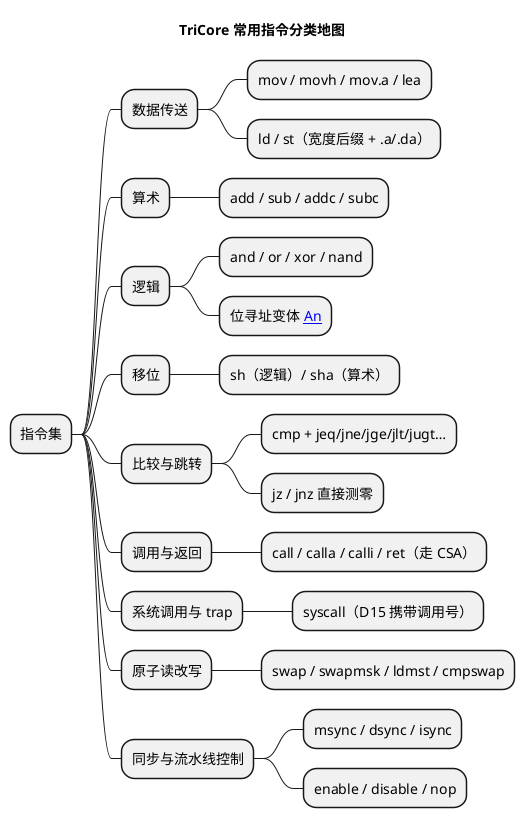

# TriCore 常用指令集：按类认脸

> 一句话定位：把 startup/trap/OS 调度里高频出现的 TriCore（TC1.6P）指令按九类认一遍——每类记住"长什么样、什么时候会遇到"，不确定的助记细节查 ISA 手册，不背参数表。
> 等级：L2 ｜ 前置：[01-寄存器与寻址](01-寄存器与寻址.md)

## 原理

TriCore 指令集先记三条"世界观"：

1. **加载/存储（Load/Store）架构**：只有 `ld/st` 碰内存，算术逻辑全在寄存器之间做——所以读到"运算指令"时不用怀疑，操作数必然已经在寄存器里。
2. **助记符带后缀，后缀先翻译**：`.b/.h/.w/.d` = 操作 1/2/4/8 字节（`.d` 用寄存器对，如 `d1:d0`）；`.a` = 目的为地址寄存器（如 `ld.a`）；`.da` = 地址寄存器对（如 `ld.da`）。先读后缀再读助记符，语义就清楚一半。
3. **比较结果不落寄存器**：`cmp` 只更新 PSW 的 CC 条件码，条件跳转读 CC；另有 `jz/jnz` 直接测寄存器是否为 0，连 `cmp` 都省。地址比较常用无符号条件（`jugt/jule`），有符号比较用 `jge/jlt`。



## 代码示例/解读

### 1. 数据传送：mov / movh / lea / ld / st

```asm
; ---- 常数与地址的构造 ----
mov    d0, #0x1234        ; d0 = 0x1234：16 位立即数直接装（32 位常数装不进一条指令）
movh   d1, #0x8000        ; d1 高 16 位 ← 立即数，低 16 位清零 → d1 = 0x8000_0000
movh.a a4, #0x7000        ; 地址寄存器版：a4 = 0x7000_0000（构造 32 位地址第一步）
lea    a4, [a4]@los(TAB)  ; 补低 16 位 → a4 = &TAB（"movh.a + lea"两步取地址法）
mov.a  a5, d0             ; 数据寄存器 → 地址寄存器（要当指针用先转 A）
mov.d  d0, a5             ; 地址寄存器 → 数据寄存器（要比较/运算时转回来）

; ---- 访存全家桶：宽度后缀决定步长，.a/.da 决定目的类型 ----
ld.b   d0, [a4]           ; 读 1 字节（寻址模式细节见 01 篇）
ld.h   d0, [a4]           ; 读半字（2 字节）
ld.w   d0, [a4]           ; 读字（4 字节）——最常见
ld.d   d0, [a4]           ; 读双字到寄存器对 d1:d0（64 位数据/long long）
ld.a   a5, [a4]           ; 读 32 位进地址寄存器——取指针、链表遍历的标配
ld.da  a4, [a5]           ; 读双字进地址寄存器对 a5:a4
st.b   [a4], d0           ; 写 1 字节（只动 d0 最低字节）
st.w   [a4], d0           ; 写字
st.d   [a4], d0           ; 写寄存器对 d1:d0
st.a   [a4], a5           ; 把地址寄存器的值存进内存
```

什么时候会遇到：**任何汇编的头两行都是地址构造（movh.a + lea），任何循环里都有 `ld/st` + 后增量 `[a4+]`**。读 startup 的 .data 拷贝循环、读 OS 的队列操作，全是这一类。

### 2. 算术：add / sub / addc / subc

```asm
add    d0, d1, d2         ; d0 = d1 + d2（也有 d0 += d1 的双操作数短编码）
addi   d0, d1, #16        ; 加立即数有专门编码，别看到 addi 愣住
add.a  a4, a4, #8         ; 地址寄存器加法：指针前进 8 字节（结构体数组遍历）
sub    d0, d1, d2         ; d0 = d1 - d2
addc   d0, d4, d5         ; 带进位加（用 PSW.C）：64 位加法的高 32 位靠它
subc   d0, d4, d5         ; 带借位减：多字长运算的配套
; 64 位加减 = 低字 add/sub + 高字 addc/subc，与手写 C 的多精度算法同构
```

什么时候会遇到：指针步进（`add.a`）、数组下标计算；`addc/subc` 只在 64 位定点运算、CRC/哈希的手写优化里出现，日常 C 代码编译出来很少见。

### 3. 逻辑：and / or / xor / nand

```asm
and    d0, d0, #0x0F      ; 掩码取低 4 位
or     d0, d0, #0x80      ; 置位某位
xor    d0, d0, d0         ; 清零寄存器的经典短写法（等效 mov d0, #0）
nand   d0, d1, d2         ; 与非——别的架构少见，TriCore 原生支持
and    d0, [[a4]]         ; 位寻址版：对 a4 指向的位串按位与（位寻址规则见 01 篇）
or     d0, [[a4]]         ; 对单个位域做"读-改-写"的单条指令形态
```

什么时候会遇到：外设寄存器置位/清位（配 `[[...]]` 位寻址）、位标志判断；`nand` 多出自编译器生成的位运算化简，看到别懵——就是 `~(d1 & d2)`。

### 4. 移位：sh / sha

```asm
sh     d0, d0, #4         ; 逻辑移位：左移 4（无符号乘 16），空位补 0
sha    d0, d0, #28        ; 算术右移 28：补符号位——signed 除 2^n 的标配
sha    d0, d1             ; 移位数放寄存器里（有效位数与语义细节查 ISA 手册）
sh     d1:d0, d2          ; 64 位寄存器对整体移位：定点缩放/多精度运算会遇到
; 记法：sh = shift logical（补 0），sha = shift arithmetic（右移补符号）；
;       算术"左"移与逻辑左移效果相同，区别只在右移。
```

什么时候会遇到：定点数缩放（`* 2^-n` 编译成 sha）、位域拼包（CAN 报文/DLL 信号提取）、除法优化（除以常数被编译成一串移位加减）。

### 5. 比较与跳转：cmp + 条件跳转

```asm
cmp    d0, d1             ; 只更新 PSW.CC，不写回寄存器
jeq    label              ; d0 == d1
jne    label              ; d0 != d1
jge    label              ; 有符号 >=（与 jlt 成对）
jlt    label              ; 有符号 <
jugt   label              ; 无符号 >——比较地址/指针用它！
jule   label              ; 无符号 <=

jz     d0, label          ; 不用 cmp：直接测 d0 是否为 0（循环哨兵、判空指针）
jnz    d0, label          ; d0 != 0 跳
j      label              ; 无条件跳

; ⚠ 注意：jl 不是"小于跳"！jl 是 jump-and-link（见下一节），
;    "有符号小于"的助记符是 jlt。这两个是 TriCore 阅读中最经典的认脸坑。
```

什么时候会遇到：所有循环边界（`cmp + jlt`）、拷贝完成判断（`jz 计数器`）、指针判空。读循环先找"谁在改计数器、谁在测零"。

### 6. 调用与返回：call 家族与 CSA 的关系

```asm
call   sub_func           ; 返回地址 → A11，Upper Context 自动存入空闲 CSA
                          ; （所以函数开头没有一串压栈指令——硬件干了，见 01 篇）
calla  far_func           ; 32 位绝对地址调用：目标很远（跨段）时用
calli  a4                 ; 间接调用：目标地址在 a4——C 函数指针就编译成它
jl     a5, func           ; 跳转并链接：返回地址存进 a5 指定寄存器，不切上下文
                          ; （跳转表/尾调用/编译器优化会见，别当成"小于"）
ret                      ; 从 A11 取返回地址，同时从 CSA 恢复 Upper Context
```

什么时候会遇到：读反汇编时函数边界就靠 `call/ret` 对认；回调注册表初始化一排 `calli`；OS 任务切换代码里手写 `jl` 挪 PC。**call/ret 与 CSA 的联动**是 TriCore 面试最爱：call 保存 Upper Context（PC/PSW/A10~A15、D8~D15）到 CSA，ret 反向恢复，A10 栈主要留给局部变量。

### 7. 系统调用与 trap 触发：syscall

```asm
mov    d15, #4            ; 系统调用号放 D15（ABI 约定，编号由 OS 自定义）
syscall                   ; 触发 Class 4 trap → 经 BTV 向量表进 OS 的服务分发入口
debug                     ; 附加一条：主动进入调试模式（断点/调试器插的 就是它）
```

什么时候会遇到：AUTOSAR OS 的很多 API（任务激活、关中断进入核互斥区等）在 TriCore 上就编译成 `mov d15, #n; syscall` 序列；调试时下的软件断点对应 `debug`。trap 分类与处理骨架见 [04-trap入口代码](04-trap入口代码.md)。

### 8. 多核原子操作：swap / swapmsk / ldmst / cmpswap

TC377 三个核共享内存，跨核标志位、信号量必须用"读改写不可插队"的原子指令（助记符与操作数排列在 GHS/TASKING/GCC 间略有出入，以所用工具链手册为准）：

```asm
swap.w     d0, [a4]       ; 原子交换：d0 ↔ *a4 一步完成
                           ; 经典用途：信号量获取——把"占用"值换进去，旧值换出来判断
swapmsk.w  d0, d1, [a4]   ; 原子"读 + 按掩码改写"：旧值回 d0，按 d1 掩码只动指定位
                           ; 经典用途：跨核事件标志位的 test-and-set / 清位
ldmst.w    d0, d1, [a4]   ; 不可打断的读-改-写：用一对寄存器给"掩码 + 新值"，
                           ; 合并后写回——改外设寄存器位域专用
cmpswap.w  d0, d1, [a4]   ; 比较并交换（CAS 原语）：*a4 == d0 时才写入 d1
```

什么时候会遇到：OS 的资源锁/核间事件（`swapmsk` 最常见）、MCAL 改外设位域（`ldmst`）、无锁队列（`cmpswap`）。**单核内它们保证"不被中断/异常插队"；跨核的全局原子性保证条款以芯片 UM 的多核原子章节为准**——写跨核代码前必查。

### 9. 同步与流水线控制：msync / dsync / isync

```asm
enable                    ; 开全局中断（PSW.IE ← 1）
disable                   ; 关全局中断（PSW.IE ← 0）——临界区、掉电序列第一步
msync                     ; 等此前发出的访存（含预取）全部落地
                          ; 经典组合 "msync; disable; …" 出现在低功耗/安全下电序列
dsync                     ; 等此前指令（含数据访问）全部完成——上下文切换、进trap处理前后
isync                     ; 指令同步：清流水线——自修改代码、改完关键系统寄存器后用
nop                       ; 占位/对齐；真延时看指令周期表，别拿 nop 数数
```

什么时候会遇到：OS 调度器与 idle 代码（`msync; disable` 组合）、内存保护/系统寄存器配置（`mtsr` 之后跟 `isync`）、安全下电序列。三条 sync 的精确语义差别以 ISA 手册的 Synchronization 章节为准，笔记里记"msync 管访存收尾、isync 管流水线作废"即可。

## 易错点与陷阱

1. **jl ≠ jlt**：`jl` 是 jump-and-link（跳转并保存返回地址），`jlt` 才是"有符号小于跳"。把 `jl` 当比较读，循环逻辑全反。
2. **jz/jeq 混用**：`jz d0` 直接测寄存器零，不依赖上条指令；`jeq` 读的是最近一次 `cmp` 的 CC。两套机制别互相"脑补"依赖关系。
3. **后增量步长跟宽度走**：`ld.b [a4+]` 只 +1，`ld.d [a4+]` +8；宽度后缀写错，指针错位，拷贝/遍历全乱。
4. **原子指令当万能跨核锁**：swap 家族对单核"不可打断"是确定的，跨核原子性另有架构条款；不看 UM 就上多核无锁结构是事故源。
5. **`disable` 关不掉 NMI**：不可屏蔽中断（时钟/电压/lockstep 报警类）不走 IE 位，指望关中断屏蔽 NMI 是方向性错误。
6. **助记符背到具体位号就敢写代码**：不同 TC1.6.x 小版本与不同工具链的编码细节有差异，"认脸 + 查手册"比背表可靠。

## 面试高频题

1. **TriCore 条件跳转有哪两套机制？**
   答：`cmp` 更新 PSW 的 CC，`jeq/jne/jge/jlt/jugt/...` 读 CC 判断；另有 `jz/jnz` 直接测试寄存器是否为零，不需要前置 cmp。

2. **call/ret 与 CSA 什么关系？为什么 TriCore 函数序言没有压栈指令？**
   答：`call` 硬件自动把 Upper Context（PC/PSW/A10~A15/D8~D15）存入 FCX 指向的空闲 CSA 并记录在 PCXI，返回地址放 A11；`ret` 从 CSA 恢复现场。栈（A10）只管局部变量，所以没有 ARM 式 push/pop 序言。

3. **syscall 是干什么的？参数怎么传？**
   答：触发 Class 4 trap 进入 OS 的系统调用分发；调用号约定放 D15（TIN 也复用 D15），其余参数按 ABI 用常规寄存器传。AUTOSAR OS 的核互斥、任务激活等服务常以 syscall 实现。

4. **TC377 上两个核同时操作一个标志位，汇编层面怎么保证原子？**
   答：用原子读改写指令族：`swap`（整体交换）、`swapmsk`（掩码位 test-and-set）、`cmpswap`（CAS）；单核不可打断由指令语义保证，跨核全局原子性条款以 UM 多核原子章节为准。

5. **msync / dsync / isync 分别什么时候用？**
   答：概念级——msync 确保此前访存全部完成（低功耗/关中断前的经典 `msync; disable` 序列）；dsync 等此前指令完成（上下文切换前）；isync 作废流水线（自修改代码、写关键系统寄存器后）。精确差别查 ISA 手册。

6. **`xor d0, d0, d0` 和 `mov d0, #0` 什么关系？**
   答：效果都是清零；xor 形式编码更短/更快，编译器偏爱。顺带：它也会更新 CC，后面跟 `jge` 之类是有语义的，删"死代码"时小心。

## 延伸

- 上一篇：[01-寄存器与寻址](01-寄存器与寻址.md)（寻址模式与后缀细节）
- 下一篇：[03-读startup汇编](03-读startup汇编.md)（本篇指令的实战现场）
- [04-trap入口代码](04-trap入口代码.md)（syscall 的去向）
- [TriCore 架构总览](../../../../02-芯片与体系结构/3-L3高级/TriCore架构/README.md)
- [TC377 平台](../../../../02-芯片与体系结构/2-L2进阶/TC377平台/README.md)
