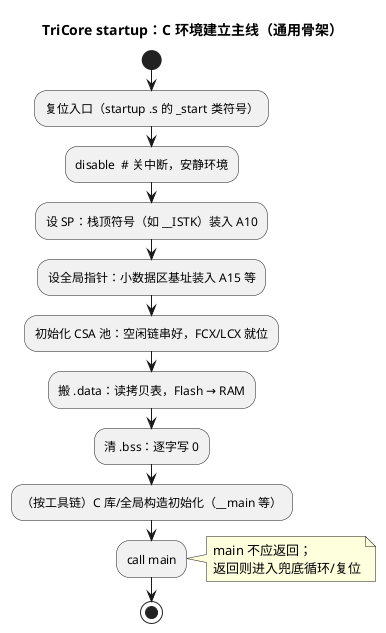

# 读 TriCore startup 汇编：从复位到 main

> 一句话定位：以"C 环境建立"为主线拆 startup .s——设 SP（A10）→ 全局指针 → CSA 池 → 搬 .data → 清 .bss → 调 main，每一行都知道它在为 C 的哪个前提条件铺路。
> 等级：L2 ｜ 前置：[02-常用指令集](02-常用指令集.md)

## 原理

C 代码能跑，靠五个隐含前提，startup 的工作就是把它们逐个兑现：

| C 的隐含前提 | 谁来兑现 | 对应动作 |
|---|---|---|
| 局部变量有地方放 | 栈 | `A10`（SP）装入栈顶初值 |
| 全局/静态变量有初值 | .data 段搬运 | Flash（LMA）→ RAM（VMA）拷贝 |
| 未初始化变量为 0 | .bss 段清零 | 逐字写 0（C 标准要求） |
| 函数调用/返回能保存现场 | CSA 池 | 初始化空闲链表，写 FCX/LCX |
| 小数据区/全局变量寻址高效 | 全局指针 | `A15`（或编译器约定的基址寄存器）装入段基址 |

两个关键符号概念（名字随工具链变，看链接脚本确认）：

- **LMA（Load Memory Address）与 VMA（Virtual/运行 Memory Address）**：`.data` 在 Flash 里存一份（LMA），运行时要在 RAM 里（VMA）。所谓"搬 .data"就是把 LMA 处的镜像拷到 VMA。`.bss` 只在 RAM，没有 LMA，所以只需清零。
- **拷贝表（copy table，`__table...copy` 风格）**：链接器生成一张 `{源地址, 目的地址, 长度}` 三元组表放在 Flash 尾部，startup 逐条取表项搬——比写死"一段 .data"更能对付分散加载（scatter loading）。



## 代码示例/解读

以下是**通用伪汇编骨架**——符号名、指令细节随 GHS/TASKING/GCC 与工程配置变化，重点认结构与意图，不对应任何特定版本的文件。

```asm
; =====================================================================
; 通用骨架：_start → main（中文注释为主线导读）
; =====================================================================
_start:
    disable                       ; 关全局中断：环境没建好前谁也别来打断

    ; ---- 1) 设栈指针 SP：A10 装入（中断）栈顶 ----
    ; 32 位地址装不进一条指令，永远是 movh.a 高 16 位 + lea 低 16 位两步
    movh.a a10, #@his(__ISTK)     ; a10 = 栈顶地址高 16 位（低 16 位暂为 0）
    lea     a10, [a10]@los(__ISTK); a10 = __ISTK（__ISTK：链接脚本给的栈顶符号）
                                   ; 栈向低地址生长，所以"栈顶"是最高地址

    ; ---- 2) 设全局指针/小数据区基址 ----
    ; 编译器把常用全局变量集中放小数据区，用 A15 基址 + 短偏移寻址省编码
    movh.a a15, #@his(__SDATA1)   ; 小数据区基址高 16 位
    lea     a15, [a15]@los(__SDATA1)

    ; ---- 3) 初始化 CSA 池：把 [__CSA_BEGIN, __CSA_END) 串成空闲链 ----
    ; 每个 CSA 单元 16 个字；空闲单元的第 0 字存"下一个空闲单元地址"
    ; 串好后链头写入 FCX，警戒地址写入 LCX（核心特殊寄存器，
    ; 写法与寄存器编号查 UM / 工具链 cstart 源码）
    movh.a  a4, #@his(__CSA_BEGIN)
    lea     a4, [a4]@los(__CSA_BEGIN)
    movh.a  a5, #@his(__CSA_END)
    lea     a5, [a5]@los(__CSA_END)
csa_loop:                          ; 逐单元把"下一个地址"写进本单元第 0 字
    ...                             ; （细节省略：写链指针、末节点写链尾标志）
    cmp / 跳转                      ; 走到 __CSA_END 结束
    ; 随后：FCX ← 链头；LCX ← 警戒地址（mtsr 类指令写特殊寄存器）

    ; ---- 4) 搬 .data：__table...copy 风格，逐条取表项 ----
    movh.a  a8, #@his(__ROMCPYTAB) ; a8 → 拷贝表首（链接器生成）
    lea     a8, [a8]@los(__ROMCPYTAB)
romcpy_outer:
    ld.w    d0, [a8+]              ; 表项 1/3：源地址（.data 在 Flash 的 LMA）
    ld.w    d1, [a8+]              ; 表项 2/3：目的地址（.data 在 RAM 的 VMA）
    ld.w    d2, [a8+]              ; 表项 3/3：本段字数；表尾项约定 cnt = 0
    jz      d2, bss_init           ; cnt == 0 → 表走完，全部拷完，去清 .bss
    mov.a   a4, d0                 ; 源/目的转地址寄存器——ld/st 只认 A 寄存器！
    mov.a   a5, d1
romcpy_inner:
    ld.w    d3, [a4+]              ; 从 Flash 读一个字，a4 自动 +4（后增量跟 .w 走）
    st.w    [a5+], d3              ; 写入 RAM，a5 自动 +4
    add     d2, d2, #-1            ; 计数减一（等价写法 sub/addi，工具链自选）
    jnz     d2, romcpy_inner       ; 本段没拷完继续
    j       romcpy_outer           ; 下一个表项（可能有多段 .data/.data.ls 等）

    ; ---- 5) 清 .bss：[__BSS_START, __BSS_END) 逐字写 0 ----
bss_init:
    movh.a  a8, #@his(__BSS_START)
    lea     a8, [a8]@los(__BSS_START)
    movh.a  a9, #@his(__BSS_END)
    lea     a9, [a9]@los(__BSS_END)
    xor     d0, d0, d0             ; d0 = 0（短编码清零）
bss_loop:
    mov.d   d1, a8                 ; 地址寄存器转数据寄存器再 cmp
    mov.d   d2, a9                 ; （地址寄存器比较也有专用编码，此处拆写便于理解）
    cmp     d1, d2
    jge     bss_done               ; a8 >= a9 → 清完
    st.w    [a8+], d0              ; 写 0，指针 +4
    j       bss_loop
bss_done:

    ; ---- 6) 进入 C 世界 ----
    ; 各工具链在 main 前可能还有一层库/构造初始化：TASKING 的 __main、
    ; GCC 的 __libc_init_array、GHS 的 __copy/初始化序列——看到别慌，性质相同
    call    __main                 ; （有的工程直接 call main，看 crt0/链接脚本）
    ; main 不应返回；万一返回，挂住等调试器，绝不"跑飞"
main_dead:
    j       main_dead              ; 或触发复位兜底
```

配套的链接脚本概念（读懂 startup 必读，方向对照）：

```text
__ISTK / __USTK     : 中断栈 / 用户栈顶，给 A10 用
__SDATA1            : 小数据区基址，给 A15 用
__CSA_BEGIN/__CSA_END: CSA 池范围，喂 FCX/LCX
__ROMCPYTAB…END     : 拷贝表（每项：src, dst, cnt）
__BSS_START/__BSS_END: 清零范围
main / __main       : C 世界入口
```

## 易错点与陷阱

1. **SP 装的是"栈顶"（最高地址）**：TriCore 栈向低地址生长，把栈底当栈顶装进 A10，第一次函数调用就往下越界。
2. **CSA 池没初始化就 call**：第一个 `call` 就会因取不到空闲 CSA 触发 Class 1 内部保护 trap——症状是"第一条 C 函数都没进去就崩"，别去查 C 代码。
3. **以为 .data 是硬件自动搬的**：TriCore 没有 Cortex-M 之外的魔法，.data/.bss 全靠这段软件循环；链接脚本漏配拷贝表，全局变量初值就是 Flash 镜像地址处的"随机数"。
4. **在 startup 里调 C 函数**：环境未建好前调 C（尤其用到栈/全局变量/printf 的函数）等于在流沙上盖楼；要提前干活用纯汇编或工具链指定的 `__low_level_init` 类钩子。
5. **多核各有一套**：TC377 每个核有自己的 A10/CSA 池；.data 通常共享一份拷贝（由一个核完成），但各核 cstart 各跑各的——把"一份 startup"当"所有核共用"会漏初始化。
6. **宽度/步长错位**：`ld.w [a4+]` +4、`ld.d [a4+]` +8；拷贝表 cnt 的单位（字 vs 字节）看链接器约定，单位搞错轻则多拷、重则踩别的段。

## 面试高频题

1. **为什么 main 之前必须先设 A10？**
   答：A10 是 SP，C 的局部变量、函数临时量都在栈上；没设 SP 前任何 C 函数（含编译器生成的辅助调用）都可能写飞内存。TriCore 虽用 CSA 保存调用现场，但局部变量仍靠栈。

2. **.data 和 .bss 的区别？谁搬谁清？**
   答：.data 有非零初值，Flash 存镜像（LMA）、RAM 里运行（VMA），startup 用拷贝表搬到 RAM；.bss 无初值（C 标准要求视为 0），只在 RAM，startup 逐字清零。两者都是软件（startup）负责，不是硬件。

3. **CSA 池是谁、在什么时候初始化的？**
   答：链接脚本在 RAM 划出池子并给出边界符号，startup 早期把它串成空闲链、设置 FCX/LCX；这发生在第一次 call 之前，否则触发 CSA 类 trap。

4. **拷贝表风格的 .data 搬运比写死单段循环好在哪？**
   答：链接器自动描述任意多段、任意 LMA→VMA 映射（分散加载），startup 代码不用随内存布局改动而改，天然适配不同链接配置。

5. **怎么验证 startup 干对了？**
   答：三个金标准：带初值的全局变量复位后值正确（.data）；未初始化全局变量为 0（.bss）；栈顶附近写 canary 字并在运行中检查（SP 方向与深度）；再用调试器直接看 A10/FCX 与对应符号是否一致。

6. **startup 里为什么常见 movh.a + lea 成对出现？**
   答：TriCore 指令编码放不下 32 位立即数，构造完整地址固定两步：movh.a 装高 16 位，lea 补低 16 位；认出这个"对"，读地址初始化就快了。

## 延伸

- 上一篇：[02-常用指令集](02-常用指令集.md)
- 下一篇：[04-trap入口代码](04-trap入口代码.md)
- [TC377 启动代码全链路（SSW/BMHD→本篇的 startup）](../启动代码阅读/01-TC377启动代码分析.md)
- [启动流程](../../../../02-芯片与体系结构/2-L2进阶/启动流程/README.md)
- [TriCore 架构总览](../../../../02-芯片与体系结构/3-L3高级/TriCore架构/README.md)
