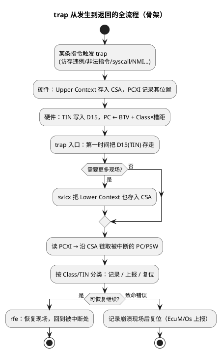

# TriCore trap 入口代码与崩溃定位

> 一句话定位：trap 机制全景——BTV 向量基址、Class 0~7 典型分类、每类里的 TIN，trap 处理骨架怎么写，以及崩溃后怎么顺着 CSA 挖出"死时 PC"完成定位。
> 等级：L2→L3 ｜ 前置：[03-读startup汇编](03-读startup汇编.md)

## 太长不看

> - 人话直觉：trap 是"某条具体指令出了错"（越权访问、非法指令、syscall……），硬件按 BTV 向量表按 Class（0~7）跳进对应入口，细分号 TIN 放在 D15 里；中断则是"外面来了事件"，异步、走 BIV、带优先级——一句话：trap 错在哪条指令，中断什么时候来事件。
> - 本篇解决：看懂 trap 向量表与 handler 骨架（存 D15 → svlcx 凑齐现场 → 沿 PCXI/CSA 链挖出错时 PC → 存证上报 → rfe 返回），以及崩溃后拿 Class/TIN/PC 三个数对照 UM 与 map 文件完成定位的排查清单。
> - 赶时间记住：① handler 第一件事把 D15（TIN）挪走保存，任何指令都可能覆盖它；② trap 返回必须用 rfe 而不是 ret，写反直接二次异常；③ 崩溃定位 = 读 PCXI 找 CSA → 取被中断 PC → 对照 map 文件，CSA 第 0 字的 PCXI 链还能逐层回溯出完整调用链。

## 原理

### trap 与中断的区别（先分家）

| 维度 | trap（同步异常） | 中断（异步事件） |
|---|---|---|
| 触发 | 某条**具体指令**执行出错/主动触发 | 外设/定时事件，与当前指令无关 |
| 向量基址 | **BTV**（Trap Vector Base） | BIV（Interrupt Vector Base） |
| 编号来源 | Class（类别）+ **TIN**（Trap Identification Number，进 D15） | 优先级 + PIRN（进 PCXI 的 PIE/PIRN 字段） |
| 典型来源 | 访存违例、非法指令、syscall、NMI | 外设中断、软件中断 |

### 向量机制：BTV + Class

- BTV 是核心特殊寄存器，指向 trap 向量表（工程里常见符号如 `__TRAP_TAB`），**由 startup 早期用 mtsr 类指令装载**。
- trap 发生时：硬件按 `BTV + Class × 槽距` 取表项跳转。向量表每个槽位放一条跳转（如 `jl`），真正干活的 handler 在别处。
- 硬件同时做两件事：**Upper Context 自动存入 CSA**（PCXI 记录位置）、**TIN 写入 D15**。所以 handler 一进门就能从 D15 拿到细分号，从 CSA 链挖到被中断现场。

### Class 0~7 典型分类（关键词落位，精确 TIN 查 UM）

下表是"典型分工"速查：内存保护/浮点/内部保护/寻址与数据错误/非法操作/上下文错误/系统调用/NMI 八个关键词全部落位。**各类的具体 TIN、位定义以所用芯片 UM 的 Trap 章节为准**，不同 TC1.6.x 小版本有保留差异。

| Class | 典型含义 | 高频场景（举例） |
|---|---|---|
| 0 | 内存保护（Memory Protection） | MPU 违例：越权读/写/取指 |
| 1 | 内部保护错误（Internal Protection） | **上下文错误**（CSA 空闲链耗尽、调用深度超限、非法上下文）、**浮点异常**（溢出/除零/非法操作等细分 TIN）、寄存器堆保护 |
| 2 | 指令错误（非法操作） | 非法操作码、未对齐取指、非法操作数格式 |
| 3 | 寻址与数据错误 | 数据地址未对齐、访问未映射/非法地址、总线错误 |
| 4 | 系统调用（System Call） | `syscall` 指令，D15 携带调用号（见 02 篇） |
| 5 | 不可屏蔽中断 NMI | SMU 报警（时钟/电压/ECC/lockstep 失配等，芯片实现定义） |
| 6 | 保留/实现定义 | 查 UM |
| 7 | 保留/实现定义 | 查 UM |



## 代码示例/解读

### 1. 向量表与 handler 骨架（通用，符号名随工具链）

```asm
; =====================================================================
; trap 向量表：BTV 指向这里；每类一个固定槽位，槽内是一条跳转
; =====================================================================
    .section .traptab, "a"         ; 段名随工具链，链接脚本把它放好并算出 __TRAP_TAB
__TRAP_TAB:
    jl  trap_c0                    ; Class 0：内存保护（MPU 违例）
    jl  trap_c1                    ; Class 1：内部保护（CSA 耗尽/调用深度/浮点…）
    jl  trap_c2                    ; Class 2：指令错误（非法操作码等）
    jl  trap_c3                    ; Class 3：寻址与数据错误
    jl  trap_c4                    ; Class 4：系统调用（OS 服务分发入口）
    jl  trap_c5                    ; Class 5：NMI
    jl  trap_default               ; Class 6：保留/实现定义
    jl  trap_default               ; Class 7：保留/实现定义

; =====================================================================
; handler 骨架（以数据错误类为例）：保存 → 取证 → 处置 → 返回
; =====================================================================
trap_c3:
    ; 进门时硬件已做：Upper Context 进 CSA（PCXI 指向它）、TIN 在 D15
    mov    d14, d15                ; ① 第一件事：TIN 挪到 d14——后面任何指令都可能覆盖 D15
    svlcx                          ; ② 把 Lower Context 也存入 CSA，凑齐完整现场
                                  ;    （rfe 返回前它会成对恢复）
    ; ---- ③ 取证：读 PCXI，从 CSA 挖被中断时刻的 PC/PSW ----
    ; PCXI 的 PCX 字段指向最近被换出的现场 CSA；读法（mfsr 类指令 + 位段
    ; 定义）以 UM 为准，工程里通常封装成一小段汇编/C 内联
    ; 崩溃转储要点：错误 PC、PSW、A11（返回地址）、出错访问地址（如总线
    ; 接口记录的 fault address，随芯片实现）——一并打包给上报函数

    ; ---- ④ 处置：这里只做最小工作 ----
    ; 典型策略：写崩溃日志（no-init RAM / DFlash）→ 通知 Os/EcuM →
    ; 看门狗复位或受控下电；绝不在 handler 里 printf/malloc
    ...

    rfe                            ; ⑤ 返回：从 CSA 恢复完整现场，回到被中断处
                                  ;    （致命错误则不返回，直接走复位路径）
```

### 2. 用 CSA 链还原崩溃调用链（C 概念代码）

```c
/* 崩溃转储：沿 PCXI 链回溯，把每一层的 PC 打出来（概念骨架） */
void crash_dump(void)
{
    volatile uint32_t pcxi = read_pcxi();      /* 读 PCXI 特殊寄存器（封装的 mfsr） */
    for (int depth = 0; depth < MAX_DEPTH; depth++) {
        const csa_t *csa = pcxi_to_csa(pcxi); /* PCX 字段 → CSA 地址（位段查 UM） */
        log_write("depth=%d PC=%08x PSW=%08x A11=%08x\n",
                  depth, csa->pc, csa->psw, csa->a11);
        pcxi = csa->pcxi;                     /* CSA 第 0 字 = 上一层 PCXI，继续回溯 */
        if (is_chain_end(pcxi)) { break; }    /* 链尾标志（上下文类型/链尾位，查 UM） */
    }
    /* 拿着一串 PC 查 map 文件 → 崩溃调用链。等价于 ARM 上的栈回溯。 */
}
```

### 3. 排查清单（现场按序过一遍）

1. **先拿三个数**：Class（哪个向量槽进来的）、TIN（D15 里的细分号）、错误 PC（CSA 里挖出的被中断 PC）——Class/TIN 对照 UM 的 trap 表定性质，PC 对 map 文件定位置。
2. **Class 1（内部保护/上下文/浮点）**：查 CSA 池大小（map 文件）与深调用/递归；调用深度计数超限也在这类；浮点 TIN 细分出除零/溢出。
3. **Class 0/3（内存保护/寻址数据错误）**：核对 MPU 配置表；指针未初始化（常是 .data 未拷，见 03 篇）；未对齐访问（packed 结构体、char* 强转 int*）；目标地址是否在存储器映射内。
4. **Class 2（非法操作）**：怀疑代码区被踩——查栈溢出覆盖、函数指针野值、跳转表越界；可用 CRC 校验代码区排除。
5. **Class 4（syscall）**：核对 D15 调用号是否合法——正常 OS 服务还是程序跑飞恰好撞进 syscall 编码。
6. **Class 5（NMI）**：查 SMU 报警状态——哪个 alarm 置位（时钟/电压/ECC/lockstep），顺藤摸瓜。
7. **复现性**：偶发往多核竞争、时序、ECC 上想；必现直接从 PC 反查 map，一击命中。
8. **上报通道**：崩溃日志写 no-init RAM / EE，复位前别依赖已损坏的栈；复位策略（立即复位 vs 记录后复位）与功能安全目标对齐。

## 易错点与陷阱

1. **D15 双重身份**：它既是 syscall 调用号寄存器又是 TIN 传递寄存器——handler 不先保存 D15，细分号直接丢。
2. **rfe 与 ret 混用**：`ret` 用于普通函数返回（call 配对）；trap 返回必须 `rfe`（恢复完整异常现场、回到被中断指令流）。写反了直接二次异常。
3. **handler 里干重活**：printf/malloc/大数组操作可能自己再触发 trap（栈已伤、内存已坏），handler 只做"存证 + 上报 + 复位"三件事。
4. **BTV 初始化前的窗口期**：startup 里 BTV 装好之前发生 trap，会跳到未初始化向量 → 二次异常死循环。所以 cstart 尽早设 BTV（与设 SP 同一优先级看待）。
5. **想用 disable 屏蔽 NMI**：Class 5 不可屏蔽，`disable`（PSW.IE）对它无效；NMI 的"开关"在 SMU/报警配置层，不在 CPU 标志位。
6. **lockstep 视角**：lockstep 核对同时 trap，读现场时按主核（主视角）寄存器取证，别把冗余核的状态当独立信息源。

## 面试高频题

1. **trap 和中断的区别？**
   答：trap 同步、由具体指令触发、经 BTV 向量、TIN 进 D15；中断异步、由外设事件触发、经 BIV 向量、带优先级仲裁。一句话：trap "错在哪条指令"，中断"什么时候来事件"。

2. **trap 发生时硬件自动做了什么？**
   答：Upper Context（PC/PSW/A10~A15/D8~D15）存入空闲 CSA 并记录于 PCXI；TIN 写入 D15；PC 装载 BTV+Class×槽距处的表项。软件 handler 只需处理剩余现场与取证。

3. **崩溃后怎么找到出错的那条指令？**
   答：读 PCXI 的 PCX 字段定位最近被换出的 CSA，从中取出被中断的 PC（及 PSW/A11），对照 map 文件定位代码；必要时沿 CSA 第 0 字的 PCXI 链逐层回溯还原调用链。

4. **Class 1 里最常见的两种现场崩溃是什么？**
   答：CSA 空闲链耗尽（等效"上下文耗尽"——深调用/递归/CSA 池太小）与调用深度计数超限（PSW.CDC 超限，抓失控递归）；浮点异常细分 TIN 也归此类。症状都是"看似栈溢出，其实是上下文耗尽"，扩 CSA 池或减深调用解决。

5. **syscall 走哪条向量？OS 怎么区分服务？**
   答：Class 4，经 BTV 向量进 OS 的系统调用分发入口；服务号在 D15（与 TIN 同寄存器，进入后先保存），其余参数按常规 ABI 寄存器传。

6. **为什么 trap 返回用 rfe 而不是 ret？**
   答：rfe 从 CSA 恢复被中断的完整上下文（含 PC/PSW）并返回被中断处；ret 只做普通函数级的上下文恢复。trap 是异常流，语义上必须整场还原。

## 延伸

- 上一篇：[03-读startup汇编](03-读startup汇编.md)（BTV 就在那儿初始化）
- [02-常用指令集](02-常用指令集.md)（syscall/原子/同步指令）
- [TC377 启动代码全链路](../启动代码阅读/01-TC377启动代码分析.md)
- [异常与 Trap](../../../../02-芯片与体系结构/3-L3高级/异常与Trap/README.md)
- [TC377 平台](../../../../02-芯片与体系结构/2-L2进阶/TC377平台/README.md)
- 工程深入场景：产线偶发复位分析、ECC/SMU 报警排查、功能安全崩溃取证——拿到一串崩溃 PC 需要沿 CSA 链回溯完整调用链、并对着 UM 的 Trap 章节核对 TIN 时，才需要真正啃透。
