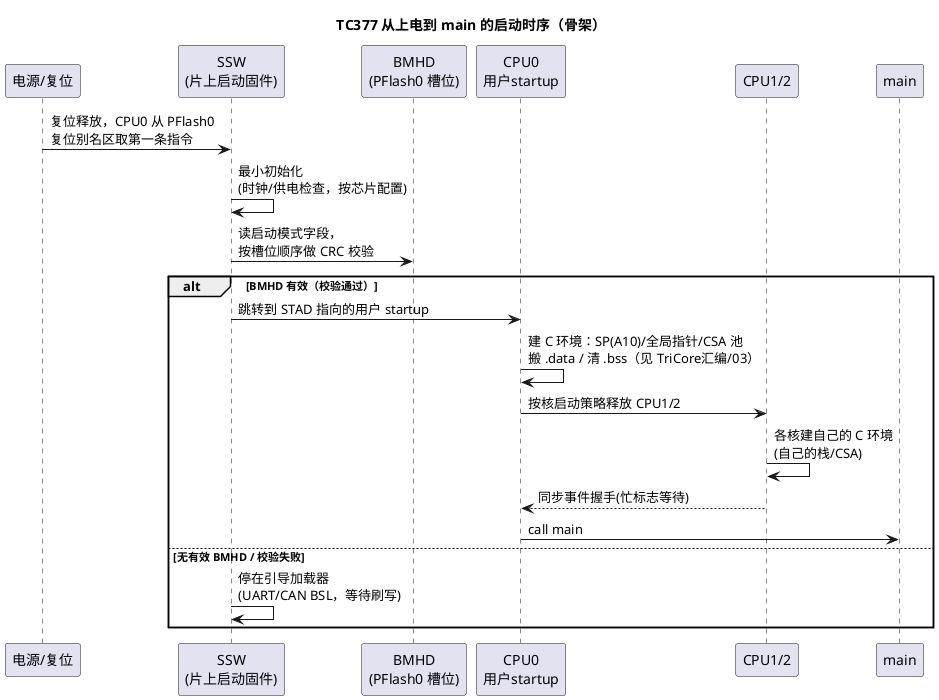

# TC377 启动代码全链路分析：从复位到 main

> 一句话定位：TC377 上电后程序怎么"活"过来——片上 SSW → 启动模式判定 → BMHD 引导头校验 → 跳用户 Flash startup（cstart）→ main，一条链读完，配"C 环境建立检查清单"收尾。
> 等级：L2 ｜ 前置：[03-读startup汇编](../TriCore汇编/03-读startup汇编.md)

## 原理

### 分层视角：谁先跑

TC377（AURIX TC3xx 家族，TriCore TC1.6P）复位后的引导链比 Cortex-M 长一截，因为**引导判定和完整性校验前置在芯片侧**：

```text
① 片上 SSW（Startup Software，英飞启动固件，占 PFlash0 头部）
      │  最小初始化 + 启动模式判定（用户引导 vs UART/CAN 引导）
      ▼
② BMHD（Boot Mode Header，用户 Flash 里的引导头）
      │  有效标志 / 用户起始地址 STAD / CRC 校验
      ▼
③ 用户 startup（cstart，.s 文件）——建 C 环境（见 TriCore汇编/03）
      ▼
④ main
```

- **SSW（Startup Software）**：与用户程序一起烧进 PFlash0 头部的英飞启动固件（源码随 AURIX 软件包提供，一般不改）。复位后 CPU0 从 PFlash0 复位别名区取第一条指令执行 SSW。
- **启动模式判定**：TC2xx 时代由 BMI（Boot Mode Index）寄存器决定；TC3xx 收敛到 BMHD 里的模式字段。读旧资料时注意名字变化，概念不变——回答"从哪里引导"：
  - **用户引导（Normal Boot）**：校验 BMHD 通过 → 跳用户启动地址，正常跑应用；
  - **UART（ASC）/CAN 引导（Generic/CAN Boot Loader）**：无有效 BMHD 或选了引导模式 → 停在 BSL，等上位机刷写（空白片/程序损坏时的"救护通道"）；
  - **备用引导（Alternate Boot）**：特殊恢复/调试用途。
- **BMHD（Boot Mode Header）**：用户 PFlash0 里固定槽位的一组引导头（BMHD0/1 各带副本冗余，SSW 按槽位顺序取第一个有效的）。字段概念：

| 字段（概念名，位定义查 UM Boot Modes 章节） | 作用 |
|---|---|
| 模式字段（含保护密码 PW0/PW1） | 启动模式选择 + Flash 访问保护口令 |
| **STAD（启动地址）** | 用户启动代码入口，通常指向 cstart |
| CRC 配置 / CRC 头 | 校验使能、参与校验的地址范围与位计数 |
| CRC0~CRC3 | 对用户代码最多 4 个窗口的校验值 |
| 副本槽位 | BMHD0/1 原件+拷贝，任一有效即可用——防单点损坏 |

- **CRC 校验行为**：校验使能且通过 → 跳 STAD；不通过/无有效头 → 留在 BSL。**症状识别**：烧完片子"没反应"，先想 CRC/BMHD，别急着怀疑硬件。
- **多核时序**：TC377 三个核——复位后 **CPU0 独自跑 SSW**，CPU1/CPU2 处于等待状态，由 SSW（按配置）或用户代码释放到各自启动地址；iLLD 的 `IfxCpu_startCore`/`IfxCpu_emitEvent`/`IfxCpu_waitEvent` 一套就是干释放与同步的。核型组合（性能核 lockstep + 效率核）以数据手册为准，具体释放机制与寄存器查 UM 多核章节。



## 代码示例/解读

### 1. SSW 阶段（黑盒观察，不贴其源码）

SSW 是英飞的固件，工程视角记"它做了什么、你能看到什么"：

```text
它做：  供电/时钟最小检查 → 判定启动模式 → 按槽位校验 BMHD → 跳 STAD（或留 BSL）
你看到：复位后 PC 先落在 PFlash0 头部（调试器可见），
       若停在 ASC/UART 等待循环 → 多半 BMHD 无效或被选成串口引导
别做：  链接脚本把用户段放进 SSW/BMHD 保留区 → 覆盖引导固件 → 板子变砖
       （保留区范围以 UM/链接脚本模板为准，模板通常已留好）
```

### 2. BMHD 的 C 侧形态（字段概念示例）

```c
/* BMHD 概念结构：字段名/位域以 UM 为准，这里记"有哪些东西" */
typedef struct {
    uint32_t mode_and_pw0;   /* 启动模式 + 保护密码低字（含 PW0）          */
    uint32_t stad_and_pw1;   /* 用户启动地址 STAD（另含 PW1，布局查 UM）   */
    uint32_t crc_cfg;        /* CRC 配置：使能位、初值等                   */
    uint32_t crc_header;     /* 校验范围头：起始地址、位计数               */
    uint32_t crc[4];         /* CRC0~CRC3：用户代码最多 4 个窗口的校验值   */
    /* ……其余字段与副本槽位布局查 UM                                */
} Bmhd_t;

/* 工程意义：改了 cstart 入口/加了 CRC 范围，BMHD 要重新生成并烧录；
   STAD 写错 = 一跳就 trap；CRC 范围漏了新段 = 校验失败停 BSL。 */
```

### 3. 用户 startup 阶段（呼应 TriCore汇编/03）

SSW 跳到 STAD 后进入用户 cstart（.s 文件），主线就是"C 环境建立"：

```asm
; 通用骨架（细节与逐行注释见 TriCore汇编/03-读startup汇编）
cstart:
    disable                      ; 安静环境
    movh.a a10, #@his(__ISTK)    ; ① SP：每核自己的栈顶
    lea     a10, [a10]@los(__ISTK)
    movh.a a15, #@his(__SDATA1)  ; ② 全局指针/小数据区
    lea     a15, [a15]@los(__SDATA1)
    ;    ③ CSA 池串链 → FCX/LCX
    ;    ④ 拷贝表风格搬 .data（Flash LMA → RAM VMA）
    ;    ⑤ 清 .bss
    ;    ⑥ 设 BIV/BTV（中断与 trap 向量基址——trap 处理见 TriCore汇编/04）
    call    main                 ; ⑦ 进入 C 世界
dead:   j       dead             ; main 不应返回
```

### 4. 多核启动的 C 侧形态（iLLD 风格，概念）

```c
/* CPU0 视角：释放其它核并同步（iLLD 风格概念代码，接口以所用版本为准） */
void core0_main(void)
{
    IfxCpu_emitEvent(&g_core1_event);   /* 给 CPU1 发"环境已就绪"事件 */
    IfxCpu_emitEvent(&g_core2_event);
    IfxCpu_startCore(CPU1);             /* 释放 CPU1 到它的启动地址    */
    IfxCpu_startCore(CPU2);
    IfxCpu_waitEvent(&g_core1_ready, 1);/* 等各核握手完成再动共享资源  */
    ...
}
/* CPU1/2 视角：先建自己的 C 环境（自己的栈/CSA），再置就绪标志参与同步。
   共享的 .data 拷贝通常只做一份（CPU0 干），别在拷完前去读全局变量。 */
```

## C 环境建立检查清单

- [ ] 每核 SP：A10 = 各自 `__ISTK`（调试器直接看 A10 核对）
- [ ] CSA 池：FCX/LCX 非零且指向正确区域，池大小查 map 文件
- [ ] .data：带初值全局变量复位后值正确（最灵验的烟囱测试）
- [ ] .bss：未初始化全局变量复位后为 0
- [ ] 全局指针/小数据区基址与内存模型一致（换编译器/模型必复查）
- [ ] BIV/BTV 分别指向中断向量表与 trap 向量表（trap 见 TriCore汇编/04）
- [ ] PSW/IO 特权级、看门狗状态明确：WDT 是否已使能、喂狗策略就位
- [ ] 时钟：startup 阶段通常还是复位默认时钟，PLL 切换在 Mcu_Init/SystemInit 计划内
- [ ] map 文件核对：SSW/BMHD 保留区未被用户段占用；cstart 地址与 BMHD 的 STAD 一致
- [ ] CPU1/2 释放与同步：谁等谁、忙标志/事件握手正确，共享资源访问在同步之后

## 易错点与陷阱

1. **链接脚本侵入保留区**：用户段盖住 SSW/BMHD → 上电即"死"，串口也没反应，只能调试器救——新工程起手先用模板链接脚本。
2. **STAD 与实际 cstart 地址脱节**：挪了代码布局/改了入口没重生成 BMHD，一跳就 trap（trap 定位见 TriCore汇编/04）。
3. **CRC 校验失败当成硬件故障**：典型症状是 ASC 接口一直等刷写；先核对 BMHD 有效性与 CRC 范围是否覆盖全部用户段。
4. **以为三核同时进 main**：CPU1/2 要等释放与各自 cstart；"那个核的任务不跑"先查释放与同步事件，再查任务配置。
5. **依赖"热复位后变量还有值"**：每次上电/复位都完整重走 SSW→cstart，RAM 数据全丢；需要跨复位保留的数据放 no-init 段/DFlash。
6. **startup 里长初始化不看狗**：SSW/cstart 阶段看门狗可能已使能，大初始化尽早喂狗或先按策略关狗。

## 面试高频题

1. **TC377 复位后第一条指令在哪里执行？**
   答：PFlash0 头部的 SSW（复位别名区），不是用户 main、也不是向量表——引导判定与校验前置是 AURIX 与 Cortex-M 的最大差异之一。

2. **BMHD 有什么用？校验失败会怎样？**
   答：提供启动模式、用户启动地址（STAD）与代码完整性 CRC（多窗口、带副本冗余）。失败/无有效头则不跳用户程序，停在 UART/CAN 引导加载器等待刷写——这既是保护也是救护通道。

3. **从复位到 main 依次经过哪些阶段？**
   答：SSW 最小初始化 → 启动模式判定 → BMHD CRC 校验 → 跳 STAD → 用户 cstart（SP/全局指针/CSA/搬 .data/清 .bss/设向量基址）→ main；CPU1/2 由 CPU0 释放后各自走 cstart。

4. **SSW 和用户 startup 的分工边界在哪？**
   答：SSW 管"要不要跑你的程序、从哪里开始跑"（模式判定、校验、入口）；用户 startup 管"你的程序跑起来需要的环境"（C 环境：栈/CSA/.data/.bss/向量基址）。

5. **三个核谁先跑？其它核怎么开始跑？**
   答：CPU0 先跑 SSW 与主引导；CPU1/2 复位后等待，由 SSW/用户代码释放到各自启动地址，随后各建自己的 C 环境（独立栈与 CSA），用事件/忙标志做就绪同步。

6. **BMHD 与 Cortex-M 向量表的本质区别？**
   答：BMHD 是"引导头"——先校验完整性再决定跳哪，支持多副本冗余；Cortex-M 向量表是"入口表"——硬件直接取 SP 与复位向量，默认不带校验。安全导向（ISO 26262）vs 简洁导向。

## 延伸

- 上一篇：[TriCore汇编/03-读startup汇编](../TriCore汇编/03-读startup汇编.md)（cstart 逐行注释）
- 下一篇：[02-S32K启动代码分析](02-S32K启动代码分析.md)（双平台对比）
- [TriCore汇编/04-trap入口代码](../TriCore汇编/04-trap入口代码.md)
- [TC377 平台](../../../../02-芯片与体系结构/2-L2进阶/TC377平台/README.md)
- [启动流程](../../../../02-芯片与体系结构/2-L2进阶/启动流程/README.md)
- [多核架构](../../../../02-芯片与体系结构/3-L3高级/多核架构/README.md)
