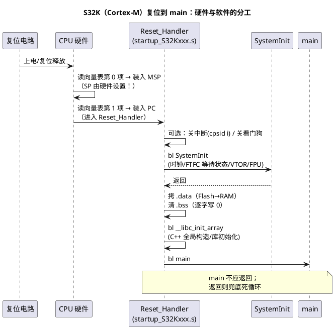

# S32K 启动代码分析：Cortex-M 的"硬件半个 startup"

> 一句话定位：Cortex-M 复位时硬件自动取向量表装 MSP 与 PC，软件只负责剩下半个 C 环境——Reset_Handler 流程逐段拆解，结尾给 TC377 vs S32K 启动对比表。
> 等级：L2 ｜ 前置：[03-启动文件startup解读](../ARM汇编/03-启动文件startup解读.md)

## 原理

Cortex-M（S32K1xx 为 Cortex-M4F）的启动哲学是**硬件替你干一半**：

**硬件自动做的（复位序列）**：

1. 从向量表（复位时映射到 0x0000'0000，S32K1xx 即 Flash 别名区）取**第 0 项装入 MSP**（主栈指针）；
2. 取**第 1 项装入 PC**——即 Reset_Handler 的地址，进入 Thumb 状态；
3. 至此 SP 与 PC 就位，"从哪里开始跑、栈在哪"由硬件回答完毕。

**软件负责的（Reset_Handler 流程，顺序随模板版本略有差异，以手头 startup_S32Kxxx.s 为准）**：

```text
可选：关中断 / 关看门狗
  → SystemInit（时钟配置、FTFC 等待状态、FPU 使能、VTOR 等）
  → 拷 .data（Flash LMA → RAM VMA）
  → 清 .bss
  → __libc_init_array（C++ 全局构造 / C 库初始化）
  → main
```

几个名词先立住：

- **FTFC（Flash 与 RAM 控制的 Flash 模块）**：主频起来后必须按实际时钟配置 Flash 等待周期/确认 FTFC 就绪，否则取指出错——这就是 SystemInit 里"FTFC 等待"的意义。
- **看门狗默认状态**：S32K1xx 的 WDOG 复位默认状态与解锁/关闭序列随 derivative 不同，具体以 RM 看门狗章节为准；模板常在 Reset_Handler 开头处理它，因为后面的初始化可能跑超过首个超时窗口。
- **`__libc_init_array`**：遍历 `.preinit_array/.init_array` 表，逐个调用其中的函数——C++ 全局对象的构造函数、部分 C 库初始化都挂在这。注意区分：**全局变量的初值靠 .data 拷贝（数据），构造函数靠它（代码）**。



## 代码示例/解读

startup_S32Kxxx.s 风格的注释骨架（GNU 语法；MDK/IAR 风格类似，标签名不同）：

```asm
.syntax unified
.cpu cortex-m4
.thumb

; =====================================================================
; 向量表：硬件的"半个 startup"就藏在前两项里
; =====================================================================
.section .isr_vector, "a", %progbits
.word __StackTop              ; 第 0 项：初始 MSP —— 复位时硬件自动装载
.word Reset_Handler           ; 第 1 项：复位向量 —— 硬件把它的值装进 PC
.word NMI_Handler             ; 第 2 项起：系统异常向量
.word HardFault_Handler
/* …… 中略：MemManage/BusFault/UsageFault/SVC/…/外设 IRQ 向量 …… */

; =====================================================================
; Reset_Handler：软件的"另半个 startup"
; =====================================================================
.section .text.Reset_Handler
.thumb_func
Reset_Handler:
    cpsid   i                 ; 先关中断，建安静环境（模板可选项）

    ; ---- 可选：关看门狗 ----
    ; S32K1xx 的 WDOG 要先解锁再关：解锁序列与寄存器地址随 derivative 不同，
    ; 查 RM 看门狗章节；这里通常是一条 bl DisableWatchdog（C 函数或宏）

    ; ---- SystemInit：时钟/FTFC 等待状态/VTOR/FPU（system_S32Kxxx.c）----
    ldr     r0, =SystemInit
    blx     r0

    ; ---- .data：从 Flash（LMA）拷到 RAM（VMA）----
    ldr     r0, =__DATA_ROM   ; 源：.data 在 Flash 里的存放地址（LMA）
    ldr     r1, =__DATA_RAM   ; 目的：.data 在 RAM 里的运行地址（VMA）
    ldr     r2, =__DATA_END   ; 结束边界（链接脚本符号）
1:  cmp     r1, r2            ; 目的指针到边界了吗？
    bcs     2f                ; r1 >= r2（无符号比较）→ 拷完跳出
    ldr     r3, [r0], #4      ; 从 Flash 读一个字，r0 自增 4
    str     r3, [r1], #4      ; 写入 RAM，r1 自增 4
    b       1b

    ; ---- .bss：清零 ----
    ldr     r1, =__BSS_START
    ldr     r2, =__BSS_END
    movs    r0, #0            ; 写 0 源
3:  cmp     r1, r2
    bcs     4f
    str     r0, [r1], #4      ; 逐字写 0
    b       3b

    ; ---- C++ 全局构造 / C 库初始化 ----
4:  bl      __libc_init_array ; 遍历 .preinit_array/.init_array 调构造与库初始化

    ; ---- 进入 C 世界 ----
    bl      main
    ; main 不应返回；返回说明程序结构有问题，兜底死循环
5:  b       5b
```

读法提示：

- 与 TriCore 对照着读最有效率——Cortex-M 的循环用 `ldr/str [rx], #4` 后增量，TriCore 用 `ld/st [a4+]` 后增量，**"谁在数边界、谁在动指针"** 的骨架完全同构（TriCore 版见 [TriCore汇编/03-读startup汇编](../TriCore汇编/03-读startup汇编.md)）。
- `__DATA_ROM/__DATA_RAM/__DATA_END/__BSS_START/__BSS_END` 都是链接脚本符号，各模板命名略异，看 .ld/.sct/.icf 文件确认。

### TC377 vs S32K 启动对比

| 维度 | TC377（TriCore） | S32K1xx（Cortex-M4） |
|---|---|---|
| 谁设 SP | 用户 startup：cstart 把栈顶装进 A10 | **硬件：向量表第 0 项自动装 MSP** |
| 第一条用户指令 | SSW 判定 BMHD 后跳 STAD（间接） | 向量表第 1 项直接由硬件装入 PC（直接） |
| 引导头 vs 向量表 | **BMHD 引导头**：启动地址 + CRC 校验 + 副本冗余 | **向量表即入口**：无引导头、默认无 CRC |
| 无效程序的行为 | 校验失败停 UART/CAN 引导加载器（可救护） | 照常跳复位向量（向量表坏了就 HardFault） |
| 谁搬 .data/.bss | 用户 cstart（拷贝表风格，多段自动描述） | 用户 Reset_Handler（LMA→VMA 循环） |
| C++ 构造/库初始化 | 工具链 crt 入口（__main 等） | `__libc_init_array` |
| 多核启动 | CPU0 跑 SSW 后释放 CPU1/2，lockstep 冗余核 | S32K1xx 单核；S32K3xx 多核另有引导核/HSE 概念 |
| 上电时钟准备 | SSW 最小检查 + 用户 Mcu_Init 切 PLL | SystemInit 切时钟 + FTFC 等待状态 |
| 典型破坏性坑 | 用户段覆盖 SSW/BMHD 保留区 → 变砖 | 向量表拷 RAM 后 VTOR 没设/没对齐 → 跑飞 |

## 易错点与陷阱

1. **裁掉 `__libc_init_array`**：C++ 全局对象不构造（虚表指针空的、成员是垃圾）、部分库初始化缺失；C 工程里也常见库钩子挂在 init_array，别手痒删。
2. **拷 .data 之前开中断或访问全局变量**：此时 RAM 里还是上电随机值；中断更危险——handler 一读全局变量就踩雷。cpsid i 不是装饰。
3. **MSP/PSP 分不清**：复位后 CPU 用 MSP；RTOS 启动任务后才切 PSP。手写汇编/内联压栈用错栈，调度器一开就错位。
4. **向量表重位忘 VTOR 或没对齐**：向量表拷到 RAM 修改后必须设 VTOR；且向量表起始地址要满足"向量数向上取 2 的幂"的对齐要求，否则取向量异常。
5. **看门狗默认状态想当然**：各 derivative 默认开/关不同、超时不同；长初始化前先确认狗的状态，否则"初始化到一半复位"的灵异现象伺候。
6. **FTFC 等待周期与主频不匹配**：超频或改时钟后忘改等待周期，取指偶发出错——症状是"跑一段就 HardFault"，极难查，先查这里。

## 面试高频题

1. **Cortex-M 复位后硬件自动做了什么？**
   答：从向量表取第 0 项装入 MSP、第 1 项装入 PC（进入 Reset_Handler），同时进入特权级 Thumb 状态——SP 与入口由硬件设置，这是与 TriCore/ARM7 等最直观的差异。

2. **向量表第 0 项为什么是栈顶而不是代码？**
   答：架构约定：让硬件在执行任何指令前就有可用栈（异常压栈、C 运行都需要）；第 1 项才是复位向量。所以"向量表 = 数据（SP）+ 代码入口（PC）"混合表。

3. **谁把 .data 搬到 RAM？什么时候？**
   答：Reset_Handler 里的软件循环（读 LMA 写 VMA），发生在 main 之前、SystemInit 之后（顺序随模板略异）；硬件不搬——和 TC377 一样都是 startup 软件职责。

4. **`__libc_init_array` 是干什么的？不调会怎样？**
   答：遍历 `.preinit_array/.init_array` 执行注册函数——C++ 全局构造、部分 C 库初始化。不调：全局**对象的构造函数**不执行（初值数据本身由 .data 拷贝覆盖，能对，但构造逻辑与库状态缺失）。

5. **TC377 与 S32K 启动最核心的两点差异？**
   答：①入口机制：S32K 硬件直接取向量表（SP+PC），TC377 先过 SSW/BMHD 引导判定与 CRC 校验再跳用户地址；②SP 来源：S32K 硬件装 MSP，TC377 由 cstart 装软件设 A10。顺带可提多核：TC377 要显式释放 CPU1/2，S32K1xx 单核。

6. **为什么 main 不应该返回？返回了会发生什么？**
   答：嵌入式没有"操作系统收尸"语义，main 返回后行为未定义（多数模板进死循环）。裸机工程的 main 应为无限循环；RTOS 工程由调度器接管，main 里只做启动后转交。

## 延伸

- 上一篇：[01-TC377启动代码分析](01-TC377启动代码分析.md)（双平台对照的另一边）
- [TriCore汇编/03-读startup汇编](../TriCore汇编/03-读startup汇编.md)（TriCore 版 C 环境建立）
- [ARM Cortex-M](../../../../02-芯片与体系结构/1-L1基础/ARM-Cortex-M/README.md)
- [S32K 平台](../../../../02-芯片与体系结构/1-L1基础/S32K平台/README.md)
- [启动流程](../../../../02-芯片与体系结构/2-L2进阶/启动流程/README.md)
