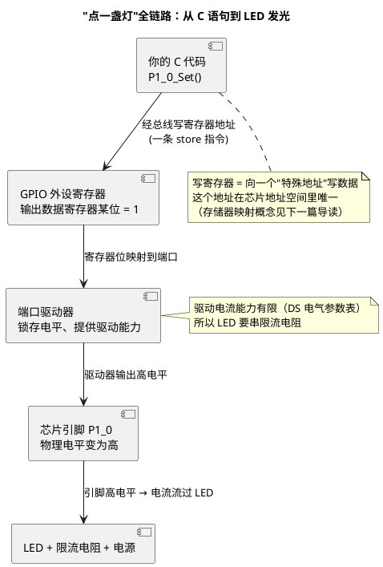

# 01-从零认识一颗MCU

> 一句话定位：把一颗 MCU 拆成"内核 + 外设 + 总线 + 存储"四块积木，学会带着这张地图去翻数据手册第一章，并顺着"点一盏灯"的全链路看清软件到底是怎么碰到硬件的。
> 等级：L1 ｜ 前置：无

## 原理

### 一颗 MCU 就是四块积木

不管手册多厚、型号多花，一颗微控制器（MCU，Microcontroller Unit）拆开来只有四样东西：

| 积木 | 干什么 | 大白话 |
|---|---|---|
| 内核（Core/CPU） | 执行指令、做运算 | 干活的"工人"，本库双平台是 TriCore（TC377）与 Cortex-M（S32K） |
| 外设（Peripheral） | GPIO/UART/ADC/定时器… | 工人的"工具箱"，每个工具对应一类外部世界 |
| 总线（Bus） | 内核与外设/存储之间的路 | 连接工人、仓库、工具台的"车间通道" |
| 存储（Memory） | Flash（掉电不丢）+ RAM（掉电即丢） | 仓库（放程序）+ 工作台（放正在处理的数据） |

四块积木的关系一句话：**内核从存储里取指令，通过总线去操作外设，外设再连到芯片引脚上影响真实世界。**

### 引脚：芯片与世界的手指

MCU 表面那一排金属脚（引脚，Pin）是它与外界唯一的物理接口。同一根引脚往往身兼数职——既可以是普通开关量输入输出（GPIO，General Purpose Input/Output），也可以复用成 UART 的发送脚、定时器的 PWM 输出脚。**"这根脚现在干什么"由芯片内部的一个复用选择寄存器决定**，这是驱动配置的第一课（S32K 叫 PORT/SIUL2，TC377 叫 Port 模块，细节都在各自平台专区）。

### 数据手册第一章怎么翻

拿到一颗新芯片，先翻三份文档里的两份（第三份后面再说）：

| 文档 | 缩写 | 什么时候翻 |
|---|---|---|
| 数据手册 | DS（Data Sheet） | 讲"这颗料有什么、量是多少"：资源清单、容量、频率、引脚定义 |
| 参考手册/用户手册 | RM/UM（Reference/User Manual） | 讲"怎么用"：每个模块的寄存器、位定义、时序 |
| 应用笔记 | AN（Application Note） | 讲"某个具体问题怎么解"，按需检索 |

DS 第一章（Overview / 简介）的正确读法：

**要看的三样：**

1. **特性列表（Features）**：多少 KB Flash、多少 KB RAM、主频多少、几个内核——先建量级概念；
2. **模块框图（Block Diagram）**：一张图把四块积木的位置画清楚，看内核挂了几颗、外设分几组、总线怎么连；
3. **引脚复用表（Pinout / Multiplexing）**：每根脚能当什么用，做硬件选型与引脚分配时天天要查。

**可以先跳过的：**

- 封装机械尺寸、回流焊温度曲线（硬件同事的战场）；
- 订货编号后缀含义表（采购用）；
- 每个模块的电气参数细表（用到再回来查，例如做 ADC 精度评估时）。

一句话：**DS 管"有没有、有多少"，RM/UM 管"怎么配"，第一步只用 DS 建立地图感。**

### "点一盏灯"：一次 GPIO 输出的全链路

嵌入式世界的"Hello World"是点亮 LED。从 C 代码到灯亮，中间隔着一条完整的链路：

```c
/* 软件侧最终动作（示意，具体库函数各平台不同） */
P1_0_Set();          /* 或 PORT->PSOR = ...; 写的是"输出置位寄存器" */
```

这一行代码到灯亮之间发生了什么：



链条上每一环都可能出问题，这也是排障的检查顺序：

1. **代码没写到对的寄存器**（复用没配成 GPIO、引脚号写错）；
2. **寄存器写了但时钟没开**（很多平台外设有独立时钟开关，关着时写寄存器等于没写——TC377 侧详见时钟系统专区）；
3. **寄存器对了但引脚方向没设成输出**；
4. **引脚电平变了但硬件接法不对**（LED 接法是"灌电流"还是"拉电流"，低电平亮还是高电平亮）。

### 双平台一句话定位

本库面向双平台，四块积木在两边长这样（细节全部延后到各专区）：

| 积木 | TC377（英飞凌 AURIX） | S32K（NXP） |
|---|---|---|
| 内核 | TriCore TC1.6P ×3（车规多核） | Cortex-M4（K1）/ Cortex-M7（K3） |
| 外设 | GTM 定时器矩阵、EVADC、MCAN… | FTM/eMIOS、LPADC、FlexCAN… |
| 总线 | SRI 互联 + SPB 外设总线 | AMBA 总线矩阵（AHB/APB） |
| 存储 | PFlash/DFlash + 每核 DSPR/PSPR | 程序 Flash/FlexNVM + SRAM |

现在只需要记住差异的"味道"：**TC377 像三室一厅（多核、资源分家），S32K 像精装单间（单核为主、生态顺滑）**——为什么这样设计、怎么各自使用，就是后面 L1→L3 各篇笔记的事。

## 易错点与陷阱

1. **把 MCU 当"一块芯片=一个 CPU"**：MCU 是 SoC（System on Chip，片上系统），内核只是住户之一；外设有自己的寄存器和时钟，"配了内核不等于配了外设"。
2. **引脚天生就是 GPIO 的错觉**：多数引脚复位后的复用模式不是 GPIO，点灯前先配复用与方向，三个动作缺一不可（复用→方向→电平）。
3. **拿通用 MCU 知识硬套车规芯片**：TC3xx 家族部分料号配锁步核（是否配备随子型号而异，以 DS 为准）、看门狗上电即开、Flash 写入要过安全解锁——这些"车规税"在通用开发板上没有，遇到再说，但心里要有数。
4. **只看教程不看 DS**：教程讲的是"某一颗芯片的某一种接法"，参数（驱动能力、耐压、时序）永远以 DS 为准。
5. **"寄存器"与"内存变量"混为一谈**：写普通变量只影响内存；写寄存器会触发硬件动作，且有读写顺序、写 1 清除等特殊规则（后续各篇反复出现）。

## 延伸

### 下一步读什么

- [02-存储器映射初识](02-存储器映射初识.md)：寄存器为什么有"地址"、地址空间怎么分区；
- [03-中断初识-从轮询到中断](03-中断初识-从轮询到中断.md)：CPU 如何不被"等灯"拖死；
- [04-复位启动初识-第一条指令从哪来](04-复位启动初识-第一条指令从哪来.md)：上电之后、main 之前发生了什么；
- 正式进入 L1 带：[ARM-Cortex-M/01-编程模型与寄存器](../1-L1基础/ARM-Cortex-M/01-编程模型与寄存器.md)——从 S32K 的内核视角开工；
- 想先看另一条线：[S32K1与S32K3对比/01-内核与资源对比](../1-L1基础/S32K平台/S32K1与S32K3对比/01-内核与资源对比.md)。
