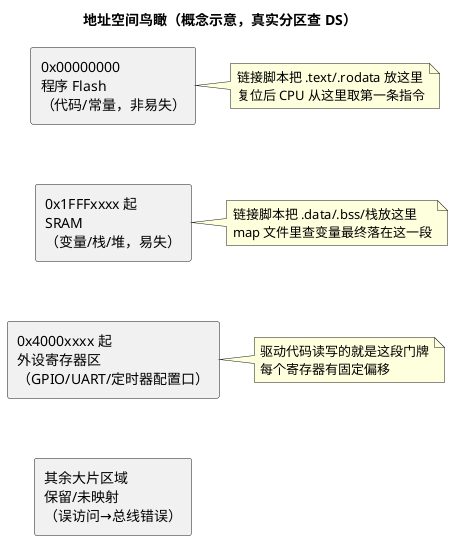

# 02-存储器映射初识

> 一句话定位：地址空间就是一条超长的"门牌号"街道——Flash、RAM、外设寄存器各占一段门牌；学会看 memory map 表、学会从编译器生成的 map 文件里找一个变量，你就掌握了芯片世界里的"查地址"基本功。
> 等级：L1 ｜ 前置：[01-从零认识一颗MCU](01-从零认识一颗MCU.md)

## 原理

### 门牌号比喻：什么是地址空间

MCU 里所有可以读写的东西——每字节 Flash、每字节 RAM、每一个外设寄存器——都被编在一个统一的编号系统里，这个系统叫**地址空间（Address Space）**。32 位 MCU 的地址空间是 0x00000000 ~ 0xFFFFFFFF，共 4GB 个门牌号。

三条街道规则：

1. **一个门牌只住一户**：每个地址最多对应一个物理存储位置（Flash、RAM 或某个寄存器），不存在两户抢一个门牌；
2. **大片门牌是空地**：4GB 远大于实际存储容量，没挂东西的地址叫"保留区"，误访问轻则读回 0，重则触发总线错误异常（TC377 的 trap / Cortex-M 的 HardFault，进阶后细看）；
3. **门牌号是硬件焊死的**：哪一段给 Flash、哪一段给 RAM，芯片设计时就定了，写在 DS 的 Memory Map 章节里，软件改不了。

为什么寄存器也能有地址？因为芯片把外设寄存器也"挂"在了这条街上——**访问寄存器 = 向它的门牌号读写数据**，这就是上一篇导读里 `P1_0_Set()` 的底层动作。这套机制叫**存储器映射（Memory Mapping）**，寄存器因此得名 MMIO（Memory Mapped I/O，内存映射输入输出）。

### 看懂一张 memory map 表

DS 里的 Memory Map 表长得像下面这张（**地址与大小纯属示意，真实数值永远查对应芯片 DS**）：

| 起始地址（示意） | 结束地址（示意） | 区域 | 用途 |
|---|---|---|---|
| 0x00000000 | 0x0007FFFF | 程序 Flash | 存代码和常量，掉电不丢 |
| 0x1FFF8000 | 0x1FFFFFFF | SRAM | 存运行中的变量、栈，掉电即丢 |
| 0x40000000 | 0x4000FFFF | 外设寄存器区 | 各外设的配置/数据寄存器 |
| … | … | （保留区） | 未使用，访问可能出错 |

看表抓三个要点：

1. **找三样东西的"家"**：Flash 段、RAM 段、外设段各在哪——以后看链接脚本、看野指针地址，全靠这三段的位置感；
2. **注意地址宽度台阶**：0x0000_0000（Flash）、0x1FFF_xxxx / 0x2000_xxxx（SRAM）、0x4000_xxxx（外设）是 MCU 世界常见的"片区划分习惯"（Cortex-M 尤其典型），看到高位数字就能猜区域；
3. **留意别名/双视图**：有的芯片给同一块物理存储两个门牌（如 TC377 的 PFlash 有 cached/uncached 两个视图），先知道有这回事，用到再查。

一张极简的空间直觉图：

### 从 map 文件里找一个变量

编译链接完成后，工具链会生成一份 **map 文件**（映射文件，GCC 链接器 map / IAR map / Keil map 都有），它记录"每个符号最终放在哪个地址"。排查"变量在哪、段有没有放对、RAM 用了多少"全靠它。

找一个变量的三步（以符号 `g_canRxCount` 为例）：

1. **打开 map 文件搜符号名**：找到一行类似 `g_canRxCount  0x200012a4  0x4  data  o can_drv.o`；
2. **看两列关键数字**：地址 `0x200012a4`（落在 SRAM 段——对照 memory map 判断"住对小区没有"）、大小 `0x4`（4 字节）；
3. **交叉验证**：把地址抄进调试器的 Memory 窗口，改动量、看内存跟着变，闭环确认。

map 文件还能回答三个高频问题：

- **RAM/Flash 用量**：段汇总表（Section Summary）里 `.data + .bss` 是 RAM 占用，`.text + .rodata` 是 Flash 占用——立项评估容量够不够先看这；
- **函数在哪**：函数名也是符号，同样能搜到地址，排异常（HardFault/trap）时拿出错 PC 来 map 里对号入座；
- **段放错没**：想让某变量进特殊区域（如 TC377 某核的 DSPR），配置后必须回 map 验证真的进去了（进阶话题，见 L2/L3 带）。

### 双平台差异预告

同样是"门牌号街道"，两家的规划风格不同（细节在各自专区展开）：

| 维度 | S32K（Cortex-M） | TC377（TriCore） |
|---|---|---|
| 地址空间气质 | 统一 4GB 线性空间，片区划分规整（ARM 架构习惯） | 32 位统一编址，但"每核私有 + 全局共享"分区分明 |
| RAM 形态 | 一大块（或几块）系统 SRAM，大家共用 | 每核一份 DSPR/PSPR（私有零等待）+ 共享 DSRAM/LMU |
| Flash 形态 | 程序 Flash + 数据 Flash（FlexNVM） | PFlash（双 Bank，可 OTA 切换）+ DFlash |
| map 文件看点 | 栈顶、堆、段布局；RAM 总量 | 三核各自 DSPR/PSPR 划分、CSA 池位置、各核栈 |

一句话：**S32K 的地图像"一栋楼分层"，TC377 的地图像"三户人家各有私室+公共客厅"**——这个印象先立起来，进 L2 带（[TC377平台/存储器映射](../2-L2进阶/TC377平台/存储器映射/README.md)）时所有细节都会各归各位。

## 易错点与陷阱

1. **把"地址"当 C 指针随意算**：地址是硬件契约，指针运算越界就是访问保留区，撞上总线错误；尤其别拿 Flash 段地址 ± 偏移去"顺手"访问外设。
2. **拿教程地址硬套自己的板子**：教程基于某型号，不同型号 Flash/RAM 起址可能不同，一切以你那颗芯片的 DS + 工程链接脚本为准。
3. **搜 map 文件搜不到变量就慌**：先确认不是被优化掉（局部变量、未取地址的量可能没有独立符号）、拼写无误，再看是否在静态库里。
4. **以为 RAM 复位后是 0**：物理 RAM 上电是随机值，"看到 0"是启动代码清零后的结果；NoInit 段（刻意不清零的段）里就是随机值。
5. **混淆 Flash 与 RAM 的写法**：RAM 直接赋值即可；Flash 要走擦写流程（先擦后写、按页/扇区），把 Flash 当 RAM 写是新手经典坑（进阶见 S32K 存储器专区）。
6. **外设寄存器地址抄错一位**：0x4000_1000 与 0x4001_0000 差之千里，用厂商头文件的定义（如 `GPIOA->PDOR`），不手拼裸地址。

## 延伸

### 下一步读什么

- [03-中断初识-从轮询到中断](03-中断初识-从轮询到中断.md)：地址空间之外，CPU 响应世界的另一条路；
- [04-复位启动初识-第一条指令从哪来](04-复位启动初识-第一条指令从哪来.md)：第一条指令的地址是谁决定的；
- 深入 S32K 侧存储：[S32K平台/存储器与Flash](../1-L1基础/S32K平台/存储器与Flash/README.md)；
- 深入 TC377 侧存储：[TC377平台/存储器映射](../2-L2进阶/TC377平台/存储器映射/README.md)；
- 链接脚本（谁决定变量住哪个门牌）：[启动流程/03-链接脚本与分散加载](../2-L2进阶/启动流程/03-链接脚本与分散加载.md)。
