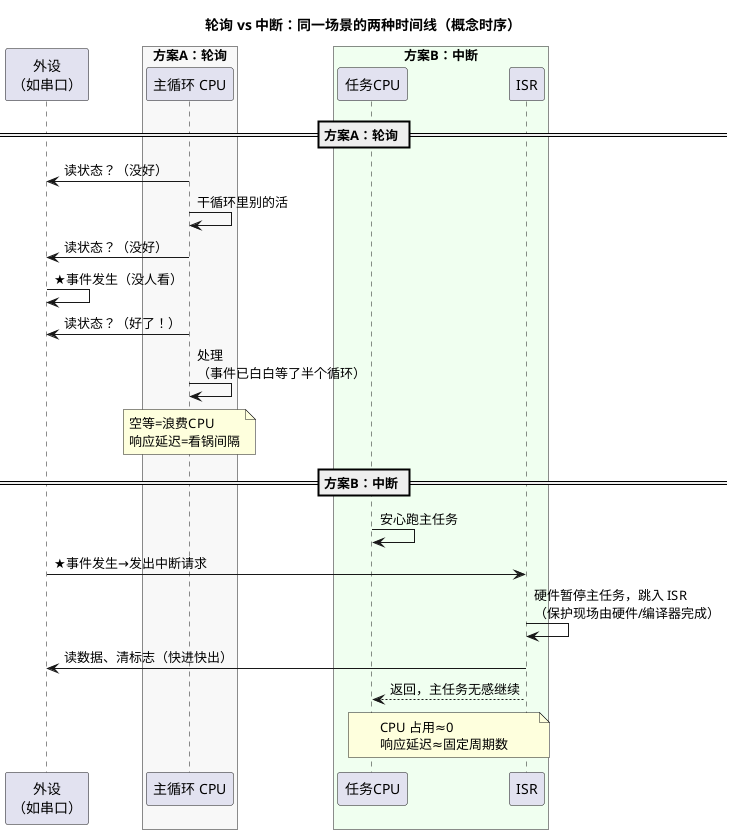

# 03-中断初识：从轮询到中断

> 一句话定位：CPU 等外设只有两种姿势——轮询（一遍遍问"好了吗"）和中断（外设来敲门）；本篇用一张对比表、一张时序图建立取舍直觉，并划清"ISR 里该做什么、不该做什么"的红线。
> 等级：L1 ｜ 前置：[01-从零认识一颗MCU](01-从零认识一颗MCU.md)

## 原理

### 场景：等一锅水烧开

你让 CPU 干一件事："水开了（按键按下/串口来数据/定时器到点）就处理一下"。两种等法：

- **轮询（Polling）**：CPU 站在锅边，每秒钟看一眼——主循环里反复读外设状态标志位，读到"好了"才去干活；
- **中断（Interrupt）**：CPU 去干别的活，装了个"水开报警器"——外设事件发生时硬件主动给 CPU 发一个信号，CPU **暂停当前工作**、跳去执行你预先注册的中断服务程序（ISR，Interrupt Service Routine），处理完再**原路返回**继续干活。

中断机制涉及四个固定角色，先记住名字：

| 角色 | 英文 | 干什么 |
|---|---|---|
| 中断源 | Source | 发事件的那个外设（UART 收到一字节、定时器溢出…） |
| 中断请求 | IRQ（Interrupt ReQuest） | 源向 CPU 发出的"敲门声" |
| 中断服务程序 | ISR | 你写的、事件发生时被执行的函数 |
| 中断控制器 | NVIC（Cortex-M）/ IR+SRC（TriCore） | 决定"谁的声音先被听见"的裁判 |

### 轮询 vs 中断：三维度对比

| 维度 | 轮询 | 中断 |
|---|---|---|
| CPU 占用 | 干等，主循环被"看锅"占满，别的事干不了 | 事件驱动，99% 时间 CPU 都是自由的 |
| 响应速度 | 取决于轮询周期——事件到"下一眼看锅"之间有延迟；最坏延迟≈整个循环体执行时间 | 硬件直达，典型几十个时钟周期内进入 ISR；延迟上界确定 |
| 复杂度 | 逻辑直白，初学者友好；多个事件要排队自己写状态机 | 引入并发：ISR 与主程序"同时"跑，共享数据要保护、优先级要规划、调试更难 |

选型直觉（不用背，用三次就长在身上）：

- **慢速、无所谓延迟的事件** → 轮询足够（比如 100ms 一次的按键扫描）；
- **快速、不能错过的事件** → 中断（串口每字节到达、电机控制周期采样）；
- **实时系统主流姿势** → 中断收事件 + 任务做重活（AUTOSAR 的标准玩法，见 L2 带展开）。

### 时序对比图

看图记三句话：**轮询的延迟看"循环多长"，中断的延迟看"硬件多快"；轮询浪费的是 CPU，中断花费的是复杂度；ISR 越短，中断的好处越大。**

### 优先级直觉：抢占

不止一个中断源时，"裁判"（中断控制器）要决定谁先被服务：

- 每个中断有一个**优先级数值**——注意两家方向相反：**Cortex-M 数值越小优先级越高，TriCore 的 SRPN 数值越大越高**（移植代码时经典坑，细节进 L1/L2 带）；
- **抢占（Preemption）**：高优先级中断可以打断正在执行的低优先级 ISR，先服务自己再让人家继续——像医院分诊，危重病人插队；
- **同级不打断**：同优先级的中断排队轮流来，这天然避免了"同类自己打断自己"的混乱。

抢占的工程含义：**优先级 = 谁的实时性更金贵**。刹车信号 > 电机电流环 > 通信收发 > 日志统计——排优先级就是排"谁不能等"。

### ISR 红线：该做什么、不该做什么

ISR 是"借来的时间"——你在打断别人，规矩比普通函数多：

**该做（快进快出三件事）：**

1. **读/写硬件**：取走数据、发出命令、**清中断标志位**（不清标志，退出后立刻重进同一个中断，系统"卡死在中断里"）；
2. **存数据/置标志**：把结果放进缓冲区或变量，交给主流程；
3. **唤醒后续处理**：置事件标志、发通知，让任务层接力。

**不该做（三条红线）：**

1. **不做长活**：延时循环、大块 memcpy、浮点矩阵运算、printf——ISR 每多跑一微秒，所有更低优先级中断就多等一微秒；
2. **不调用阻塞/不可重入的函数**：等待锁、等待另一事件、"malloc/printf 这类内部有锁或静态状态的库函数"——中断里等锁大概率死锁；
3. **不动共享数据不加保护**：ISR 与主程序都会碰的变量，主程序侧读写时要防"读到一半被中断改了"（手段：关中断短临界区/原子操作，进阶展开）。

一句话总纲：**ISR 像前台收快递——签收、放门口、通知家人，绝不当场开箱装配。**

## 易错点与陷阱

1. **清标志位的位置和顺序错**：有的外设要"先读状态再清"、有的"写 1 清除"——顺序错要么清不掉、要么把别人的标志一起清了，逐条查 RM。
2. **忘了开三层开关**：外设自身中断使能、中断控制器使能、CPU 全局中断使能——三层全开中断才会来，缺一层就是"配了没反应"，排查按这三层走。
3. **中断里改多字节共享变量，主程序读到半新半旧**：16/32 位变量在 8 位机上、或结构体成员的组合读写，都可能被 ISR 从中打断——共享数据要么原子、要么临界区。
4. **volatile 都不加**：主循环轮询 ISR 置的标志，编译器可能把读操作优化成读一次——被 ISR 与主程序共享的变量要加 volatile（但 volatile ≠ 线程安全，多核场景进 L3 带再补课）。
5. **优先级规划拍脑袋**："先来的功能占高位、后加的功能挤低位"，结果实时性要求最高的反而排后——优先级表是设计文档，不是顺手填的表格。
6. **在中断里调试 printf 卡死**还以为是硬件问题——printf 常是阻塞+非重入的，ISR 调试用翻转 GPIO/内存标记，不用打印。

## 延伸

### 下一步读什么

- [04-复位启动初识-第一条指令从哪来](04-复位启动初识-第一条指令从哪来.md)：中断的"入口地址表"与启动的故事；
- S32K/Cortex-M 线深入中断：[ARM-Cortex-M/02-NVIC与中断](../1-L1基础/ARM-Cortex-M/02-NVIC与中断.md)；
- TC377/TriCore 线深入中断：[TC377平台/中断系统/01-SRC模块](../2-L2进阶/TC377平台/中断系统/01-SRC模块.md)；
- 中断优先级与 AUTOSAR OS 的工程约束：[TC377平台/中断系统/03-中断优先级实践](../2-L2进阶/TC377平台/中断系统/03-中断优先级实践.md)。
