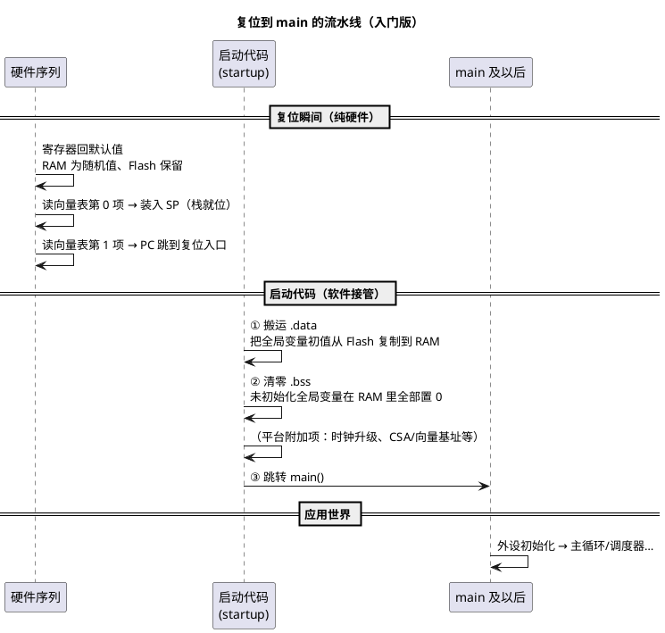

# 04-复位启动初识：第一条指令从哪来

> 一句话定位：上电那一刻 CPU 不是从 main 开始的——向量表告诉它"先拿栈、再拿入口"，启动文件默默完成"搬数据、清 bss"再把它送进 main；看懂这条流水线，"程序为什么没跑起来"就有了排查地图。
> 等级：L1 ｜ 前置：[02-存储器映射初识](02-存储器映射初识.md)

## 原理

### 复位：一切归零的瞬间

复位（Reset）是芯片回到已知初始状态的动作——上电（POR）、看门狗超时、软件请求、调试器命令都会触发。复位之后两件事是确定的：

1. **CPU 内部寄存器回到出厂默认值**：程序计数器（PC）指向固定位置、大部分控制位归零——"默认值"意味着"未被你配置的世界"，比如复位后中断通常是关的、时钟跑在保守的内部 RC 上、外设大多没启用；
2. **RAM 内容是随机的，Flash 内容原封不动**：RAM 掉电/复位不保证清零；Flash 是非易失的，你的程序好好躺在里面。

所以上电后 CPU 面对的局面是：**Flash 里有程序（谁放的？烧录工具），RAM 里是垃圾，寄存器全是默认值——第一条指令从 Flash 里来。**

常见的复位触发源速查（入门期认脸即可，具体位定义进阶查手册）：

| 复位源 | 典型场景 | 一句话印象 |
|---|---|---|
| 上电复位 POR | 拔插电源、KL30 重新上电 | 最"干净"的复位，一切从头来 |
| 外部复位引脚 | 硬件复位电路、调试器按复位 | 板子上那颗复位按钮 |
| 看门狗复位 | 程序跑飞/卡死，Wdg 超时 | "没人喂狗，狗咬人" |
| 软件复位 | EcuM 重置、Bootloader 跳转前自清 | 代码里主动要求的 |
| 调试器复位 | 仿真器 Reset 命令 | 注意：行为可能与真实上电不同 |

> 排障时第一个问题往往是"这次是哪种复位？"——S32K 可在启动早期读复位原因寄存器回答它（进阶见"暗桩"一段）。

### 向量表：芯片的"应急通讯录"

第一条指令的**具体地址**，芯片设计时就约定好了：地址空间固定位置处放着一张**向量表（Vector Table）**，它是一个函数指针数组。以 Cortex-M 为例（TriCore 思想相同、形式不同，见下）：

| 表项 | 内容 | 一句话 |
|---|---|---|
| 第 0 项 | **栈顶地址**（不是指令！） | 硬件把它装进栈指针 SP——第一条指令还没跑，栈就先可用 |
| 第 1 项 | **复位入口**（Reset_Handler） | 复位后 PC 从这里开始执行 |
| 第 2~15 项 | 系统异常入口 | NMI、HardFault、SVC、PendSV、SysTick… |
| 第 16 项起 | 外设中断入口 | 每个中断源占一格——上一导读说的"ISR 从哪进来"，答案就是这张表 |

两个入门要点：

- **为什么第 0 项是栈顶？** 中断随时可能来，中断响应要压栈保存现场——所以架构保证"第一条指令执行前栈就合法"。这个设计细节在 [ARM-Cortex-M/03-向量表与复位](../1-L1基础/ARM-Cortex-M/03-向量表与复位.md) 展开；
- **表是数组，就有"基址 + 索引 ×4"的寻址公式**——排查"进错中断/跳飞"时，会算向量表偏移是基本功。

TriCore 侧的对应差异先立个印象：TC377 把表拆成 **BTV（管 trap，出错走这里）** 和 **BIV（管中断，按优先级索引）** 两张，复位后由启动代码装载——"一张表 vs 两张表"是双平台入门期最值得记住的差异之一。

### 启动文件在干什么（入门版）

从复位入口到 main 之间，有一段大多数人没读过、但天天在跑的代码——**启动代码（startup code）**，由芯片厂商提供、汇编或 C 写成、链接在向量表后面。入门阶段只需记住它干的三件事：

为什么要"搬数据"和"清 bss"？回到上一篇的存储器常识：

- `int g_count = 100;`——**初值 100** 必须存在掉电不丢的 Flash 里（编译器把它收进镜像），但变量运行时要住在 RAM（可写）。所以启动代码把初值**从 Flash 复制到 RAM**：这段叫 `.data`（已初始化数据段），Flash 里的那份叫"加载地址"，RAM 里的家叫"运行地址"；
- `int g_buf[64];`——没写初值的变量约定为 0，但 RAM 上电是随机值，所以启动代码把这段 `.bss`（未初始化数据段）**统一清零**。

一句话：**启动代码是在"RAM 是垃圾"与"C 标准要求全局变量有初值"之间收拾残局的人。** 这也解释了一个经典现象：在 main 之前（比如全局对象的构造函数、或手改启动流程时）访问未搬运完的全局变量，会读到垃圾值。

### 排查地图："程序没跑起来"看哪里

按流水线顺序检查，入门期记住五站：

1. **烧录对不对**：镜像真的进了 Flash？（烧录工具日志、回读校验）
2. **向量表对不对**：第 0/1 项是合法栈顶与入口（链接脚本配置、烧录偏移地址）；
3. **启动代码跑没跑**：时钟是否升级成功、有没有卡在等 PLL 锁定等环节；
4. **搬运/清零有没有出错**：链接脚本把段放歪、copy table 与段不匹配（进阶陷阱，见 L2 带链接脚本篇）；
5. **main 里的第一行是不是"看似无害实则依赖未初始化设施"**（比如时钟没配好就配外设波特率）。

车规平台额外两根"暗桩"，先知其名：TC377 复位后先跑芯片固化的 SSW，校验用户引导头（BMHD）通过才放行你的程序（进阶见 [TC377-BMI与引导头](../2-L2进阶/启动流程/01-TC377-BMI与引导头.md)）；S32K 的复位原因寄存器能在启动第一时间读出"这次为什么复位"（进阶见 [S32K复位流程](../2-L2进阶/启动流程/02-S32K复位流程.md)）。

## 易错点与陷阱

1. **以为"程序从 main 开始"**：main 之前有完整的硬件序列 + 启动代码；调试"还没进 main 就死"的问题，要看向量表、启动汇编与时钟初始化，而不是 main。
2. **全局变量初值"凭空出现"的错觉**：初值来自 Flash 镜像、由启动代码搬运——改初值要重新编译烧录，改 Flash 里的值不会自动同步 RAM（除非重新复位）。
3. **把栈顶当地码地址**：向量表第 0 项是栈顶地址，填成函数入口会导致第一次压栈写飞——这是"手写向量表/做 Bootloader"的高发坑。
4. **复位后"什么都能用"的错觉**：复位后时钟通常在低速默认源、中断关闭、外设未使能——先初始化再使用，顺序错了配置会"无声丢失"。
5. **调试器复位与真实上电行为不同**：调试复位可能保留部分 RAM/外设状态，"挂仿真器正常、拔了就不行"优先怀疑初始化不全而不是玄学。
6. **.bss 当 .data 用**：依赖"未初始化全局变量恰好像 0"没大错（标准保证），但把**需要非零初值**的变量忘了赋值，在 RAM 随机 + 清零链路有 bug 时会现形。

## 延伸

### 下一步读什么

- 正式进入 L1 带：[ARM-Cortex-M/03-向量表与复位](../1-L1基础/ARM-Cortex-M/03-向量表与复位.md)——向量表/VTOR/Bootloader 跳转的完整展开；
- 启动代码逐行读（S32K 线）：[启动流程/02-S32K复位流程](../2-L2进阶/启动流程/02-S32K复位流程.md)；
- 启动代码逐行读（TC377 线）：[启动流程/01-TC377-BMI与引导头](../2-L2进阶/启动流程/01-TC377-BMI与引导头.md)；
- 段与搬运的契约：[启动流程/03-链接脚本与分散加载](../2-L2进阶/启动流程/03-链接脚本与分散加载.md)；
- 汇编视角的启动文件走读：[ARM汇编/03-启动文件startup解读](../../01-编程语言/2-L2进阶/汇编基础/ARM汇编/03-启动文件startup解读.md)。
