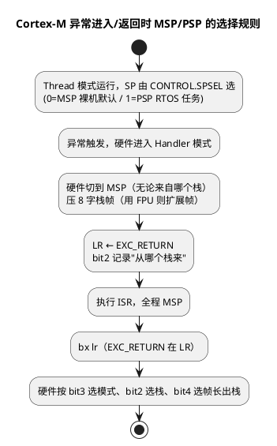

# 01-编程模型与寄存器

> 一句话定位：从架构机制视角看 Cortex-M（ARMv7-M）编程模型——异常时硬件自动压栈的 8 字栈帧、EXC_RETURN 魔数、CONTROL 切换 MSP/PSP 与特权的规则，以及 M4 与 M7 在流水线/Cache/TCM 上的本质差异；寄存器的汇编用法在汇编篇已讲，本篇只补"硬件如何对待这些寄存器"。
> 等级：L1 ｜ 前置：[01-从零认识一颗MCU](../../00-入门导读/01-从零认识一颗MCU.md)

## 原理

### 1. 寄存器组鸟瞰（呼应汇编篇，不重复）

r0~r12 通用、r13 分体为 MSP/PSP、r14 LR、r15 PC、xPSR 三视图——逐个寄存器的调用约定与汇编读写见 [ARM汇编/01-寄存器与模式](../../../01-编程语言/2-L2进阶/汇编基础/ARM汇编/01-寄存器与模式.md)。本篇关心的是**异常这条主线**：硬件在异常进入/返回时对这些寄存器做了什么，这决定了我看不懂 RTOS 上下文切换代码、HardFault 现场解析不稳的根因。

### 2. 异常栈帧：硬件替你压的 8 个寄存器

异常进入（interrupt/exception entry）时，硬件自动把 8 个字压入**当前活跃栈**（MSP 或 PSP）：

| 压栈顺序 | 内容 | 说明 |
|---|---|---|
| 高地址 | xPSR | 保存标志位与 IPSR |
| | PC | 被打断处的返回地址 |
| | LR | 被打断时的 r14 |
| | r12 | AAPCS 调用者保存 |
| | r3, r2, r1, r0（低地址） | 参数寄存器 |

为什么正好这 8 个？r0~r3、r12、LR 在 AAPCS 里是**调用者保存（caller-saved）**——C 函数本来就不保证它们跨调用存活，所以 ISR 可以直接当普通 C 函数写，编译器无需在 ISR 上再加保护。这正是"Cortex-M 中断服务程序就是普通 C 函数"的架构根源。

带 FPU（M4F/M7）且异常前使用了浮点上下文时，硬件再压一段**扩展帧**：{S0~S15, FPSCR, 1 个保留字}，是否扩展由 EXC_RETURN 的 bit4 指示。栈指针最终 8 字节对齐，由压栈的 xPSR.bit9（强制对齐位）记录是否补了 pad。

### 3. EXC_RETURN 与 MSP/PSP 切换规则

异常进入时，LR 不再是返回地址，被硬件改写为 **EXC_RETURN 魔数**（0xFFFFFFFF 段的值），`bx lr` 返回时硬件按它决定"怎么回去"：

| EXC_RETURN | bit3=模式 | bit2=栈 | bit4=栈帧 | 含义 |
|---|---|---|---|---|
| 0xFFFFFFF1 | 0=Handler | 0=MSP | 1=基本帧 | 返回 Handler，用 MSP |
| 0xFFFFFFF9 | 1=Thread | 0=MSP | 1=基本帧 | 返回线程态，用 MSP（裸机 main） |
| 0xFFFFFFFD | 1=Thread | 1=PSP | 1=基本帧 | 返回线程态，用 PSP（RTOS 任务） |
| 0xFFFFFFE1/E9/ED | 同上组合 | | 0=扩展帧 | 同上但带 FPU 扩展帧 |

MSP/PSP 的切换规则一图说清：



软件侧主动切换（如 RTOS 首次跑任务）只能改 `CONTROL.SPSEL`，且建议紧跟 `isb` 生效；**Handler 模式永远 MSP、永远特权，没有例外**。

### 4. CONTROL 寄存器：模式与栈的总开关

CONTROL 只在**特权级**下可写，两位（带 FPU 三位）决定 Thread 模式的"运行姿态"：

| 位 | 名称 | 作用 | 陷阱 |
|---|---|---|---|
| bit0 | SPSEL | 1=Thread 用 PSP | 改前 PSP 必须已初始化 |
| bit1 | nPRIV | 1=Thread 非特权 | 置 1 后**再想回特权必须经异常返回**（如 SVC） |
| bit2 | FPCA（M4F/M7） | 标记浮点上下文活动 | 异常栈帧长度的依据之一 |

典型 RTOS 用户任务：`SPSEL=1 + nPRIV=1`，任务跑 PSP、无特权，配合 [04-MPU](04-MPU.md) 做隔离。

### 5. DSP/SIMD 指令概念（M4/M7 = ARMv7E-M）

M4/M7 相比 M0/M3 多出 DSP 扩展指令集，概念上三层：

- **单周期 MAC**：32×32+32 乘加（MLA/MLS）一条指令一拍完成；
- **SIMD 并行运算**：一条指令同时算 2 个半字或 4 个字节（如 UADD16/SADD8），结果按通道写 APSR 的 GE[19:16] 标志，供 `sel` 指令按通道选字节；
- **饱和运算**：QADD/QSUB 等溢出时"夹紧"到最大/最小值并置 Q 标志——音频/控制算法免手动判溢出。

M7 凭双发射流水线可同拍调度两条这类指令，DSP 吞吐约为 M4 的两倍（详见下节对照表）。对 BSW 工程师的意义：知道 CanIf/PduR 的 CRC、滤波库在 M4/M7 上的性能差异来自哪。

## 寄存器与位表

xPSR 合成视图（MRS/MSR 可整体访问，APSR 可单独访问）：

| 位域 | 所属视图 | 含义 |
|---|---|---|
| [31] N / [30] Z / [29] C / [28] V | APSR | 负/零/进位/借位/溢出 |
| [27] Q | APSR | 饱和标志，只置位不自动清 |
| [19:16] GE | APSR | SIMD 按通道大于等于标志 |
| [24] T | EPSR | Thumb 位恒 1，`mrs` 直读为 0（只能调试器视图看） |
| [26:25],[15:10] ICI/IT | EPSR | 被打断的 LDM/STM/IT 块续行位 |
| [8:0] ISR_NUMBER | IPSR | 当前异常号；0=Thread；外设 IRQn = 异常号-16 |

特殊寄存器 PRIMASK/FAULTMASK/BASEPRI 的编程模型与用途见 [02-NVIC与中断](02-NVIC与中断.md)。

## 双平台对照：M4 vs M7

S32K1xx（M4F）与 S32K3xx（M7，含锁步对）的架构级差异：

| 维度 | Cortex-M4 | Cortex-M7 |
|---|---|---|
| 流水线 | 3 级顺序 | 6 级**双发射**（dual-issue，按序超标量） |
| 分支处理 | 无动态预测（取指侧静态提示） | 动态分支预测（含 BTAC 分支目标缓存） |
| L1 Cache | 无 | 可选 I-Cache/D-Cache（容量实现定义，S32K3xx 配置查 RM） |
| TCM | 无 ITCM/DTCM | 可选**紧耦合存储器** ITCM/DTCM（零等待、不受 Cache 影响，大小查 RM） |
| FPU | FPv4-SP 单精度 | FPv5，单/双精度实现可选 |
| DSP | 单周期 MAC | 双发射下 DSP 吞吐约翻倍 |
| 总线 | 32 位 AHB-Lite/AMBA | 64 位 AXI 或 AHB（实现可选） |
| 中断延迟 | 零等待态典型 12 周期 | 典型也是 12 周期，但 **Cache miss 会拉长**，确定性依赖 TCM/零等待存储器 |

> 注：M4 总线为 32 位 AHB-Lite/AMBA；M7 为 64 位 AXI 或 AHB（实现可选）。逐项参数以 ARM 内核 TRM（Technical Reference Manual）与 S32K 对应 RM 为准，本表只给架构级定性对比。

工程含义：代码从 S32K1xx 迁到 S32K3xx，"变快"不止因为主频——双发射 + Cache + 预测一起发力；但**最坏中断延迟**可能反而变差，关键 ISR/向量表应放 ITCM/DTCM 或零等待存储器（对齐 [02-NVIC与中断](02-NVIC与中断.md)、[03-向量表与复位](03-向量表与复位.md)）。

## 代码/实操

CMSIS 下切换到 PSP 跑任务（裸机模拟，RTOS 同理）：

```c
extern uint32_t task_stack[64];          /* 8 字节对齐 */

void Start_Task(void)
{
    __set_PSP((uint32_t)(task_stack + 64));   /* 先备好 PSP */
    __set_CONTROL(__get_CONTROL() | 0x2u);    /* SPSEL=1：Thread 用 PSP */
    __ISB();                                   /* 流水线冲刷，立即生效 */
    Task_Main();                               /* 此后压栈走 PSP */
}
```

要点：先 PSP 后 SPSEL 的顺序反了会在下一次压栈时用到未初始化栈指针；`__ISB()` 防止编译器/流水线重排。

## 易错点与陷阱

1. **ISR 里读 SP 是 MSP**：想看被打断任务的栈，要从 EXC_RETURN.bit2 判断后去读 PSP，HardFault 排错时尤其重要。
2. **`mrs r0, EPSR` 恒读 0**：T 位/IT 续行位只有调试器或异常栈帧里的 xPSR 可见，不是芯片坏了。
3. **nPRIV 置 1 是单程票**：非特权下写 CONTROL 无效，回特权要走 `SVC` 触发异常由 Handler 模式代劳。
4. **手写 PendSV/SVC 汇编时丢 EXC_RETURN**：ISR 里只要再压栈/用 r14 就会覆盖魔数，先 `push {lr}` 保住它。
5. **M7 上代码在 Cache 里却当零等待算延迟**：中断向量/ISR 放 Cache 时最坏情况含 miss，实测确定性要求高的场合放 ITCM。
6. **8 字节对齐 pad**：压栈时 SP 原本不在 8 字节边界会补一个字，栈帧布局解析（HardFault 取 PC）要么用帧内固定偏移（帧内相对布局不变），要么别假设 SP 便宜。
7. **双发射不是乱序**：M7 仍是按序提交，C 代码里相邻强依赖指令不会自动并行，别拿"双发射"解释一切性能差异。

## 面试高频题

**Q1：Cortex-M 异常进入时硬件自动压哪些寄存器？为什么是这几个？**
答：{r0~r3, r12, LR, PC, xPSR} 共 8 字（用 FPU 再加 S0~S15/FPSCR 扩展帧）。因为这 8 个正好是 AAPCS 的调用者保存组——C 函数本来就不保证跨调用存活，于是 ISR 可以直接写成普通 C 函数，无需汇编包装。

**Q2：EXC_RETURN 是什么？0xFFFFFFF9 和 0xFFFFFFFD 的区别？**
答：异常进入时硬件写进 LR 的魔数，`bx lr` 时硬件按它决定返回语义。区别在 bit2：F9=返回 Thread 且用 MSP（裸机），FD=返回 Thread 且用 PSP（RTOS 任务）；bit4=0 表示扩展栈帧（FPU）。

**Q3：MSP 和 PSP 什么时候切换？谁能切？**
答：三类切换——异常进入硬件强制切 MSP；异常返回硬件按 EXC_RETURN.bit2 选回 MSP/PSP；Thread 模式下特权代码写 CONTROL.SPSEL 主动切（建议跟 isb）。Handler 模式永远 MSP。

**Q4：M4 和 M7 最大的架构差异？对中断延迟的影响？**
答：M4 3 级顺序流水线、无 Cache/TCM；M7 6 级双发射+动态分支预测+可选 I/D Cache+ITCM/DTCM。两者零等待态中断延迟都约 12 周期，但 M7 在 Cache miss 时拉长，确定性场景把向量表与关键 ISR 放 ITCM/零等待存储器。

**Q5：CONTROL 寄存器两位（SPSEL/nPRIV）怎么组合出 RTOS 用户任务？**
答：SPSEL=1（任务栈走 PSP）+ nPRIV=1（非特权），再配 MPU 划任务可访问区域；回特权只能经 SVC 请求。

**Q6：DSP 扩展里 GE 标志是干什么的？**
答：SIMD 指令按半字/字节通道各产生一个"大于等于"结果写 GE[19:16]，随后 `sel` 按通道选择字节——例如一次比较 4 字节并各自挑选，实现无分支的并行处理。

## 延伸

- [ARM汇编/01-寄存器与模式](../../../01-编程语言/2-L2进阶/汇编基础/ARM汇编/01-寄存器与模式.md)：寄存器逐个的汇编读写用法（本篇的姊妹篇）。
- [02-NVIC与中断](02-NVIC与中断.md)：PRIMASK/BASEPRI 屏蔽模型与压栈延迟的量化。
- [03-向量表与复位](03-向量表与复位.md)：复位时 MSP/PC 如何由向量表前两项装载。
- [TriCore架构](../../3-L3高级/TriCore架构/README.md)：TriCore 用 CSA 硬件链表保存上下文，与 M 核"压栈 8 字"的对照。
- [S32K平台](../S32K平台/README.md)：S32K1xx（M4F）/S32K3xx（M7）的具体实现配置。
