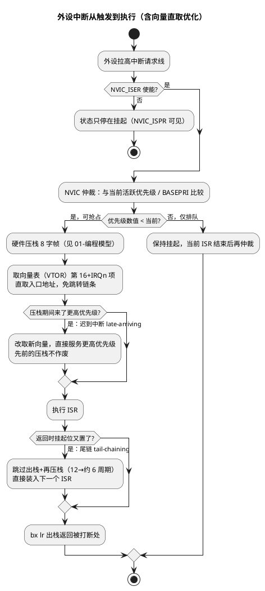

# 02-NVIC与中断

> 一句话定位：NVIC（Nested Vectored Interrupt Controller，嵌套向量中断控制器）把"使能/挂起/优先级/活跃"四个概念做成集中位图寄存器组——理解优先级分组、向量直取优化（尾链/迟到中断）与 BASEPRI 分级屏蔽，就理解了 M 核中断延迟确定性的来源；并与 TriCore 每源一个 SRC 寄存器的分布式模型对照。
> 等级：L1 ｜ 前置：[01-编程模型与寄存器](01-编程模型与寄存器.md)、[03-中断初识-从轮询到中断](../../00-入门导读/03-中断初识-从轮询到中断.md)

## 原理

### 1. NVIC 编程模型：每个中断的四元组状态

NVIC 对每个外设中断（IRQn，架构上最多 240 个，实际数目实现定义）维护四个独立状态：

- **使能（Enable）**：NVIC_ISER 置 1 才可能被服务；
- **挂起（Pending）**：中断信号已到但尚未执行（或 ISR 已在跑再来一次，挂起位再置，表示"还欠一次"）；
- **优先级（Priority）**：8 位字段（实现位宽查下文），**数值越小优先级越高**；
- **活跃（Active）**：ISR 正在执行（NVIC_IABR 只读）。

触发到执行的链路：



### 2. 优先级分组：抢占优先级 vs 子优先级

8 位优先级字段（实际实现位宽 3~8 位，**实现定义**；S32K1xx/S32K3xx 实际几位查对应 RM 的 NVIC 章节）被 SCB_AIRCR.PRIGROUP 切成两段：

- **抢占优先级（group priority / preemption priority）**：不同抢占级可互相打断；
- **子优先级（sub-priority）**：**不产生抢占**，只在多个同抢占级同时挂起时决定谁先被服务。

分组从"全部 8 位都是抢占"到"全部都是子优先级"共 8 档（PRIGROUP=0~7）。未实现的低位读 0——所以"写 0xFF"在只实现 4 位的芯片上等于 0xF0。**复位后所有 IPR=0，即所有中断都是最高优先级**，谁也抢不了谁，只剩硬件 IRQn 排队。

### 3. 向量直取优化与延迟确定性

零等待存储器下 M3/M4/M7 的中断进入延迟**典型 12 周期**，来源是"压栈+取向量"并行流水完成。三项架构优化把背对背中断的开销压到最低：

- **尾链（tail-chaining）**：ISR 返回时若挂起队列非空，跳过出栈/再压栈，约 6 周期切入下一个 ISR；
- **迟到中断（late-arriving）**：压栈期间更高优先级到达，直接改取向量服务新来的，已压的栈帧复用；
- **出栈抢占（pop preemption）**：出栈阶段更高优先级到达，出栈中止、直接服务。

确定性含义：延迟上界由存储器等待（flash 等待周期、M7 的 Cache miss）决定，而不是由软件跳转链条决定。M7 上要最坏延迟可控，向量表+关键 ISR 放 ITCM/零等待区（呼应 [01-编程模型与寄存器](01-编程模型与寄存器.md)）。

### 4. 三级屏蔽：PRIMASK / FAULTMASK / BASEPRI

| 寄存器 | 语义 | 粒度 | 典型场景 |
|---|---|---|---|
| PRIMASK | 屏蔽所有可配置优先级异常 | 全屏蔽（1 位） | 裸机临界区 `cpsid i` |
| FAULTMASK | 连 HardFault 也屏蔽（仅剩 NMI） | 全屏蔽+fault | fault 处理内临时压制 |
| BASEPRI | 屏蔽"优先级数值 ≥ BASEPRI"的中断 | **分级**屏蔽 | RTOS 内核只挡低优先级，高优先级中断（如安全相关）照常响应 |

BASEPRI=0 表示**不屏蔽**（复位值），不是"屏蔽所有"——这是最高频的语义误读。FreeRTOS 的 `configMAX_SYSCALL_INTERRUPT_PRIORITY` 本质就是把"可调 API 的中断"限制在 BASEPRI 之上。

## 寄存器与位表

NVIC 寄存器组（CMSIS 标准命名，均为公开架构标准；下表给概念，具体实例数/基地址以架构手册为准）：

| 寄存器 | 访问语义 | 作用 |
|---|---|---|
| NVIC_ISER[n] | **写 1 置位**（W1S），读回状态 | 使能中断（每 bit 一个 IRQ） |
| NVIC_ICER[n] | **写 1 清零**（W1C） | 关闭使能 |
| NVIC_ISPR[n] | W1S | 软件强制挂起（软件中断） |
| NVIC_ICPR[n] | W1C | 清挂起（ISR 取向量时硬件自动清） |
| NVIC_IABR[n] | 只读 | 活跃标志，每核一份 |
| NVIC_IPR[n] | 每中断 1 字节（未实现位读 0） | 优先级，数值越小越高 |

SCB 侧相关：

| 寄存器/位域 | 说明 |
|---|---|
| SCB_AIRCR[10:8] PRIGROUP | 抢占/子优先级分界（写时必须带 VECTKEY=0x5FA） |
| SCB_AIRCR[2] SYSRESETREQ | 请求系统复位 |
| SCB_ICSR[8:0] VECTACTIVE | 当前活跃异常号（与 IPSR 一致） |
| SCB_ICR PENDSTSET/PENDSVSET | 软件挂起 SysTick/PendSV（RTOS 调度器核心动作） |
| SCB_VTOR | 向量表基址（详见 [03-向量表与复位](03-向量表与复位.md)） |

## 双平台对照：NVIC vs TriCore SRC

| 维度 | Cortex-M NVIC | TriCore（TC1.6.x） |
|---|---|---|
| 组织方式 | 集中式位图寄存器组（ISER/IPR…每 bit/byte 对应一个 IRQ） | **分布式**：每个中断源一个 SRC（Service Request Control）寄存器 |
| 单源字段 | 使能/挂起/优先级分散在多组位图里 | 一个 SRC 内集中：SRE（使能）、SRR（挂起）、SRPN（优先级）、TOS（路由到哪个 CPU/DMA） |
| 优先级方向 | 数值越小越高 | **SRPN 数值越大越高**（且 0 表示不请求），方向相反 |
| 优先级位宽 | 8 位字段、实现 3~8 位 | SRPN 0~255 |
| 全局开关 | PRIMASK/FAULTMASK/BASEPRI | PSW.IE（总使能）+ ICR.CCPN（当前 CPU 优先级，低于它的进不来） |
| 向量来源 | VTOR 表按 IRQn 索引（偏移=16+IRQn） | BIV 基址按**优先级**索引（优先级×向量间隔） |
| 路由 | 单核直接仲裁 | TOS 字段把请求路由到不同核/服务提供者 |
| 硬件上下文保存 | 自动压 8 字栈帧 | 硬件经 CSA（上下文保存区）保存 upper context 链表 |

字段命名以 TriCore 架构手册为准，本表为机制级对照。

## 代码/实操

CMSIS 标准三连（顺序：先优先级后使能）：

```c
NVIC_SetPriority(LPUART1_IRQn, 5u);   /* 先设优先级；忘设则复位值 0=最高 */
NVIC_ClearPendingIRQ(LPUART1_IRQn);   /* 清残留挂起（外设初始化期间可能误触发） */
NVIC_EnableIRQ(LPUART1_IRQn);         /* 最后开 */
```

RTOS 分级屏蔽（FreeRTOS 风格）：

```c
/* configMAX_SYSCALL_INTERRUPT_PRIORITY = 0x50（示例）
 * BASEPRI=0x50：屏蔽所有数值>=0x50 的中断，数值更小的（更高优先级）照常响应 */
taskENTER_CRITICAL();    /* 实现为 __set_BASEPRI(0x50) */
...                       /* 内核临界区，高优先级中断不被拖慢 */
taskEXIT_CRITICAL();     /* __set_BASEPRI(0) 恢复 */
```

## 易错点与陷阱

1. **先使能后设优先级**：IPR 复位为 0（最高级），中途来一个中断就抢了本该抢不进的临界区——永远"先优先级、后使能"。
2. **把 W1C 寄存器当普通寄存器读改写**：`NVIC->ICER[0] |= mask` 会把"读到为 1"的其它位一起清掉——ICER/ICPR 必须直写，不读改写。
3. **BASEPRI=0 的语义**：不屏蔽。想全屏蔽用 PRIMASK（`cpsid i`）。
4. **子优先级不能抢占**：把关键中断只给了"子优先级更高"以为能抢占，实际同抢占级仍要等当前 ISR 结束。
5. **优先级左对齐**：实现 4 位时写 5 与写 0x50 等效（低位不实现），跨芯片移植直接搬数值会颠倒相对关系。
6. **IRQn 与异常号差 16**：向量表下标 = IRQn+16；手填表/算 VTOR 偏移时忘了 +16 是经典 bug（详见 [03-向量表与复位](03-向量表与复位.md)）。
7. **M7 上忽视 Cache 影响**：ISR 首次执行 I-Cache miss 时延迟超 12 周期，硬实时中断放 ITCM 并实测。
8. **清挂起清不掉"还在拉高的线"**：外设请求信号未清就写 NVIC_ICPR，硬件立刻重新置挂起——先清外设标志位，再清 NVIC。

## 面试高频题

**Q1：NVIC 的尾链（tail-chaining）是什么？带来什么收益？**
答：ISR 返回发现还有挂起中断时，硬件跳过"出栈回被打断处 + 再压栈"两步，直接装入下一个 ISR，约 6 周期完成切换（正常 12 周期）。背对背中断风暴下收益显著。

**Q2：抢占优先级和子优先级的区别？PRIGROUP 怎么分？**
答：抢占级不同才能互相打断；子优先级只在同抢占级里决定排队顺序，不产生抢占。SCB_AIRCR.PRIGROUP 把 8 位优先级字段从某个分界切成两段，8 档可选；实际有效位宽是 3~8 位实现定义。

**Q3：PRIMASK 和 BASEPRI 的区别？RTOS 为什么用 BASEPRI？**
答：PRIMASK 一刀切屏蔽所有可配置优先级异常；BASEPRI 只屏蔽优先级数值 ≥ 它的中断，分级。RTOS 用 BASEPRI 让内核临界区只挡低优先级中断，把高优先级中断（刹车、安全气囊类）的延迟维持在微秒级不受内核影响。

**Q4：Cortex-M 的中断延迟是多少？为什么说是确定性的？**
答：零等待存储器下典型 12 周期。因为压栈和取向量由硬件流水并行完成，路径固定无软件跳转；上界只受存储器等待影响（flash 等待、M7 Cache miss），放 TCM/零等待区即可拿到上界。

**Q5：NVIC 和 TriCore 的中断机制有什么架构差异？**
答：NVIC 集中式位图（ISER/IPR 每位对应一个 IRQ），TriCore 每源一个 SRC 寄存器（SRE/SRR/SRPN/TOS 集中）；优先级方向相反（M 越小越高，TriCore SRPN 越大越高）；向量来源不同（按 IRQn 索引 vs 按优先级索引 BIV）；TriCore 还有 TOS 做核间路由，硬件保存上下文走 CSA 而非压栈。

**Q6：怎么用 NVIC 软件触发一个中断？**
答：`NVIC_SetPendingIRQ(irqn)`（写 NVIC_ISPR），使能且优先级允许即进入 ISR；常用于把"核间事件/软任务"折成统一中断路径处理。

## 延伸

- [01-编程模型与寄存器](01-编程模型与寄存器.md)：压栈的 8 字栈帧、EXC_RETURN——中断进入/返回的另一半。
- [03-向量表与复位](03-向量表与复位.md)：NVIC 取向量时读的表长什么样、VTOR 怎么重定位。
- [04-MPU](04-MPU.md)：把 RTOS 临界区与任务隔离配合起来的保护机制。
- [异常与Trap](../../3-L3高级/异常与Trap/README.md)：HardFault/BusFault 等异常本身的分类与定位。
- [TriCore架构](../../3-L3高级/TriCore架构/README.md)：SRC/CSA/BIV 的 TriCore 侧细节。
- [ARM汇编/02-Thumb指令](../../../01-编程语言/2-L2进阶/汇编基础/ARM汇编/02-Thumb指令.md)：cpsid/cpsie、msr/mrs 屏蔽指令写法。
