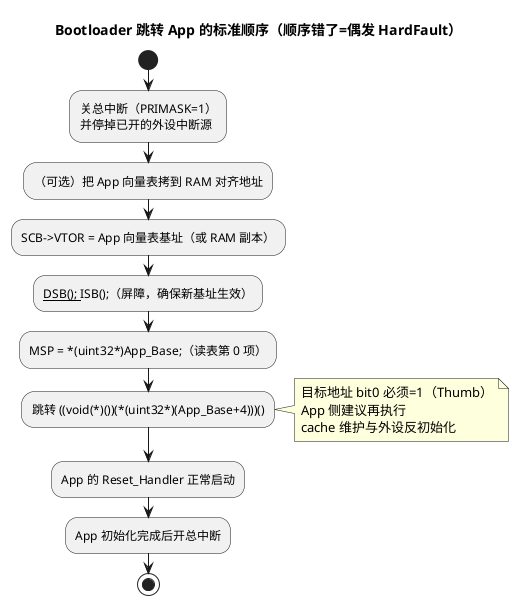

# 03-向量表与复位

> 一句话定位：向量表（Vector Table）是 Cortex-M 一切异常响应的"根目录"——前 16 项系统异常 + 外设项按 IRQn 排列，复位时硬件自动装载前两项（MSP 初值 + 复位入口）；本篇讲清表结构、VTOR 重定位与 Bootloader/OTA 场景的正确顺序，并与 TriCore 的 BTV/BIV 机制对照。
> 等级：L1 ｜ 前置：[02-NVIC与中断](02-NVIC与中断.md)、[04-复位启动初识-第一条指令从哪来](../../00-入门导读/04-复位启动初识-第一条指令从哪来.md)

## 原理

### 1. 表结构：16 项系统 + N 项外设

向量表就是一个函数指针数组，每项 4 字节（bit0=1 表 Thumb 态），架构固定的前 16 项如下：

| 下标 | 内容 | 备注 |
|---|---|---|
| 0 | **MSP 初值** | 不是代码地址！是栈顶（链接脚本 `__StackTop`） |
| 1 | **复位入口**（Reset_Handler） | 复位后 PC 从这里开始 |
| 2 | NMI | |
| 3 | HardFault | |
| 4~7 | MemManage / BusFault / UsageFault / 保留 | fault 类 |
| 8~10 | 保留 | |
| 11 | SVCall | RTOS 系统调用入口 |
| 12 | DebugMon | |
| 13 | 保留 | |
| 14 | PendSV | RTOS 任务切换标配 |
| 15 | SysTick | RTOS 时基标配 |
| 16+ | 外设中断 | IRQn = 下标-16；**顺序按芯片 RM 的中断向量映射表**（S32K 上 LPUART/LPTMR/FTM/CAN 的次序各系列不同，查 RM） |

startup 文件如何把 C 函数填进这张表（weak/alias 兜底机制）在汇编篇已细讲：[ARM汇编/03-启动文件startup解读](../../../01-编程语言/2-L2进阶/汇编基础/ARM汇编/03-启动文件startup解读.md)，本篇不重复。

### 2. 复位装载：硬件自动取前两项

复位后软件还没跑第一行之前，硬件完成两步：

1. 从向量表基址（复位时由实现定义的默认地址，常见 0x00000000，S32K 具体默认值与 BOOT 映射查 RM）读**第 0 项**装入 MSP——这样第一条指令一执行中断一开就能压栈；
2. 读**第 1 项**作为 PC，跳进复位入口。

这解释了两个"为什么"：为什么向量表第 0 项是栈顶而不是指令；为什么 MSP 在任何 C 代码之前就已可用。

### 3. VTOR 重定位：把"根目录"搬走

SCB_VTOR（Vector Table Offset Register）把表基址从默认地址改到别处。两个约束：

- **对齐**：表必须对齐到不小于表大小的 2 的幂，且架构最低 128 字节（VTOR.TBOFF 只实现 bits[31:7]）；
- **写入后建议 `DSB; ISB`**，保证后续异常取向量用新基址。

三大典型场景：

| 场景 | 做法 | 目的 |
|---|---|---|
| RAM 调试 | 拷表到 RAM → VTOR 指向 RAM | 断点/单步时可直接改 RAM 里的向量做动态插桩 |
| Bootloader 跳 App | 拷表/直用 App 表 → 设 VTOR → 设 MSP → 跳转 | 中断全部走 App 的表 |
| OTA 升级 | 新表先落 RAM 或双分区切换 | 见第 5 节陷阱 |

Bootloader → App 的正确顺序是本篇核心实操：



**顺序为什么不能反**：先开中断再搬表，窗口期里来的中断会按旧表/半新表取向量——旧表项指向 Bootloader 的 handler 或已擦除的 flash，直接 HardFault 或"飞线"。

### 4. TriCore 对照：BTV 与 BIV

TriCore（TC1.6.x）把向量表拆成两个基址寄存器（概念对照，字段细节查 TriCore 架构手册）：

| | Cortex-M | TriCore |
|---|---|---|
| 系统级异常（trap） | 与外设中断同表，下标 2~15 | **BTV**（Trap Vector Table Base）按 trap 类号索引，单独一张表 |
| 外设中断 | VTOR 表，按下标 IRQn+16 索引 | **BIV**（Interrupt Vector Table Base）**按优先级 SRPN 索引**，不是按外设号 |
| 表项内容 | handler 入口地址 | 跳转指令/入口 |
| 复位装载 | 前两项硬件自动装 MSP/PC | 复位后 PC 从固定 reset 地址起，trap/interrupt 基址由启动代码装载 |

"按优先级索引"意味着 TriCore 一个中断源改 SRPN 就会换向量槽位，与 Cortex-M"表序=芯片定死的 IRQn"是两种世界观——移植驱动时最容易踩的次序差异（外设号 ↔ 优先级错位）。

### 5. OTA 后向量表更新的陷阱

1. **擦写瞬间掉电变砖**：向量表在 flash 里，擦除该扇区的几毫秒内掉电，复位后前两项是 0xFF，MSP/PC 全废。对策：Bootloader 本体的表永不动，只更新 App 区；或双分区 A/B + 保留最小不可变 boot 区。
2. **擦写窗口来了中断**：擦写 App 向量扇区前必须关中断（PRIMASK）且 VTOR 指向 RAM 副本，否则窗口期中断取向量读到半擦除数据。
3. **只更新了 flash，忘了 VTOR/cache**：表内容变了但运行中 VTOR 还指旧地址；M7 上 I-Cache 里还有旧 ISR 首行指令——跳转/复位前做 cache invalidate（M7 维护操作查内核手册）。
4. **新表没对齐**：OTA 写完的表基址不满足"2 的幂且 ≥ 表大小"（最低 128B），写 VTOR 后异常进入即 fault。
5. **App 假定表在默认地址**：Bootloader 已把 VTOR 指到 App，App 的启动代码再按默认地址重复初始化外设/再搬一次表且搬到不一致的地址——两边都要有明确的 VTOR 约定。

## 寄存器与位表

| 寄存器/位域 | 位置 | 说明 |
|---|---|---|
| SCB_VTOR.TBLOFF | bits[31:7] | 表基址偏移；bits[6:0] 不实现 → 至少 128B 对齐 |
| SCB_VTOR 写后 | — | 建议 `__DSB(); __ISB();` 生效 |
| SCB_AIRCR.SYSRESETREQ | bit[2] | 请求系统复位（写时带 VECTKEY=0x5FA），跳转 App 前的"干净复位"常用 |
| SCB_AIRCR.VECTRESET | bit[0] | 仅复位内核（调试用，生产慎用） |
| 表项格式 | 每项 4B | bit0 必须为 1（Thumb）；第 0 项是 MSP 初值（bit0 可为 0，是地址不是代码） |

## 代码/实操

Bootloader 跳 App（GCC/CMSIS 风格骨架）：

```c
#define APP_BASE        (0x00010000u)          /* App 起始（含向量表），需满足对齐 */
#define RAM_VEC_BASE    (0x1FFF8000u)          /* RAM 中 128B 对齐的副本位置 */

void Jump_To_App(void)
{
    uint32_t app_sp   = *(volatile uint32_t *)(APP_BASE);
    uint32_t app_pc   = *(volatile uint32_t *)(APP_BASE + 4u);
    void (*app_reset)(void) = (void (*)(void))app_pc;

    __disable_irq();                                  /* 1. 关总中断 */
    /* 停用已开的外设中断源、SysTick —— 项目相关，逐个关干净 */

    memcpy((void *)RAM_VEC_BASE, (void *)APP_BASE, VECTOR_TABLE_SIZE);
    SCB->VTOR = RAM_VEC_BASE;                         /* 2. 指向新表 */
    __DSB(); __ISB();                                 /* 3. 屏障生效 */

    __set_MSP(app_sp);                                /* 4. 装主栈指针 */
    app_reset();                                      /* 5. 跳转，bit0=1 */
}
```

App 侧 `SystemInit` 里同步声明主权（不依赖 boot 残留状态）：

```c
SCB->VTOR = (uint32_t)&__Vectors;   /* 以链接符号为准，不写死地址 */
```

## 易错点与陷阱

1. **第 0 项填成函数地址**：MSP 被装成代码地址，第一个压栈就写飞——检查链接脚本的栈顶符号。
2. **bit0 忘置 1**：跳转目标 bit0=0 会触发 INVSTATE UsageFault（T 位被清）。
3. **VTOR 写完不做屏障**：紧跟着的异常可能仍用旧表，DSB+ISB 一行都不能省。
4. **对齐按"128 字节"一刀切**：向量多的芯片要按"覆盖全表的下一个 2 的幂"对齐（如 80 个向量=320B → 对齐 512B）。
5. **关中断只关了 PRIMASK 忘了外设**：外设请求线还拉高，App 一开使能立刻进"陈年挂起"，先清外设标志再清 NVIC（呼应 [02-NVIC与中断](02-NVIC与中断.md)）。
6. **M7 跳转不做 cache 维护**：boot 阶段预取的旧指令残留 I-Cache，App 首跑踩到旧代码，invalidate 后再跳。

## 面试高频题

**Q1：Cortex-M 复位后到执行第一条指令，硬件做了什么？**
答：从默认表基址取向量：第 0 项装入 MSP（栈立即可用），第 1 项作为 PC 跳到复位入口。全程无软件参与，这也是"复位向量"名字的由来。

**Q2：VTOR 有什么用？对齐要求是什么？**
答：重定位向量表基址，用于 Bootloader 跳 App、RAM 调试、动态换表。表必须对齐到不小于表大小的 2 的幂，架构最低 128 字节（VTOR 只实现 bits[31:7]）；写入后建议 DSB+ISB。

**Q3：Bootloader 跳转 App 的标准步骤？为什么顺序重要？**
答：关总中断并关外设中断源 → （可选）拷表到 RAM → 设 VTOR → 屏障 → 设 MSP → 跳转（目标 bit0=1）→ App 内开中断。顺序错了会在"表已半换"的窗口期响应中断，取向量到旧表/擦除区，产生偶发 HardFault。

**Q4：OTA 升级时向量表有什么风险？怎么设计？**
答：擦写向量扇区时掉电或来中断都会让表失效（掉电=变砖，中断=取向量到半擦除数据）。设计上：最小不可变 boot 区 + App 双分区 A/B 交替 + 回滚标志；擦写期间关中断且 VTOR 指向 RAM 副本。

**Q5：TriCore 和 Cortex-M 的向量机制有何不同？**
答：Cortex-M 一张表（VTOR）按异常号索引，前 16 项架构固定；TriCore 分两张：BTV 管 trap（按类号）、BIV 管中断（按优先级 SRPN 而非外设号）。TriCore 改中断优先级会换向量槽位，Cortex-M 改优先级不换表位置。

**Q6：为什么第 0 项是 MSP 初值而不是第一条指令？**
答：架构要保证"第一条指令执行前栈就可用"——任何异常从第一条指令起就可能到来，压栈必须有合法 SP。复位序列装完 MSP 再跳复位入口，正是为了这个时序。

## 延伸

- [ARM汇编/03-启动文件startup解读](../../../01-编程语言/2-L2进阶/汇编基础/ARM汇编/03-启动文件startup解读.md)：startup 如何生成这张表（weak/alias 兜底、`.isr_vector` 段）。
- [02-NVIC与中断](02-NVIC与中断.md)：取到的向量如何被 NVIC 仲裁、尾链、迟到中断。
- [01-编程模型与寄存器](01-编程模型与寄存器.md)：MSP/PSP 装载后的切换规则与压栈机制。
- [启动流程](../../2-L2进阶/启动流程/README.md)：从复位到 main 的全链路（时钟、拷 data/清 bss、SystemInit）。
- [TriCore架构](../../3-L3高级/TriCore架构/README.md)：BTV/BIV 与 trap 分类的 TriCore 侧展开。
