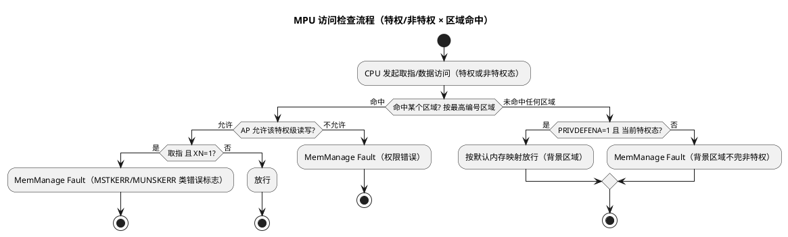

# 04-MPU

> 一句话定位：Cortex-M 的 MPU（Memory Protection Unit）是 PMSA 保护模型——不用 MMU 做虚实地址翻译，只按"编号区域（region）+ 基址 + 2 的幂大小 + 特权/非特权权限"做访问检查；掌握背景区域 PRIVDEFENA、子区域禁用 SRD 与栈溢出守卫用法，是任务隔离的第一步。
> 等级：L1→L2 ｜ 前置：[01-编程模型与寄存器](01-编程模型与寄存器.md)

## 原理

### 1. PMSA：保护而非翻译

Cortex-M 用 **PMSA（Protected Memory System Architecture）**，与 A 核的 **VMSA/MMU**（虚实地址翻译+页表）相对：

- 无虚地址、无 TLB、无页表——地址永远物理；
- 检查的是"这次取指/数据访问允不允许"，不允许就抛 **MemManage Fault**（MemManage 管理错误异常）；
- 检查对象是**CPU 自己的访问**（取指与数据），DMA 等其它总线主设备不受 MPU 约束（见陷阱 1）。

### 2. 区域机制：编号、基址、2 的幂、子区域

MPU 提供最多 16 个编号区域（region 0~15，实际区域数读 MPU_TYPE.DREGION，S32K1xx/S32K3xx 的实配查 RM）。每区域三要素：

- **基址（RBAR.ADDR）**：必须对齐到区域大小（配 64KB 区域，基址就要 64KB 对齐）；
- **大小（RASR.SIZE）**：**2 的幂**字节，最小 32B、最大 4GB，按 `大小=2^(SIZE+1)` 编码；
- **子区域禁用 SRD（Sub-Region Disable，bits[15:8]）**：每区域等分 8 个子区域，每 bit 对应一个 1/8 子区域可单独禁用——用来在"必须 2 的幂"的约束下抠出非 2 的幂形状（如 64KB 区域中禁掉顶部 1/8，得到 56KB 有效保护）。

**重叠区域的仲裁规则：编号大的优先**。RTOS 常用低号区域铺大背景，高号区域给任务开小口。

### 3. 权限模型：特权/非特权 × 读写执行

每区域一套属性：AP（Access Permission）管读写、XN（eXecute Never）管取指：

| AP[2:0] | 特权态 RW | 非特权态 RW | 说明 |
|---|---|---|---|
| 000 | 无 | 无 | 全禁（守卫区域用） |
| 001 | RW | 无 | 内核数据 |
| 010 | RW | 只读 | 任务看配置表 |
| 011 | RW | RW | 共享缓冲 |
| 101 | 只读 | 无 | 只读寄存器 |
| 110 | 只读 | 只读 | 常量表 |
| 100/111 | — | — | 保留，勿用 |

XN=1 时该区域任何态取指都触发 MemManage Fault——把数据区（尤其外设/通信缓冲）设 XN 是防代码注入攻击溢出的标准动作。

### 4. 背景区域 PRIVDEFENA

MPU_CTRL.PRIVDEFENA=1 时，**未命中任何区域**的访问按默认内存映射放行——但**仅特权态**享有；非特权态访问未映射区一律 fault。两种典型配置：

- 裸机调试期：PRIVDEFENA=1，特权代码"感觉不到 MPU 存在"，只有任务（非特权）受限；
- 严格模式：PRIVDEFENA=0，白名单制，漏配的区域连内核也访问不了。

### 5. 检查流程与典型用法



三大典型用法：

| 用法 | 做法 | 收益 |
|---|---|---|
| **栈溢出守卫** | 在栈底（增长方向的反端）放一个 32B 或更小的全禁（AP=000）区域 | 溢出第一笔写即 MemManage Fault，代替"静默踩相邻变量几小时后才崩" |
| **任务隔离** | 每任务自己的代码/数据/栈区域，上下文切换时整组重配 | 任务 A 的野指针写不进任务 B 的数据（配合 [01-编程模型与寄存器](01-编程模型与寄存器.md) 的非特权模式） |
| **DMA 缓冲/描述符保护** | 把 DMA 描述符表所在内存设为"仅特权 RW"（AP=001） | 防止非特权任务代码误改描述符——注意这是约束 **CPU 侧**的写，DMA 本身不受 MPU 管，DMA 越权要靠芯片级方案（查 RM） |

## 寄存器与位表

| 寄存器 | 关键位 | 说明 |
|---|---|---|
| MPU_TYPE | DREGION[15:8] | 实现的区域数（0=无 MPU；S32K 实配查 RM）；IREGION 架构上读 0 |
| MPU_CTRL | bit0 ENABLE | MPU 总使能 |
| | bit1 HFNMIENA | HardFault/NMI 期间 MPU 是否继续生效（**复位默认 0=不生效**） |
| | bit2 PRIVDEFENA | 背景区域开关 |
| MPU_RNR | REGION[7:0] | 先选区域号，再写 RBAR/RASR |
| MPU_RBAR | ADDR[31:N]（N=log2 大小）+ VALID[4] + REGION[3:0] | VALID=1 时写基址顺带选区域号（免 RNR 两步） |
| MPU_RASR | XN[28]、AP[26:24]、TEX[21:19]/S[18]/C[17]/B[16]（Cache 属性）、SRD[15:8]、SIZE[5:1]、ENABLE[0] | 区域属性全集 |

区域大小编码：`SIZE=4` → 32B（最小），`SIZE=n` → `2^(n+1)` 字节。TEX/S/C/B 与 Cacheable/Bufferable/Shareable 属性主要影响 M7 的 Cache 行为，具体组合语义查 ARMv7-M 架构手册，不凭记忆写。

## 双平台对照

M4 vs M7（本系内部）：

| | Cortex-M4 | Cortex-M7 |
|---|---|---|
| 有无 | 可选实现 | 可选实现 |
| 区域数上限 | 16 | 16 |
| 实配差异 | S32K1xx 查 RM | S32K3xx 查 RM |
| Cache 属性位 | 意义有限（无 L1 Cache） | TEX/S/C/B 直接影响 I/D Cache 与写缓冲行为，配置更讲究 |

Cortex-M vs TriCore（跨架构，概念对照）：

| | Cortex-M MPU | TriCore 保护机制 |
|---|---|---|
| 模型 | 全局一组编号区域，RTOS 软件重配 | **每核一套保护寄存器集**（protection register set：数据/代码/栈范围寄存器等） |
| 任务切换 | 上下文切换时内核逐条重写 RBAR/RASR | 支持**多套保护集**，可随任务上下文硬件切换保护集指针 |
| 越权后果 | MemManage Fault（错误地址可从 MMAR 读出） | Memory Protection Trap（trap 类，TIN 区分原因） |
| 细节 | 见本文 | 字段/套数查 TriCore 架构手册，不编造 |

TriCore "多套保护集随任务硬件切换"与 M 核"软件重配区域"是两种工程取舍：前者切换快但套数固定，后者无限灵活但切换耗时段。

## 代码/实操

CMSIS（CORE_MPU 头）配置骨架：

```c
/* 1. 栈守卫：栈底 32B 全禁区域（假设栈向下增长，guard 在 __STACK_LIMIT）
 *    AP=000（特权/非特权均不可读写），SIZE=4 → 32 字节，ENABLE 位由宏内置置 1 */
ARM_MPU_SetRegion(ARM_MPU_RBAR(7u, (uint32_t)&__STACK_LIMIT),
                  ARM_MPU_RASR(0u,          /* XN=0 */
                               0x0u,        /* AP=000：全禁 */
                               0u,          /* TEX */
                               0u,          /* S */
                               0u,          /* C */
                               0u,          /* B */
                               0u,          /* SRD：子区域全使能 */
                               4u));        /* SIZE=4 → 32B */

/* 2. 任务代码区：特权 RW、非特权只读、可执行 */
ARM_MPU_SetRegion(ARM_MPU_RBAR(8u, TASK_CODE_BASE),
                  ARM_MPU_RASR(0u,          /* XN=0 */
                               0x2u,        /* AP=010 */
                               ...));       /* TEX/S/C/B/SRD/SIZE 按区域补全 */

/* 3. 使能：开背景区域，HardFault/NMI 期间保持生效 */
ARM_MPU_Enable(ARM_MPU_CTRL_PRIVDEFENA | ARM_MPU_CTRL_HFNMIENA);
```

> CMSIS 原型为 `ARM_MPU_RASR(XN, AP, TEX, S, C, B, SUBDISABLE, SIZE)`——各参数按位域入位、ENABLE 位由宏内部置 1（ARMv8-M 侧另有 `ARM_MPU_RASR_EX`+`ARM_MPU_Attrib` 组合）。实际工程用 CMSIS 提供的 `ARM_MPU_Load()/ARM_MPU_SetRegion()` 宏按表驱动配置；FreeRTOS-MPU 版本在任务切换钩子里自动换区域组。

栈溢出守卫的 MemManage 处理骨架：

```c
void MemManage_Handler(void)
{
    /* SCB->CFSR 的 DACCVIOL/MSTKERR 置位 + SCB->MMAR 给出违规地址 */
    if ((SCB->CFSR & SCB_CFSR_DACCVIOL_Msk) != 0u)
    {
        /* MMAR 落在栈守卫区域 → 判定栈溢出，记录任务名/栈水位 */
        Handle_StackOverflow(SCB->MMAR);
    }
    /* 其余按权限/取指违规分流，见 异常与Trap 篇 */
}
```

## 易错点与陷阱

1. **以为 MPU 能管 DMA**：MPU 只检查 CPU 的取指与数据访问，DMA/以太网等其它总线主设备不经过 MPU。所谓"DMA 保护"是保护 DMA 缓冲不被 CPU 侧误写；DMA 自身越权要靠芯片级方案，查 RM。
2. **默认 HFNMIENA=0**：HardFault/NMI 处理期间 MPU 失效——调试时"明明配了区域怎么 fault 里还能访问"，这是设计如此；要 fault 内也管住就置 HFNMIENA=1（慎用：fault 处理栈若在受限区会二次 fault）。
3. **漏开 PRIVDEFENA 全员 fault**：特权代码访问未映射区（如新外设地址）直接 MemManage，以为 MPU"坏了"。
4. **区域重叠忘了优先级**：低号区域"配了没用"，被高号区域覆盖，检查两区域重叠时按"高号赢"推演。
5. **基址没对齐到区域大小**：RBAR 写入无效或区域从对齐边界生效，保护范围与预期错位。
6. **XN 误设到 RAM 函数区**：跳转到 RAM 里跑的代码（bootloader 搬运、OTA 校验）立即 INVSTATE/MemManage，RAM 代码区必须可执行。
7. **上下文切换不重配区域**：RTOS 集成 MPU 时只在初始化配一次，任务切换后沿用上一个任务的区域组——隔离形同虚设；切换钩子里整组更新。
8. **SRD 位序搞反**：SRD bit0 对应**最低地址**子区域，从高位往低位数会禁错段。

## 面试高频题

**Q1：MPU 和 MMU 的区别？为什么 MCU 用 MPU？**
答：MMU 做虚实地址翻译（页表、TLB），MPU 只做访问权限检查、地址不经翻译。MCU 无需进程级地址隔离、追求确定性与低开销，PMSA 保护模型足够实现任务隔离与故障 containment。

**Q2：MPU 区域的大小和基址有什么约束？SRD 是干什么的？**
答：大小必须是 2 的幂（32B~4GB），基址必须对齐到区域大小。SRD（子区域禁用，8 位）把区域等分 8 段可单独禁用，用于在 2 的幂约束下拼出非 2 的幂的保护形状（如 56KB=64KB 禁 1/8）。

**Q3：PRIVDEFENA 背景区域是什么？**
答：MPU_CTRL 的 bit2。置 1 时特权态访问"未命中任何区域"的地址按默认内存映射放行，非特权态则不兜底。等于给内核一个"默认可访问一切"的退路，只对任务做白名单。

**Q4：怎么用 MPU 做栈溢出检测？**
答：栈增长方向的反端放一个小（如 32B）AP=000 全禁区域，正常永远不触；一旦溢出，第一笔越界写触发 MemManage Fault，从 SCB->CFSR 的 DACCVIOL 与 MMAR 读出违规地址，把"静默踩内存"变成"即时带现场报警"。

**Q5：两个 MPU 区域重叠，按谁算？**
答：编号大的优先。利用这一点：低号区域铺大范围默认属性，高号区域针对特定地址段覆盖例外。

**Q6：Cortex-M MPU 与 TriCore 保护机制的主要差异？**
答：M 核一组全局区域、RTOS 切换任务时软件重写区域寄存器；TriCore 每核带保护寄存器集且支持多套保护集随任务上下文硬件切换；越权后果分别是 MemManage Fault 与 Memory Protection Trap。两者都不约束 DMA。

## 延伸

- [01-编程模型与寄存器](01-编程模型与寄存器.md)：非特权模式（CONTROL.nPRIV）是 MPU 权限模型生效的前提。
- [02-NVIC与中断](02-NVIC与中断.md)：MemManage 与中断异常的优先级关系。
- [异常与Trap](../../3-L3高级/异常与Trap/README.md)：MemManage/BusFault 的 CFSR 位段解读与定位决策树。
- [多核架构](../../3-L3高级/多核架构/README.md)：多主设备（CPU×n+DMA）下"MPU 管不到的总线"如何防。
- [TriCore架构](../../3-L3高级/TriCore架构/README.md)：保护寄存器集的 TriCore 侧展开。
- [S32K平台](../S32K平台/README.md)：S32K1xx/S32K3xx 的 MPU 区域数与 SDK 使能入口。
