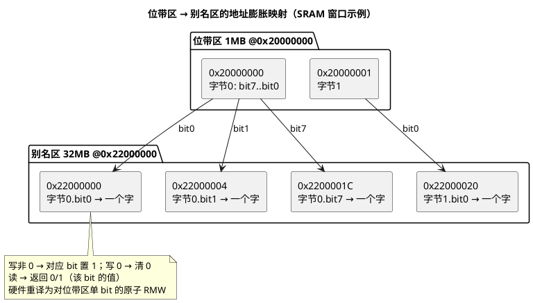

# 05-位带操作

> 一句话定位：位带（Bit-Band）是 ARMv7-M 在**地址映射层**做的硬件特性——把两个 1MB 位带区（SRAM/外设）的每一个比特，膨胀映射成 32MB 别名区里的一个 32 位字，写别名即单 bit 原子读写；本篇从架构视角讲映射公式、总线重译原理与 TriCore 无位带的原因，C 工程宏用法见 C 语言篇。
> 等级：L1 ｜ 前置：[01-编程模型与寄存器](01-编程模型与寄存器.md)

## 原理

### 1. 设计动机：把"读改写"折叠成一次写

改一个 bit 的经典三步是**读-改-写（RMW, Read-Modify-Write）**：`reg |= (1<<n)` 是三条指令（LDR/ORR/STR）。中间被 ISR 或另一核打断，对方的修改就被"用旧值写回"覆盖——丢更新。

传统解法是关中断或上锁。位带的思路不同：**让"改一个 bit"在指令层就是一条普通 32 位写**，原子性由地址映射硬件保证，无需任何软件锁。

### 2. 位带区与别名区：1MB → 32MB 的膨胀映射

ARMv7-M（M3/M4/M7）固定两个位带区：

| 位带区 | 地址范围 | 对应别名区起始 |
|---|---|---|
| SRAM 位带 | `0x20000000 ~ 0x200FFFFF`（1MB） | `0x22000000` |
| 外设位带 | `0x40000000 ~ 0x400FFFFF`（1MB） | `0x42000000` |

映射公式（公开架构标准）：

```
bit_word_addr = region_base + (byte_offset * 32) + (bit_number * 4)
```

- `region_base`：别名区起始（0x22000000 或 0x42000000）；
- `byte_offset`：目标字节在位带区内的偏移；
- `*32`：一个字节 8 个 bit、每个 bit 占别名区 4 字节 → 每字节占 `8×4=32` 字节；
- `bit_number*4`：位号在字节内的字节偏移。

容量自洽：1MB = 8M bit，每 bit 映射 4 字节 = 32MB，正好对上。**只覆盖这两个 1MB 窗口**——位带区之外的 SRAM/外设没有这项服务。



### 3. 原子性来源：总线矩阵的地址重译

CPU 对别名区发出的就是一条普通 `STR`（32 位写），本身没有任何特殊。**总线矩阵（BusMatrix）在地址译码阶段识别出"这是别名区地址"**，把这次访问重译为对位带区那一个 bit 的内部读改写——全过程在一个总线事务内完成，不可分割。所以：

- 不需要 PRIMASK 关中断、不需要独占访问（LDREX/STREX）；
- ISR 与任务、两个总线主设备对**同一个字节的不同 bit** 并发写，也不会互相覆盖。

注意代价：一次位带访问在总线上仍是 RMW 序列，比直接位操作**更占带宽、更慢**——它是"用总线开销换软件简洁"的交易。

### 4. SW 写别名区：指令层视角

对 C 工程宏（`BITBAND(addr,bit)` 之类）在反汇编里看到的就是这两条：

```asm
    ; 目标：置 0x20000004 的 bit3
    ; 别名地址 = 0x22000000 + (4*32) + (3*4) = 0x22000090
    LDR   r0, =0x22000090     ; r0 指向别名区的"字"
    MOVS  r1, #1
    STR   r1, [r0]            ; 一条 SW（Store Word）→ bit3 原子置 1

    ; 清零同一 bit
    MOVS  r1, #0
    STR   r1, [r0]            ; 写 0 → bit3 原子清 0
```

关键认知：**别名区不是真实存储器**。dump 内存时 0x22000000 一带"读出来全 0/1"是正常的——每个字就是对应 bit 的镜像值，不是数据本体；数据本体永远在位带区原地址。

### 5. 为什么 TriCore 没有位带

位带需要两个前提：**单一 4GB 线性地址映射**（别名区才有处安放）+ **总线矩阵级的地址重译硬件**。TriCore 的路线不同（概念对照，细节查 TriCore 架构手册）：

| | Cortex-M | TriCore |
|---|---|---|
| 地址空间 | 单一 4GB 线性映射 | 分段式地址空间（代码/数据/外设分段），无整体线性映射可做 32 倍膨胀 |
| 单 bit 原子手段 | 位带（地址重译） | **原子 RMW 类指令**：如 LDMST（装载-修改-存储，按掩码原子改位）、SWAP.W（字交换），用指令而不是地址映射实现 |
| 屏障手段 | LDREX/STREX 独占访问 | 原子指令 + 关中断（PSW 操作） |

也就是说两家解决同一个问题的位置不同：ARMv7-M 把原子性下沉到**地址映射层**（换来"普通写=原子位写"的简洁），TriCore 把原子性放在**指令层**（LSA 掩码式 RMW）。指令名/编码以 TriCore 架构手册为准。

另外一个跨代事实：**ARMv8-M（M23/M33/M85）删除了位带**——它被视为"当年 SRAM 紧俏时代的优化"，新架构用原子指令和外设集成的 Set/Clr 寄存器替代。所以位带代码的移植面比想象窄：M0/M0+、M23/M33、TriCore 都没有。

## 寄存器与位表

位带是**纯地址映射机制，没有任何编程寄存器**（无使能位、无配置位，上电即生效）。可维护的只有地址常量表：

| 常量 | 值 | 用途 |
|---|---|---|
| BITBAND_SRAM_BASE | 0x20000000 | SRAM 位带区起始 |
| BITBAND_SRAM_ALIAS | 0x22000000 | SRAM 别名区起始 |
| BITBAND_PERI_BASE | 0x40000000 | 外设位带区起始 |
| BITBAND_PERI_ALIAS | 0x42000000 | 外设别名区起始 |
| 判定式 | `0x20000000 ≤ addr < 0x20100000` 或 `0x40000000 ≤ addr < 0x40100000` | 判断某地址能否位带访问 |

工程侧的 C 宏封装、段 placement（把变量强制放进位带区）见 [C语言/03-位带操作](../../../01-编程语言/2-L2进阶/寄存器编程/03-位带操作.md)。

## 双平台对照

| 维度 | Cortex-M3/M4/M7 | TriCore |
|---|---|---|
| 有无位带 | 有（两个 1MB 窗口） | 无 |
| 单 bit 原子置/清 | 写别名区一个字 | 原子指令（LDMST/SWAP.W 概念）或关中断 RMW |
| 多 bit 原子改 | 不支持（仍要锁） | LDMST 掩码可一次改多位 |
| 别名区开销 | 每 bit 占 4 字节地址空间（32MB×2） | 无此膨胀 |
| 外设改位 | 外设位带区内的寄存器可位带 | 外设改位走普通 RMW+关中断 |
| 可移植性 | 仅 ARMv7-M 有效 | — |

## 代码/实操

架构验证小实验（区分"懂映射"与"背公式"）：任取位带区内变量，先用别名写、再回原地址读：

```c
volatile uint32_t shared;                 /* 确认链接后落在 0x20000000~0x200FFFFF 内 */
uint32_t alias = 0x22000000u + (((uint32_t)&shared - 0x20000000u) * 32u) + (3u * 4u);

*(volatile uint32_t *)alias = 1u;         /* 写别名字 → shared 的 bit3 置 1 */
/* 此时 ((shared >> 3) & 1u) == 1，且相邻 bit 未被扰动——单 bit 原子的直接证据 */
```

完整的位带宏（SRAM/外设两套）、变量落段方法、与 volatile 的配合，全部在工程篇：[C语言/03-位带操作](../../../01-编程语言/2-L2进阶/寄存器编程/03-位带操作.md)，此处不重复。

## 易错点与陷阱

1. **别名区当真实内存用**：往别名区 memcpy/当缓冲区，读写行为完全不是存储器语义；调试器 dump 出"全是 0 和 1"是映射使然。
2. **地址不在两个 1MB 窗口内**：大 SRAM 尾部、窗口外的外设寄存器用位带公式算出的别名地址是无效地址，访问即 BusFault/HardFault。
3. **外设 W1C（写 1 清除）位语义错位**：位带"写 0 清位"对 W1C 类型状态位无效（人家要写 1 才清），先查寄存器类型再上位带。
4. **读别名返回 0/1 不是字节**：判断条件写成 `if (alias_val == 0xFF)` 永远为假。
5. **跨核/多主设备的一致性**：位带解决"单 bit 不丢更新"，但位带区数据若还有 Cache/写缓冲（M7 D-Cache 覆盖范围），别名访问与普通访问的一致性行为查内核 TRM，不确定就别在开 Cache 的区域混用两种访问方式。
6. **性能误判**：热路径逐 bit 位带写，总线事务数放大（每次 RMW），比批量掩码写慢；位带适合"低频标志位"，不适合"高频位流"。
7. **跨核移植裸奔**：代码里散布位带宏，搬到 M0+/M33/TriCore 直接编译过、运行飞——用条件编译隔离位带路径。

## 面试高频题

**Q1：位带的别名地址公式？现场推导。**
答：`bit_word_addr = region_base + byte_offset*32 + bit_number*4`。位带区 1MB=8M bit，每 bit 占别名区 4 字节共 32MB：字节内偏移每加 1，别名地址加 8×4=32；位号每加 1，别名地址加 4。

**Q2：位带为什么原子？是谁在保证？**
答：CPU 发出的只是对别名区的普通 32 位写；总线矩阵在地址译码时识别别名区地址，把访问重译为对位带区单个 bit 的内部读改写，单一总线事务完成，硬件级不可分割——不是指令特殊，是地址映射特殊。

**Q3：位带覆盖整个 SRAM 和外设空间吗？**
答：不。只有 SRAM 0x20000000 起、外设 0x40000000 起各 1MB。窗口外的地址用位带公式算出的别名地址无效。另外 M0/M0+、ARMv8-M（M23/M33）都没有位带。

**Q4：位带和 LDREX/STREX 独占访问怎么选？**
答：单 bit 的置/清/读选位带（更简单，无循环重试）；多 bit 原子改、CAS 类操作用 LDREX/STREX；两者都不适用（大临界区）才关中断。

**Q5：为什么 TriCore 上没有位带？怎么替代？**
答：位带依赖单一 4GB 线性地址映射+总线地址重译硬件，TriCore 是分段地址空间且走了"指令层原子"路线：用 LDMST（按掩码的原子装载-修改-存储）、SWAP.W 等原子指令或关中断 RMW 实现单/多位原子修改。

**Q6：ARM 自己后来为什么砍掉了位带？**
答：ARMv8-M（M23/M33 起）删除位带：它是 SRAM/总线资源紧张时代的优化，新架构以原子指令+外设内置 Set/Clr 寄存器达到同样效果，还省下 64MB 别名地址空间与重译硬件。

## 延伸

- [C语言/03-位带操作](../../../01-编程语言/2-L2进阶/寄存器编程/03-位带操作.md)：本篇的工程篇——BITBAND 宏、变量落段、与 volatile 配合与踩坑全集。
- [01-编程模型与寄存器](01-编程模型与寄存器.md)：位带所在的 4GB 线性内存映射全景与 M4/M7 存储子系统差异。
- [02-NVIC与中断](02-NVIC与中断.md)：位带最常见的受益者——ISR 与任务共享标志位。
- [S32K平台](../S32K平台/README.md)：S32K 的 SRAM/外设哪些落在位带窗口内。
- [TC377平台](../../2-L2进阶/TC377平台/README.md)：TriCore 侧原子指令与关中断替代方案。
