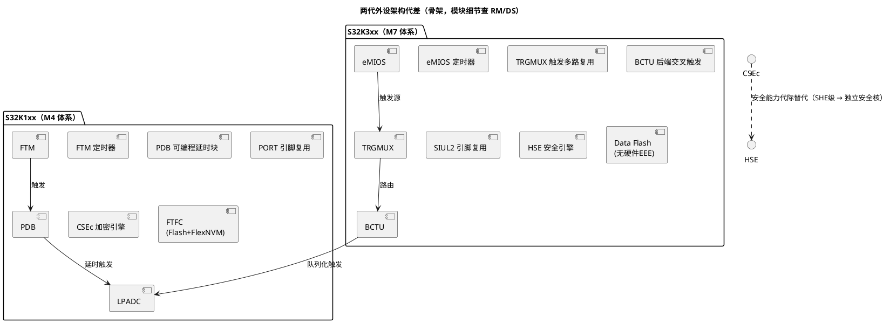

# S32K1xx 与 S32K3xx：内核与资源对比

> 一句话定位：K1（Cortex-M4）与 K3（Cortex-M7）是同门两代——内核代差、安全引擎换代（CSEc→HSE）、触发与引脚架构重构，选型结论直接决定驱动层、信息安全方案与工具链形态。
> 等级：L1 ｜ 前置：[01-从零认识一颗MCU](../../../00-入门导读/01-从零认识一颗MCU.md)

## 原理

### 内核代差：Cortex-M4F vs Cortex-M7

| 维度 | S32K1xx：Cortex-M4F | S32K3xx：Cortex-M7 |
|---|---|---|
| 流水线 | 三级顺序单发射 | 双发射超标量 + 分支预测，同频实际性能更高 |
| TCM（Tightly Coupled Memory，紧耦合存储器） | 无 ITCM/DTCM | 有 ITCM/DTCM（大小查 DS） |
| Cache | 无，靠零等待 SRAM 区补偿 | 集成 I-Cache/D-Cache（大小查 DS） |
| 总线接口 | 32 位 AHB-Lite 风格 | 64 位宽接口，访存带宽翻倍量级 |
| FPU/DSP | 单精度 FPU + DSP 指令 | FPU + DSP 指令（精度配置查 DS） |
| 锁步（Lockstep，双核冗余比对） | 无，单核 | 部分料号双核锁步（DCLS），按料号查 DS |
| 典型主频 | 80~120 MHz 量级（RUN/HSRUN 上限不同，以 DS 为准） | 160 MHz 量级（以 DS 为准） |

对软件工程师的含义：同样 C 代码在 K3 上"每 MHz 能干更多活"，但双发射 + Cache 让**时序精确的软件延时**（NOP 循环、位拆裂 bit-banging）不再确定——K1 上调好的精确时序代码不能默认平移到 K3。

### 资源量级对比（以常见型号为例，最终以 DS 为准）

| 资源 | S32K144（K1 主流量号） | S32K148（K1 大资源料号） | S32K3xx（K3 量级） |
|---|---|---|---|
| 程序 Flash（Program/Code Flash） | 512 KB | 1.5 MB | 数 MB 量级 |
| 数据 Flash（Data Flash/FlexNVM） | 64 KB | 512 KB | 数百 KB 量级 |
| SRAM | 64 KB（含 4 KB FlexRAM） | 256 KB（含 4 KB FlexRAM） | 数百 KB + Standby SRAM（查 DS） |
| 硬件 EEE（EEPROM 模拟） | 有（FlexRAM+FlexNVM，见 EEE 篇） | 有 | **无**，Fee 直接跑在普通 Data Flash 上 |
| 安全引擎 | CSEc（SHE 兼容加密引擎） | CSEc | HSE（Hardware Security Engine，独立安全核） |
| 多核形态 | 单核 | 单核 | 单核 / 双核锁步（按料号） |

两个容易被忽略的量级差异：

- **K3 把 EEE 拿掉了**：K1 的"FlexRAM 当 EEPROM"路线在 K3 不存在，NVM 方案必须改成 Fee on Data Flash（形态与 TC377 趋同，详见 [02-EEE模拟EEPROM](../存储器与Flash/02-EEE模拟EEPROM.md)）；
- **Standby SRAM**：K3 的低功耗域留存内存是独立的一块，深度休眠数据保持方案与 K1 不同（区域划分查 DS 存储映射章节）。

### 外设代差：触发与安全两条主线

- **K1：PDB + FTM**：ADC 定时采样靠 FTM 触发 PDB（Programmable Delay Block，可编程延时块）做延时排队，链路为"定时器→延时块→ADC"，一对一色彩重；
- **K3：TRGMUX + BCTU**：TRGMUX（Trigger Multiplexer，触发多路复用器）把全片触发源汇成可配置交换网，BCTU（Back-end Cross Triggering Unit，ADC 后端交叉触发单元，名称以 RM 为准）按队列自动推 ADC 采样——"谁在什么时候采哪路"从硬件连线题变成配置题；
- **CSEc → HSE**：CSEc 是 SHE 兼容的加密服务引擎，能力以密钥存储与对称加密为主；HSE 是带独立核的安全引擎，承担安全启动、验签、密钥管理、SecOC 加解密等，固件（HSE Firmware）由 NXP 单独发行、随工程加载——信息安全架构从"调个引擎"升级为"多一个需要管理 FW 的子系统"（一句话概念见 [03-分区与安全](../存储器与Flash/03-分区与安全.md)，深入见 [功能安全与信息安全](../../../../11-功能安全与信息安全/README.md)）。

## 寄存器与位表

> 本篇是平台级对比，不落到具体位表；各模块位级细节见对应笔记。核对时关注对象如下：

| 关注对象 | 看什么 | 权威出处 |
|---|---|---|
| 内核特性（Cache/TCM/FPU/锁步） | 是否具备、容量、使能方式 | ARM Cortex-M4/M7 TRM + 器件 DS |
| 主频上限 | RUN/HSRUN 等电源模式下的频率上限 | DS 电气特性 |
| Flash/SRAM 容量与分区 | 具体料号的实际容量、地址分区 | DS 存储映射章节 |
| 触发链路 | 触发源→TRGMUX/PDB→ADC 的连接表 | RM 对应章节 |
| 安全引擎能力集 | CSEc/HSE 支持的算法与密钥槽数量 | RM + NXP 安全应用笔记 |

## 双平台对照（S32K1 / S32K3 / TC377 三方参照）

| 维度 | S32K1xx | S32K3xx | TC377（AURIX TC3xx） |
|---|---|---|---|
| 内核 | Cortex-M4F 单核 | Cortex-M7 单/双锁步 | TriCore TC1.6P 三核 |
| 主频量级 | 80~120 MHz | 160 MHz | 200 MHz 量级（查 DS） |
| 性能手段 | 零等待 SRAM | 双发射+Cache+TCM | 三核并行+DSPR/PSPR |
| 安全引擎 | CSEc（SHE 兼容） | HSE（独立安全核） | HSM（独立核） |
| ADC 触发 | FTM+PDB | TRGMUX+BCTU | GTM（+EVADC 队列） |
| 引脚复用 | PORT 模块 | SIUL2 | IO 端口模块（IOCR 等） |
| Flash 管理 | FTFC（含硬件 EEE） | Flash 控制器（命名查 RM，无硬件 EEE） | DMU（PFlash/DFlash） |
| 看门狗体系 | WDOG/EWM | WDOG + 故障监控机制（查 RM） | WDT + SMU |

## 代码/实操

- 选型操作顺序（概念）：先按功能安全目标定"要不要锁步/HSE"→ 再按采样触发复杂度评估 TRGMUX+BCTU 是否带来配置收益 → 核对 Flash/SRAM 量级 → 最后确认封装与引脚（复用差异见 [01-外设速查表](../外设资源清单/01-外设速查表.md)）；
- 软件包绑定：K1 → S32K1xx SDK；K3 → RTD（Real-Time Drivers），生态差异详见 [02-SDK与RTD生态对比](02-SDK与RTD生态对比.md)；
- Cortex-M4/M7 编程模型（NVIC、MPU、向量表）通用部分见 [ARM-Cortex-M](../../ARM-Cortex-M/README.md)；
- K3 的 Cache/MPU 使用注意与通用原理见 [体系结构通用](../../../2-L2进阶/体系结构通用/README.md)。

## 易错点与陷阱

1. **把 K3 当"更快的 K1"**：触发（PDB→TRGMUX/BCTU）、引脚（PORT→SIUL2）、加密（CSEc→HSE）三套体系全部换代，外设驱动不可源码级平移；
2. **精确软件延时失真**：K1 的 NOP 延时函数搬到 K3 后受双发射/Cache 影响节拍漂移，时序敏感协议必须换硬件外设或定时器方案；
3. **EEE 方案想当然**：在 K3 上按 K1 经验找 FlexRAM/EEE 命令，会发现根本不存在——NVM 方案要重新设计（Fee 布局、磨损策略全变）；
4. **锁步核的调试体验不同**：双核锁步料号上断点/单步行为受限，调试策略要在项目初期确认；
5. **忽略电源模式与频率联动**：主频上限随 RUN/HSRUN 模式变化，超限配置在特定模式下才暴露问题；
6. **同家族不同后缀当同款**：S32K 家族后缀决定 Flash/SRAM/引脚数，BOM 换料号时必须重查 DS；
7. **HSE 固件当外设驱动看待**：HSE FW 有独立版本与生命周期，升级与安全启动联动，纳入项目配置管理而不是"随库升级"。

## 面试高频题

1. **S32K1 与 S32K3 的内核差异，对应用软件有什么实际影响？**
   答：M4→M7 带来双发射、分支预测、Cache/TCM 与 64 位总线，同频性能更高；但软件精确延时、执行时间确定性受 Cache 影响，K1 的 bit-banging 类代码不能直接平移，需换硬件外设或基于 TCM 的方案。

2. **K3 为什么要用 HSE 替代 CSEc？**
   答：CSEc 只提供 SHE 级密钥存储与对称加解密；HSE 是独立安全核，承担安全启动验签、密钥全生命周期管理、SecOC/加解密服务，满足更高等级的信息安全与启动完整性要求。

3. **TRGMUX + BCTU 解决了什么问题？**
   答：K1 上 ADC 触发链路（FTM→PDB→ADC）偏固定、一对一；TRGMUX 把全片触发源做成可配置路由网，BCTU 按队列自动推送 ADC 采样序列，多路同步采样、交叉触发从硬件连线问题变成配置问题。

4. **双核锁步（DCLS）是什么？为什么功能安全项目选它？**
   答：两个核同频同相执行同样指令，比较器实时比对输出，检测到分歧立即报警。它是覆盖率极高的故障检测机制，用于支撑较高 ASIL 等级的硬件随机故障指标。

5. **从 K1 迁移到 K3，你会重点评估哪些软件工作量？**
   答：驱动层换代（SDK→RTD）、触发与引脚配置重做（PDB/PORT→TRGMUX/SIUL2）、NVM 方案重设计（EEE→Fee on Data Flash）、信息安全方案升级（CSEc→HSE，含 HSE FW 管理）、时序敏感代码复核（Cache/双发射影响）。

6. **S32K3 上为什么"主频 160MHz"不能直接和 K1 的 120MHz 比性能？**
   答：M7 双发射+分支预测+Cache 使 IPC（每周期指令数）显著高于 M4，同频性能更高；跨内核代际比主频没有意义，要以 CoreMark/实测吞吐为准。

## 延伸

- [02-SDK与RTD生态对比.md](02-SDK与RTD生态对比.md)：两代软件生态与工具链差异；
- [01-外设速查表](../外设资源清单/01-外设速查表.md)：外设命名代差一览；
- [02-EEE模拟EEPROM](../存储器与Flash/02-EEE模拟EEPROM.md)：K1 独有的硬件 EEE 机制；
- [ARM-Cortex-M](../../ARM-Cortex-M/README.md)：M4/M7 通用编程模型；
- [TriCore架构](../../../3-L3高级/TriCore架构/README.md)：与 TC377 内核侧对照；
- [S32K平台](../README.md) / [02-芯片与体系结构](../../README.md)。
